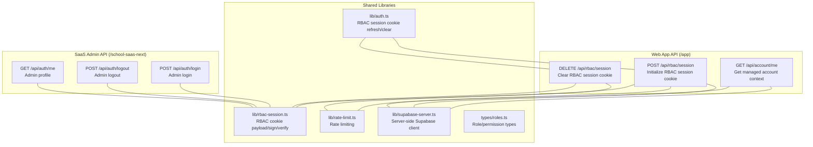
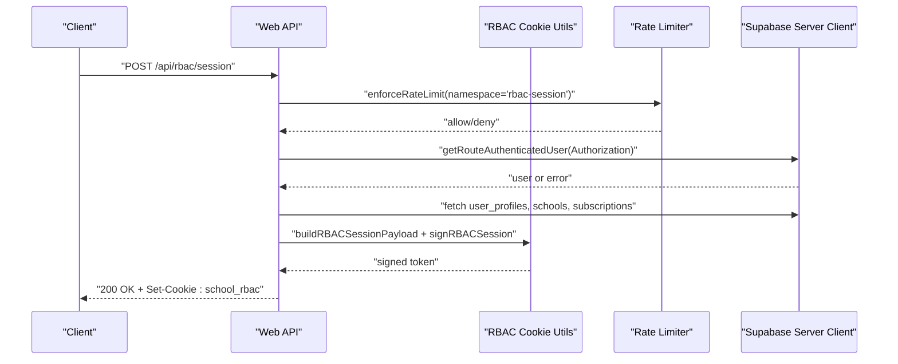
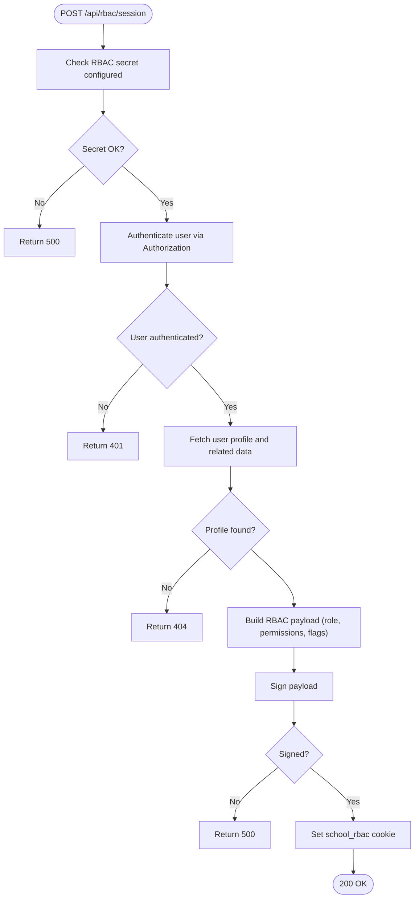
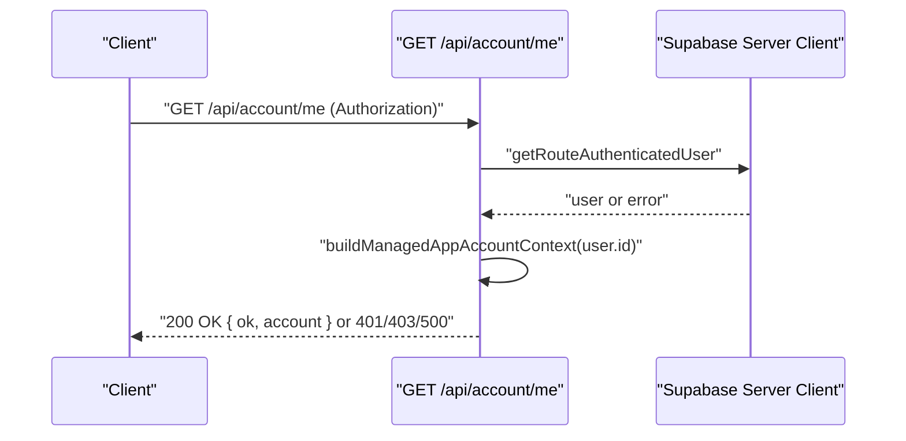
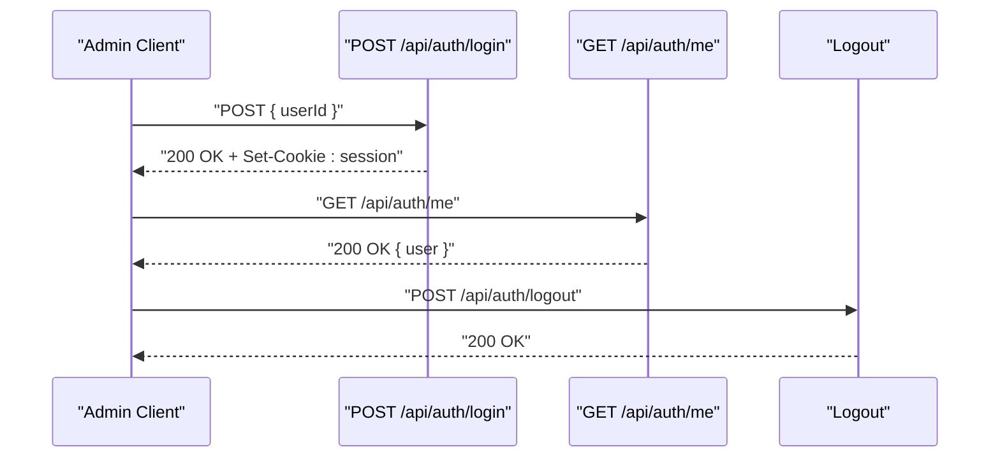
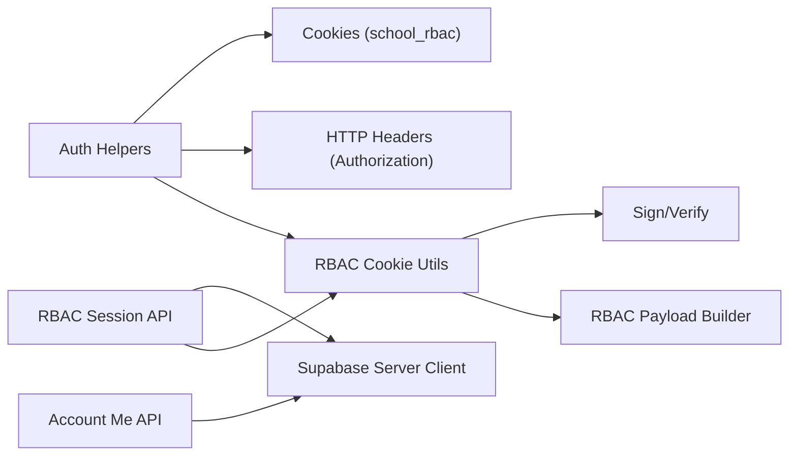

# Authentication API

<cite>
**Referenced Files in This Document**
- [app/api/rbac/session/route.ts](file://app/api/rbac/session/route.ts)
- [lib/rbac-session.ts](file://lib/rbac-session.ts)
- [lib/auth.ts](file://lib/auth.ts)
- [app/api/account/me/route.ts](file://app/api/account/me/route.ts)
- [school-saas-next/src/app/api/auth/login/route.ts](file://school-saas-next/src/app/api/auth/login/route.ts)
- [school-saas-next/src/app/api/auth/logout/route.ts](file://school-saas-next/src/app/api/auth/logout/route.ts)
- [school-saas-next/src/app/api/auth/me/route.ts](file://school-saas-next/src/app/api/auth/me/route.ts)
- [lib/rate-limit.ts](file://lib/rate-limit.ts)
- [lib/supabase-server.ts](file://lib/supabase-server.ts)
- [lib/supabase.ts](file://lib/supabase.ts)
- [types/roles.ts](file://types/roles.ts)
</cite>

## Table of Contents
1. [Introduction](#introduction)
2. [Project Structure](#project-structure)
3. [Core Components](#core-components)
4. [Architecture Overview](#architecture-overview)
5. [Detailed Component Analysis](#detailed-component-analysis)
6. [Dependency Analysis](#dependency-analysis)
7. [Performance Considerations](#performance-considerations)
8. [Troubleshooting Guide](#troubleshooting-guide)
9. [Conclusion](#conclusion)

## Introduction
This document provides comprehensive API documentation for the authentication and RBAC session management endpoints. It covers:
- RBAC session management: login-like initialization, logout, session validation, and token refresh via cookies
- Account management: user profile retrieval and updates
- Request/response schemas, authentication headers, session persistence, and security considerations
- Practical authentication flows, error responses, session timeout handling, rate limiting, and security best practices

## Project Structure
The authentication surface spans two primary areas:
- Web application API under app/api with Supabase-based authentication and RBAC cookie management
- SaaS admin API under school-saas-next/src/app/api with session cookie-based admin login/logout/me

**Diagram sources**
- [app/api/rbac/session/route.ts:1-155](file://app/api/rbac/session/route.ts#L1-L155)
- [lib/rbac-session.ts:1-153](file://lib/rbac-session.ts#L1-L153)
- [lib/auth.ts:273-340](file://lib/auth.ts#L273-L340)
- [app/api/account/me/route.ts:1-60](file://app/api/account/me/route.ts#L1-L60)
- [school-saas-next/src/app/api/auth/login/route.ts:1-41](file://school-saas-next/src/app/api/auth/login/route.ts#L1-L41)
- [school-saas-next/src/app/api/auth/logout/route.ts:1-10](file://school-saas-next/src/app/api/auth/logout/route.ts#L1-L10)
- [school-saas-next/src/app/api/auth/me/route.ts:1-16](file://school-saas-next/src/app/api/auth/me/route.ts#L1-L16)
- [lib/rate-limit.ts](file://lib/rate-limit.ts)
- [lib/supabase-server.ts](file://lib/supabase-server.ts)
- [types/roles.ts](file://types/roles.ts)

**Section sources**
- [app/api/rbac/session/route.ts:1-155](file://app/api/rbac/session/route.ts#L1-L155)
- [lib/rbac-session.ts:1-153](file://lib/rbac-session.ts#L1-L153)
- [lib/auth.ts:273-340](file://lib/auth.ts#L273-L340)
- [app/api/account/me/route.ts:1-60](file://app/api/account/me/route.ts#L1-L60)
- [school-saas-next/src/app/api/auth/login/route.ts:1-41](file://school-saas-next/src/app/api/auth/login/route.ts#L1-L41)
- [school-saas-next/src/app/api/auth/logout/route.ts:1-10](file://school-saas-next/src/app/api/auth/logout/route.ts#L1-L10)
- [school-saas-next/src/app/api/auth/me/route.ts:1-16](file://school-saas-next/src/app/api/auth/me/route.ts#L1-L16)

## Core Components
- RBAC session cookie management
  - Cookie name, signing, verification, and expiration
  - Server-side initialization and clearing
  - Client-side refresh and clear helpers
- Managed account context endpoint
  - Returns account identity, permissions, and access decision
- SaaS admin session endpoints
  - Admin login, logout, and profile retrieval via session cookie

**Section sources**
- [lib/rbac-session.ts:3-17](file://lib/rbac-session.ts#L3-L17)
- [lib/rbac-session.ts:112-152](file://lib/rbac-session.ts#L112-L152)
- [app/api/rbac/session/route.ts:14-133](file://app/api/rbac/session/route.ts#L14-L133)
- [app/api/rbac/session/route.ts:135-154](file://app/api/rbac/session/route.ts#L135-L154)
- [lib/auth.ts:273-340](file://lib/auth.ts#L273-L340)
- [app/api/account/me/route.ts:28-59](file://app/api/account/me/route.ts#L28-L59)
- [school-saas-next/src/app/api/auth/login/route.ts:7-40](file://school-saas-next/src/app/api/auth/login/route.ts#L7-L40)
- [school-saas-next/src/app/api/auth/logout/route.ts:5-9](file://school-saas-next/src/app/api/auth/logout/route.ts#L5-L9)
- [school-saas-next/src/app/api/auth/me/route.ts:6-15](file://school-saas-next/src/app/api/auth/me/route.ts#L6-L15)

## Architecture Overview
The authentication architecture combines Supabase for user authentication with a custom RBAC cookie for web app session management. Admin sessions use a separate cookie-based mechanism.

**Diagram sources**
- [app/api/rbac/session/route.ts:14-133](file://app/api/rbac/session/route.ts#L14-L133)
- [lib/rate-limit.ts](file://lib/rate-limit.ts)
- [lib/supabase-server.ts](file://lib/supabase-server.ts)
- [lib/rbac-session.ts:56-119](file://lib/rbac-session.ts#L56-L119)

## Detailed Component Analysis

### RBAC Session Management API
- Endpoint: POST /api/rbac/session
  - Purpose: Initialize or refresh RBAC session cookie after successful user authentication
  - Authentication: Requires Authorization header with Bearer token
  - Rate limit: 30 hits per minute per user ID
  - Behavior:
    - Validates presence of RBAC signing secret
    - Fetches authenticated user and profile
    - Normalizes permissions and computes school/subscription status
    - Builds payload with role, permissions, flags, timestamps, and version
    - Signs payload and sets secure httpOnly cookie
  - Response: 200 OK with ok: true; Cookie: school_rbac
  - Errors: 401 Unauthorized, 403 Forbidden (role mismatch), 404 Not Found (profile), 500 Internal Server Error (secret/signing)

- Endpoint: DELETE /api/rbac/session
  - Purpose: Clear RBAC session cookie
  - Rate limit: 60 hits per minute
  - Response: 200 OK with ok: true; Clears cookie

- Client helpers
  - refreshRBACSessionCookie(profile?, options?): POST or DELETE depending on profile presence
  - clearRBACSessionCookie(): DELETE
  - signOutClient(): Sign out from Supabase and clear RBAC cookie

**Diagram sources**
- [app/api/rbac/session/route.ts:14-133](file://app/api/rbac/session/route.ts#L14-L133)
- [lib/rbac-session.ts:56-119](file://lib/rbac-session.ts#L56-L119)

**Section sources**
- [app/api/rbac/session/route.ts:14-133](file://app/api/rbac/session/route.ts#L14-L133)
- [lib/rbac-session.ts:3-17](file://lib/rbac-session.ts#L3-L17)
- [lib/rbac-session.ts:112-152](file://lib/rbac-session.ts#L112-L152)
- [lib/auth.ts:273-340](file://lib/auth.ts#L273-L340)

### Account Management API
- Endpoint: GET /api/account/me
  - Purpose: Retrieve current managed account context for the authenticated user
  - Authentication: Requires Authorization header with Bearer token
  - Behavior:
    - Validates session via Authorization
    - Builds managed account context including identity, permissions, and access decision
    - Returns ok: true with account object or 403 with error details if access denied
  - Response: 200 OK with ok: true and account object; or 401/403/500 as appropriate

**Diagram sources**
- [app/api/account/me/route.ts:28-59](file://app/api/account/me/route.ts#L28-L59)
- [lib/supabase-server.ts](file://lib/supabase-server.ts)

**Section sources**
- [app/api/account/me/route.ts:28-59](file://app/api/account/me/route.ts#L28-L59)

### SaaS Admin Session APIs
- Endpoint: POST /api/auth/login
  - Purpose: Admin login to establish session cookie
  - Request body: { userId: string }
  - Validation: Requires userId; checks user existence and status; validates school/subscription status for non-super admins
  - Response: 200 OK with user; Sets session cookie
  - Errors: 400 (missing user id), 404 (user not found), 403 (blocked or inactive subscription), 400 (invalid request)

- Endpoint: POST /api/auth/logout
  - Purpose: Clear admin session cookie
  - Response: 200 OK with success: true; Clears cookie

- Endpoint: GET /api/auth/me
  - Purpose: Get current admin user from session cookie
  - Response: 200 OK with user or null if no session

**Diagram sources**
- [school-saas-next/src/app/api/auth/login/route.ts:7-40](file://school-saas-next/src/app/api/auth/login/route.ts#L7-L40)
- [school-saas-next/src/app/api/auth/logout/route.ts:5-9](file://school-saas-next/src/app/api/auth/logout/route.ts#L5-L9)
- [school-saas-next/src/app/api/auth/me/route.ts:6-15](file://school-saas-next/src/app/api/auth/me/route.ts#L6-L15)

**Section sources**
- [school-saas-next/src/app/api/auth/login/route.ts:7-40](file://school-saas-next/src/app/api/auth/login/route.ts#L7-L40)
- [school-saas-next/src/app/api/auth/logout/route.ts:5-9](file://school-saas-next/src/app/api/auth/logout/route.ts#L5-L9)
- [school-saas-next/src/app/api/auth/me/route.ts:6-15](file://school-saas-next/src/app/api/auth/me/route.ts#L6-L15)

## Dependency Analysis
- RBAC cookie lifecycle depends on:
  - RBAC signing secret availability (required in production)
  - Supabase user session validation
  - Role and permission normalization
  - School/subscription status resolution
- Client-side helpers depend on:
  - Supabase session for Authorization header
  - RBAC cookie refresh/clear flows

**Diagram sources**
- [lib/rbac-session.ts:56-119](file://lib/rbac-session.ts#L56-L119)
- [lib/auth.ts:273-340](file://lib/auth.ts#L273-L340)
- [app/api/rbac/session/route.ts:14-133](file://app/api/rbac/session/route.ts#L14-L133)
- [app/api/account/me/route.ts:28-59](file://app/api/account/me/route.ts#L28-L59)
- [lib/supabase-server.ts](file://lib/supabase-server.ts)

**Section sources**
- [lib/rbac-session.ts:1-153](file://lib/rbac-session.ts#L1-L153)
- [lib/auth.ts:273-340](file://lib/auth.ts#L273-L340)
- [app/api/rbac/session/route.ts:14-133](file://app/api/rbac/session/route.ts#L14-L133)
- [app/api/account/me/route.ts:28-59](file://app/api/account/me/route.ts#L28-L59)

## Performance Considerations
- RBAC session initialization performs up to three database reads (profile, school, subscription) using concurrent requests to minimize latency.
- Cookie-based session validation avoids repeated server-side authentication checks for subsequent requests.
- Rate limiting reduces abuse risks for session initialization and deletion endpoints.

[No sources needed since this section provides general guidance]

## Troubleshooting Guide
Common issues and resolutions:
- RBAC secret not configured (production)
  - Symptom: 500 response indicating RBAC secret is not configured
  - Resolution: Set RBAC_COOKIE_SECRET; do not rely on fallback in production
- Unauthorized access
  - Symptom: 401 response when Authorization header is missing or invalid
  - Resolution: Ensure Bearer token is present and valid
- Profile not found
  - Symptom: 404 response during RBAC session initialization
  - Resolution: Verify user profile exists and is accessible via RLS
- Role not permitted for web admin
  - Symptom: 403 response with role mismatch
  - Resolution: Ensure user has a supported web role
- Rate limit exceeded
  - Symptom: 429 responses for session init/delete
  - Resolution: Back off and retry; reduce frequency of requests
- Session timeout handling
  - Symptom: RBAC cookie expires or is cleared
  - Resolution: Re-authenticate and re-initialize RBAC session; client helpers automatically handle refresh/clear

**Section sources**
- [lib/rbac-session.ts:23-31](file://lib/rbac-session.ts#L23-L31)
- [app/api/rbac/session/route.ts:15-20](file://app/api/rbac/session/route.ts#L15-L20)
- [app/api/rbac/session/route.ts:28-30](file://app/api/rbac/session/route.ts#L28-L30)
- [app/api/rbac/session/route.ts:49-56](file://app/api/rbac/session/route.ts#L49-L56)
- [app/api/rbac/session/route.ts:58-72](file://app/api/rbac/session/route.ts#L58-L72)
- [lib/rate-limit.ts](file://lib/rate-limit.ts)

## Conclusion
The authentication system provides robust RBAC session management for the web app and admin session management for the SaaS admin area. It emphasizes secure cookie handling, role-based permissions, and rate-limited protection. Clients should use the provided helpers to refresh or clear RBAC sessions and ensure proper error handling for authentication failures and timeouts.