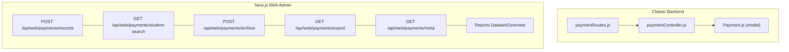
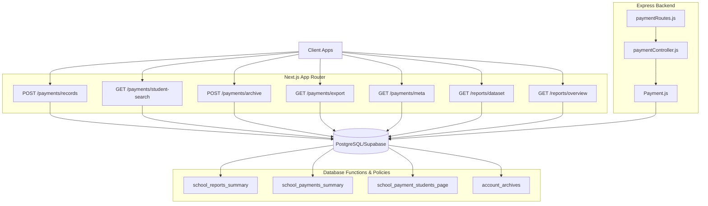
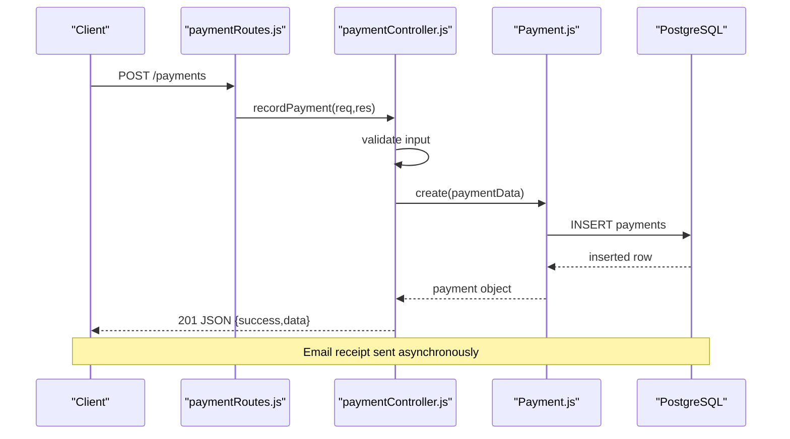
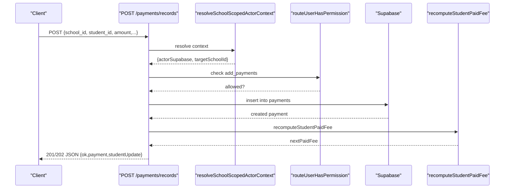
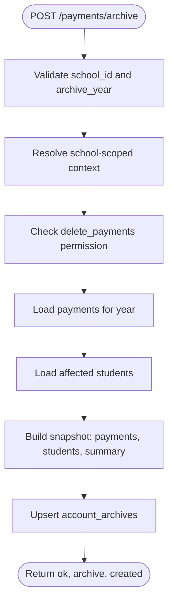
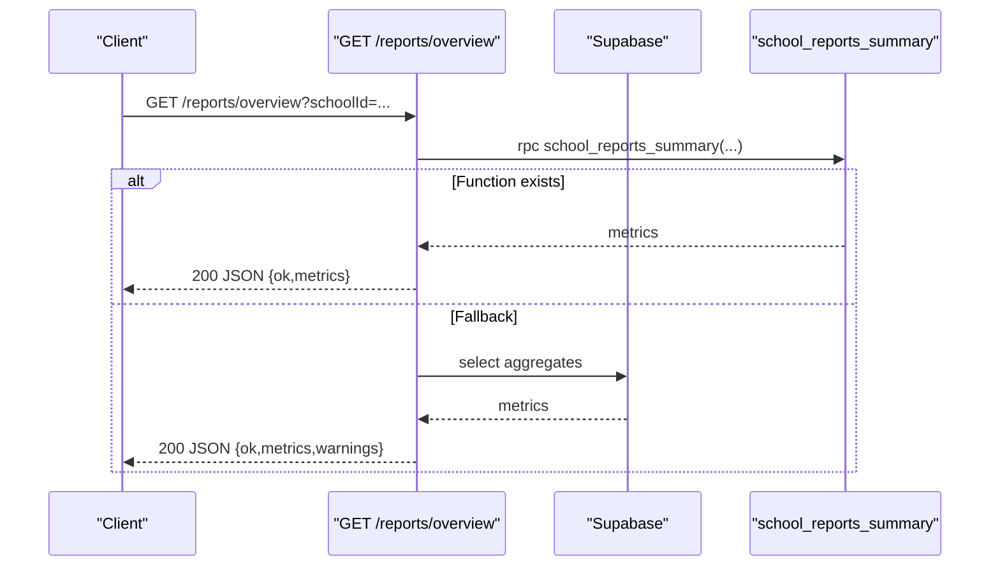
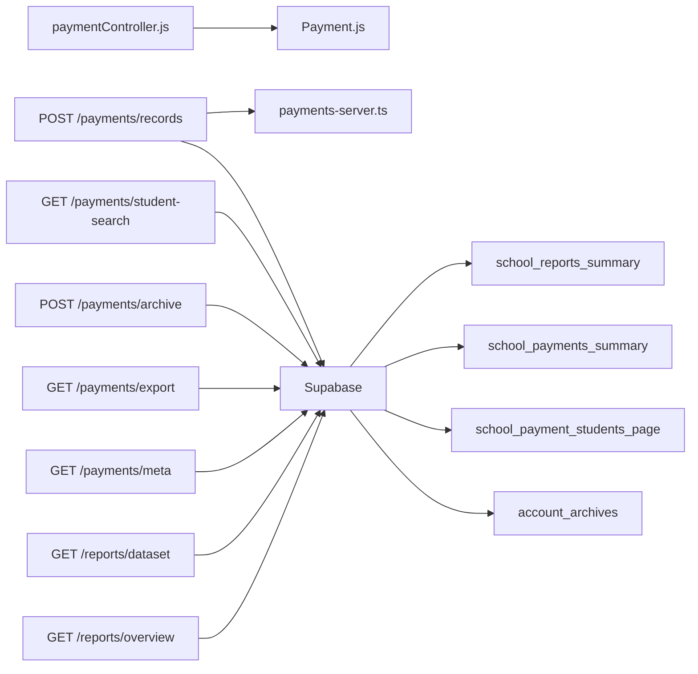

# Financial Operations API

<cite>
**Referenced Files in This Document**
- [paymentRoutes.js](file://00990090/school-accounting-system/backend/src/routes/paymentRoutes.js)
- [paymentController.js](file://00990090/school-accounting-system/backend/src/controllers/paymentController.js)
- [Payment.js](file://00990090/school-accounting-system/backend/src/models/Payment.js)
- [route.ts](file://app/api/web/payments/records/route.ts)
- [route.ts](file://app/api/web/payments/student-search/route.ts)
- [route.ts](file://app/api/web/payments/archive/route.ts)
- [route.ts](file://app/api/web/payments/export/route.ts)
- [route.ts](file://app/api/web/payments/meta/route.ts)
- [payments-server.ts](file://lib/payments-server.ts)
- [route.ts](file://app/api/web/reports/dataset/route.ts)
- [route.ts](file://app/api/web/reports/overview/route.ts)
- [20260326_010000_payments_page_functions.sql](file://migrations/20260326_010000_payments_page_functions.sql)
- [20260326_020000_account_archives_table.sql](file://migrations/20260326_020000_account_archives_table.sql)
- [20260326_000000_reports_summary_function.sql](file://migrations/20260326_000000_reports_summary_function.sql)
- [database_setup.sql](file://database_setup.sql)
</cite>

## Table of Contents
1. [Introduction](#introduction)
2. [Project Structure](#project-structure)
3. [Core Components](#core-components)
4. [Architecture Overview](#architecture-overview)
5. [Detailed Component Analysis](#detailed-component-analysis)
6. [Dependency Analysis](#dependency-analysis)
7. [Performance Considerations](#performance-considerations)
8. [Troubleshooting Guide](#troubleshooting-guide)
9. [Conclusion](#conclusion)
10. [Appendices](#appendices)

## Introduction
This document provides comprehensive API documentation for financial operations, covering payment processing, student payment searches, payment archiving, financial reporting, export functionality, and payment metadata. It also documents request/response schemas, status tracking, batch operations, financial data aggregation, error handling, and security considerations including PCI compliance and financial data protection.

## Project Structure
The financial operations are implemented across two primary layers:
- Backend Express routes/controllers/models for classic accounting endpoints
- Next.js App Router handlers for modern web admin endpoints

**Diagram sources**
- [paymentRoutes.js:1-32](file://00990090/school-accounting-system/backend/src/routes/paymentRoutes.js#L1-L32)
- [paymentController.js:1-305](file://00990090/school-accounting-system/backend/src/controllers/paymentController.js#L1-L305)
- [Payment.js:1-176](file://00990090/school-accounting-system/backend/src/models/Payment.js#L1-L176)
- [route.ts:1-129](file://app/api/web/payments/records/route.ts#L1-L129)
- [route.ts:1-58](file://app/api/web/payments/student-search/route.ts#L1-L58)
- [route.ts:1-130](file://app/api/web/payments/archive/route.ts#L1-L130)
- [route.ts:1-58](file://app/api/web/payments/export/route.ts#L1-L58)
- [route.ts:1-54](file://app/api/web/payments/meta/route.ts#L1-L54)
- [route.ts:1-184](file://app/api/web/reports/dataset/route.ts#L1-L184)
- [route.ts:1-248](file://app/api/web/reports/overview/route.ts#L1-L248)

**Section sources**
- [paymentRoutes.js:1-32](file://00990090/school-accounting-system/backend/src/routes/paymentRoutes.js#L1-L32)
- [paymentController.js:1-305](file://00990090/school-accounting-system/backend/src/controllers/paymentController.js#L1-L305)
- [Payment.js:1-176](file://00990090/school-accounting-system/backend/src/models/Payment.js#L1-L176)
- [route.ts:1-129](file://app/api/web/payments/records/route.ts#L1-L129)
- [route.ts:1-58](file://app/api/web/payments/student-search/route.ts#L1-L58)
- [route.ts:1-130](file://app/api/web/payments/archive/route.ts#L1-L130)
- [route.ts:1-58](file://app/api/web/payments/export/route.ts#L1-L58)
- [route.ts:1-54](file://app/api/web/payments/meta/route.ts#L1-L54)
- [route.ts:1-184](file://app/api/web/reports/dataset/route.ts#L1-L184)
- [route.ts:1-248](file://app/api/web/reports/overview/route.ts#L1-L248)

## Core Components
- Classic backend payment endpoints: listing, filtering, recording, updating, deleting, and invoice generation
- Modern web admin payment endpoints: payment creation, student search, archiving, export, and metadata
- Reporting endpoints: dataset exports and financial overview metrics
- Supporting utilities: student fee recomputation and database functions

**Section sources**
- [paymentController.js:11-305](file://00990090/school-accounting-system/backend/src/controllers/paymentController.js#L11-L305)
- [Payment.js:14-176](file://00990090/school-accounting-system/backend/src/models/Payment.js#L14-L176)
- [route.ts:23-129](file://app/api/web/payments/records/route.ts#L23-L129)
- [route.ts:11-58](file://app/api/web/payments/student-search/route.ts#L11-L58)
- [route.ts:11-130](file://app/api/web/payments/archive/route.ts#L11-L130)
- [route.ts:11-58](file://app/api/web/payments/export/route.ts#L11-L58)
- [route.ts:11-54](file://app/api/web/payments/meta/route.ts#L11-L54)
- [route.ts:40-184](file://app/api/web/reports/dataset/route.ts#L40-L184)
- [route.ts:173-248](file://app/api/web/reports/overview/route.ts#L173-L248)
- [payments-server.ts:5-33](file://lib/payments-server.ts#L5-L33)

## Architecture Overview
The system integrates classic backend and modern web admin endpoints with a shared Supabase/PostgreSQL backend. Authentication and authorization are enforced via role-based access control (RBAC) and row-level security (RLS). Payment data is stored in dedicated tables with supporting functions for summaries and paginated student payment views.

**Diagram sources**
- [route.ts:1-129](file://app/api/web/payments/records/route.ts#L1-L129)
- [route.ts:1-58](file://app/api/web/payments/student-search/route.ts#L1-L58)
- [route.ts:1-130](file://app/api/web/payments/archive/route.ts#L1-L130)
- [route.ts:1-58](file://app/api/web/payments/export/route.ts#L1-L58)
- [route.ts:1-54](file://app/api/web/payments/meta/route.ts#L1-L54)
- [route.ts:1-184](file://app/api/web/reports/dataset/route.ts#L1-L184)
- [route.ts:1-248](file://app/api/web/reports/overview/route.ts#L1-L248)
- [paymentRoutes.js:1-32](file://00990090/school-accounting-system/backend/src/routes/paymentRoutes.js#L1-L32)
- [paymentController.js:1-305](file://00990090/school-accounting-system/backend/src/controllers/paymentController.js#L1-L305)
- [Payment.js:1-176](file://00990090/school-accounting-system/backend/src/models/Payment.js#L1-L176)
- [20260326_000000_reports_summary_function.sql:1-83](file://migrations/20260326_000000_reports_summary_function.sql#L1-L83)
- [20260326_010000_payments_page_functions.sql:1-190](file://migrations/20260326_010000_payments_page_functions.sql#L1-L190)
- [20260326_020000_account_archives_table.sql:1-64](file://migrations/20260326_020000_account_archives_table.sql#L1-L64)

## Detailed Component Analysis

### Payment Records (Classic Backend)
Endpoints for listing, filtering, retrieving, recording, updating, deleting payments, and generating invoices.

- GET /payments
  - Query parameters: page, limit, student_id, from_date, to_date
  - Response: success flag, data array, pagination metadata
- GET /payments/:id
  - Path parameter: id
  - Response: success flag, single payment object
- POST /payments (roles: admin, accountant)
  - Request body: student_id, student_fee_id, amount, payment_method, reference_number, notes
  - Response: success flag, message, created payment object
- PUT /payments/:id (roles: admin, accountant)
  - Path parameter: id
  - Request body: amount, payment_method, reference_number, notes
  - Response: success flag, message, updated payment object
- DELETE /payments/:id (roles: admin)
  - Path parameter: id
  - Response: success flag, message
- GET /payments/:student_id/invoice/:fee_id
  - Path parameters: student_id, fee_id
  - Response: success flag, message, invoice metadata (invoice_number, pdf_path)

**Diagram sources**
- [paymentRoutes.js:19-21](file://00990090/school-accounting-system/backend/src/routes/paymentRoutes.js#L19-L21)
- [paymentController.js:79-130](file://00990090/school-accounting-system/backend/src/controllers/paymentController.js#L79-L130)
- [Payment.js:94-114](file://00990090/school-accounting-system/backend/src/models/Payment.js#L94-L114)

**Section sources**
- [paymentRoutes.js:10-29](file://00990090/school-accounting-system/backend/src/routes/paymentRoutes.js#L10-L29)
- [paymentController.js:15-184](file://00990090/school-accounting-system/backend/src/controllers/paymentController.js#L15-L184)
- [Payment.js:14-139](file://00990090/school-accounting-system/backend/src/models/Payment.js#L14-L139)

### Payment Records (Web Admin)
Modern endpoint for creating payments with school-scoped authorization, permission checks, and student fee recomputation.

- POST /api/web/payments/records
  - Request body: school_id, student_id, amount, payment_method, notes, receipt_date, receipt_number, manual_receipt_number, branch_id
  - Response: ok flag, payment object, studentUpdate payload with recalculated paid_fee and remaining_fee
  - On sync failure: 202 Accepted with warning message

**Diagram sources**
- [route.ts:23-129](file://app/api/web/payments/records/route.ts#L23-L129)
- [payments-server.ts:5-33](file://lib/payments-server.ts#L5-L33)

**Section sources**
- [route.ts:23-129](file://app/api/web/payments/records/route.ts#L23-L129)
- [payments-server.ts:5-33](file://lib/payments-server.ts#L5-L33)

### Student Payment Searches
- GET /api/web/payments/student-search
  - Query parameters: schoolId, q (search), limit
  - Response: ok flag, students array
  - Rate-limited per user

**Section sources**
- [route.ts:11-58](file://app/api/web/payments/student-search/route.ts#L11-L58)

### Payment Archiving
- POST /api/web/payments/archive
  - Request body: school_id, archive_year
  - Response: ok flag, archive object, created indicator
  - Requires delete_payments permission
  - Creates/updates yearly snapshot in account_archives table

**Diagram sources**
- [route.ts:11-130](file://app/api/web/payments/archive/route.ts#L11-L130)
- [20260326_020000_account_archives_table.sql:1-64](file://migrations/20260326_020000_account_archives_table.sql#L1-L64)

**Section sources**
- [route.ts:11-130](file://app/api/web/payments/archive/route.ts#L11-L130)
- [20260326_020000_account_archives_table.sql:1-64](file://migrations/20260326_020000_account_archives_table.sql#L1-L64)

### Export and Metadata
- GET /api/web/payments/export
  - Query parameters: schoolId (forwarded to filters)
  - Response: ok flag, students array (exportable dataset)
  - Rate-limited per user
- GET /api/web/payments/meta
  - Query parameters: schoolId
  - Response: ok flag, metadata payload
  - Rate-limited per user

**Section sources**
- [route.ts:11-58](file://app/api/web/payments/export/route.ts#L11-L58)
- [route.ts:11-54](file://app/api/web/payments/meta/route.ts#L11-L54)

### Financial Reporting
- GET /api/web/reports/dataset
  - Query parameters: schoolId, type (students|payments|expenses|salaries|all), status, search, className, sectionName
  - Response: ok flag, dataset subset(s)
- GET /api/web/reports/overview
  - Query parameters: schoolId
  - Response: ok flag, metrics object (counts, volumes, balances)
  - Falls back to per-query aggregates if function unavailable

**Diagram sources**
- [route.ts:173-248](file://app/api/web/reports/overview/route.ts#L173-L248)
- [20260326_000000_reports_summary_function.sql:1-83](file://migrations/20260326_000000_reports_summary_function.sql#L1-L83)

**Section sources**
- [route.ts:40-184](file://app/api/web/reports/dataset/route.ts#L40-L184)
- [route.ts:173-248](file://app/api/web/reports/overview/route.ts#L173-L248)
- [20260326_000000_reports_summary_function.sql:1-83](file://migrations/20260326_000000_reports_summary_function.sql#L1-L83)

## Dependency Analysis
- Classic backend depends on:
  - Payment model for database operations
  - Helpers for pagination and invoice number generation
  - PDF/email utilities for receipts
- Web admin endpoints depend on:
  - Managed user context resolution
  - Permission checks
  - Supabase client for inserts and selects
  - Student fee recomputation utility
- Database functions and policies:
  - school_reports_summary for overview metrics
  - school_payments_summary and school_payment_students_page for paginated views
  - account_archives table for yearly snapshots

**Diagram sources**
- [paymentController.js:1-305](file://00990090/school-accounting-system/backend/src/controllers/paymentController.js#L1-L305)
- [Payment.js:1-176](file://00990090/school-accounting-system/backend/src/models/Payment.js#L1-L176)
- [route.ts:1-129](file://app/api/web/payments/records/route.ts#L1-L129)
- [payments-server.ts:1-33](file://lib/payments-server.ts#L1-L33)
- [route.ts:1-58](file://app/api/web/payments/student-search/route.ts#L1-L58)
- [route.ts:1-130](file://app/api/web/payments/archive/route.ts#L1-L130)
- [route.ts:1-58](file://app/api/web/payments/export/route.ts#L1-L58)
- [route.ts:1-54](file://app/api/web/payments/meta/route.ts#L1-L54)
- [route.ts:1-184](file://app/api/web/reports/dataset/route.ts#L1-L184)
- [route.ts:1-248](file://app/api/web/reports/overview/route.ts#L1-L248)
- [20260326_000000_reports_summary_function.sql:1-83](file://migrations/20260326_000000_reports_summary_function.sql#L1-L83)
- [20260326_010000_payments_page_functions.sql:1-190](file://migrations/20260326_010000_payments_page_functions.sql#L1-L190)
- [20260326_020000_account_archives_table.sql:1-64](file://migrations/20260326_020000_account_archives_table.sql#L1-L64)

**Section sources**
- [paymentController.js:1-305](file://00990090/school-accounting-system/backend/src/controllers/paymentController.js#L1-L305)
- [Payment.js:1-176](file://00990090/school-accounting-system/backend/src/models/Payment.js#L1-L176)
- [route.ts:1-129](file://app/api/web/payments/records/route.ts#L1-L129)
- [payments-server.ts:1-33](file://lib/payments-server.ts#L1-L33)
- [route.ts:1-58](file://app/api/web/payments/student-search/route.ts#L1-L58)
- [route.ts:1-130](file://app/api/web/payments/archive/route.ts#L1-L130)
- [route.ts:1-58](file://app/api/web/payments/export/route.ts#L1-L58)
- [route.ts:1-54](file://app/api/web/payments/meta/route.ts#L1-L54)
- [route.ts:1-184](file://app/api/web/reports/dataset/route.ts#L1-L184)
- [route.ts:1-248](file://app/api/web/reports/overview/route.ts#L1-L248)
- [20260326_000000_reports_summary_function.sql:1-83](file://migrations/20260326_000000_reports_summary_function.sql#L1-L83)
- [20260326_010000_payments_page_functions.sql:1-190](file://migrations/20260326_010000_payments_page_functions.sql#L1-L190)
- [20260326_020000_account_archives_table.sql:1-64](file://migrations/20260326_020000_account_archives_table.sql#L1-L64)

## Performance Considerations
- Use pagination and filters on payment listing to avoid large result sets
- Prefer database functions (e.g., school_reports_summary) for aggregated metrics when available; expect fallback behavior otherwise
- Indexes on payments, students, and related tables improve query performance
- Rate limits applied to search/export/meta endpoints prevent abuse

[No sources needed since this section provides general guidance]

## Troubleshooting Guide
Common errors and resolutions:
- Validation failures (400): Ensure required fields are present and formatted correctly
- Authorization failures (403): Verify user role and permissions for payment operations
- Resource not found (404): Confirm entity identifiers (payment, student, fee) exist
- Internal errors (500): Inspect server logs; database constraints or missing functions may cause failures
- Archive table missing: Apply database setup script to create account_archives table

**Section sources**
- [route.ts:40-68](file://app/api/web/payments/records/route.ts#L40-L68)
- [route.ts:16-40](file://app/api/web/payments/archive/route.ts#L16-L40)
- [route.ts:222-229](file://app/api/web/reports/overview/route.ts#L222-L229)
- [database_setup.sql:158-172](file://database_setup.sql#L158-L172)

## Conclusion
The financial operations API provides robust endpoints for payment processing, student search, archiving, export, and reporting. It leverages Supabase/PostgreSQL with RLS and RBAC for tenant isolation and secure access. Use the provided schemas and examples to integrate payment workflows, implement batch operations safely, and maintain accurate financial audits.

[No sources needed since this section summarizes without analyzing specific files]

## Appendices

### Request/Response Schemas

- POST /api/web/payments/records
  - Request body:
    - school_id: string
    - student_id: string
    - amount: number (must be > 0)
    - payment_method: string (default cash)
    - notes: string (optional)
    - receipt_date: string (ISO date/time optional)
    - receipt_number: string (optional)
    - manual_receipt_number: string (optional)
    - branch_id: string (optional)
  - Response:
    - ok: boolean
    - payment: object (payment record)
    - studentUpdate: object (paid_fee, remaining_fee)

- GET /api/web/payments/student-search
  - Query parameters:
    - schoolId: string
    - q: string (search term)
    - limit: number (default 8)
  - Response:
    - ok: boolean
    - students: array

- POST /api/web/payments/archive
  - Request body:
    - school_id: string
    - archive_year: number
  - Response:
    - ok: boolean
    - archive: object (snapshot)
    - created: boolean

- GET /api/web/payments/export
  - Query parameters:
    - schoolId: string
  - Response:
    - ok: boolean
    - students: array

- GET /api/web/payments/meta
  - Query parameters:
    - schoolId: string
  - Response:
    - ok: boolean
    - metadata: object

- GET /api/web/reports/dataset
  - Query parameters:
    - schoolId: string
    - type: enum("students"|"payments"|"expenses"|"salaries"|"all")
    - status: enum("active"|"transferred"|"suspended"|"deleted")
    - search: string
    - className: string
    - sectionName: string
  - Response:
    - ok: boolean
    - dataset: object (selected arrays)

- GET /api/web/reports/overview
  - Query parameters:
    - schoolId: string
  - Response:
    - ok: boolean
    - metrics: object (counts, volumes, balances)
    - warnings: array (optional)

**Section sources**
- [route.ts:11-129](file://app/api/web/payments/records/route.ts#L11-L129)
- [route.ts:11-58](file://app/api/web/payments/student-search/route.ts#L11-L58)
- [route.ts:11-130](file://app/api/web/payments/archive/route.ts#L11-L130)
- [route.ts:11-58](file://app/api/web/payments/export/route.ts#L11-L58)
- [route.ts:11-54](file://app/api/web/payments/meta/route.ts#L11-L54)
- [route.ts:40-184](file://app/api/web/reports/dataset/route.ts#L40-L184)
- [route.ts:173-248](file://app/api/web/reports/overview/route.ts#L173-L248)

### Security and Compliance Notes
- Authentication and authorization:
  - Role-based access control (RBAC) enforced via route permissions
  - Row-level security (RLS) policies restrict data visibility by school
- Data protection:
  - Sensitive financial data is scoped to the authenticated user’s school
  - Use HTTPS/TLS in production
- PCI considerations:
  - Do not store, process, or transmit primary account numbers (PAN) or CVV
  - Use external payment processors; log minimal transaction metadata only
  - Restrict access to financial endpoints to authorized roles

[No sources needed since this section provides general guidance]