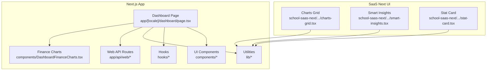
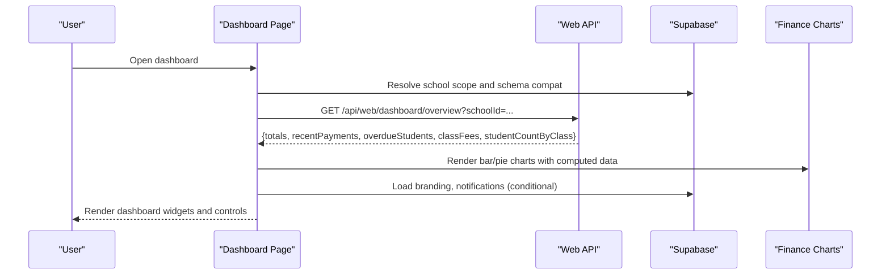
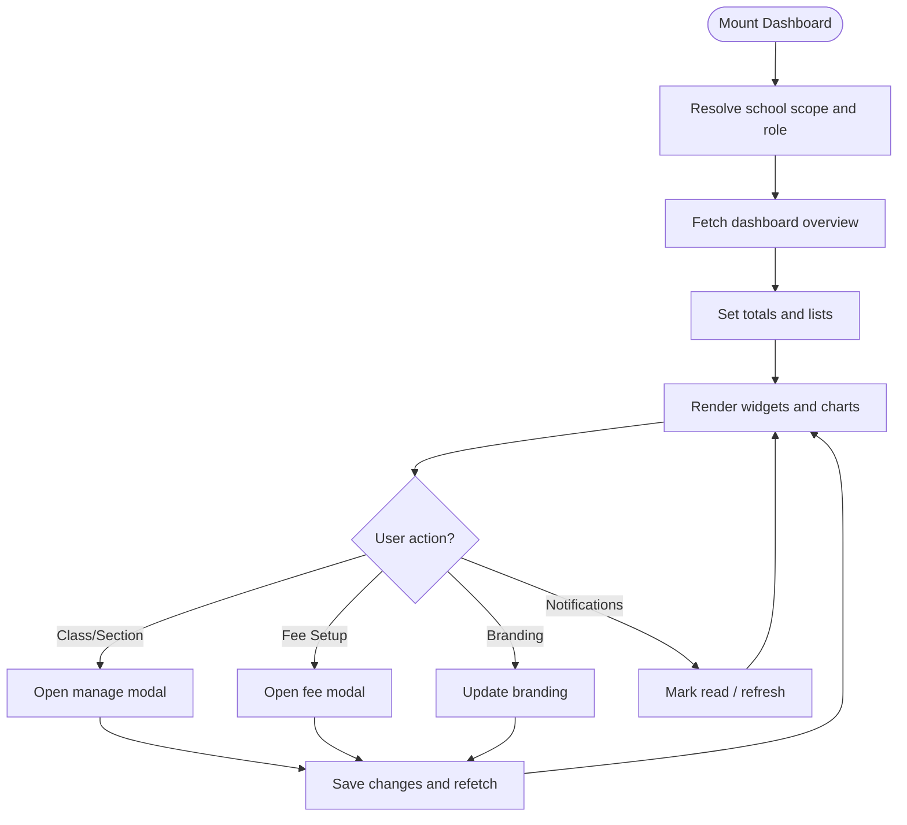
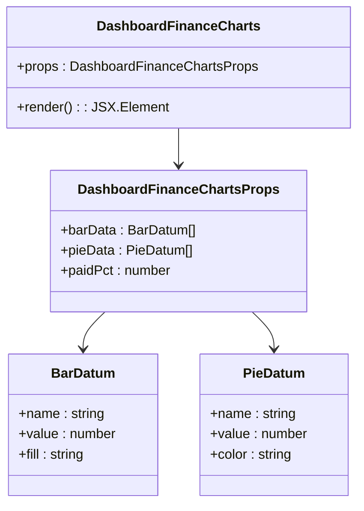
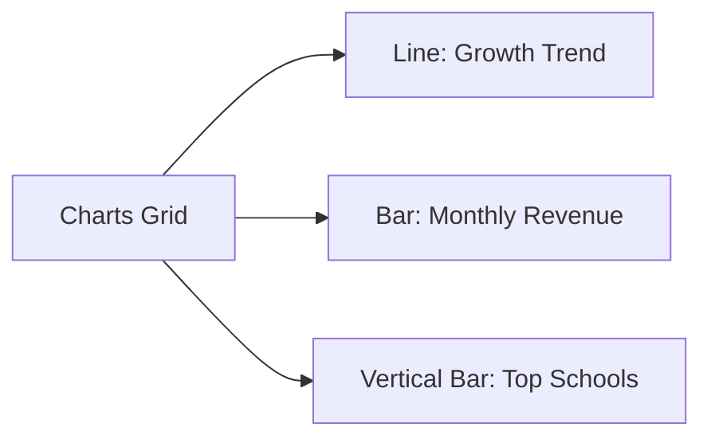
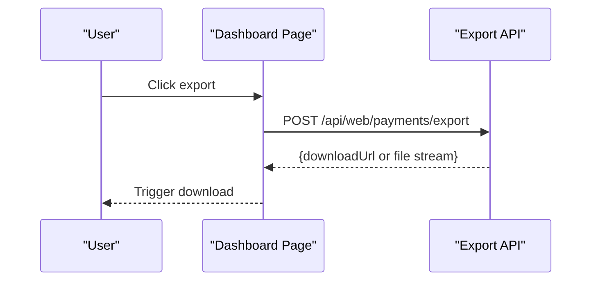
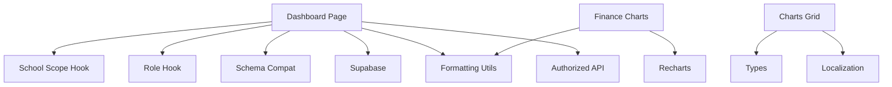

# Dashboard & Analytics

<cite>
**Referenced Files in This Document**
- [app/[locale]/dashboard/page.tsx](file://app/[locale]/dashboard/page.tsx)
- [components/DashboardFinanceCharts.tsx](file://components/DashboardFinanceCharts.tsx)
- [school-saas-next/src/components/dashboard/charts-grid.tsx](file://school-saas-next/src/components/dashboard/charts-grid.tsx)
- [school-saas-next/src/components/dashboard/smart-insights.tsx](file://school-saas-next/src/components/dashboard/smart-insights.tsx)
- [school-saas-next/src/components/dashboard/stat-card.tsx](file://school-saas-next/src/components/dashboard/stat-card.tsx)
- [lib/formatting.ts](file://lib/formatting.ts)
- [lib/supabase.ts](file://lib/supabase.ts)
- [lib/authorized-api.ts](file://lib/authorized-api.ts)
- [lib/schema-compat.ts](file://lib/schema-compat.ts)
- [lib/school/context.ts](file://lib/school/context.ts)
- [lib/brand/palette.ts](file://lib/brand/palette.ts)
- [lib/brand/themes.ts](file://lib/brand/themes.ts)
- [hooks/useRole.tsx](file://hooks/useRole.tsx)
- [hooks/useSchoolScope.tsx](file://hooks/useSchoolScope.tsx)
- [components/AppSidebar.tsx](file://components/AppSidebar.tsx)
- [components/AppShellTopbar.tsx](file://components/AppShellTopbar.tsx)
- [components/ProtectedRoute.tsx](file://components/ProtectedRoute.tsx)
- [components/SchoolScopeBanner.tsx](file://components/SchoolScopeBanner.tsx)
- [components/skeleton.tsx](file://components/skeleton.tsx)
- [lib/locale-routing.ts](file://lib/locale-routing.ts)
- [lib/i18n.ts](file://lib/i18n.ts)
- [lib/types.ts](file://lib/types.ts)
- [app/api/web/dashboard/overview/route.ts](file://app/api/web/dashboard/overview/route.ts)
- [app/api/web/dashboard/branding/route.ts](file://app/api/web/dashboard/branding/route.ts)
- [app/api/web/payments/export/route.ts](file://app/api/web/payments/export/route.ts)
- [app/api/web/reports/overview/route.ts](file://app/api/web/reports/overview/route.ts)
- [app/api/web/reports/dataset/route.ts](file://app/api/web/reports/dataset/route.ts)
- [app/api/web/students/list/route.ts](file://app/api/web/students/list/route.ts)
- [app/api/web/students/meta/route.ts](file://app/api/web/students/meta/route.ts)
- [app/api/web/payments/overview/route.ts](file://app/api/web/payments/overview/route.ts)
- [app/api/web/payments/records/route.ts](file://app/api/web/payments/records/route.ts)
- [app/api/web/payments/student-search/route.ts](file://app/api/web/payments/student-search/route.ts)
- [app/api/web/payments/records/[paymentId]/route.ts](file://app/api/web/payments/records/[paymentId]/route.ts)
- [app/api/web/schools/[schoolId]/route.ts](file://app/api/web/schools/[schoolId]/route.ts)
- [app/api/web/teachers/[teacherId]/route.ts](file://app/api/web/teachers/[teacherId]/route.ts)
- [app/api/web/monitoring/route.ts](file://app/api/web/monitoring/route.ts)
- [app/api/web/attendance/route.ts](file://app/api/web/attendance/route.ts)
- [app/api/web/grades/route.ts](file://app/api/web/grades/route.ts)
- [app/api/web/assignments/route.ts](file://app/api/web/assignments/route.ts)
- [app/api/web/notifications/route.ts](file://app/api/web/notifications/route.ts)
- [app/api/web/super-admin/overview/route.ts](file://app/api/web/super-admin/overview/route.ts)
- [app/api/web/super-admin/schools/[schoolId]/route.ts](file://app/api/web/super-admin/schools/[schoolId]/route.ts)
- [app/api/web/super-admin/subscriptions/[schoolId]/route.ts](file://app/api/web/super-admin/subscriptions/[schoolId]/route.ts)
- [app/api/web/super-admin/users/[userId]/route.ts](file://app/api/web/super-admin/users/[userId]/route.ts)
- [app/api/web/teacher-activity/meta/route.ts](file://app/api/web/teacher-activity/meta/route.ts)
- [app/api/web/teacher-activity/messages/[id]/route.ts](file://app/api/web/teacher-activity/messages/[id]/route.ts)
- [app/api/web/teacher-activity/homework/[id]/route.ts](file://app/api/web/teacher-activity/homework/[id]/route.ts)
- [migrations/20260326_000000_reports_summary_function.sql](file://migrations/20260326_000000_reports_summary_function.sql)
- [migrations/20260326_010000_payments_page_functions.sql](file://migrations/20260326_010000_payments_page_functions.sql)
</cite>

## Table of Contents
1. [Introduction](#introduction)
2. [Project Structure](#project-structure)
3. [Core Components](#core-components)
4. [Architecture Overview](#architecture-overview)
5. [Detailed Component Analysis](#detailed-component-analysis)
6. [Dependency Analysis](#dependency-analysis)
7. [Performance Considerations](#performance-considerations)
8. [Troubleshooting Guide](#troubleshooting-guide)
9. [Conclusion](#conclusion)
10. [Appendices](#appendices)

## Introduction
This document describes the dashboard and analytics system for data visualization and business intelligence. It covers:
- Dashboard architecture with customizable widgets and interactive charts
- Financial analytics: revenue trends, expense analysis, and cash flow visualization
- Academic performance dashboards: student achievement metrics, class performance, and institutional statistics
- Implementation of chart components, data aggregation functions, and export/report capabilities
- Practical examples of customization, filtering, and report generation workflows
- Integrations with data sources, real-time update strategies, and performance optimization

## Project Structure
The dashboard spans a Next.js app and a separate SaaS-next UI layer. Key areas:
- Frontend dashboard page orchestrates data fetching, state, and rendering
- Finance charts component renders responsive bar and pie charts
- Super-admin UI components provide growth, revenue, and top-paying-schools charts
- API routes under app/api/web provide data endpoints for dashboards and reports
- Utilities for formatting, branding, localization, and schema compatibility

**Diagram sources**
- [app/[locale]/dashboard/page.tsx](file://app/[locale]/dashboard/page.tsx#L103-L1495)
- [components/DashboardFinanceCharts.tsx:67-124](file://components/DashboardFinanceCharts.tsx#L67-L124)
- [school-saas-next/src/components/dashboard/charts-grid.tsx:27-95](file://school-saas-next/src/components/dashboard/charts-grid.tsx#L27-L95)
- [school-saas-next/src/components/dashboard/smart-insights.tsx:13-51](file://school-saas-next/src/components/dashboard/smart-insights.tsx#L13-L51)
- [school-saas-next/src/components/dashboard/stat-card.tsx:10-22](file://school-saas-next/src/components/dashboard/stat-card.tsx#L10-L22)

**Section sources**
- [app/[locale]/dashboard/page.tsx](file://app/[locale]/dashboard/page.tsx#L103-L1495)
- [components/DashboardFinanceCharts.tsx:67-124](file://components/DashboardFinanceCharts.tsx#L67-L124)
- [school-saas-next/src/components/dashboard/charts-grid.tsx:27-95](file://school-saas-next/src/components/dashboard/charts-grid.tsx#L27-L95)
- [school-saas-next/src/components/dashboard/smart-insights.tsx:13-51](file://school-saas-next/src/components/dashboard/smart-insights.tsx#L13-L51)
- [school-saas-next/src/components/dashboard/stat-card.tsx:10-22](file://school-saas-next/src/components/dashboard/stat-card.tsx#L10-L22)

## Core Components
- Dashboard page: orchestrates data fetching, manages state, renders widgets, and handles user actions (branding, class/section management, fee setup)
- Finance charts: reusable chart component rendering bar and pie charts with tooltips and responsive containers
- Super-admin charts grid: line/bar/vertical bar charts for growth, revenue, and top schools
- Smart insights: trend cards for actionable insights
- Stat card: lightweight KPI presentation
- Utilities: formatting, localization, branding, schema compatibility, and Supabase integration

Key responsibilities:
- Data fetching via authorized API calls and Supabase queries
- Dynamic imports for client-side-only chart components
- Role-based visibility and actions
- Branding customization with palette derivation and presets

**Section sources**
- [app/[locale]/dashboard/page.tsx](file://app/[locale]/dashboard/page.tsx#L103-L1495)
- [components/DashboardFinanceCharts.tsx:67-124](file://components/DashboardFinanceCharts.tsx#L67-L124)
- [school-saas-next/src/components/dashboard/charts-grid.tsx:27-95](file://school-saas-next/src/components/dashboard/charts-grid.tsx#L27-L95)
- [school-saas-next/src/components/dashboard/smart-insights.tsx:13-51](file://school-saas-next/src/components/dashboard/smart-insights.tsx#L13-L51)
- [school-saas-next/src/components/dashboard/stat-card.tsx:10-22](file://school-saas-next/src/components/dashboard/stat-card.tsx#L10-L22)

## Architecture Overview
High-level flow:
- Client dashboard page loads and resolves school scope
- Fetches dashboard totals, recent payments, overdue students, class fees, and student counts
- Renders finance charts and summary panels
- Provides modals for class/section management and fee configuration
- Integrates with Supabase for branding, notifications, and schema compatibility detection
- Uses dynamic imports to render chart components on the client

**Diagram sources**
- [app/[locale]/dashboard/page.tsx](file://app/[locale]/dashboard/page.tsx#L157-L198)
- [app/api/web/dashboard/overview/route.ts](file://app/api/web/dashboard/overview/route.ts)
- [lib/supabase.ts](file://lib/supabase.ts)
- [lib/schema-compat.ts](file://lib/schema-compat.ts)
- [components/DashboardFinanceCharts.tsx:67-124](file://components/DashboardFinanceCharts.tsx#L67-L124)

## Detailed Component Analysis

### Dashboard Page
Responsibilities:
- Resolve school scope and role-based access
- Fetch dashboard overview data via authorized API
- Manage state for totals, payments, overdue students, class fees, and student counts
- Render finance charts and summary panels
- Provide modals for class/section management and fee configuration
- Integrate branding customization and notification panel

Implementation highlights:
- Dynamic import of finance charts to avoid SSR
- Computed bar and pie datasets from totals
- Conditional rendering based on role and school scope
- Form handling for class/section/fee CRUD operations
- Notification fetching and marking as read

**Diagram sources**
- [app/[locale]/dashboard/page.tsx](file://app/[locale]/dashboard/page.tsx#L157-L198)
- [app/[locale]/dashboard/page.tsx](file://app/[locale]/dashboard/page.tsx#L514-L568)
- [app/[locale]/dashboard/page.tsx](file://app/[locale]/dashboard/page.tsx#L570-L630)
- [app/[locale]/dashboard/page.tsx](file://app/[locale]/dashboard/page.tsx#L657-L695)
- [app/[locale]/dashboard/page.tsx](file://app/[locale]/dashboard/page.tsx#L713-L723)
- [app/[locale]/dashboard/page.tsx](file://app/[locale]/dashboard/page.tsx#L391-L397)
- [app/[locale]/dashboard/page.tsx](file://app/[locale]/dashboard/page.tsx#L356-L389)

**Section sources**
- [app/[locale]/dashboard/page.tsx](file://app/[locale]/dashboard/page.tsx#L103-L1495)
- [hooks/useRole.tsx](file://hooks/useRole.tsx)
- [hooks/useSchoolScope.tsx](file://hooks/useSchoolScope.tsx)
- [lib/authorized-api.ts](file://lib/authorized-api.ts)
- [lib/supabase.ts](file://lib/supabase.ts)
- [lib/school/context.ts](file://lib/school/context.ts)
- [lib/schema-compat.ts](file://lib/schema-compat.ts)
- [lib/brand/palette.ts](file://lib/brand/palette.ts)
- [lib/brand/themes.ts](file://lib/brand/themes.ts)
- [components/ProtectedRoute.tsx](file://components/ProtectedRoute.tsx)
- [components/AppSidebar.tsx](file://components/AppSidebar.tsx)
- [components/AppShellTopbar.tsx](file://components/AppShellTopbar.tsx)
- [components/SchoolScopeBanner.tsx](file://components/SchoolScopeBanner.tsx)
- [components/skeleton.tsx](file://components/skeleton.tsx)
- [lib/locale-routing.ts](file://lib/locale-routing.ts)

### Finance Charts Component
Responsibilities:
- Render a responsive bar chart and a pie chart for payment status
- Provide custom tooltip formatting and localized labels
- Accept typed props for bar and pie datasets and percentage

Implementation highlights:
- Recharts-based charts with responsive container
- Localized number formatting via utility
- Custom tooltip with currency formatting
- Fill and color mapping per data item

**Diagram sources**
- [components/DashboardFinanceCharts.tsx:31-35](file://components/DashboardFinanceCharts.tsx#L31-L35)
- [components/DashboardFinanceCharts.tsx:19-29](file://components/DashboardFinanceCharts.tsx#L19-L29)

**Section sources**
- [components/DashboardFinanceCharts.tsx:67-124](file://components/DashboardFinanceCharts.tsx#L67-L124)
- [lib/formatting.ts](file://lib/formatting.ts)

### Super-Admin Charts Grid
Responsibilities:
- Render three charts: monthly school growth trend, monthly revenue, and top-paying schools
- Provide localized formatting for numbers and currencies
- Use consistent color scheme and responsive containers

Implementation highlights:
- Line chart for growth trend
- Bar chart for monthly revenue
- Vertical bar chart for top schools
- Tooltip formatters for currency and number

**Diagram sources**
- [school-saas-next/src/components/dashboard/charts-grid.tsx:27-95](file://school-saas-next/src/components/dashboard/charts-grid.tsx#L27-L95)
- [lib/i18n.ts](file://lib/i18n.ts)
- [lib/types.ts](file://lib/types.ts)

**Section sources**
- [school-saas-next/src/components/dashboard/charts-grid.tsx:27-95](file://school-saas-next/src/components/dashboard/charts-grid.tsx#L27-L95)
- [lib/i18n.ts](file://lib/i18n.ts)
- [lib/types.ts](file://lib/types.ts)

### Smart Insights
Responsibilities:
- Present actionable insights with directional trends (up/down/neutral)
- Use gradient background and iconography for emphasis

Implementation highlights:
- Responsive grid layout
- Trend indicators with appropriate colors
- Localized content via translation hook

**Section sources**
- [school-saas-next/src/components/dashboard/smart-insights.tsx:13-51](file://school-saas-next/src/components/dashboard/smart-insights.tsx#L13-L51)
- [lib/i18n.ts](file://lib/i18n.ts)

### Stat Card
Responsibilities:
- Display KPIs with icon, value, and subtitle
- Hover effects and dark mode support

**Section sources**
- [school-saas-next/src/components/dashboard/stat-card.tsx:10-22](file://school-saas-next/src/components/dashboard/stat-card.tsx#L10-L22)

### Academic Performance Dashboards
While the primary dashboard focuses on finance, the system supports academic views through:
- Students overview and metadata APIs
- Teacher activity and grades endpoints
- Monitoring and attendance APIs
- Reports overview and dataset endpoints

These can be integrated into academic dashboards by:
- Fetching student performance metrics from relevant APIs
- Aggregating data by class, subject, or term
- Rendering charts similar to the finance charts component
- Applying filters by class, teacher, or date range

**Section sources**
- [app/api/web/students/list/route.ts](file://app/api/web/students/list/route.ts)
- [app/api/web/students/meta/route.ts](file://app/api/web/students/meta/route.ts)
- [app/api/web/grades/route.ts](file://app/api/web/grades/route.ts)
- [app/api/web/attendance/route.ts](file://app/api/web/attendance/route.ts)
- [app/api/web/monitoring/route.ts](file://app/api/web/monitoring/route.ts)
- [app/api/web/teacher-activity/meta/route.ts](file://app/api/web/teacher-activity/meta/route.ts)
- [app/api/web/teacher-activity/messages/[id]/route.ts](file://app/api/web/teacher-activity/messages/[id]/route.ts)
- [app/api/web/teacher-activity/homework/[id]/route.ts](file://app/api/web/teacher-activity/homework/[id]/route.ts)

### Financial Analytics Components
- Revenue trends: monthly revenue chart in super-admin grid
- Expense analysis: can be added by connecting expense APIs and rendering bar/pie charts
- Cash flow visualization: net inflow/outflow can be computed and shown via stacked bars or area charts

Integration points:
- Payments overview and records APIs
- Reports overview and dataset APIs
- Export endpoints for downloadable reports

**Section sources**
- [school-saas-next/src/components/dashboard/charts-grid.tsx:57-71](file://school-saas-next/src/components/dashboard/charts-grid.tsx#L57-L71)
- [app/api/web/payments/overview/route.ts](file://app/api/web/payments/overview/route.ts)
- [app/api/web/payments/records/route.ts](file://app/api/web/payments/records/route.ts)
- [app/api/web/reports/overview/route.ts](file://app/api/web/reports/overview/route.ts)
- [app/api/web/reports/dataset/route.ts](file://app/api/web/reports/dataset/route.ts)
- [app/api/web/payments/export/route.ts](file://app/api/web/payments/export/route.ts)

### Chart Components, Data Aggregation, and Export
- Chart components: Recharts-based bar, line, and pie charts with responsive containers and custom tooltips
- Data aggregation: computed datasets from totals and counts; localization-aware formatting
- Export: payments export endpoint for downloadable reports

**Diagram sources**
- [app/[locale]/dashboard/page.tsx](file://app/[locale]/dashboard/page.tsx#L1179-L1194)
- [app/api/web/payments/export/route.ts](file://app/api/web/payments/export/route.ts)

**Section sources**
- [components/DashboardFinanceCharts.tsx:67-124](file://components/DashboardFinanceCharts.tsx#L67-L124)
- [school-saas-next/src/components/dashboard/charts-grid.tsx:27-95](file://school-saas-next/src/components/dashboard/charts-grid.tsx#L27-L95)
- [app/api/web/payments/export/route.ts](file://app/api/web/payments/export/route.ts)

### Practical Examples
- Dashboard customization:
  - Branding customization via modal with palette derivation and presets
  - Conditional visibility of branding and notifications based on role and schema compatibility
- Data filtering:
  - Class/section management with CRUD operations
  - Fee configuration per class with installments and preview
- Report generation:
  - Payments export endpoint for generating downloadable reports
  - Reports overview and dataset endpoints for analytics datasets

**Section sources**
- [app/[locale]/dashboard/page.tsx](file://app/[locale]/dashboard/page.tsx#L399-L454)
- [app/[locale]/dashboard/page.tsx](file://app/[locale]/dashboard/page.tsx#L468-L494)
- [app/[locale]/dashboard/page.tsx](file://app/[locale]/dashboard/page.tsx#L514-L568)
- [app/[locale]/dashboard/page.tsx](file://app/[locale]/dashboard/page.tsx#L570-L630)
- [app/[locale]/dashboard/page.tsx](file://app/[locale]/dashboard/page.tsx#L657-L695)
- [app/[locale]/dashboard/page.tsx](file://app/[locale]/dashboard/page.tsx#L713-L723)
- [app/api/web/payments/export/route.ts](file://app/api/web/payments/export/route.ts)
- [app/api/web/reports/overview/route.ts](file://app/api/web/reports/overview/route.ts)
- [app/api/web/reports/dataset/route.ts](file://app/api/web/reports/dataset/route.ts)

## Dependency Analysis
Key dependencies and relationships:
- Dashboard page depends on:
  - Authorized API for overview data
  - Supabase for branding and notifications
  - Formatting utilities for numbers and dates
  - Schema compatibility utilities for feature detection
  - Role and school scope hooks for access control
- Finance charts depend on:
  - Recharts for rendering
  - Formatting utilities for currency/number formatting
- Super-admin components depend on:
  - Localization utilities
  - Types for metrics and insights

**Diagram sources**
- [app/[locale]/dashboard/page.tsx](file://app/[locale]/dashboard/page.tsx#L103-L1495)
- [lib/authorized-api.ts](file://lib/authorized-api.ts)
- [lib/supabase.ts](file://lib/supabase.ts)
- [lib/formatting.ts](file://lib/formatting.ts)
- [lib/schema-compat.ts](file://lib/schema-compat.ts)
- [hooks/useRole.tsx](file://hooks/useRole.tsx)
- [hooks/useSchoolScope.tsx](file://hooks/useSchoolScope.tsx)
- [components/DashboardFinanceCharts.tsx:67-124](file://components/DashboardFinanceCharts.tsx#L67-L124)
- [school-saas-next/src/components/dashboard/charts-grid.tsx:27-95](file://school-saas-next/src/components/dashboard/charts-grid.tsx#L27-L95)
- [lib/i18n.ts](file://lib/i18n.ts)
- [lib/types.ts](file://lib/types.ts)

**Section sources**
- [app/[locale]/dashboard/page.tsx](file://app/[locale]/dashboard/page.tsx#L103-L1495)
- [lib/authorized-api.ts](file://lib/authorized-api.ts)
- [lib/supabase.ts](file://lib/supabase.ts)
- [lib/formatting.ts](file://lib/formatting.ts)
- [lib/schema-compat.ts](file://lib/schema-compat.ts)
- [hooks/useRole.tsx](file://hooks/useRole.tsx)
- [hooks/useSchoolScope.tsx](file://hooks/useSchoolScope.tsx)
- [components/DashboardFinanceCharts.tsx:67-124](file://components/DashboardFinanceCharts.tsx#L67-L124)
- [school-saas-next/src/components/dashboard/charts-grid.tsx:27-95](file://school-saas-next/src/components/dashboard/charts-grid.tsx#L27-L95)
- [lib/i18n.ts](file://lib/i18n.ts)
- [lib/types.ts](file://lib/types.ts)

## Performance Considerations
- Client-side rendering for charts: dynamic import prevents SSR overhead
- Responsive containers: charts adapt to viewport and reduce layout shifts
- Minimal re-renders: computed datasets derived from totals to avoid unnecessary recalculations
- Lazy loading: skeleton placeholders during initial data fetch
- Efficient API usage: single overview endpoint consolidates multiple metrics
- Localization formatting: centralized formatters reduce duplication and improve consistency

[No sources needed since this section provides general guidance]

## Troubleshooting Guide
Common issues and resolutions:
- Dashboard not loading data:
  - Verify school scope resolution and role permissions
  - Check authorized API response and error handling
- Branding not updating:
  - Ensure schema compatibility allows saving colors/theme preset
  - Confirm palette derivation succeeded and saved branding
- Notifications not visible:
  - Check relation existence and enablement flag
  - Refresh notifications manually if supported
- Class/section/fee management errors:
  - Validate inputs and constraints
  - Confirm schema compatibility for legacy vs normalized models

**Section sources**
- [app/[locale]/dashboard/page.tsx](file://app/[locale]/dashboard/page.tsx#L170-L198)
- [app/[locale]/dashboard/page.tsx](file://app/[locale]/dashboard/page.tsx#L356-L389)
- [app/[locale]/dashboard/page.tsx](file://app/[locale]/dashboard/page.tsx#L399-L454)
- [app/[locale]/dashboard/page.tsx](file://app/[locale]/dashboard/page.tsx#L514-L568)
- [app/[locale]/dashboard/page.tsx](file://app/[locale]/dashboard/page.tsx#L570-L630)
- [app/[locale]/dashboard/page.tsx](file://app/[locale]/dashboard/page.tsx#L657-L695)
- [app/[locale]/dashboard/page.tsx](file://app/[locale]/dashboard/page.tsx#L713-L723)

## Conclusion
The dashboard and analytics system combines a flexible, role-aware frontend with robust chart components and a modular API layer. It supports financial analytics, academic insights, and administrative controls while maintaining performance and usability through dynamic imports, responsive charts, and efficient data flows. Extending the system to include academic dashboards and advanced financial visualizations follows established patterns in the codebase.

[No sources needed since this section summarizes without analyzing specific files]

## Appendices

### API Endpoints Used by the Dashboard
- Overview: GET /api/web/dashboard/overview
- Branding: GET/PATCH /api/web/dashboard/branding
- Payments export: POST /api/web/payments/export
- Reports overview: GET /api/web/reports/overview
- Reports dataset: GET /api/web/reports/dataset
- Students list/meta: GET /api/web/students/list, GET /api/web/students/meta
- Payments overview/records/search: GET /api/web/payments/overview, GET /api/web/payments/records, GET /api/web/payments/student-search
- Super-admin endpoints: GET /api/web/super-admin/overview, GET /api/web/super-admin/schools/[schoolId], GET /api/web/super-admin/subscriptions/[schoolId], GET /api/web/super-admin/users/[userId]
- Teacher activity: GET /api/web/teacher-activity/meta, GET /api/web/teacher-activity/messages/[id], GET /api/web/teacher-activity/homework/[id]
- Monitoring/attendance/grades/assignments: GET /api/web/monitoring, GET /api/web/attendance, GET /api/web/grades, GET /api/web/assignments
- Notifications: GET /api/web/notifications

**Section sources**
- [app/api/web/dashboard/overview/route.ts](file://app/api/web/dashboard/overview/route.ts)
- [app/api/web/dashboard/branding/route.ts](file://app/api/web/dashboard/branding/route.ts)
- [app/api/web/payments/export/route.ts](file://app/api/web/payments/export/route.ts)
- [app/api/web/reports/overview/route.ts](file://app/api/web/reports/overview/route.ts)
- [app/api/web/reports/dataset/route.ts](file://app/api/web/reports/dataset/route.ts)
- [app/api/web/students/list/route.ts](file://app/api/web/students/list/route.ts)
- [app/api/web/students/meta/route.ts](file://app/api/web/students/meta/route.ts)
- [app/api/web/payments/overview/route.ts](file://app/api/web/payments/overview/route.ts)
- [app/api/web/payments/records/route.ts](file://app/api/web/payments/records/route.ts)
- [app/api/web/payments/student-search/route.ts](file://app/api/web/payments/student-search/route.ts)
- [app/api/web/super-admin/overview/route.ts](file://app/api/web/super-admin/overview/route.ts)
- [app/api/web/super-admin/schools/[schoolId]/route.ts](file://app/api/web/super-admin/schools/[schoolId]/route.ts)
- [app/api/web/super-admin/subscriptions/[schoolId]/route.ts](file://app/api/web/super-admin/subscriptions/[schoolId]/route.ts)
- [app/api/web/super-admin/users/[userId]/route.ts](file://app/api/web/super-admin/users/[userId]/route.ts)
- [app/api/web/teacher-activity/meta/route.ts](file://app/api/web/teacher-activity/meta/route.ts)
- [app/api/web/teacher-activity/messages/[id]/route.ts](file://app/api/web/teacher-activity/messages/[id]/route.ts)
- [app/api/web/teacher-activity/homework/[id]/route.ts](file://app/api/web/teacher-activity/homework/[id]/route.ts)
- [app/api/web/monitoring/route.ts](file://app/api/web/monitoring/route.ts)
- [app/api/web/attendance/route.ts](file://app/api/web/attendance/route.ts)
- [app/api/web/grades/route.ts](file://app/api/web/grades/route.ts)
- [app/api/web/assignments/route.ts](file://app/api/web/assignments/route.ts)
- [app/api/web/notifications/route.ts](file://app/api/web/notifications/route.ts)

### Database Functions and Migrations
- Reports summary function: provides aggregated report summaries
- Payments page functions: support payments-related analytics and queries

**Section sources**
- [migrations/20260326_000000_reports_summary_function.sql](file://migrations/20260326_000000_reports_summary_function.sql)
- [migrations/20260326_010000_payments_page_functions.sql](file://migrations/20260326_010000_payments_page_functions.sql)