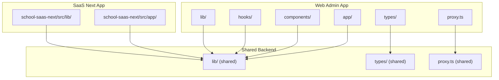
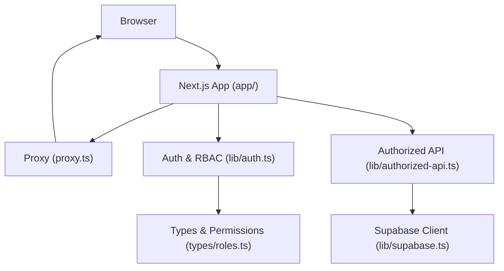
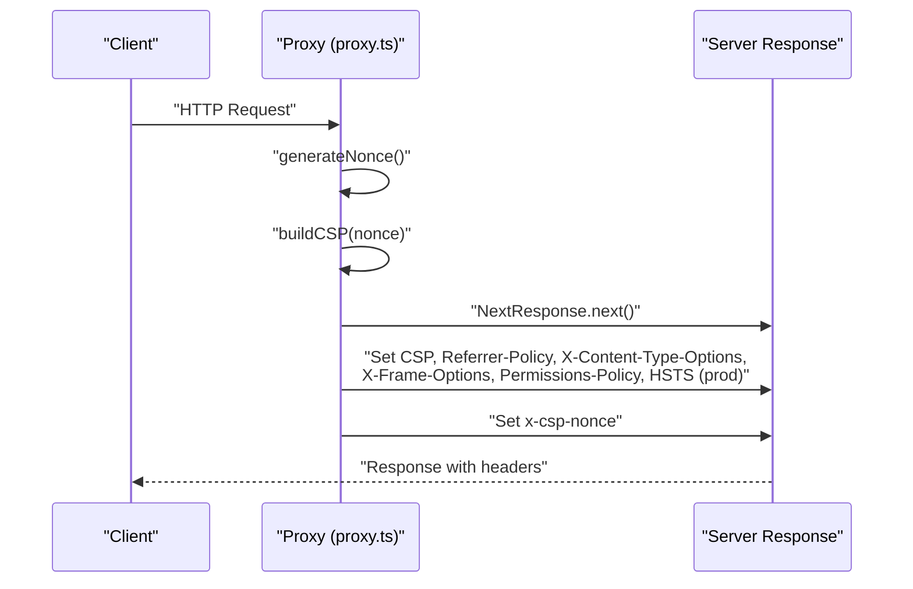
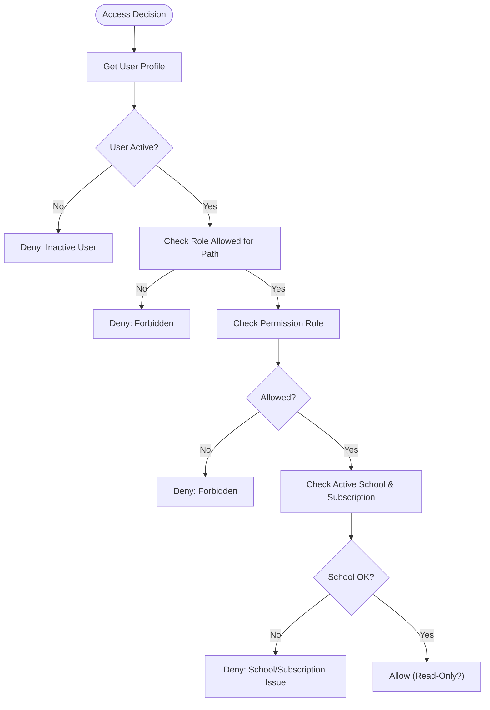
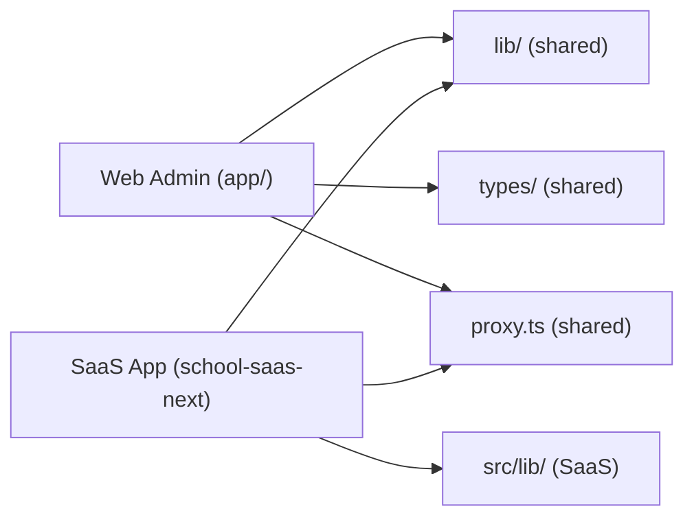

# Developer Guidelines

<cite>
**Referenced Files in This Document**
- [README.md](file://README.md)
- [package.json](file://package.json)
- [eslint.config.mjs](file://eslint.config.mjs)
- [tsconfig.json](file://tsconfig.json)
- [next.config.ts](file://next.config.ts)
- [postcss.config.mjs](file://postcss.config.mjs)
- [proxy.ts](file://proxy.ts)
- [lib/auth.ts](file://lib/auth.ts)
- [lib/supabase.ts](file://lib/supabase.ts)
- [lib/authorized-api.ts](file://lib/authorized-api.ts)
- [types/roles.ts](file://types/roles.ts)
- [hooks/useAuth.ts](file://hooks/useAuth.ts)
- [components/ui/button.tsx](file://components/ui/button.tsx)
- [app/layout.tsx](file://app/layout.tsx)
- [school-saas-next/eslint.config.mjs](file://school-saas-next/eslint.config.mjs)
- [school-saas-next/tsconfig.json](file://school-saas-next/tsconfig.json)
- [school-saas-next/package.json](file://school-saas-next/package.json)
</cite>

## Table of Contents
1. [Introduction](#introduction)
2. [Project Structure](#project-structure)
3. [Core Components](#core-components)
4. [Architecture Overview](#architecture-overview)
5. [Detailed Component Analysis](#detailed-component-analysis)
6. [Dependency Analysis](#dependency-analysis)
7. [Performance Considerations](#performance-considerations)
8. [Troubleshooting Guide](#troubleshooting-guide)
9. [Conclusion](#conclusion)
10. [Appendices](#appendices)

## Introduction
This document defines developer standards, contribution processes, and best practices for the school administration platform. It covers TypeScript configuration, ESLint rules, code formatting, development workflow, project structure conventions, testing and documentation expectations, quality gates, and practical examples for implementing features, refactoring, and integrating with shared backend services. It also describes the development environment setup, debugging techniques, and performance profiling approaches.

## Project Structure
The repository is a monorepo-like structure with multiple apps and shared libraries:
- Web admin UI: app/[locale], components/, hooks/, messages/, public/
- Shared backend/domain logic: app/api/, lib/, types/, proxy.ts, scripts/
- Database, migrations, storage: migrations/, database_setup.sql, admin_infrastructure.sql
- SaaS Next.js app: school-saas-next/
- Additional standalone apps: 00990090/, school-acc-system/

Key boundaries and notes:
- The web admin UI is intentionally scoped to web-only concerns and must not include mobile runtime code.
- Shared Supabase and domain logic live under lib/ and are consumed by both web and SaaS apps.
- Security headers and CSP are enforced via a proxy function that injects per-request nonces.

**Diagram sources**
- [README.md:18-31](file://README.md#L18-L31)
- [proxy.ts:125-139](file://proxy.ts#L125-L139)

**Section sources**
- [README.md:18-31](file://README.md#L18-L31)

## Core Components
- TypeScript configuration: strict mode, bundler module resolution, isolated modules, JSX transform, path aliases, and include/exclude rules tailored to the app scope.
- ESLint configuration: Next.js core-web-vitals and TypeScript presets, custom overrides, and project-specific ignores.
- Build and lint scripts: dev, build, lint, typecheck, check, audit.
- Security headers and CSP: dynamic generation via a proxy with per-request nonces and environment-aware HSTS.

**Section sources**
- [tsconfig.json:1-49](file://tsconfig.json#L1-L49)
- [eslint.config.mjs:1-40](file://eslint.config.mjs#L1-L40)
- [package.json:5-14](file://package.json#L5-L14)
- [next.config.ts:8-49](file://next.config.ts#L8-L49)
- [proxy.ts:44-123](file://proxy.ts#L44-L123)

## Architecture Overview
The system integrates a Next.js web admin app with shared backend logic and Supabase. Authentication and RBAC decisions are centralized in lib/auth.ts, while API access is mediated by lib/authorized-api.ts. Security headers and CSP are injected by proxy.ts for dynamic routes, with static assets receiving fallback headers.

**Diagram sources**
- [proxy.ts:91-123](file://proxy.ts#L91-L123)
- [lib/auth.ts:1-341](file://lib/auth.ts#L1-L341)
- [lib/authorized-api.ts:1-49](file://lib/authorized-api.ts#L1-L49)
- [lib/supabase.ts:1-22](file://lib/supabase.ts#L1-L22)
- [types/roles.ts:1-432](file://types/roles.ts#L1-L432)

## Detailed Component Analysis

### TypeScript Configuration and Formatting Standards
- Strictness: enabled with no implicit any and no emit for type checks.
- Module resolution: bundler for ESM and isolated modules for build safety.
- Path aliases: @/* mapped to repository root for clean imports.
- Include/exclude: targets TS/TSX files and Next’s generated types; excludes sibling projects and artifacts.
- Formatting: enforced via ESLint rules and Next presets; avoid unsafe inline scripts by generating nonces in CSP.

**Section sources**
- [tsconfig.json:11-31](file://tsconfig.json#L11-L31)
- [tsconfig.json:33-47](file://tsconfig.json#L33-L47)
- [eslint.config.mjs:27-35](file://eslint.config.mjs#L27-L35)

### ESLint Rules and Code Quality
- Presets: Next.js core-web-vitals and TypeScript recommended rules.
- Overrides: disable specific React Hooks purity and setState-in-effect checks; warn on unused vars with underscore pattern; prefer const; warn on explicit any.
- Ignores: exclude sibling projects and artifacts; keep Next internals and build outputs ignored.

**Section sources**
- [eslint.config.mjs:5-37](file://eslint.config.mjs#L5-L37)

### Security Headers and CSP (Dynamic Nonce Injection)
- Per-request nonce generation for CSP script-src.
- Connect-src and image-src include self, data, blob, HTTPS, and Supabase origins when configured.
- Development adds unsafe-eval for HMR/source maps; production includes HSTS.
- Other security headers set consistently; nonce exposed via custom header for server components.

**Diagram sources**
- [proxy.ts:7-17](file://proxy.ts#L7-L17)
- [proxy.ts:44-85](file://proxy.ts#L44-L85)
- [proxy.ts:91-123](file://proxy.ts#L91-L123)

**Section sources**
- [proxy.ts:44-123](file://proxy.ts#L44-L123)

### Authentication, RBAC, and Access Control
- Centralized user profile retrieval and access decision logic.
- Role-based permissions and route-level rules; supports read-only roles and subscription checks.
- Session cookie initialization via an RBAC endpoint; safe sign-out clears session cookie and Supabase session.

**Diagram sources**
- [lib/auth.ts:106-145](file://lib/auth.ts#L106-L145)
- [types/roles.ts:198-268](file://types/roles.ts#L198-L268)

**Section sources**
- [lib/auth.ts:79-149](file://lib/auth.ts#L79-L149)
- [types/roles.ts:47-72](file://types/roles.ts#L47-L72)
- [types/roles.ts:198-268](file://types/roles.ts#L198-L268)

### Authorized API Access Pattern
- Merge and augment headers with Supabase session bearer token.
- Provide fetch wrappers for authorized requests and JSON parsing with safe error handling.

**Section sources**
- [lib/authorized-api.ts:14-49](file://lib/authorized-api.ts#L14-L49)

### Supabase Client Initialization
- Enforce presence of required environment variables for Supabase URL and keys.
- Create a browser client for SSR-friendly auth and data access.

**Section sources**
- [lib/supabase.ts:8-22](file://lib/supabase.ts#L8-L22)

### UI Component Conventions
- Reusable UI components use forwardRef and Tailwind-based variants/sizes.
- Consistent props and class composition via a small utility.

**Section sources**
- [components/ui/button.tsx:15-35](file://components/ui/button.tsx#L15-L35)

### Application Layout and Providers
- Global metadata and RTL layout with hydration suppression.
- Providers wrap children for theme, language, and toast contexts.

**Section sources**
- [app/layout.tsx:6-31](file://app/layout.tsx#L6-L31)

### SaaS Next.js App Configuration
- Separate ESLint and TypeScript configs for the SaaS app with minimal ignores.
- Scripts and dependencies aligned with Next.js 16.

**Section sources**
- [school-saas-next/eslint.config.mjs:1-19](file://school-saas-next/eslint.config.mjs#L1-L19)
- [school-saas-next/tsconfig.json:1-35](file://school-saas-next/tsconfig.json#L1-L35)
- [school-saas-next/package.json:5-10](file://school-saas-next/package.json#L5-L10)

## Dependency Analysis
- Web admin app depends on shared lib/, types/, and proxy.ts.
- SaaS app depends on its own src/lib and shares Supabase client patterns.
- Security posture relies on CSP nonces and environment-aware headers.

**Diagram sources**
- [README.md:20-22](file://README.md#L20-L22)
- [proxy.ts:125-139](file://proxy.ts#L125-L139)

**Section sources**
- [README.md:20-22](file://README.md#L20-L22)

## Performance Considerations
- Prefer isolated modules and bundler module resolution for faster builds and accurate diagnostics.
- Keep strict mode enabled to catch potential performance pitfalls early.
- Use the proxy’s CSP with nonces to minimize render-blocking script risks.
- Leverage Next.js static headers for static assets and dynamic headers only for non-static routes.

**Section sources**
- [tsconfig.json:14-18](file://tsconfig.json#L14-L18)
- [next.config.ts:10-44](file://next.config.ts#L10-L44)
- [proxy.ts:44-85](file://proxy.ts#L44-L85)

## Troubleshooting Guide
- Missing Supabase environment variables cause an immediate error during client creation. Ensure NEXT_PUBLIC_SUPABASE_URL and NEXT_PUBLIC_SUPABASE_ANON_KEY (or publishable key) are present.
- If RBAC session initialization fails, the wrapper throws a descriptive error when strict mode is enabled; otherwise it logs and continues.
- For access denied issues, inspect the access decision reasons returned by the RBAC logic and verify role, permissions, active school, and subscription status.
- To debug CSP, confirm the nonce header is present and that dynamic routes match the proxy matcher configuration.

**Section sources**
- [lib/supabase.ts:8-19](file://lib/supabase.ts#L8-L19)
- [lib/authorized-api.ts:294-317](file://lib/authorized-api.ts#L294-L317)
- [lib/auth.ts:106-145](file://lib/auth.ts#L106-L145)
- [proxy.ts:125-139](file://proxy.ts#L125-L139)

## Conclusion
These guidelines establish a consistent, secure, and maintainable development process across the web admin app, shared backend, and SaaS app. By adhering to TypeScript strictness, ESLint rules, CSP with nonces, and centralized auth/RBAC patterns, contributors can implement features safely and efficiently while preserving code quality and performance.

## Appendices

### Development Workflow and Contribution Processes
- Branching: Use feature branches prefixed with concise, descriptive names. Sync with main before opening PRs.
- Pull Requests: Include a summary, rationale, and links to related issues. Ensure CI passes and reviews are approved.
- Code Review: Focus on correctness, readability, security (especially CSP and auth), and adherence to project conventions.
- Quality Gates: Run lint, typecheck, and build locally before pushing. Verify Supabase env vars are set and RBAC behavior aligns with expectations.

[No sources needed since this section provides general guidance]

### Testing Requirements
- Unit tests: Prefer component and utility tests with deterministic mocks for Supabase and RBAC logic.
- Integration tests: Validate API flows with authorized headers and session cookies.
- Manual QA: Test access control across roles, locales, and subscription states; verify CSP and security headers.

[No sources needed since this section provides general guidance]

### Documentation Standards
- Document new APIs in lib/ and shared types with clear intent and examples.
- Update README sections when introducing new capabilities or changing boundaries.
- Keep inline comments concise; defer long-form explanations to docs or JSDoc.

[No sources needed since this section provides general guidance]

### Practical Examples

#### Implementing a New Feature Page
- Create a new page under app/[locale]/<feature>/page.tsx.
- Add route-level access rules in types/roles.ts if needed.
- Use lib/authorized-api.ts for data fetching and hooks/useAuth.ts for capability checks.
- Apply UI components from components/ and ensure RTL layout compatibility.

**Section sources**
- [types/roles.ts:198-268](file://types/roles.ts#L198-L268)
- [lib/authorized-api.ts:27-49](file://lib/authorized-api.ts#L27-L49)
- [hooks/useAuth.ts:5-21](file://hooks/useAuth.ts#L5-L21)

#### Refactoring Existing Code
- Replace ad-hoc headers with buildAuthorizedHeaders from lib/authorized-api.ts.
- Consolidate access checks into getAccessDecision from lib/auth.ts.
- Ensure path normalization and matching logic align with types/roles.ts.

**Section sources**
- [lib/authorized-api.ts:14-25](file://lib/authorized-api.ts#L14-L25)
- [lib/auth.ts:106-145](file://lib/auth.ts#L106-L145)
- [types/roles.ts:380-414](file://types/roles.ts#L380-L414)

#### Integrating with Shared Backend Services
- Use lib/supabase.ts for client initialization and lib/authorized-api.ts for authenticated requests.
- Respect RBAC rules and session lifecycle; clear cookies on sign-out via lib/auth.ts.

**Section sources**
- [lib/supabase.ts:1-22](file://lib/supabase.ts#L1-L22)
- [lib/authorized-api.ts:27-49](file://lib/authorized-api.ts#L27-L49)
- [lib/auth.ts:333-341](file://lib/auth.ts#L333-L341)

### Development Environment Setup
- Install dependencies and run the dev server using the scripts defined in package.json.
- Configure environment variables for Supabase and any external services.
- Use ESLint and TypeScript checks locally before committing.

**Section sources**
- [package.json:5-14](file://package.json#L5-L14)
- [lib/supabase.ts:3-19](file://lib/supabase.ts#L3-L19)
- [eslint.config.mjs:9-25](file://eslint.config.mjs#L9-L25)

### Debugging Techniques
- Inspect access decision reasons in lib/auth.ts to diagnose permission failures.
- Verify CSP headers and nonce presence in proxy.ts for script-related issues.
- Use browser devtools to confirm headers and network requests.

**Section sources**
- [lib/auth.ts:106-145](file://lib/auth.ts#L106-L145)
- [proxy.ts:91-123](file://proxy.ts#L91-L123)

### Performance Profiling Approaches
- Measure build times with Next.js stats and analyze bundle composition.
- Monitor runtime performance using browser devtools and server logs.
- Keep CSP minimal and nonces per request to reduce render-blocking risks.

[No sources needed since this section provides general guidance]