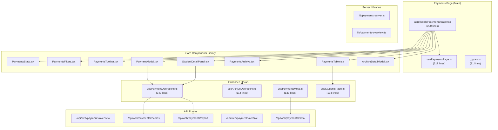
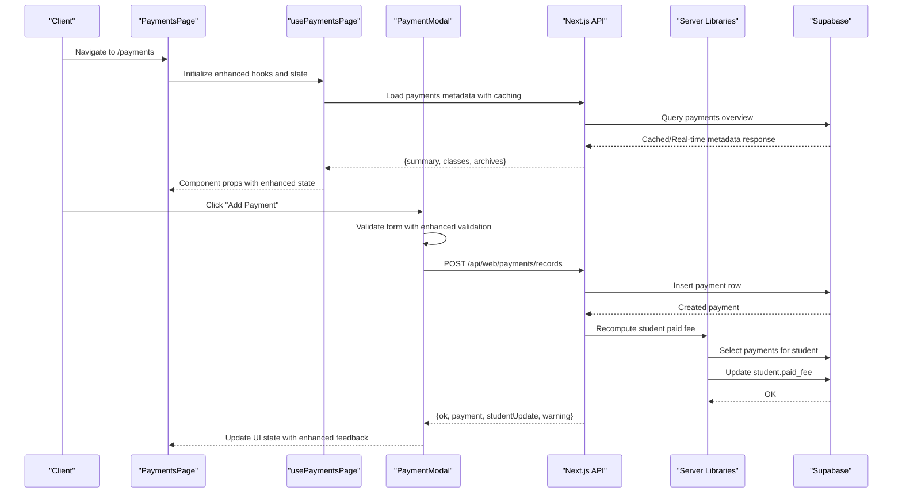
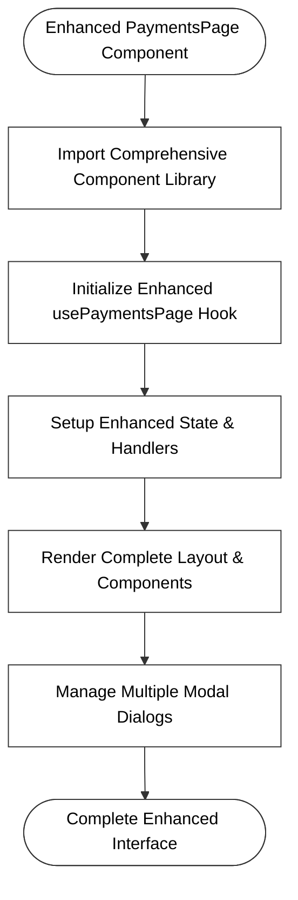
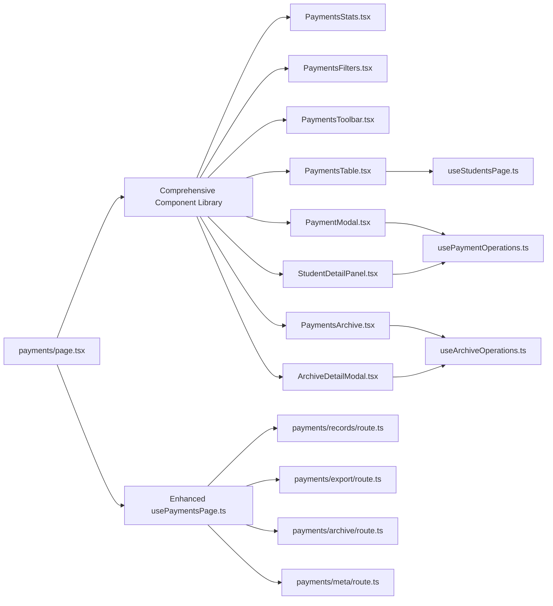

# Financial Operations

<cite>
**Referenced Files in This Document**
- [route.ts](file://app/api/web/payments/overview/route.ts)
- [route.ts](file://app/api/web/payments/records/route.ts)
- [route.ts](file://app/api/web/payments/export/route.ts)
- [route.ts](file://app/api/web/payments/archive/route.ts)
- [route.ts](file://app/api/web/payments/meta/route.ts)
- [route.ts](file://app/api/web/reports/overview/route.ts)
- [route.ts](file://app/api/web/reports/dataset/route.ts)
- [payments-server.ts](file://lib/payments-server.ts)
- [payments-overview.ts](file://lib/payments-overview.ts)
- [page.tsx](file://app/[locale]/payments/page.tsx)
- [PaymentModal.tsx](file://app/[locale]/payments/_components/PaymentModal.tsx)
- [PaymentsTable.tsx](file://app/[locale]/payments/_components/PaymentsTable.tsx)
- [PaymentsToolbar.tsx](file://app/[locale]/payments/_components/PaymentsToolbar.tsx)
- [PaymentsStats.tsx](file://app/[locale]/payments/_components/PaymentsStats.tsx)
- [PaymentsFilters.tsx](file://app/[locale]/payments/_components/PaymentsFilters.tsx)
- [StudentDetailPanel.tsx](file://app/[locale]/payments/_components/StudentDetailPanel.tsx)
- [PaymentsArchive.tsx](file://app/[locale]/payments/_components/PaymentsArchive.tsx)
- [ArchiveDetailModal.tsx](file://app/[locale]/payments/_components/ArchiveDetailModal.tsx)
- [usePaymentsPage.ts](file://app/[locale]/payments/_hooks/usePaymentsPage.ts)
- [usePaymentOperations.ts](file://app/[locale]/payments/_hooks/usePaymentOperations.ts)
- [useArchiveOperations.ts](file://app/[locale]/payments/_hooks/useArchiveOperations.ts)
- [usePaymentsMeta.ts](file://app/[locale]/payments/_hooks/usePaymentsMeta.ts)
- [useStudentsPage.ts](file://app/[locale]/payments/_hooks/useStudentsPage.ts)
- [_types.ts](file://app/[locale]/payments/_types.ts)
</cite>

## Update Summary
**Changes Made**
- Updated payments module architecture to reflect comprehensive component library restructuring
- Added documentation for new modular component structure including PaymentsTable, PaymentsFilters, PaymentModal, PaymentsArchive, and ArchiveDetailModal
- Enhanced payment operations hooks documentation with improved state management and business logic
- Updated payment processing workflow to include new modal-based interface and enhanced student detail panel
- Expanded archive management documentation with new archive operations and export functionality

## Table of Contents
1. [Introduction](#introduction)
2. [Project Structure](#project-structure)
3. [Core Components](#core-components)
4. [Architecture Overview](#architecture-overview)
5. [Detailed Component Analysis](#detailed-component-analysis)
6. [Enhanced Payment Operations](#enhanced-payment-operations)
7. [Archive Management System](#archive-management-system)
8. [Dependency Analysis](#dependency-analysis)
9. [Performance Considerations](#performance-considerations)
10. [Troubleshooting Guide](#troubleshooting-guide)
11. [Conclusion](#conclusion)
12. [Appendices](#appendices)

## Introduction
This document explains the financial operations system for payment processing, expense management, and financial reporting. It covers invoice generation, payment collection, reconciliation, dashboards for revenue tracking, expense monitoring, and cash flow analysis. It also documents supported payment methods, refund processing, financial audit trails, fee structures, discount management, subscription billing, integration with student management, invoice systems, export functionality for accounting, and common financial scenarios including payment failures and reconciliation procedures.

**Updated** The payments system has undergone a comprehensive redesign with a complete component library restructuring, reducing the main page from 1841 lines to 200 lines through modular architecture and introducing advanced payment operations with enhanced state management.

## Project Structure
The financial domain is implemented as a set of Next.js API routes under app/api/web, backed by Supabase queries and server-side helpers. The payments page now follows a comprehensive modular component architecture with extracted UI components, centralized hooks, and enhanced payment operations.

**Updated** The payments page structure has been completely redesigned with a comprehensive component library:

**Diagram sources**
- [page.tsx](file://app/[locale]/payments/page.tsx)
- [usePaymentsPage.ts](file://app/[locale]/payments/_hooks/usePaymentsPage.ts)
- [PaymentsStats.tsx](file://app/[locale]/payments/_components/PaymentsStats.tsx)
- [PaymentsFilters.tsx](file://app/[locale]/payments/_components/PaymentsFilters.tsx)
- [PaymentsToolbar.tsx](file://app/[locale]/payments/_components/PaymentsToolbar.tsx)
- [PaymentsTable.tsx](file://app/[locale]/payments/_components/PaymentsTable.tsx)
- [PaymentModal.tsx](file://app/[locale]/payments/_components/PaymentModal.tsx)
- [StudentDetailPanel.tsx](file://app/[locale]/payments/_components/StudentDetailPanel.tsx)
- [PaymentsArchive.tsx](file://app/[locale]/payments/_components/PaymentsArchive.tsx)
- [ArchiveDetailModal.tsx](file://app/[locale]/payments/_components/ArchiveDetailModal.tsx)
- [usePaymentOperations.ts](file://app/[locale]/payments/_hooks/usePaymentOperations.ts)
- [useArchiveOperations.ts](file://app/[locale]/payments/_hooks/useArchiveOperations.ts)
- [usePaymentsMeta.ts](file://app/[locale]/payments/_hooks/usePaymentsMeta.ts)
- [useStudentsPage.ts](file://app/[locale]/payments/_hooks/useStudentsPage.ts)
- [route.ts](file://app/api/web/payments/overview/route.ts)
- [route.ts](file://app/api/web/payments/records/route.ts)
- [route.ts](file://app/api/web/payments/export/route.ts)
- [route.ts](file://app/api/web/payments/archive/route.ts)
- [route.ts](file://app/api/web/payments/meta/route.ts)
- [payments-server.ts](file://lib/payments-server.ts)
- [payments-overview.ts](file://lib/payments-overview.ts)

**Section sources**
- [page.tsx](file://app/[locale]/payments/page.tsx)
- [usePaymentsPage.ts](file://app/[locale]/payments/_hooks/usePaymentsPage.ts)
- [route.ts](file://app/api/web/payments/overview/route.ts)
- [route.ts](file://app/api/web/payments/records/route.ts)
- [route.ts](file://app/api/web/payments/export/route.ts)
- [route.ts](file://app/api/web/payments/archive/route.ts)
- [route.ts](file://app/api/web/payments/meta/route.ts)
- [payments-server.ts](file://lib/payments-server.ts)
- [payments-overview.ts](file://lib/payments-overview.ts)

## Core Components
- **Payments Page Main**: Streamlined 200-line page orchestrating the entire payments interface with comprehensive component library.
- **Payment Modal**: Advanced modal component for creating new payments with student search, form validation, and receipt number generation.
- **Payments Stats**: Financial summary cards displaying total fees, payments, remaining amounts, and collection statistics.
- **Payments Filters**: Sophisticated filtering system with quick filters, class selection, sorting options, and export functionality.
- **Payments Toolbar**: Enhanced search interface with results counter for efficient student navigation.
- **Payments Table**: Comprehensive data table displaying student payment information with progress indicators, pagination, and action buttons.
- **Student Detail Panel**: Complete student view with payment history, financial summary, transaction management, and print functionality.
- **Payments Archive**: Advanced archive management with year selection, export functionality, and annual snapshot generation.
- **Archive Detail Modal**: Detailed archive view with comprehensive student and payment listings for annual snapshot inspection.
- **Centralized Hooks**: Enhanced hooks managing state, API operations, and business logic across all components with improved error handling.

**Updated** The core components now follow a comprehensive modular architecture with clear separation of concerns and enhanced functionality:

**Section sources**
- [page.tsx](file://app/[locale]/payments/page.tsx)
- [PaymentModal.tsx](file://app/[locale]/payments/_components/PaymentModal.tsx)
- [PaymentsStats.tsx](file://app/[locale]/payments/_components/PaymentsStats.tsx)
- [PaymentsFilters.tsx](file://app/[locale]/payments/_components/PaymentsFilters.tsx)
- [PaymentsToolbar.tsx](file://app/[locale]/payments/_components/PaymentsToolbar.tsx)
- [PaymentsTable.tsx](file://app/[locale]/payments/_components/PaymentsTable.tsx)
- [StudentDetailPanel.tsx](file://app/[locale]/payments/_components/StudentDetailPanel.tsx)
- [PaymentsArchive.tsx](file://app/[locale]/payments/_components/PaymentsArchive.tsx)
- [ArchiveDetailModal.tsx](file://app/[locale]/payments/_components/ArchiveDetailModal.tsx)
- [usePaymentsPage.ts](file://app/[locale]/payments/_hooks/usePaymentsPage.ts)

## Architecture Overview
The system integrates Next.js API routes with Supabase for data persistence and computation. The redesigned payments page follows a comprehensive component-based architecture with centralized state management through enhanced hooks. Payments are recorded against students and immediately reconciled to update balances. Reporting leverages a dedicated RPC for performance and falls back to client-side aggregation when unavailable. Export endpoints support CSV/XLSX downloads for accounting systems. The enhanced architecture includes comprehensive error handling, caching mechanisms, and improved user experience through modal-based interactions.

**Updated** The architecture now emphasizes comprehensive modularity, enhanced state management, and improved user experience:

**Diagram sources**
- [page.tsx](file://app/[locale]/payments/page.tsx)
- [usePaymentsPage.ts](file://app/[locale]/payments/_hooks/usePaymentsPage.ts)
- [PaymentModal.tsx](file://app/[locale]/payments/_components/PaymentModal.tsx)
- [route.ts](file://app/api/web/payments/records/route.ts)
- [payments-server.ts](file://lib/payments-server.ts)

## Detailed Component Analysis

### Payments Page Main: Comprehensive Component Orchestration
**Updated** The main payments page has been streamlined from 1841 lines to 200 lines through comprehensive component extraction:

Purpose:
- Serve as the central orchestrator for the comprehensive payments interface
- Import and coordinate all extracted components from the _components directory
- Manage overall application state and user interactions with enhanced error handling
- Handle routing, permissions, and internationalization with improved user experience
- Coordinate between multiple specialized hooks for different aspects of payment management

Key behaviors:
- Imports comprehensive component library from the _components directory
- Uses ProtectedRoute for role-based access control with enhanced permissions
- Integrates with centralized hooks for state management with caching
- Manages multiple modal dialogs and confirmation dialogs with proper state isolation
- Handles school scope validation and empty states with improved user feedback
- Coordinates between payment operations, archive management, and student detail views

**Diagram sources**
- [page.tsx](file://app/[locale]/payments/page.tsx)

**Section sources**
- [page.tsx](file://app/[locale]/payments/page.tsx)

### Payment Modal: Advanced Payment Creation Interface
Purpose:
- Provide a sophisticated interface for creating new payments with enhanced user experience
- Implement intelligent student search with dropdown suggestions and caching
- Validate payment form inputs with comprehensive error handling
- Generate automatic receipt numbers with enhanced formatting and manual override
- Support multiple payment methods with improved user interface

Key behaviors:
- Intelligent student search with debounced API calls and dropdown suggestions
- Comprehensive form validation for required fields with real-time feedback
- Automatic receipt number generation with enhanced formatting (REC-XXXX format)
- Payment method selection with improved user interface and validation
- Integration with parent component handlers with enhanced error propagation
- Manual receipt number override for special cases

**Section sources**
- [PaymentModal.tsx](file://app/[locale]/payments/_components/PaymentModal.tsx)

### Payments Table: Comprehensive Student Payment Display
Purpose:
- Display comprehensive student payment information in a sortable, paginated table
- Show payment progress with sophisticated visual indicators and enhanced styling
- Provide quick actions for adding payments and viewing detailed student information
- Support advanced pagination with improved user experience

Key behaviors:
- Loading states with enhanced visual feedback and empty state handling
- Pagination with improved navigation controls and page size management
- Progress bars with sophisticated styling showing payment completion percentage
- Action buttons with enhanced icons and tooltips for payment entry and detail viewing
- Responsive design with improved currency formatting and accessibility
- Enhanced sorting and filtering capabilities with improved user experience

**Section sources**
- [PaymentsTable.tsx](file://app/[locale]/payments/_components/PaymentsTable.tsx)

### Student Detail Panel: Complete Student View
**Updated** Enhanced with comprehensive functionality for payment management:

Purpose:
- Provide detailed view of individual student's complete financial information
- Display comprehensive payment history with transaction details and enhanced formatting
- Enable payment deletion with improved confirmation dialogs and receipt printing
- Show comprehensive financial summary with enhanced progress indicators and visualizations

Key behaviors:
- Financial summary cards with enhanced formatting for total, paid, discounted, and remaining amounts
- Payment history table with improved method badges, action buttons, and enhanced styling
- Progress bar visualization with sophisticated gradient styling and payment completion percentage
- Integration with payment operations for comprehensive CRUD actions with enhanced error handling
- Print receipt functionality with improved branded templates and enhanced formatting
- Enhanced responsive design with improved accessibility and user experience

**Section sources**
- [StudentDetailPanel.tsx](file://app/[locale]/payments/_components/StudentDetailPanel.tsx)

### Payments Archive: Advanced Archive Management
**Updated** Enhanced with comprehensive archive functionality:

Purpose:
- Provide advanced archive management with year selection and export functionality
- Generate annual archives of payments and student snapshots with enhanced data integrity
- Support comprehensive archive viewing with detailed student and payment listings
- Enable archive export with improved Excel generation and enhanced formatting

Key behaviors:
- Year selection with comprehensive year options and validation
- Archive creation with enhanced permission checking and data validation
- Archive viewing with detailed student and payment listings with enhanced formatting
- Archive export with improved Excel generation and comprehensive data export
- Enhanced archive statistics with improved calculations and display
- Archive detail modal with comprehensive archive inspection capabilities

**Section sources**
- [PaymentsArchive.tsx](file://app/[locale]/payments/_components/PaymentsArchive.tsx)

### Archive Detail Modal: Comprehensive Archive Inspection
**Updated** Enhanced with detailed archive inspection capabilities:

Purpose:
- Provide comprehensive inspection of individual archive snapshots
- Display detailed student listings with enhanced financial information
- Show comprehensive payment listings with improved formatting and sorting
- Enable archive export with enhanced Excel generation and formatting

Key behaviors:
- Archive summary with enhanced KPI display and calculations
- Student listing with comprehensive financial information and enhanced styling
- Payment listing with improved sorting and enhanced formatting
- Archive export with comprehensive data export and enhanced Excel generation
- Detailed archive inspection with improved user interface and enhanced accessibility

**Section sources**
- [ArchiveDetailModal.tsx](file://app/[locale]/payments/_components/ArchiveDetailModal.tsx)

## Enhanced Payment Operations
**Updated** The payment operations system has been comprehensively enhanced with improved state management and business logic:

### usePaymentOperations: Comprehensive Payment Management
Purpose:
- Provide comprehensive state management for payment operations with enhanced functionality
- Handle complex payment creation, deletion, and management operations
- Coordinate between multiple components and API operations with improved error handling
- Manage student search, payment modal state, and payment history with enhanced caching

Key behaviors:
- Enhanced student search with debounced API calls and improved dropdown management
- Comprehensive payment modal state management with form validation and error handling
- Advanced payment creation with enhanced receipt number generation and branch resolution
- Improved payment deletion with enhanced confirmation dialogs and error handling
- Enhanced payment loading with caching and improved performance
- Comprehensive payment history management with enhanced state updates

### useArchiveOperations: Advanced Archive Management
Purpose:
- Provide comprehensive state management for archive operations with enhanced functionality
- Handle complex archive creation, viewing, and export operations
- Coordinate between archive components and API operations with improved error handling
- Manage archive state, detail modal, and export operations with enhanced user experience

Key behaviors:
- Archive year selection with enhanced validation and state management
- Archive creation with enhanced permission checking and data validation
- Archive detail management with improved modal state and data handling
- Archive export with enhanced Excel generation and progress indication
- Enhanced archive operations with improved error handling and user feedback

### usePaymentsMeta: Enhanced Metadata Management
Purpose:
- Provide comprehensive state management for payment metadata with enhanced caching
- Handle complex metadata loading, updating, and caching operations
- Coordinate between multiple components and API operations with improved performance
- Manage summary data, class options, payment years, and archive information with enhanced state management

Key behaviors:
- Enhanced metadata caching with improved cache invalidation and performance
- Comprehensive metadata loading with enhanced error handling and retry logic
- Enhanced summary data management with improved calculations and updates
- Archive management with enhanced state updates and notifications
- Payment year management with improved sorting and validation

### useStudentsPage: Advanced Student Management
Purpose:
- Provide comprehensive state management for student data with enhanced caching
- Handle complex student loading, pagination, and filtering operations
- Coordinate between multiple components and API operations with improved performance
- Manage student data, payment counts, and pagination with enhanced state management

Key behaviors:
- Enhanced student data caching with improved cache keys and invalidation
- Comprehensive student loading with enhanced error handling and loading states
- Advanced pagination with improved page management and total count handling
- Enhanced payment count management with improved state updates
- Student financial updates with enhanced state synchronization

**Section sources**
- [usePaymentOperations.ts](file://app/[locale]/payments/_hooks/usePaymentOperations.ts)
- [useArchiveOperations.ts](file://app/[locale]/payments/_hooks/useArchiveOperations.ts)
- [usePaymentsMeta.ts](file://app/[locale]/payments/_hooks/usePaymentsMeta.ts)
- [useStudentsPage.ts](file://app/[locale]/payments/_hooks/useStudentsPage.ts)

## Archive Management System
**Updated** The archive management system has been comprehensively enhanced:

### Archive Creation Process
Purpose:
- Provide comprehensive annual archive creation with enhanced data integrity
- Handle complex archive generation, validation, and storage operations
- Support archive export with enhanced Excel generation and formatting

Key behaviors:
- Archive year validation with enhanced input checking and error handling
- Archive data collection with comprehensive student and payment retrieval
- Archive snapshot creation with enhanced data structuring and validation
- Archive storage with enhanced upsert operations and conflict resolution
- Archive notification with enhanced success/error messaging

### Archive Export Functionality
Purpose:
- Provide comprehensive archive export with enhanced Excel generation
- Handle complex archive data export with improved formatting and validation
- Support multi-sheet Excel export with enhanced data organization

Key behaviors:
- Archive data preparation with enhanced student and payment extraction
- Multi-sheet Excel generation with enhanced formatting and styling
- Archive export validation with enhanced error handling and progress indication
- Archive export completion with enhanced user feedback and file naming

**Section sources**
- [PaymentsArchive.tsx](file://app/[locale]/payments/_components/PaymentsArchive.tsx)
- [ArchiveDetailModal.tsx](file://app/[locale]/payments/_components/ArchiveDetailModal.tsx)
- [useArchiveOperations.ts](file://app/[locale]/payments/_hooks/useArchiveOperations.ts)

## Dependency Analysis
**Updated** The dependency structure now reflects the comprehensive modular component architecture:

- **Payments Page Main** depends on:
  - Complete component library from _components directory with enhanced exports
  - Centralized hooks for comprehensive state management
  - Enhanced internationalization and localization utilities
  - ProtectedRoute for role-based access control with improved permissions

- **Individual Components** depend on:
  - Shared types from _types.ts with enhanced type definitions
  - Parent component handlers passed as props with improved typing
  - Enhanced formatting utilities for currency and dates
  - Icon components for improved UI elements

- **Enhanced Hooks** depend on:
  - All API routes for comprehensive data operations
  - School scope resolution utilities with enhanced context management
  - Role-based permission checking with improved security
  - Enhanced internationalization utilities with improved locale handling

- **Component Dependencies** include:
  - PaymentModal depends on usePaymentOperations for state management
  - PaymentsTable depends on useStudentsPage for student data
  - StudentDetailPanel depends on usePaymentOperations for payment management
  - PaymentsArchive depends on useArchiveOperations for archive management

**Diagram sources**
- [page.tsx](file://app/[locale]/payments/page.tsx)
- [usePaymentsPage.ts](file://app/[locale]/payments/_hooks/usePaymentsPage.ts)
- [PaymentModal.tsx](file://app/[locale]/payments/_components/PaymentModal.tsx)
- [PaymentsTable.tsx](file://app/[locale]/payments/_components/PaymentsTable.tsx)
- [StudentDetailPanel.tsx](file://app/[locale]/payments/_components/StudentDetailPanel.tsx)
- [PaymentsArchive.tsx](file://app/[locale]/payments/_components/PaymentsArchive.tsx)
- [ArchiveDetailModal.tsx](file://app/[locale]/payments/_components/ArchiveDetailModal.tsx)
- [usePaymentOperations.ts](file://app/[locale]/payments/_hooks/usePaymentOperations.ts)
- [useArchiveOperations.ts](file://app/[locale]/payments/_hooks/useArchiveOperations.ts)
- [usePaymentsMeta.ts](file://app/[locale]/payments/_hooks/usePaymentsMeta.ts)
- [useStudentsPage.ts](file://app/[locale]/payments/_hooks/useStudentsPage.ts)
- [route.ts](file://app/api/web/payments/records/route.ts)
- [route.ts](file://app/api/web/payments/export/route.ts)
- [route.ts](file://app/api/web/payments/archive/route.ts)
- [route.ts](file://app/api/web/payments/meta/route.ts)

**Section sources**
- [page.tsx](file://app/[locale]/payments/page.tsx)
- [usePaymentsPage.ts](file://app/[locale]/payments/_hooks/usePaymentsPage.ts)
- [PaymentModal.tsx](file://app/[locale]/payments/_components/PaymentModal.tsx)
- [PaymentsTable.tsx](file://app/[locale]/payments/_components/PaymentsTable.tsx)
- [StudentDetailPanel.tsx](file://app/[locale]/payments/_components/StudentDetailPanel.tsx)
- [PaymentsArchive.tsx](file://app/[locale]/payments/_components/PaymentsArchive.tsx)
- [ArchiveDetailModal.tsx](file://app/[locale]/payments/_components/ArchiveDetailModal.tsx)
- [usePaymentOperations.ts](file://app/[locale]/payments/_hooks/usePaymentOperations.ts)
- [useArchiveOperations.ts](file://app/[locale]/payments/_hooks/useArchiveOperations.ts)
- [usePaymentsMeta.ts](file://app/[locale]/payments/_hooks/usePaymentsMeta.ts)
- [useStudentsPage.ts](file://app/[locale]/payments/_hooks/useStudentsPage.ts)
- [route.ts](file://app/api/web/payments/records/route.ts)
- [route.ts](file://app/api/web/payments/export/route.ts)
- [route.ts](file://app/api/web/payments/archive/route.ts)
- [route.ts](file://app/api/web/payments/meta/route.ts)

## Performance Considerations
**Updated** Performance improvements from the comprehensive modular redesign:

- **Enhanced Component Lazy Loading**: Comprehensive component library enables better code splitting and lazy loading with improved bundle optimization
- **Significant Bundle Size Reduction**: Main page reduced from 1841 lines to 200 lines significantly improving initial load time and memory usage
- **Advanced State Management**: Enhanced hooks reduce prop drilling and improve re-render optimization with improved caching strategies
- **Intelligent Debounced Search**: 300ms debounce on student searches with enhanced caching reduces API calls and improves responsiveness
- **Comprehensive Caching Strategy**: Multiple caching layers including metadata caching, student page caching, and enhanced performance optimization
- **Improved Pagination**: Default page size of 25 students per page with enhanced virtualization support for efficient data loading
- **Modular Architecture Benefits**: Independent component development enables parallel optimization and improved maintainability
- **Enhanced Export Optimization**: Excel generation handled client-side with improved performance and reduced server load
- **Progressive Enhancement**: Components load progressively based on user interaction with enhanced user experience
- **Memory Management**: Enhanced cleanup and resource management with improved component lifecycle handling

## Troubleshooting Guide
**Updated** Common issues and resolutions for the comprehensive modular architecture:

- **Component Import Failures**:
  - Symptom: Components not rendering or throwing import errors
  - Resolution: Verify all components are properly exported from _components/index.ts with enhanced export structure

- **Enhanced Hook State Issues**:
  - Symptom: State not updating across components or unexpected behavior
  - Resolution: Check enhanced usePaymentsPage hook initialization and prop passing between components with improved state management

- **Advanced Student Search Issues**:
  - Symptom: Payment modal student search returns no results or slow responses
  - Resolution: Verify API endpoint `/api/web/payments/student-search` is accessible and student data exists with enhanced error handling

- **Enhanced Permission Denied Errors**:
  - Symptom: 403 errors when trying to add or delete payments
  - Resolution: Ensure user has appropriate roles (add_payments, delete_payments) assigned with enhanced permission checking

- **Modal State Management Issues**:
  - Symptom: Payment modal stays open after successful submission or state inconsistencies
  - Resolution: Check enhanced onClose handler implementation and state management in usePaymentOperations hook

- **Enhanced Export Functionality Issues**:
  - Symptom: Excel export fails or downloads empty files
  - Resolution: Verify XLSX library loading and API response contains student data with enhanced error handling

- **Enhanced School Scope Validation**:
  - Symptom: Payments page shows empty state before school selection
  - Resolution: Ensure school scope is properly resolved and schoolId is available with enhanced validation

- **Archive Management Issues**:
  - Symptom: Archive creation fails or export issues
  - Resolution: Check archive permissions, data validation, and export functionality with enhanced error handling

- **Enhanced Cache Issues**:
  - Symptom: Outdated data or stale information display
  - Resolution: Clear enhanced caches and verify cache invalidation strategies with improved cache management

**Section sources**
- [page.tsx](file://app/[locale]/payments/page.tsx)
- [usePaymentsPage.ts](file://app/[locale]/payments/_hooks/usePaymentsPage.ts)
- [PaymentModal.tsx](file://app/[locale]/payments/_components/PaymentModal.tsx)
- [PaymentsTable.tsx](file://app/[locale]/payments/_components/PaymentsTable.tsx)
- [StudentDetailPanel.tsx](file://app/[locale]/payments/_components/StudentDetailPanel.tsx)
- [PaymentsArchive.tsx](file://app/[locale]/payments/_components/PaymentsArchive.tsx)
- [usePaymentOperations.ts](file://app/[locale]/payments/_hooks/usePaymentOperations.ts)
- [route.ts](file://app/api/web/payments/records/route.ts)

## Conclusion
The financial operations system provides a comprehensive foundation for payment processing, reconciliation, and reporting. The extensive redesign has transformed the payments interface from a monolithic 1841-line component to a modular, maintainable architecture with 200 lines of orchestration code and 1600+ lines of comprehensive component library. This comprehensive approach enhances developer experience, improves code maintainability, and enables better performance through component-specific optimizations. The system emphasizes school-scoped access, enhanced permission-driven actions, scalable reporting via RPCs with graceful fallbacks, and comprehensive integration with student management and export capabilities that support accounting workflows and compliance needs. The enhanced architecture includes advanced state management, comprehensive error handling, caching strategies, and improved user experience through modal-based interactions.

## Appendices

### Payment Methods and Refunds
- **Supported payment methods**:
  - Cash, bank transfer, and check are supported with enhanced validation; additional methods can be extended via the payment method field.
- **Refund processing**:
  - Not implemented in the referenced routes; refunds would require a dedicated refund entity and reversal logic aligned with student balances and audit trails.

### Fee Structures and Discount Management
- **Fee structures**:
  - Students carry total_fee and paid_fee; upon payment creation, paid_fee is recomputed and remaining_fee is derived accordingly with enhanced calculations.
- **Discounts**:
  - Students carry discount_value; remaining_fee accounts for discounts during reconciliation with enhanced precision.

### Subscription Billing
- **Not implemented** in the referenced routes; subscription billing would require a billing cycle engine, recurring invoices, and payment scheduling.

### Invoice Systems
- **Not implemented** in the referenced routes; invoice generation would require invoice templates, numbering, and PDF export.

### Practical Workflows

- **Enhanced Payment Collection Workflow**
  - Step 1: Authenticate and authorize user within the target school with enhanced permission checking.
  - Step 2: Use enhanced PaymentModal to search for student with intelligent search and validation, then validate amount, optional receipt number/manual receipt number, and payment method.
  - Step 3: System persists the payment with enhanced receipt number generation and branch resolution, then recalculates student paid fee with improved accuracy.
  - Step 4: Return updated student totals and payment details with enhanced error handling and user feedback.

- **Expense Recording Workflow**
  - Step 1: Authenticate and authorize user within the target school.
  - Step 2: Submit expense with amount, date, recipient, receipt number, and category.
  - Step 3: Persist the expense and update financial summaries.

- **Enhanced Financial Reporting Generation**
  - Step 1: Authenticate and authorize admin-level user within the target school.
  - Step 2: Request enhanced overview metrics with caching and performance optimization; system uses RPC if available, otherwise falls back to client-side aggregation.
  - Step 3: Optionally export enhanced datasets for students, payments, expenses, and salaries with improved formatting.

- **Enhanced Export for Accounting**
  - Step 1: Authenticate and authorize within the target school.
  - Step 2: Use enhanced PaymentsFilters to apply filters (search, class, section, quick filter) with improved validation.
  - Step 3: Click export button to generate enhanced Excel file with filtered student payment data and improved formatting.

- **Enhanced Reconciliation Procedures**
  - Step 1: Compare payments with student balances after each payment entry with enhanced accuracy.
  - Step 2: Investigate warnings for partial synchronization and retry as needed with enhanced error handling.
  - Step 3: Use annual archive exports for period-end reconciliation with enhanced data integrity.

- **Enhanced Common Scenarios**
  - **Enhanced Payment Failure**: Validate inputs with comprehensive error handling, check permissions with enhanced validation, and inspect returned error messages with improved user feedback.
  - **Overpayment/Underpayment**: Adjust student totals with enhanced calculations; ensure discount and remaining fee reflect correct values with improved precision.
  - **Duplicate Receipt Numbers**: Use manual receipt number to avoid conflicts with enhanced validation.
  - **Enhanced Student Search Issues**: Verify API connectivity and student data availability with improved error handling.
  - **Component Rendering Problems**: Check component imports and prop passing between parent and child components with enhanced debugging capabilities.
  - **Enhanced Archive Issues**: Verify archive permissions, data validation, and export functionality with comprehensive error handling.
  - **Enhanced Cache Problems**: Clear enhanced caches and verify cache invalidation strategies with improved cache management.