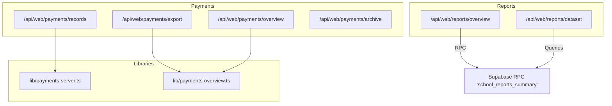
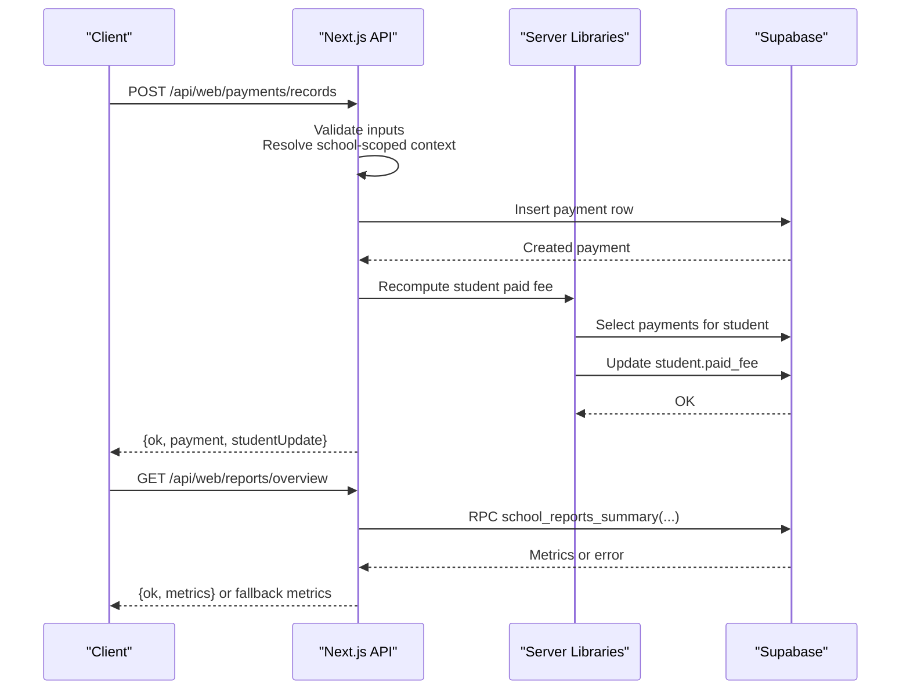
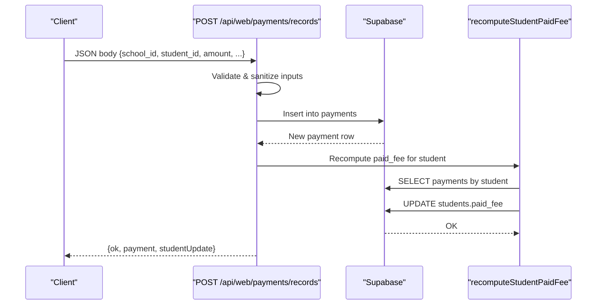
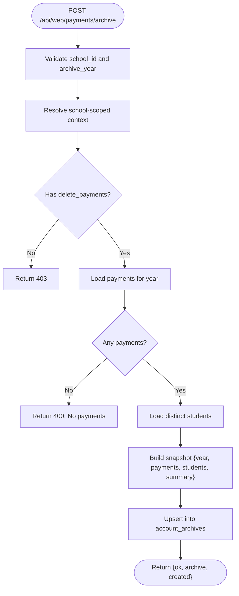
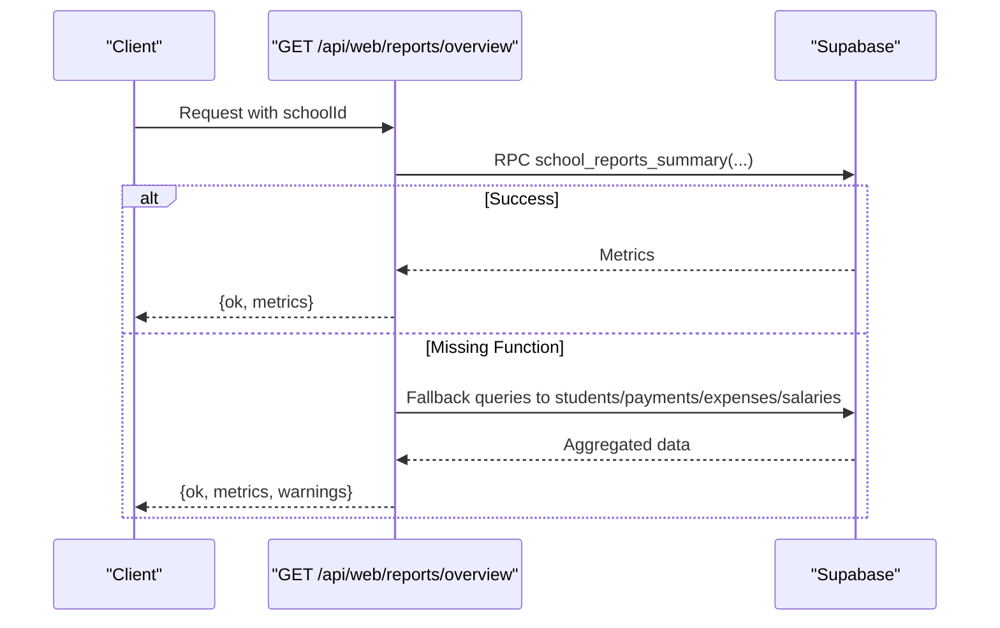
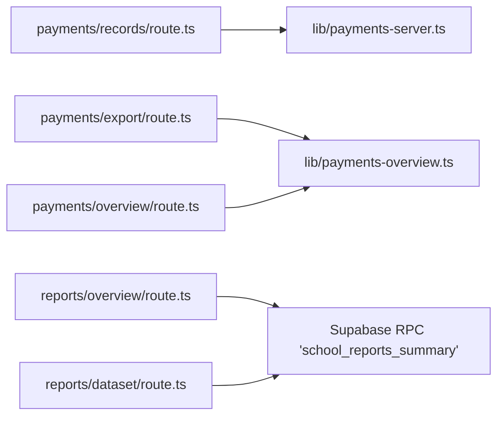

# Financial Operations

<cite>
**Referenced Files in This Document**
- [route.ts](file://app/api/web/payments/overview/route.ts)
- [route.ts](file://app/api/web/payments/records/route.ts)
- [route.ts](file://app/api/web/payments/export/route.ts)
- [route.ts](file://app/api/web/payments/archive/route.ts)
- [route.ts](file://app/api/web/reports/overview/route.ts)
- [route.ts](file://app/api/web/reports/dataset/route.ts)
- [payments-server.ts](file://lib/payments-server.ts)
- [payments-overview.ts](file://lib/payments-overview.ts)
</cite>

## Table of Contents
1. [Introduction](#introduction)
2. [Project Structure](#project-structure)
3. [Core Components](#core-components)
4. [Architecture Overview](#architecture-overview)
5. [Detailed Component Analysis](#detailed-component-analysis)
6. [Dependency Analysis](#dependency-analysis)
7. [Performance Considerations](#performance-considerations)
8. [Troubleshooting Guide](#troubleshooting-guide)
9. [Conclusion](#conclusion)
10. [Appendices](#appendices)

## Introduction
This document explains the financial operations system for payment processing, expense management, and financial reporting. It covers invoice generation, payment collection, reconciliation, dashboards for revenue tracking, expense monitoring, and cash flow analysis. It also documents supported payment methods, refund processing, financial audit trails, fee structures, discount management, subscription billing, integration with student management, invoice systems, export functionality for accounting, and common financial scenarios including payment failures and reconciliation procedures.

## Project Structure
The financial domain is implemented as a set of Next.js API routes under app/api/web, backed by Supabase queries and server-side helpers. Key areas:
- Payments: overview, records (create), export, archive
- Reports: overview metrics, dataset exports
- Shared server logic: payment recomputation and overview exports

**Diagram sources**
- [route.ts](file://app/api/web/payments/overview/route.ts)
- [route.ts](file://app/api/web/payments/records/route.ts)
- [route.ts](file://app/api/web/payments/export/route.ts)
- [route.ts](file://app/api/web/payments/archive/route.ts)
- [route.ts](file://app/api/web/reports/overview/route.ts)
- [route.ts](file://app/api/web/reports/dataset/route.ts)
- [payments-server.ts](file://lib/payments-server.ts)
- [payments-overview.ts](file://lib/payments-overview.ts)

**Section sources**
- [route.ts](file://app/api/web/payments/overview/route.ts)
- [route.ts](file://app/api/web/payments/records/route.ts)
- [route.ts](file://app/api/web/payments/export/route.ts)
- [route.ts](file://app/api/web/payments/archive/route.ts)
- [route.ts](file://app/api/web/reports/overview/route.ts)
- [route.ts](file://app/api/web/reports/dataset/route.ts)
- [payments-server.ts](file://lib/payments-server.ts)
- [payments-overview.ts](file://lib/payments-overview.ts)

## Core Components
- Payment Records: Create payments, validate inputs, persist to database, and synchronize student balances.
- Payments Overview: Load aggregated payment metadata scoped to a school.
- Payments Export: Export filtered student payment datasets for accounting.
- Payments Archive: Generate annual account archives for compliance and reporting.
- Reports Overview: Compute financial metrics via a Supabase RPC or fallback aggregation.
- Reports Dataset: Fetch normalized datasets for students, payments, expenses, and salaries.

**Section sources**
- [route.ts](file://app/api/web/payments/records/route.ts)
- [route.ts](file://app/api/web/payments/overview/route.ts)
- [route.ts](file://app/api/web/payments/export/route.ts)
- [route.ts](file://app/api/web/payments/archive/route.ts)
- [route.ts](file://app/api/web/reports/overview/route.ts)
- [route.ts](file://app/api/web/reports/dataset/route.ts)
- [payments-server.ts](file://lib/payments-server.ts)
- [payments-overview.ts](file://lib/payments-overview.ts)

## Architecture Overview
The system integrates Next.js API routes with Supabase for data persistence and computation. Payments are recorded against students and immediately reconciled to update balances. Reporting leverages a dedicated RPC for performance and falls back to client-side aggregation when unavailable. Export endpoints support CSV/XLSX downloads for accounting systems.

**Diagram sources**
- [route.ts](file://app/api/web/payments/records/route.ts)
- [payments-server.ts](file://lib/payments-server.ts)
- [route.ts](file://app/api/web/reports/overview/route.ts)

## Detailed Component Analysis

### Payment Records: Create and Reconcile
Purpose:
- Accept payment creation requests with validation.
- Persist payment records linked to a student and school.
- Recalculate student paid fee and remaining balance.
- Return updated student totals and payment details.

Key behaviors:
- School-scoped authorization and permission checks.
- Input sanitization and defaults (e.g., payment method).
- Timestamp handling for receipts.
- Student balance synchronization via a dedicated helper.

**Diagram sources**
- [route.ts](file://app/api/web/payments/records/route.ts)
- [payments-server.ts](file://lib/payments-server.ts)

**Section sources**
- [route.ts](file://app/api/web/payments/records/route.ts)
- [payments-server.ts](file://lib/payments-server.ts)

### Payments Overview: Aggregated Metadata
Purpose:
- Provide payment overview metadata scoped to a school.
- Enforce role-based access and include a deprecation notice for student lists.

Behavior:
- School-scoped actor resolution.
- Delegates to overview library for payload composition.
- Returns a structured payload with an archive notice.

**Section sources**
- [route.ts](file://app/api/web/payments/overview/route.ts)
- [payments-overview.ts](file://lib/payments-overview.ts)

### Payments Export: Accounting Export
Purpose:
- Export filtered student payment datasets for accounting systems.
- Apply rate limiting and school-scoped access control.

Behavior:
- Parse filters and sort options.
- Delegate to overview library for export generation.
- Return export-ready student dataset.

**Section sources**
- [route.ts](file://app/api/web/payments/export/route.ts)
- [payments-overview.ts](file://lib/payments-overview.ts)

### Payments Archive: Annual Account Archives
Purpose:
- Generate annual archives of payments and student snapshots.
- Enforce permissions and handle missing archive tables gracefully.

Behavior:
- Validate inputs and compute date range.
- Query payments and associated students for the year.
- Build snapshot and upsert into account_archives.
- Return created flag and archive details.

**Diagram sources**
- [route.ts](file://app/api/web/payments/archive/route.ts)

**Section sources**
- [route.ts](file://app/api/web/payments/archive/route.ts)

### Reports Overview: Financial Metrics
Purpose:
- Compute high-level financial metrics for the dashboard.
- Use a Supabase RPC for optimized aggregation; fall back to client-side queries if unavailable.

Behavior:
- Resolve school-scoped context and enforce rate limits.
- Attempt RPC call; if missing, compute fallback metrics from raw tables.
- Return normalized metrics and warnings.

**Diagram sources**
- [route.ts](file://app/api/web/reports/overview/route.ts)

**Section sources**
- [route.ts](file://app/api/web/reports/overview/route.ts)

### Reports Dataset: Export Datasets
Purpose:
- Provide normalized datasets for students, payments, expenses, and salaries.
- Support filtering by status, class, section, and search terms.
- Enforce rate limits and role-based access.

Behavior:
- Normalize parameters and apply filters.
- Execute targeted queries per dataset type.
- Return combined or individual datasets.

**Section sources**
- [route.ts](file://app/api/web/reports/dataset/route.ts)

## Dependency Analysis
- Payment Records depends on:
  - School-scoped actor resolution
  - Permission checks
  - Supabase insert/update
  - Server helper to recompute student paid fee
- Payments Export depends on:
  - School-scoped actor resolution
  - Rate limiting
  - Overview export utilities
- Reports Overview depends on:
  - Supabase RPC for performance
  - Fallback aggregation when RPC is missing
- Reports Dataset depends on:
  - Supabase queries for normalized relations

**Diagram sources**
- [route.ts](file://app/api/web/payments/records/route.ts)
- [route.ts](file://app/api/web/payments/export/route.ts)
- [route.ts](file://app/api/web/payments/overview/route.ts)
- [route.ts](file://app/api/web/reports/overview/route.ts)
- [route.ts](file://app/api/web/reports/dataset/route.ts)
- [payments-server.ts](file://lib/payments-server.ts)
- [payments-overview.ts](file://lib/payments-overview.ts)

**Section sources**
- [route.ts](file://app/api/web/payments/records/route.ts)
- [route.ts](file://app/api/web/payments/export/route.ts)
- [route.ts](file://app/api/web/payments/overview/route.ts)
- [route.ts](file://app/api/web/reports/overview/route.ts)
- [route.ts](file://app/api/web/reports/dataset/route.ts)
- [payments-server.ts](file://lib/payments-server.ts)
- [payments-overview.ts](file://lib/payments-overview.ts)

## Performance Considerations
- Prefer the RPC-based reports overview for reduced latency and optimized aggregations.
- Use rate limiting on report endpoints to prevent abuse.
- Batch operations: archive endpoint aggregates per year; consider chunking large exports.
- Indexes: ensure appropriate indexes on timestamps and foreign keys for payments, expenses, and salaries.

## Troubleshooting Guide
Common issues and resolutions:
- Missing reports summary function:
  - Symptom: RPC error indicating missing function.
  - Resolution: Apply the required migration to create the RPC; fallback aggregation will still work.
- Insufficient permissions:
  - Symptom: 403 errors when creating payments or archiving.
  - Resolution: Assign required permissions (e.g., add_payments, delete_payments) to the user role.
- Invalid inputs:
  - Symptom: 400 errors for missing or invalid fields.
  - Resolution: Ensure school_id, student_id, and positive amount are provided.
- Payment synchronization failure:
  - Symptom: Payment recorded but student balance not updated; response includes a warning.
  - Resolution: Retry the operation; check database connectivity and permissions.
- Archive table missing:
  - Symptom: 500 error indicating missing account_archives table.
  - Resolution: Run the database setup script to create required tables.

**Section sources**
- [route.ts](file://app/api/web/reports/overview/route.ts)
- [route.ts](file://app/api/web/payments/records/route.ts)
- [route.ts](file://app/api/web/payments/archive/route.ts)

## Conclusion
The financial operations system provides a robust foundation for payment processing, reconciliation, and reporting. It emphasizes school-scoped access, permission-driven actions, and scalable reporting via RPCs with graceful fallbacks. Integrations with student management and export capabilities support accounting workflows and compliance needs.

## Appendices

### Payment Methods and Refunds
- Supported payment methods:
  - Cash and bank transfer are supported; additional methods can be extended via the payment method field.
- Refund processing:
  - Not implemented in the referenced routes; refunds would require a dedicated refund entity and reversal logic aligned with student balances and audit trails.

### Fee Structures and Discount Management
- Fee structures:
  - Students carry total_fee and paid_fee; upon payment creation, paid_fee is recomputed and remaining_fee is derived accordingly.
- Discounts:
  - Students carry discount_value; remaining_fee accounts for discounts during reconciliation.

### Subscription Billing
- Not implemented in the referenced routes; subscription billing would require a billing cycle engine, recurring invoices, and payment scheduling.

### Invoice Systems
- Not implemented in the referenced routes; invoice generation would require invoice templates, numbering, and PDF export.

### Practical Workflows

- Payment Collection Workflow
  - Step 1: Authenticate and authorize user within the target school.
  - Step 2: Submit payment with validated amount, optional receipt number/manual receipt number, and payment method.
  - Step 3: System persists the payment and recalculates student paid fee.
  - Step 4: Return updated student totals and payment details.

- Expense Recording Workflow
  - Step 1: Authenticate and authorize user within the target school.
  - Step 2: Submit expense with amount, date, recipient, receipt number, and category.
  - Step 3: Persist the expense and update financial summaries.

- Financial Reporting Generation
  - Step 1: Authenticate and authorize admin-level user within the target school.
  - Step 2: Request overview metrics; system uses RPC if available, otherwise falls back to client-side aggregation.
  - Step 3: Optionally export datasets for students, payments, expenses, and salaries.

- Export for Accounting
  - Step 1: Authenticate and authorize within the target school.
  - Step 2: Request export with filters (search, class, section, quick filter).
  - Step 3: Receive export-ready dataset for downstream processing.

- Reconciliation Procedures
  - Step 1: Compare payments with student balances after each payment entry.
  - Step 2: Investigate warnings for partial synchronization and retry as needed.
  - Step 3: Use annual archive exports for period-end reconciliation.

- Common Scenarios
  - Payment Failure: Validate inputs, check permissions, and inspect returned error messages.
  - Overpayment/Underpayment: Adjust student totals; ensure discount and remaining fee reflect correct values.
  - Duplicate Receipt Numbers: Use manual receipt number to avoid conflicts.

[No sources needed since this section provides general guidance]