# Internationalization

<cite>
**Referenced Files in This Document**
- [i18n.ts](file://i18n.ts)
- [next.config.ts](file://next.config.ts)
- [messages/en.json](file://messages/en.json)
- [messages/ar.json](file://messages/ar.json)
- [app/layout.tsx](file://app/layout.tsx)
- [app/[locale]/layout.tsx](file://app/[locale]/layout.tsx)
- [app/[locale]/error.tsx](file://app/[locale]/error.tsx)
- [components/LanguageToggle.tsx](file://components/LanguageToggle.tsx)
- [components/LegacyLocaleBridge.tsx](file://components/LegacyLocaleBridge.tsx)
- [lib/locale-routing.ts](file://lib/locale-routing.ts)
- [lib/legacy-locale.ts](file://lib/legacy-locale.ts)
- [lib/formatting.ts](file://lib/formatting.ts)
</cite>

## Table of Contents
1. [Introduction](#introduction)
2. [Project Structure](#project-structure)
3. [Core Components](#core-components)
4. [Architecture Overview](#architecture-overview)
5. [Detailed Component Analysis](#detailed-component-analysis)
6. [Dependency Analysis](#dependency-analysis)
7. [Performance Considerations](#performance-considerations)
8. [Troubleshooting Guide](#troubleshooting-guide)
9. [Conclusion](#conclusion)
10. [Appendices](#appendices)

## Introduction
This document explains the internationalization (i18n) system for multi-language support and localization in the application. It focuses on Arabic and English language support, right-to-left (RTL) layout handling, bidirectional text rendering, and cultural adaptation. It documents Next.js i18n configuration, locale routing, dynamic language switching, the message catalog system, locale-specific formatting, and the integration with UI components, form validation, and error message localization. It also covers locale bridging for legacy systems, testing strategies, and practical examples for extending the system.

## Project Structure
The i18n implementation spans server-side configuration, client-side providers, routing utilities, message catalogs, and UI components:
- Server request configuration loads locale-specific messages and enforces supported locales.
- Client-side providers and layouts integrate Next Intl and manage RTL/LTR directionality.
- Routing utilities normalize and manipulate locale prefixes in URLs.
- Message catalogs provide translations for navigation, common actions, authentication, access gates, and health checks.
- UI components implement language toggling and legacy text bridging for backward compatibility.

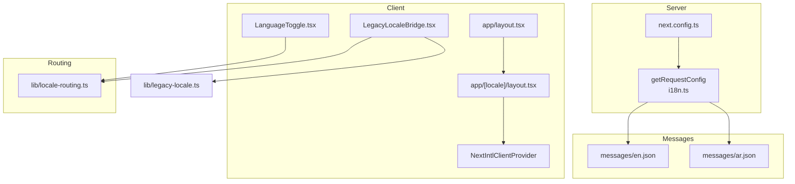

**Diagram sources**
- [i18n.ts:1-18](file://i18n.ts#L1-L18)
- [next.config.ts:47-49](file://next.config.ts#L47-L49)
- [app/[locale]/layout.tsx:12-34](file://app/[locale]/layout.tsx#L12-L34)
- [app/layout.tsx:14-31](file://app/layout.tsx#L14-L31)
- [components/LanguageToggle.tsx:12-47](file://components/LanguageToggle.tsx#L12-L47)
- [components/LegacyLocaleBridge.tsx:48-82](file://components/LegacyLocaleBridge.tsx#L48-L82)
- [lib/locale-routing.ts:1-50](file://lib/locale-routing.ts#L1-L50)
- [messages/en.json:1-2](file://messages/en.json#L1-L2)
- [messages/ar.json:1-2](file://messages/ar.json#L1-L2)

**Section sources**
- [i18n.ts:1-18](file://i18n.ts#L1-L18)
- [next.config.ts:47-49](file://next.config.ts#L47-L49)
- [app/[locale]/layout.tsx:12-34](file://app/[locale]/layout.tsx#L12-L34)
- [app/layout.tsx:14-31](file://app/layout.tsx#L14-L31)
- [lib/locale-routing.ts:1-50](file://lib/locale-routing.ts#L1-L50)
- [messages/en.json:1-2](file://messages/en.json#L1-L2)
- [messages/ar.json:1-2](file://messages/ar.json#L1-L2)

## Core Components
- Request configuration: Loads locale-specific messages and rejects unsupported locales.
- Client provider and layout: Wrap pages with Next Intl and set HTML lang/dir.
- Locale routing utilities: Normalize, detect, strip, and prepend locale prefixes.
- Message catalogs: JSON files keyed by categories and keys for each locale.
- Language toggle: Switches between Arabic and English and preserves query/hash.
- Legacy locale bridge: Applies English-to-Arabic translations and sets RTL directionality.

**Section sources**
- [i18n.ts:1-18](file://i18n.ts#L1-L18)
- [app/[locale]/layout.tsx:16-33](file://app/[locale]/layout.tsx#L16-L33)
- [lib/locale-routing.ts:1-50](file://lib/locale-routing.ts#L1-L50)
- [messages/en.json:1-2](file://messages/en.json#L1-L2)
- [messages/ar.json:1-2](file://messages/ar.json#L1-L2)
- [components/LanguageToggle.tsx:12-47](file://components/LanguageToggle.tsx#L12-L47)
- [components/LegacyLocaleBridge.tsx:48-82](file://components/LegacyLocaleBridge.tsx#L48-L82)

## Architecture Overview
The i18n pipeline integrates server and client layers:
- Server: Validates and resolves locale, imports messages, and forwards them to the client.
- Client: Initializes Next Intl with messages, applies HTML lang/dir, and renders localized content.
- Routing: Ensures URLs carry a locale prefix and supports switching without losing query/hash.
- Bridging: Translates legacy English text into Arabic and sets RTL directionality when applicable.

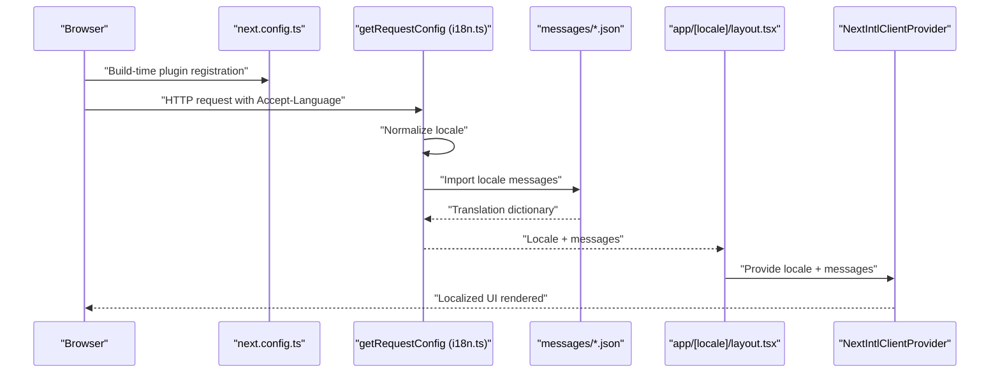

**Diagram sources**
- [next.config.ts:47-49](file://next.config.ts#L47-L49)
- [i18n.ts:6-17](file://i18n.ts#L6-L17)
- [messages/en.json:1-2](file://messages/en.json#L1-L2)
- [messages/ar.json:1-2](file://messages/ar.json#L1-L2)
- [app/[locale]/layout.tsx:24-33](file://app/[locale]/layout.tsx#L24-L33)

## Detailed Component Analysis

### Next.js i18n Configuration and Request Handling
- Supported locales are enforced server-side; unknown locales trigger a 404.
- Messages are dynamically imported based on the resolved locale.
- The configuration is registered via the Next.js plugin in next.config.ts.

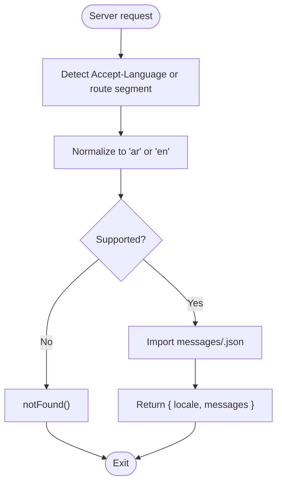

**Diagram sources**
- [i18n.ts:6-17](file://i18n.ts#L6-L17)

**Section sources**
- [i18n.ts:1-18](file://i18n.ts#L1-L18)
- [next.config.ts:47-49](file://next.config.ts#L47-L49)

### Client Provider and Locale Routing
- The root app layout sets default HTML attributes for the application shell.
- The locale layout initializes Next Intl with messages and applies lang/dir per locale.
- Static generation emits locale-specific routes.

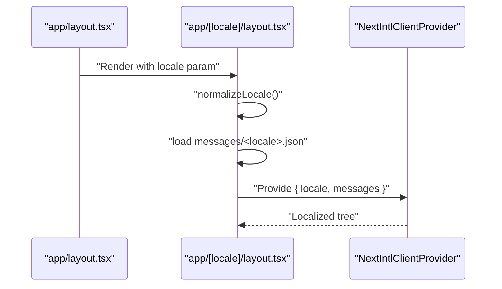

**Diagram sources**
- [app/layout.tsx:14-31](file://app/layout.tsx#L14-L31)
- [app/[locale]/layout.tsx:12-34](file://app/[locale]/layout.tsx#L12-L34)

**Section sources**
- [app/layout.tsx:14-31](file://app/layout.tsx#L14-L31)
- [app/[locale]/layout.tsx:12-34](file://app/[locale]/layout.tsx#L12-L34)

### Locale Routing Utilities
- Normalize and detect locale from URL segments.
- Strip or prepend locale prefixes safely.
- Sanitize paths to prevent malformed redirects.

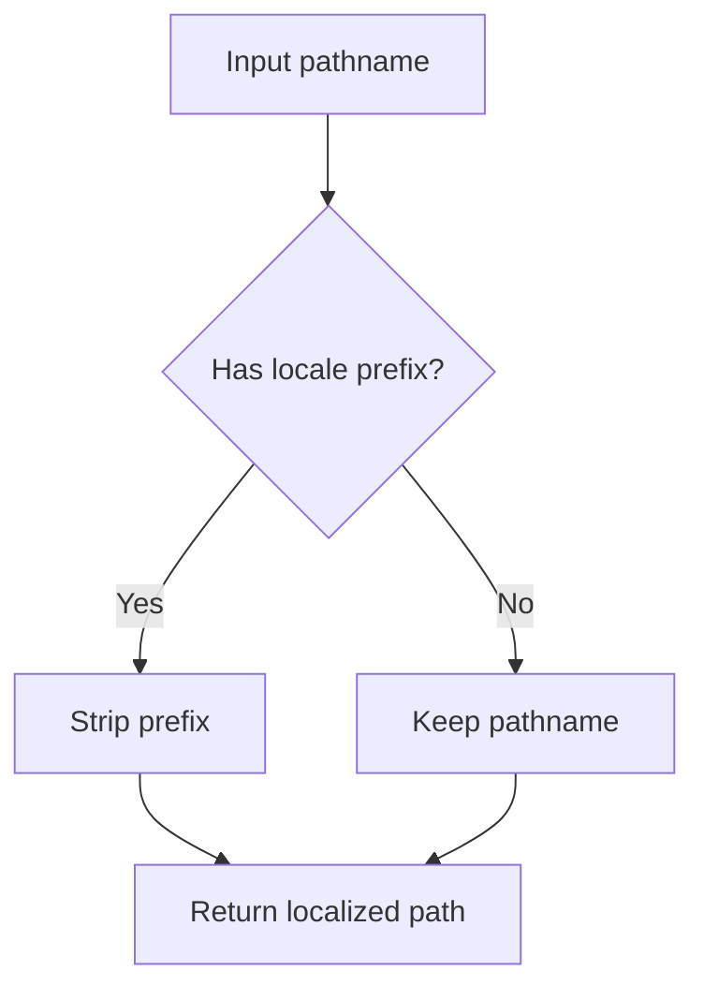

**Diagram sources**
- [lib/locale-routing.ts:18-43](file://lib/locale-routing.ts#L18-L43)

**Section sources**
- [lib/locale-routing.ts:1-50](file://lib/locale-routing.ts#L1-L50)

### Message Catalog System
- Two catalogs exist: English and Arabic.
- Keys are grouped by functional domains (navigation, common actions, auth, access gates, health checks).
- Client-side layouts import the appropriate catalog for the current locale.

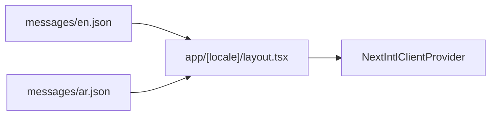

**Diagram sources**
- [messages/en.json:1-2](file://messages/en.json#L1-L2)
- [messages/ar.json:1-2](file://messages/ar.json#L1-L2)
- [app/[locale]/layout.tsx:24-25](file://app/[locale]/layout.tsx#L24-L25)

**Section sources**
- [messages/en.json:1-2](file://messages/en.json#L1-L2)
- [messages/ar.json:1-2](file://messages/ar.json#L1-L2)
- [app/[locale]/layout.tsx:24-25](file://app/[locale]/layout.tsx#L24-L25)

### Language Toggle Component
- Determines the current locale from the URL and computes the next locale.
- Preserves query and hash when navigating.
- Uses client-side router replace to update the URL without triggering a full reload.

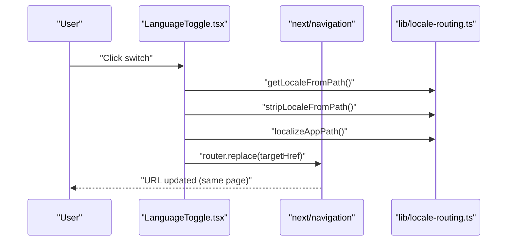

**Diagram sources**
- [components/LanguageToggle.tsx:12-47](file://components/LanguageToggle.tsx#L12-L47)
- [lib/locale-routing.ts:18-43](file://lib/locale-routing.ts#L18-L43)

**Section sources**
- [components/LanguageToggle.tsx:12-47](file://components/LanguageToggle.tsx#L12-L47)
- [lib/locale-routing.ts:18-43](file://lib/locale-routing.ts#L18-L43)

### Legacy Locale Bridge
- Observes DOM mutations and translates English text into Arabic for backward compatibility.
- Sets HTML lang and dir attributes based on the detected locale.
- Skips script/style/noscript nodes and specific attributes to avoid breaking functionality.

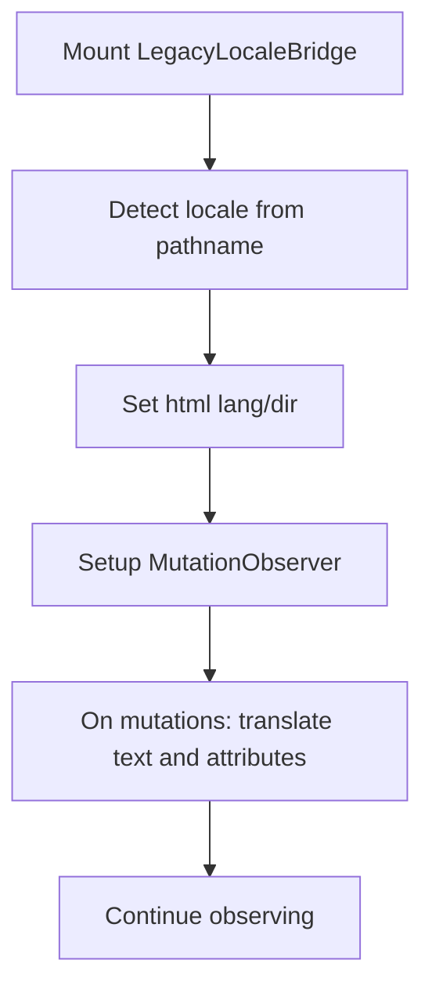

**Diagram sources**
- [components/LegacyLocaleBridge.tsx:48-82](file://components/LegacyLocaleBridge.tsx#L48-L82)
- [lib/legacy-locale.ts:182-205](file://lib/legacy-locale.ts#L182-L205)

**Section sources**
- [components/LegacyLocaleBridge.tsx:12-82](file://components/LegacyLocaleBridge.tsx#L12-L82)
- [lib/legacy-locale.ts:182-205](file://lib/legacy-locale.ts#L182-L205)

### Locale Detection and Fallback Mechanisms
- Server-side normalization defaults to Arabic if no locale is provided.
- Unsupported locales trigger a 404.
- Client-side routing utilities default to Arabic when unknown or missing.

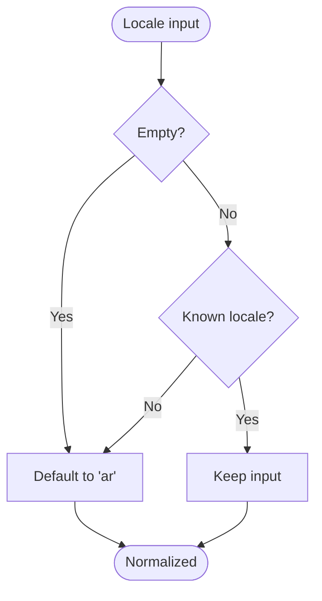

**Diagram sources**
- [i18n.ts:7-11](file://i18n.ts#L7-L11)
- [lib/locale-routing.ts:10-16](file://lib/locale-routing.ts#L10-L16)

**Section sources**
- [i18n.ts:7-11](file://i18n.ts#L7-L11)
- [lib/locale-routing.ts:10-16](file://lib/locale-routing.ts#L10-L16)

### RTL Layout Handling and Bidirectional Text Rendering
- The root layout sets default HTML attributes for the app shell.
- The locale layout applies lang/dir per locale.
- The legacy bridge sets RTL directionality for Arabic and ensures English text is translated where applicable.

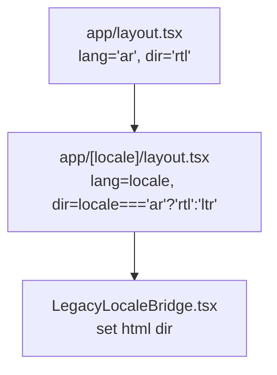

**Diagram sources**
- [app/layout.tsx:21-21](file://app/layout.tsx#L21-L21)
- [app/[locale]/layout.tsx:29-29](file://app/[locale]/layout.tsx#L29-L29)
- [components/LegacyLocaleBridge.tsx:52-54](file://components/LegacyLocaleBridge.tsx#L52-L54)

**Section sources**
- [app/layout.tsx:21-21](file://app/layout.tsx#L21-L21)
- [app/[locale]/layout.tsx:29-29](file://app/[locale]/layout.tsx#L29-L29)
- [components/LegacyLocaleBridge.tsx:52-54](file://components/LegacyLocaleBridge.tsx#L52-L54)

### Locale-Specific Formatting for Dates and Numbers
- Number formatting uses a fixed locale for consistency.
- Date formatting converts strings/dates to a specific locale.

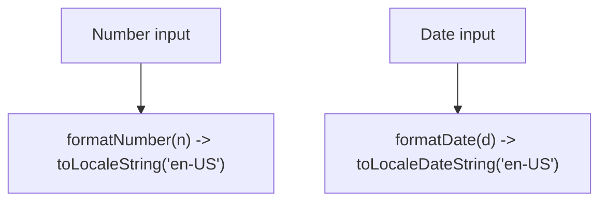

**Diagram sources**
- [lib/formatting.ts:1-3](file://lib/formatting.ts#L1-L3)

**Section sources**
- [lib/formatting.ts:1-3](file://lib/formatting.ts#L1-L3)

### Integration with UI Components, Forms, and Error Localization
- UI components can consume translations from the Next Intl client provider.
- Error boundaries under locale routes render localized messages and preserve RTL directionality.
- The language toggle integrates with routing utilities to maintain query/hash during transitions.

**Section sources**
- [app/[locale]/layout.tsx:24-33](file://app/[locale]/layout.tsx#L24-L33)
- [app/[locale]/error.tsx:12-48](file://app/[locale]/error.tsx#L12-L48)
- [components/LanguageToggle.tsx:19-47](file://components/LanguageToggle.tsx#L19-L47)

## Dependency Analysis
The i18n system exhibits clear separation of concerns:
- Server configuration depends on message catalogs and enforces supported locales.
- Client layouts depend on routing utilities and Next Intl.
- UI components depend on routing utilities for navigation and on the provider for translations.
- Legacy bridge depends on routing utilities and a translation map.

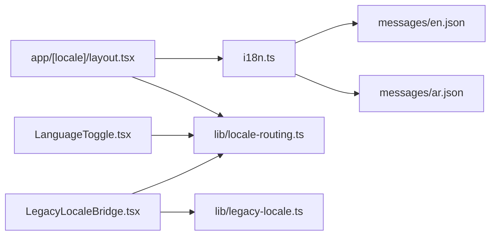

**Diagram sources**
- [i18n.ts:6-17](file://i18n.ts#L6-L17)
- [messages/en.json:1-2](file://messages/en.json#L1-L2)
- [messages/ar.json:1-2](file://messages/ar.json#L1-L2)
- [app/[locale]/layout.tsx:24-33](file://app/[locale]/layout.tsx#L24-L33)
- [lib/locale-routing.ts:18-43](file://lib/locale-routing.ts#L18-L43)
- [components/LanguageToggle.tsx:19-26](file://components/LanguageToggle.tsx#L19-L26)
- [components/LegacyLocaleBridge.tsx:49-50](file://components/LegacyLocaleBridge.tsx#L49-L50)
- [lib/legacy-locale.ts:182-205](file://lib/legacy-locale.ts#L182-L205)

**Section sources**
- [i18n.ts:6-17](file://i18n.ts#L6-L17)
- [app/[locale]/layout.tsx:24-33](file://app/[locale]/layout.tsx#L24-L33)
- [lib/locale-routing.ts:18-43](file://lib/locale-routing.ts#L18-L43)
- [components/LanguageToggle.tsx:19-26](file://components/LanguageToggle.tsx#L19-L26)
- [components/LegacyLocaleBridge.tsx:49-50](file://components/LegacyLocaleBridge.tsx#L49-L50)
- [lib/legacy-locale.ts:182-205](file://lib/legacy-locale.ts#L182-L205)

## Performance Considerations
- Dynamic imports of message catalogs occur per request; caching and static generation reduce overhead.
- MutationObserver in the legacy bridge runs continuously; limit observed subtrees and skip unnecessary nodes.
- Prefer predefining translation keys to minimize runtime lookups and improve cache hits.

## Troubleshooting Guide
- Unsupported locale: The server triggers a 404 for unknown locales; ensure the locale is one of the supported values.
- Incorrect directionality: Verify that HTML lang/dir are set correctly in both root and locale layouts.
- Missing translations: Confirm that the message catalog contains the required keys for the active locale.
- Legacy text not translated: Ensure the legacy bridge is mounted and that the locale is English; check skipped tags and attributes.

**Section sources**
- [i18n.ts:9-11](file://i18n.ts#L9-L11)
- [app/layout.tsx:21-21](file://app/layout.tsx#L21-L21)
- [app/[locale]/layout.tsx:29-29](file://app/[locale]/layout.tsx#L29-L29)
- [components/LegacyLocaleBridge.tsx:52-54](file://components/LegacyLocaleBridge.tsx#L52-L54)

## Conclusion
The i18n system combines server-side locale enforcement, client-side Next Intl integration, robust routing utilities, and a legacy bridge to deliver a cohesive multilingual experience. Arabic and English are supported with proper RTL handling and cultural adaptation. The system is extensible and can accommodate additional locales and improved formatting with minimal changes.

## Appendices

### Practical Examples

- Adding a new language
  - Create a new message catalog file under messages/<new_locale>.json with the same structure as existing catalogs.
  - Extend supported locales in the server configuration and routing utilities.
  - Update static generation parameters to include the new locale segment.

- Translating a component
  - Consume translations via the Next Intl client provider in the locale layout.
  - Reference translation keys from the appropriate domain (e.g., common, nav, auth).

- Handling locale-specific content
  - Use the locale routing utilities to construct localized paths.
  - Preserve query and hash when switching languages using the language toggle.

- Integrating with forms and validation
  - Localize placeholder, title, and aria-label attributes using the legacy bridge for English content.
  - Ensure validation messages are drawn from the message catalog and rendered conditionally based on the active locale.

- Testing strategies
  - Unit tests for locale routing utilities to verify normalization and prefix handling.
  - Snapshot tests for UI components under both Arabic and English locales.
  - End-to-end tests for language switching that assert URL updates and content localization.