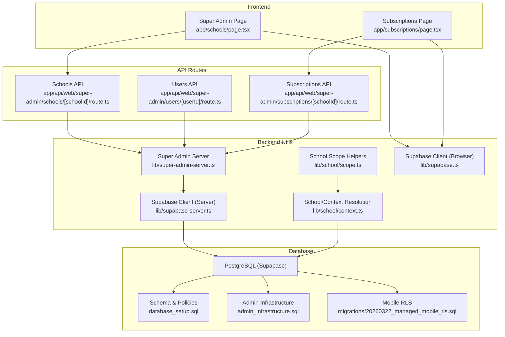
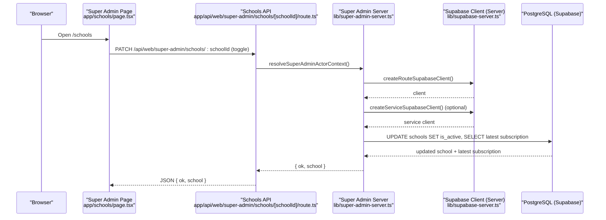
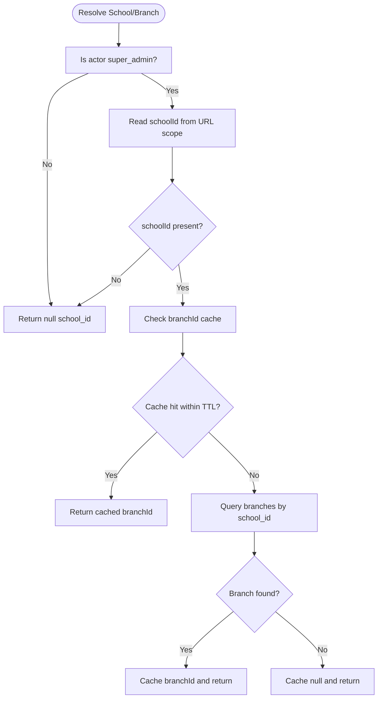
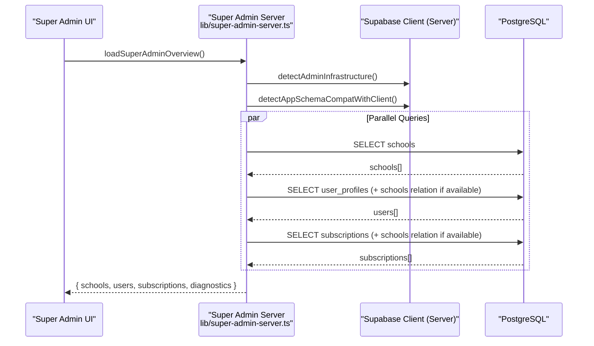
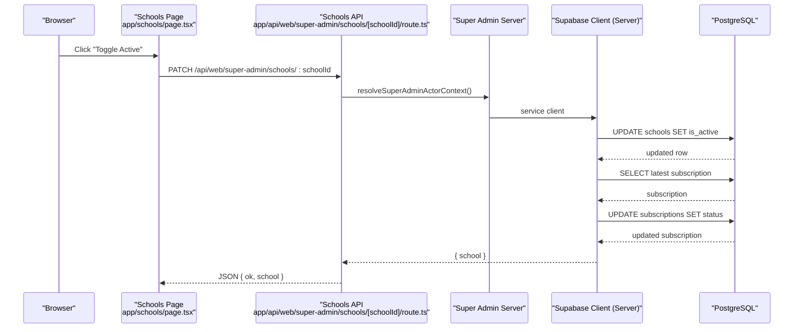
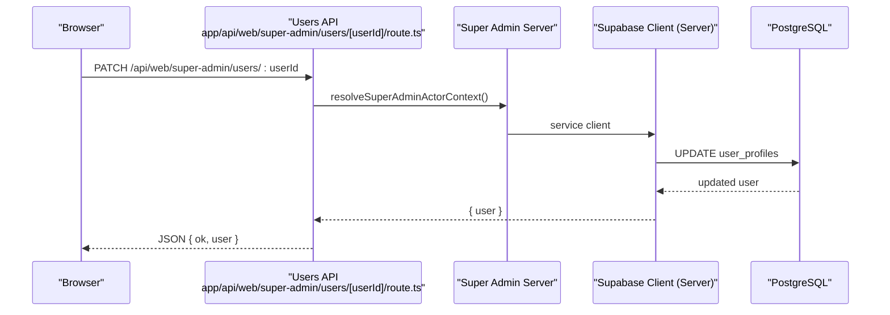
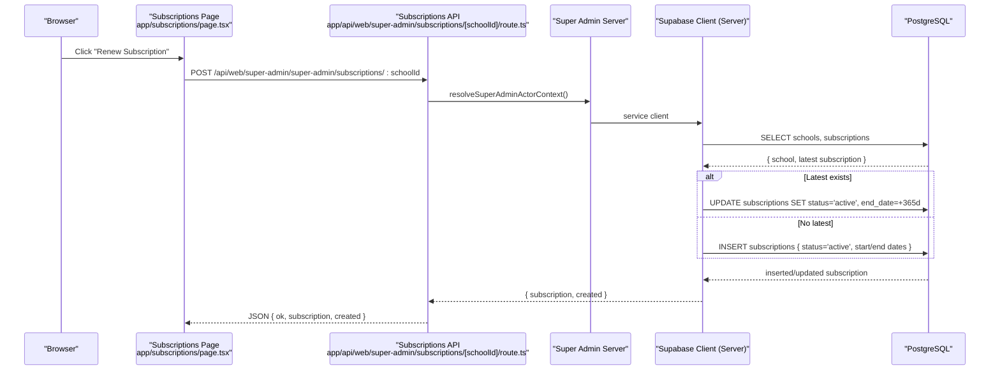
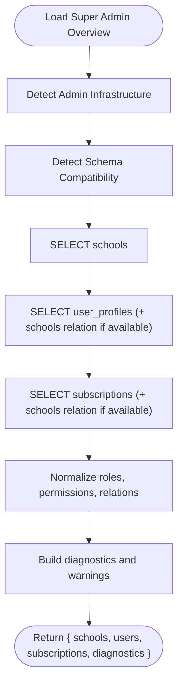
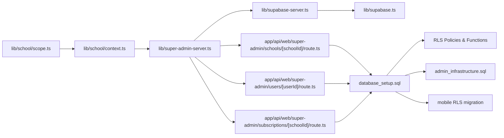
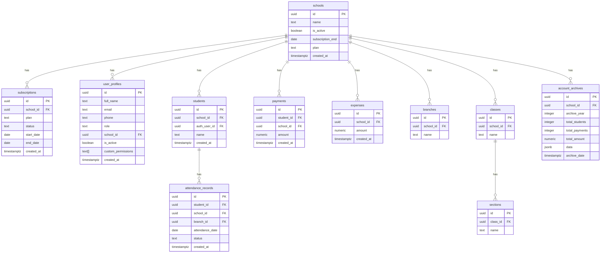

# Multi-Tenant Management

<cite>
**Referenced Files in This Document**
- [database_setup.sql](file://database_setup.sql)
- [admin_infrastructure.sql](file://admin_infrastructure.sql)
- [migrations/20260322_managed_mobile_rls.sql](file://migrations/20260322_managed_mobile_rls.sql)
- [lib/school/scope.ts](file://lib/school/scope.ts)
- [lib/school/context.ts](file://lib/school/context.ts)
- [lib/super-admin-server.ts](file://lib/super-admin-server.ts)
- [app/api/web/super-admin/schools/[schoolId]/route.ts](file://app/api/web/super-admin/schools/[schoolId]/route.ts)
- [app/api/web/super-admin/users/[userId]/route.ts](file://app/api/web/super-admin/users/[userId]/route.ts)
- [app/api/web/super-admin/subscriptions/[schoolId]/route.ts](file://app/api/web/super-admin/subscriptions/[schoolId]/route.ts)
- [app/schools/page.tsx](file://app/schools/page.tsx)
- [app/subscriptions/page.tsx](file://app/subscriptions/page.tsx)
- [lib/supabase-server.ts](file://lib/supabase-server.ts)
- [lib/supabase.ts](file://lib/supabase.ts)
</cite>

## Table of Contents
1. [Introduction](#introduction)
2. [Project Structure](#project-structure)
3. [Core Components](#core-components)
4. [Architecture Overview](#architecture-overview)
5. [Detailed Component Analysis](#detailed-component-analysis)
6. [Dependency Analysis](#dependency-analysis)
7. [Performance Considerations](#performance-considerations)
8. [Troubleshooting Guide](#troubleshooting-guide)
9. [Conclusion](#conclusion)
10. [Appendices](#appendices)

## Introduction
This document explains the multi-tenant management system for a hierarchical school and branch administration platform. It covers:
- School hierarchy and branch management
- Subscription-based access control
- Tenant isolation via school scope
- Super admin capabilities for managing multiple schools, users, and subscriptions
- School context switching, data filtering, and cross-school reporting
- Practical workflows and database design with Row Level Security (RLS)

## Project Structure
The system spans a Next.js frontend, API routes, and a Supabase-backed database with RLS policies. Key areas:
- Database schema and RLS policies for multi-tenancy
- Super admin APIs for managing schools, users, and subscriptions
- Frontend pages for super admin dashboards
- Utilities for resolving school and branch context

**Diagram sources**
- [app/schools/page.tsx:1-215](file://app/schools/page.tsx#L1-L215)
- [app/subscriptions/page.tsx:1-48](file://app/subscriptions/page.tsx#L1-L48)
- [app/api/web/super-admin/schools/[schoolId]/route.ts:1-190](file://app/api/web/super-admin/schools/[schoolId]/route.ts#L1-L190)
- [app/api/web/super-admin/users/[userId]/route.ts:1-139](file://app/api/web/super-admin/users/[userId]/route.ts#L1-L139)
- [app/api/web/super-admin/subscriptions/[schoolId]/route.ts:1-84](file://app/api/web/super-admin/subscriptions/[schoolId]/route.ts#L1-L84)
- [lib/school/scope.ts:1-50](file://lib/school/scope.ts#L1-L50)
- [lib/school/context.ts:1-74](file://lib/school/context.ts#L1-L74)
- [lib/super-admin-server.ts:1-412](file://lib/super-admin-server.ts#L1-L412)
- [lib/supabase-server.ts:1-75](file://lib/supabase-server.ts#L1-L75)
- [lib/supabase.ts:1-22](file://lib/supabase.ts#L1-L22)
- [database_setup.sql:1-614](file://database_setup.sql#L1-L614)
- [admin_infrastructure.sql:1-156](file://admin_infrastructure.sql#L1-L156)
- [migrations/20260322_managed_mobile_rls.sql:324-359](file://migrations/20260322_managed_mobile_rls.sql#L324-L359)

**Section sources**
- [database_setup.sql:75-183](file://database_setup.sql#L75-L183)
- [lib/school/scope.ts:1-50](file://lib/school/scope.ts#L1-L50)
- [lib/school/context.ts:14-73](file://lib/school/context.ts#L14-L73)
- [lib/super-admin-server.ts:122-168](file://lib/super-admin-server.ts#L122-L168)
- [app/api/web/super-admin/schools/[schoolId]/route.ts:31-142](file://app/api/web/super-admin/schools/[schoolId]/route.ts#L31-L142)
- [app/api/web/super-admin/users/[userId]/route.ts:21-86](file://app/api/web/super-admin/users/[userId]/route.ts#L21-L86)
- [app/api/web/super-admin/subscriptions/[schoolId]/route.ts:11-83](file://app/api/web/super-admin/subscriptions/[schoolId]/route.ts#L11-L83)
- [app/schools/page.tsx:22-116](file://app/schools/page.tsx#L22-L116)
- [app/subscriptions/page.tsx:31-48](file://app/subscriptions/page.tsx#L31-L48)
- [lib/supabase-server.ts:5-74](file://lib/supabase-server.ts#L5-L74)
- [lib/supabase.ts:1-22](file://lib/supabase.ts#L1-L22)

## Core Components
- School and branch resolution utilities: Resolve school and branch IDs from user context and URL scope.
- Super admin server: Load overview data, manage users, and manage subscriptions with schema compatibility detection.
- API routes: Provide mutation endpoints for toggling school status, updating school metadata, updating user profiles, and renewing subscriptions.
- Frontend dashboards: Display schools and subscriptions, and trigger actions via API routes.
- Database schema and RLS: Enforce tenant isolation and access control across tables.

**Section sources**
- [lib/school/context.ts:14-73](file://lib/school/context.ts#L14-L73)
- [lib/school/scope.ts:19-50](file://lib/school/scope.ts#L19-L50)
- [lib/super-admin-server.ts:170-354](file://lib/super-admin-server.ts#L170-L354)
- [app/api/web/super-admin/schools/[schoolId]/route.ts:31-142](file://app/api/web/super-admin/schools/[schoolId]/route.ts#L31-L142)
- [app/api/web/super-admin/users/[userId]/route.ts:21-86](file://app/api/web/super-admin/users/[userId]/route.ts#L21-L86)
- [app/api/web/super-admin/subscriptions/[schoolId]/route.ts:11-83](file://app/api/web/super-admin/subscriptions/[schoolId]/route.ts#L11-L83)
- [app/schools/page.tsx:22-116](file://app/schools/page.tsx#L22-L116)
- [app/subscriptions/page.tsx:31-48](file://app/subscriptions/page.tsx#L31-L48)
- [database_setup.sql:419-614](file://database_setup.sql#L419-L614)

## Architecture Overview
The system uses Supabase with RLS to enforce tenant boundaries. Super admins operate via dedicated API routes backed by a service-role client when available. School and branch context are resolved from the authenticated user’s profile and optional URL scope.

**Diagram sources**
- [app/schools/page.tsx:57-75](file://app/schools/page.tsx#L57-L75)
- [app/api/web/super-admin/schools/[schoolId]/route.ts:31-97](file://app/api/web/super-admin/schools/[schoolId]/route.ts#L31-L97)
- [lib/super-admin-server.ts:122-168](file://lib/super-admin-server.ts#L122-L168)
- [lib/supabase-server.ts:5-74](file://lib/supabase-server.ts#L5-L74)

## Detailed Component Analysis

### School and Branch Context Resolution
- School ID resolution supports super admin scope via URL query param and cached branch ID resolution.
- Branch ID resolution caches per school for a short TTL to reduce repeated lookups.

**Diagram sources**
- [lib/school/context.ts:14-73](file://lib/school/context.ts#L14-L73)
- [lib/school/scope.ts:44-50](file://lib/school/scope.ts#L44-L50)

**Section sources**
- [lib/school/context.ts:14-73](file://lib/school/context.ts#L14-L73)
- [lib/school/scope.ts:19-50](file://lib/school/scope.ts#L19-L50)

### Super Admin Overview and Data Loading
- Loads schools, users, and subscriptions with schema compatibility checks.
- Handles fallbacks when relations are missing (soft-delete or custom permissions).
- Normalizes roles and permissions for display and updates.

**Diagram sources**
- [lib/super-admin-server.ts:170-354](file://lib/super-admin-server.ts#L170-L354)

**Section sources**
- [lib/super-admin-server.ts:170-354](file://lib/super-admin-server.ts#L170-L354)

### School Administration Workflows
- Toggle school active state and synchronize subscription status.
- Update school metadata (including plan) and handle schema compatibility.

**Diagram sources**
- [app/schools/page.tsx:57-75](file://app/schools/page.tsx#L57-L75)
- [app/api/web/super-admin/schools/[schoolId]/route.ts:31-97](file://app/api/web/super-admin/schools/[schoolId]/route.ts#L31-L97)
- [lib/super-admin-server.ts:122-168](file://lib/super-admin-server.ts#L122-L168)

**Section sources**
- [app/schools/page.tsx:57-75](file://app/schools/page.tsx#L57-L75)
- [app/api/web/super-admin/schools/[schoolId]/route.ts:31-97](file://app/api/web/super-admin/schools/[schoolId]/route.ts#L31-L97)

### User Management Operations
- Update user profile with role normalization and permission validation.
- Soft-delete users when supported by admin infrastructure.

**Diagram sources**
- [app/api/web/super-admin/users/[userId]/route.ts:21-86](file://app/api/web/super-admin/users/[userId]/route.ts#L21-L86)
- [lib/super-admin-server.ts:356-411](file://lib/super-admin-server.ts#L356-L411)

**Section sources**
- [app/api/web/super-admin/users/[userId]/route.ts:21-86](file://app/api/web/super-admin/users/[userId]/route.ts#L21-L86)
- [lib/super-admin-server.ts:356-411](file://lib/super-admin-server.ts#L356-L411)

### Subscription Plan Management
- Renew or activate a subscription for a school, inferring plan from latest or school defaults.
- Trigger end-date updates and status transitions.

**Diagram sources**
- [app/subscriptions/page.tsx:31-48](file://app/subscriptions/page.tsx#L31-L48)
- [app/api/web/super-admin/subscriptions/[schoolId]/route.ts:11-83](file://app/api/web/super-admin/subscriptions/[schoolId]/route.ts#L11-L83)
- [lib/super-admin-server.ts:122-168](file://lib/super-admin-server.ts#L122-L168)

**Section sources**
- [app/subscriptions/page.tsx:31-48](file://app/subscriptions/page.tsx#L31-L48)
- [app/api/web/super-admin/subscriptions/[schoolId]/route.ts:11-83](file://app/api/web/super-admin/subscriptions/[schoolId]/route.ts#L11-L83)

### Cross-School Reporting Capabilities
- Super admin overview aggregates schools, users, and subscriptions with diagnostics.
- Fallbacks are applied when relations are missing (e.g., soft-delete or custom permissions).

**Diagram sources**
- [lib/super-admin-server.ts:170-354](file://lib/super-admin-server.ts#L170-L354)

**Section sources**
- [lib/super-admin-server.ts:170-354](file://lib/super-admin-server.ts#L170-L354)

## Dependency Analysis
- School and branch resolution depend on Supabase client and URL scope utilities.
- Super admin APIs depend on server-side Supabase client creation and schema compatibility detection.
- Database relies on RLS policies and helper functions to enforce tenant boundaries.

**Diagram sources**
- [lib/school/scope.ts:1-50](file://lib/school/scope.ts#L1-L50)
- [lib/school/context.ts:1-74](file://lib/school/context.ts#L1-L74)
- [lib/super-admin-server.ts:1-412](file://lib/super-admin-server.ts#L1-L412)
- [lib/supabase-server.ts:1-75](file://lib/supabase-server.ts#L1-L75)
- [lib/supabase.ts:1-22](file://lib/supabase.ts#L1-L22)
- [app/api/web/super-admin/schools/[schoolId]/route.ts:1-190](file://app/api/web/super-admin/schools/[schoolId]/route.ts#L1-L190)
- [app/api/web/super-admin/users/[userId]/route.ts:1-139](file://app/api/web/super-admin/users/[userId]/route.ts#L1-L139)
- [app/api/web/super-admin/subscriptions/[schoolId]/route.ts:1-84](file://app/api/web/super-admin/subscriptions/[schoolId]/route.ts#L1-L84)
- [database_setup.sql:419-614](file://database_setup.sql#L419-L614)
- [admin_infrastructure.sql:1-156](file://admin_infrastructure.sql#L1-L156)
- [migrations/20260322_managed_mobile_rls.sql:324-359](file://migrations/20260322_managed_mobile_rls.sql#L324-L359)

**Section sources**
- [lib/school/context.ts:14-73](file://lib/school/context.ts#L14-L73)
- [lib/super-admin-server.ts:122-168](file://lib/super-admin-server.ts#L122-L168)
- [database_setup.sql:419-614](file://database_setup.sql#L419-L614)

## Performance Considerations
- Use indexes on frequently filtered columns (e.g., school_id, status, created_at).
- Cache branch ID lookups per school to minimize repeated queries.
- Batch reads/writes in API routes where possible.
- Keep RLS policies minimal and efficient; avoid expensive checks in triggers.

[No sources needed since this section provides general guidance]

## Troubleshooting Guide
Common multi-tenant scenarios and resolutions:
- Missing relations for cross-table names: The super admin overview applies fallbacks and attaches school names when relations are unavailable.
- Soft delete columns: Ensure admin infrastructure is applied so deletion operations can mark records as deleted.
- Role and permissions mismatches: Normalize roles and permissions before updates; errors are handled gracefully with retries and fallbacks.
- Subscription synchronization: When toggling school activity, ensure the latest subscription status is synchronized.

**Section sources**
- [lib/super-admin-server.ts:205-324](file://lib/super-admin-server.ts#L205-L324)
- [admin_infrastructure.sql:109-130](file://admin_infrastructure.sql#L109-L130)
- [app/api/web/super-admin/schools/[schoolId]/route.ts:52-97](file://app/api/web/super-admin/schools/[schoolId]/route.ts#L52-L97)

## Conclusion
The system implements robust multi-tenancy through Supabase RLS, with clear separation of data by school and branch. Super admins can manage schools, users, and subscriptions while maintaining tenant isolation. School context switching and cross-school reporting are supported via URL-scoped paths and schema-compatible data loading.

[No sources needed since this section summarizes without analyzing specific files]

## Appendices

### Database Design for Multi-Tenancy
- Core tables: schools, subscriptions, user_profiles, students, payments, expenses, branches, classes, sections, attendance_records, account_archives.
- RLS enforcement: Helper functions current_app_role() and current_school_id(), with tenant policies on tables containing school_id.
- Triggers and functions: Sync subscription end dates to schools and maintain computed fields.

**Diagram sources**
- [database_setup.sql:75-183](file://database_setup.sql#L75-L183)
- [database_setup.sql:214-299](file://database_setup.sql#L214-L299)
- [database_setup.sql:314-337](file://database_setup.sql#L314-L337)
- [database_setup.sql:419-614](file://database_setup.sql#L419-L614)

**Section sources**
- [database_setup.sql:75-183](file://database_setup.sql#L75-L183)
- [database_setup.sql:419-614](file://database_setup.sql#L419-L614)

### RLS Policies and Data Isolation Strategies
- Helper functions current_app_role() and current_school_id() define the tenant boundary.
- Tenant policies on tables with school_id restrict access to super_admin or matching school_id.
- Additional policies for user_profiles, schools, and subscriptions enforce super admin-only management.

**Section sources**
- [database_setup.sql:419-520](file://database_setup.sql#L419-L520)
- [database_setup.sql:524-614](file://database_setup.sql#L524-L614)
- [admin_infrastructure.sql:29-38](file://admin_infrastructure.sql#L29-L38)