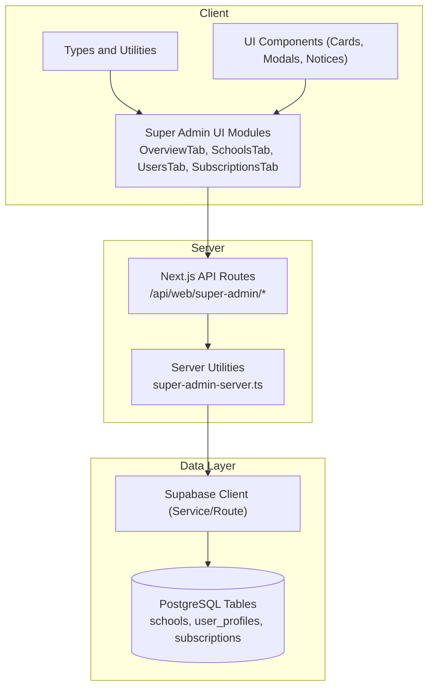
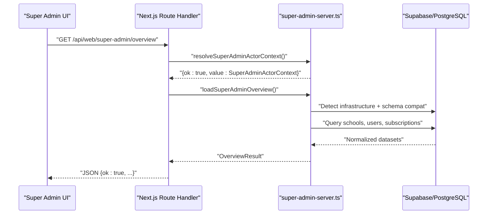
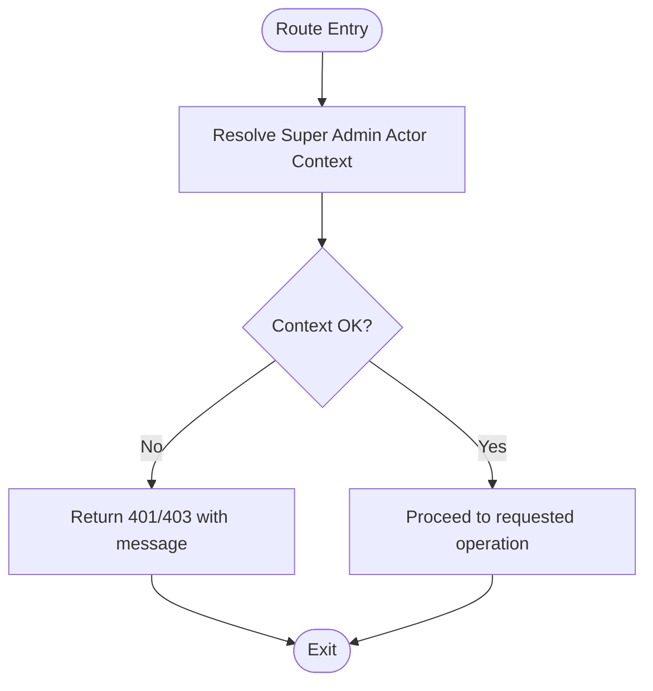
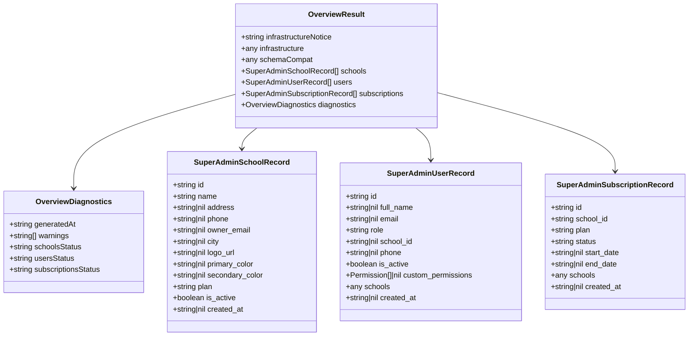
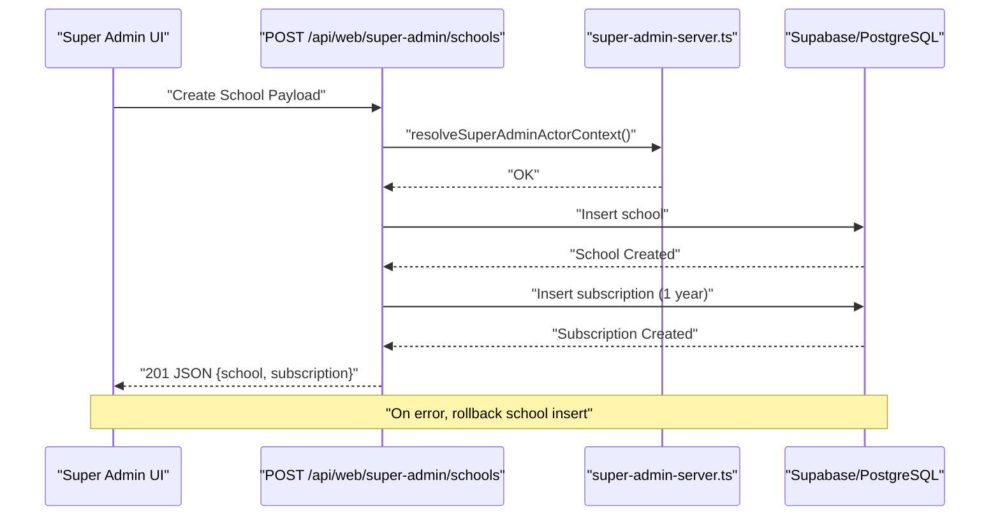
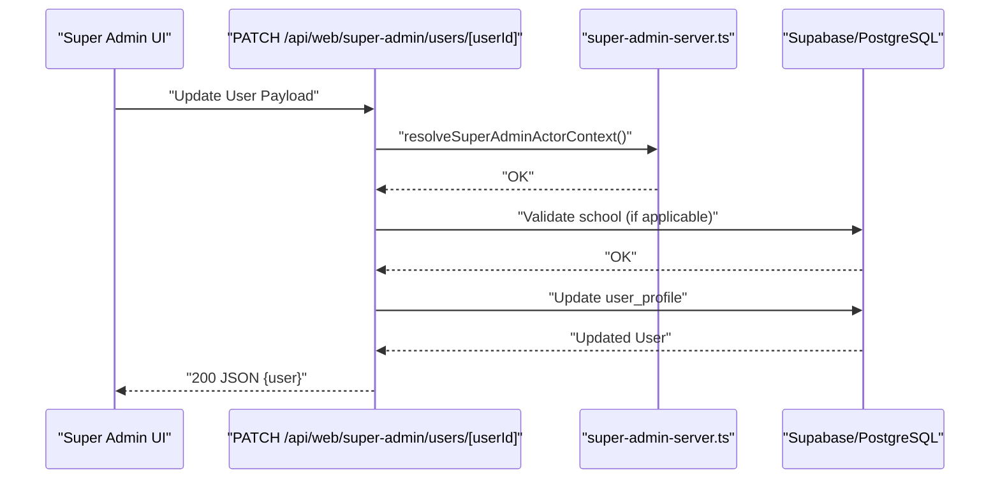
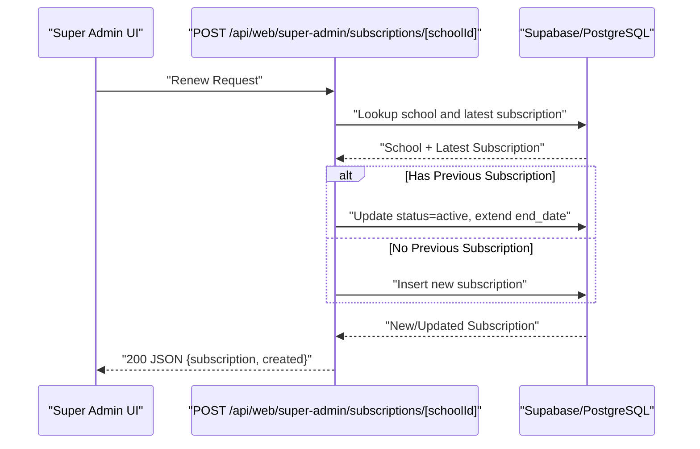
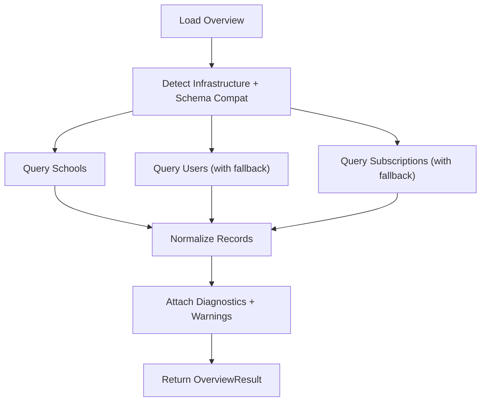
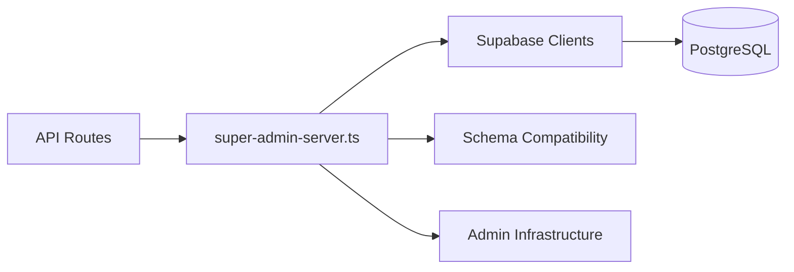

# Super Admin Functionality

<cite>
**Referenced Files in This Document**
- [page.tsx](file://app/super-admin/page.tsx)
- [super-admin-server.ts](file://lib/super-admin-server.ts)
- [index.ts](file://app/[locale]/super-admin/_components/index.ts)
- [types.ts](file://app/[locale]/super-admin/_components/types.ts)
- [utils.ts](file://app/[locale]/super-admin/_components/utils.ts)
- [ui.tsx](file://app/[locale]/super-admin/_components/ui.tsx)
- [route.ts](file://app/api/web/super-admin/overview/route.ts)
- [route.ts](file://app/api/web/super-admin/schools/route.ts)
- [route.ts](file://app/api/web/super-admin/schools/[schoolId]/route.ts)
- [route.ts](file://app/api/web/super-admin/users/[userId]/route.ts)
- [route.ts](file://app/api/web/super-admin/subscriptions/[schoolId]/route.ts)
</cite>

## Table of Contents
1. [Introduction](#introduction)
2. [Project Structure](#project-structure)
3. [Core Components](#core-components)
4. [Architecture Overview](#architecture-overview)
5. [Detailed Component Analysis](#detailed-component-analysis)
6. [Dependency Analysis](#dependency-analysis)
7. [Performance Considerations](#performance-considerations)
8. [Troubleshooting Guide](#troubleshooting-guide)
9. [Conclusion](#conclusion)
10. [Appendices](#appendices)

## Introduction
This document explains the Super Admin functionality for multi-school administration and system-wide management. It covers the Super Admin role hierarchy, elevated permissions, dashboard components, administrative operations, cross-school reporting capabilities, workflows, bulk operations, system maintenance tasks, supporting APIs, backend services, and security considerations.

## Project Structure
The Super Admin feature spans client-side UI components, server-side route handlers, and shared server utilities. The UI is organized under a localized super-admin module, while backend endpoints are exposed via Next.js App Router routes. Shared server utilities encapsulate Supabase clients, permission resolution, and data normalization.

**Diagram sources**
- [index.ts:1-22](file://app/[locale]/super-admin/_components/index.ts#L1-L22)
- [types.ts:1-106](file://app/[locale]/super-admin/_components/types.ts#L1-L106)
- [ui.tsx:1-161](file://app/[locale]/super-admin/_components/ui.tsx#L1-L161)
- [route.ts:1-28](file://app/api/web/super-admin/overview/route.ts#L1-L28)
- [super-admin-server.ts:1-412](file://lib/super-admin-server.ts#L1-L412)

**Section sources**
- [page.tsx:1-6](file://app/super-admin/page.tsx#L1-L6)
- [index.ts:1-22](file://app/[locale]/super-admin/_components/index.ts#L1-L22)
- [types.ts:1-106](file://app/[locale]/super-admin/_components/types.ts#L1-L106)
- [ui.tsx:1-161](file://app/[locale]/super-admin/_components/ui.tsx#L1-L161)
- [route.ts:1-28](file://app/api/web/super-admin/overview/route.ts#L1-L28)
- [super-admin-server.ts:1-412](file://lib/super-admin-server.ts#L1-L412)

## Core Components
- Role and Actor Context
  - Super Admin is identified by a verified authenticated profile with an active status and a specific role resolved to “super_admin”.
  - A dedicated data client is used for privileged operations when available; otherwise, falls back to the route client.
- Data Models
  - School, User, and Subscription records are normalized and enriched with optional relations and schema-aware columns.
  - Fallback logic handles missing relations or columns gracefully, returning warnings and degraded datasets.
- Dashboard and UI
  - UI components provide cards, modals, empty states, and notices for displaying overview metrics and managing operations.
  - Utilities offer formatting, status labeling, and dataset status metadata.

Key responsibilities:
- Enforce Super Admin permissions at the route boundary.
- Load and normalize system-wide data sets (schools, users, subscriptions).
- Provide CRUD-like operations for schools, users, and subscriptions with safety checks and schema compatibility.

**Section sources**
- [super-admin-server.ts:122-168](file://lib/super-admin-server.ts#L122-L168)
- [super-admin-server.ts:170-354](file://lib/super-admin-server.ts#L170-L354)
- [super-admin-server.ts:356-411](file://lib/super-admin-server.ts#L356-L411)
- [types.ts:22-59](file://app/[locale]/super-admin/_components/types.ts#L22-L59)
- [utils.ts:1-102](file://app/[locale]/super-admin/_components/utils.ts#L1-L102)
- [ui.tsx:6-161](file://app/[locale]/super-admin/_components/ui.tsx#L6-L161)

## Architecture Overview
The Super Admin architecture follows a layered pattern:
- UI layer: Tabs and forms for overview, schools, users, subscriptions, and auxiliary panels.
- API layer: Next.js routes validate Super Admin context and delegate to server utilities.
- Service layer: Server utilities manage Supabase clients, schema detection, and data normalization.
- Data layer: PostgreSQL tables for schools, user profiles, and subscriptions.

**Diagram sources**
- [route.ts:9-27](file://app/api/web/super-admin/overview/route.ts#L9-L27)
- [super-admin-server.ts:122-168](file://lib/super-admin-server.ts#L122-L168)
- [super-admin-server.ts:170-354](file://lib/super-admin-server.ts#L170-L354)

**Section sources**
- [route.ts:1-28](file://app/api/web/super-admin/overview/route.ts#L1-L28)
- [super-admin-server.ts:1-412](file://lib/super-admin-server.ts#L1-L412)

## Detailed Component Analysis

### Super Admin Role and Permissions
- Authentication and Authorization
  - Route handlers call a resolver that validates the presence of an authenticated user, checks the profile’s active status, and ensures the role resolves to “super_admin”.
  - On failure, returns appropriate HTTP errors with localized messages.
- Actor Context
  - Returns a context combining the route client, a privileged data client (service client when available), and the actor’s user ID.

**Diagram sources**
- [super-admin-server.ts:122-160](file://lib/super-admin-server.ts#L122-L160)
- [route.ts:9-13](file://app/api/web/super-admin/overview/route.ts#L9-L13)

**Section sources**
- [super-admin-server.ts:122-160](file://lib/super-admin-server.ts#L122-L160)
- [route.ts:9-13](file://app/api/web/super-admin/overview/route.ts#L9-L13)

### Super Admin Dashboard Components
- Overview Panels
  - Overview tab aggregates system-wide metrics and diagnostics.
  - Diagnostics include dataset statuses (loaded/fallback/failed) and warnings for degraded loads.
- UI Components
  - Stat cards, section cards, empty states, modal frames, and migration notices provide a cohesive UX for managing system-wide data.

**Diagram sources**
- [super-admin-server.ts:71-89](file://lib/super-admin-server.ts#L71-L89)
- [super-admin-server.ts:24-63](file://lib/super-admin-server.ts#L24-L63)
- [types.ts:61-69](file://app/[locale]/super-admin/_components/types.ts#L61-L69)
- [types.ts:22-59](file://app/[locale]/super-admin/_components/types.ts#L22-L59)

**Section sources**
- [super-admin-server.ts:71-89](file://lib/super-admin-server.ts#L71-L89)
- [super-admin-server.ts:170-354](file://lib/super-admin-server.ts#L170-L354)
- [types.ts:1-106](file://app/[locale]/super-admin/_components/types.ts#L1-L106)
- [ui.tsx:6-161](file://app/[locale]/super-admin/_components/ui.tsx#L6-L161)

### Administrative Operations

#### School Management
- Create School
  - Validates payload, normalizes plan, detects schema compatibility, inserts school, creates a default subscription, and optionally initializes a main branch.
  - On partial failures, performs cleanup (rollback inserts).
- Update School
  - Supports two modes:
    - Toggle: updates activation status and synchronizes the latest subscription status accordingly.
    - Update: updates attributes with schema-aware column handling.
- Archive School
  - Requires soft-delete infrastructure; marks deletion with timestamps and actor ID.

**Diagram sources**
- [route.ts:46-146](file://app/api/web/super-admin/schools/route.ts#L46-L146)
- [super-admin-server.ts:162-168](file://lib/super-admin-server.ts#L162-L168)

**Section sources**
- [route.ts:1-147](file://app/api/web/super-admin/schools/route.ts#L1-L147)
- [route.ts:31-142](file://app/api/web/super-admin/schools/[schoolId]/route.ts#L31-L142)
- [route.ts:144-190](file://app/api/web/super-admin/schools/[schoolId]/route.ts#L144-L190)

#### User Management
- Update User Profile
  - Normalizes role and permissions, validates school association for non-Super Admin roles, and updates user with schema-aware columns.
- Archive User
  - Requires soft-delete infrastructure; marks deletion with timestamps and actor ID, and deactivates the profile.

**Diagram sources**
- [route.ts:21-86](file://app/api/web/super-admin/users/[userId]/route.ts#L21-L86)
- [super-admin-server.ts:356-411](file://lib/super-admin-server.ts#L356-L411)

**Section sources**
- [route.ts:1-139](file://app/api/web/super-admin/users/[userId]/route.ts#L1-L139)
- [super-admin-server.ts:356-411](file://lib/super-admin-server.ts#L356-L411)

#### Subscription Management
- Renew Subscription
  - Validates school existence and retrieves the latest subscription.
  - Either activates and extends the current subscription or inserts a new one for the school.

**Diagram sources**
- [route.ts:11-83](file://app/api/web/super-admin/subscriptions/[schoolId]/route.ts#L11-L83)

**Section sources**
- [route.ts:1-84](file://app/api/web/super-admin/subscriptions/[schoolId]/route.ts#L1-L84)

### Cross-School Reporting Capabilities
- Aggregation
  - Overview loads schools, users, and subscriptions concurrently, normalizing relations and handling fallbacks when foreign keys or columns are missing.
- Diagnostics
  - Warnings indicate degraded loads and schema mismatches, enabling oversight and remediation.
- Spotlight Filters
  - Utilities expose labels and helpers for filtering inactive schools, expiring subscriptions, orphan users, and missing branding.

**Diagram sources**
- [super-admin-server.ts:170-354](file://lib/super-admin-server.ts#L170-L354)
- [utils.ts:88-101](file://app/[locale]/super-admin/_components/utils.ts#L88-L101)

**Section sources**
- [super-admin-server.ts:170-354](file://lib/super-admin-server.ts#L170-L354)
- [utils.ts:88-101](file://app/[locale]/super-admin/_components/utils.ts#L88-L101)

### Practical Workflows and Bulk Operations
- Bulk School Creation
  - Use the school creation endpoint to provision multiple schools programmatically, ensuring plan defaults and subscription initialization.
- Bulk Subscription Renewal
  - Iterate over school IDs and call the renewal endpoint to activate and extend subscriptions.
- Bulk User Updates
  - Normalize roles and permissions, validate school associations, and update profiles in batches.
- Bulk Archiving
  - Archive users and schools using dedicated endpoints with appropriate infrastructure enabled.

[No sources needed since this section provides general guidance]

### Security Implications and Best Practices
- Least Privilege
  - Limit Super Admin accounts to trusted individuals and enforce strong authentication controls.
- Session and Token Management
  - Rotate credentials regularly and monitor sessions for suspicious activity.
- Audit and Logging
  - Maintain logs for all Super Admin actions, especially deletions and role changes.
- Infrastructure Hardening
  - Apply admin infrastructure migrations to enable soft deletes and robust auditing.
- Principle of Least Privilege
  - Avoid granting Super Admin to non-essential accounts; prefer granular permissions where possible.

[No sources needed since this section provides general guidance]

## Dependency Analysis
The Super Admin feature depends on:
- Supabase clients for authenticated routes and privileged data operations.
- Schema compatibility detection to adapt queries to available columns.
- Infrastructure detection to handle optional features like soft deletes and branches.

**Diagram sources**
- [route.ts:3-3](file://app/api/web/super-admin/overview/route.ts#L3-L3)
- [super-admin-server.ts:1-16](file://lib/super-admin-server.ts#L1-L16)

**Section sources**
- [route.ts:1-28](file://app/api/web/super-admin/overview/route.ts#L1-L28)
- [super-admin-server.ts:1-412](file://lib/super-admin-server.ts#L1-L412)

## Performance Considerations
- Concurrent Queries
  - Overview loads multiple datasets concurrently to reduce latency.
- Schema-Aware Selects
  - Adjusts selected columns based on detected schema compatibility to avoid unnecessary data transfer.
- Fallback Handling
  - Gracefully degrades when relations or columns are missing, minimizing downtime.

[No sources needed since this section provides general guidance]

## Troubleshooting Guide
- Authentication Failures
  - Ensure the user is authenticated and active; Super Admin role must resolve correctly.
- Missing Relations or Columns
  - When relations or columns are missing, the system falls back and returns warnings; apply migrations to restore full functionality.
- Soft Delete Constraints
  - Archiving users and schools requires soft-delete infrastructure; install the admin infrastructure migration to enable these features.
- Subscription Renewal Errors
  - Verify school existence and that the latest subscription can be retrieved or created.

**Section sources**
- [super-admin-server.ts:205-324](file://lib/super-admin-server.ts#L205-L324)
- [route.ts:159-165](file://app/api/web/super-admin/schools/[schoolId]/route.ts#L159-L165)
- [route.ts:107-113](file://app/api/web/super-admin/users/[userId]/route.ts#L107-L113)

## Conclusion
The Super Admin functionality provides a comprehensive, schema-aware, and resilient system for multi-school administration. It enforces strict permissions, offers robust dashboard components, supports essential administrative operations, and maintains diagnostics for oversight. By following the recommended security practices and leveraging the provided APIs, administrators can efficiently manage the entire system with confidence.

## Appendices

### API Endpoints Summary
- GET /api/web/super-admin/overview
  - Loads system-wide overview data with diagnostics.
- POST /api/web/super-admin/schools
  - Creates a new school, default subscription, and optional branch.
- PATCH /api/web/super-admin/schools/[schoolId]
  - Updates school attributes or toggles activation and syncs subscription status.
- DELETE /api/web/super-admin/schools/[schoolId]
  - Archives a school if soft-delete infrastructure is enabled.
- PATCH /api/web/super-admin/users/[userId]
  - Updates user profile with role and permissions normalization.
- DELETE /api/web/super-admin/users/[userId]
  - Archives a user if soft-delete infrastructure is enabled.
- POST /api/web/super-admin/subscriptions/[schoolId]
  - Renews or activates a subscription for a school.

**Section sources**
- [route.ts:1-28](file://app/api/web/super-admin/overview/route.ts#L1-L28)
- [route.ts:1-147](file://app/api/web/super-admin/schools/route.ts#L1-L147)
- [route.ts:1-190](file://app/api/web/super-admin/schools/[schoolId]/route.ts#L1-L190)
- [route.ts:1-139](file://app/api/web/super-admin/users/[userId]/route.ts#L1-L139)
- [route.ts:1-84](file://app/api/web/super-admin/subscriptions/[schoolId]/route.ts#L1-L84)