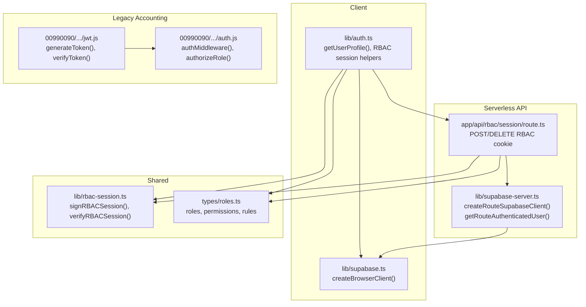
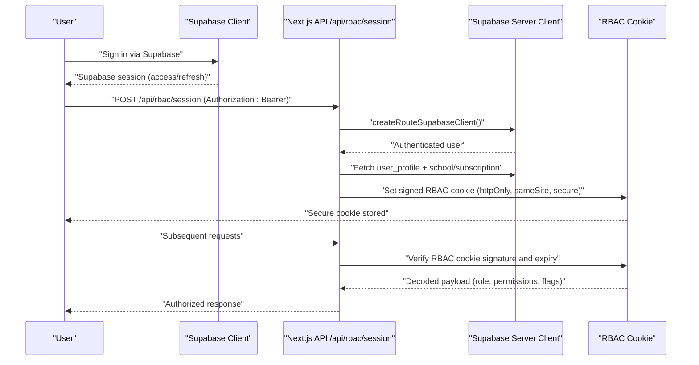
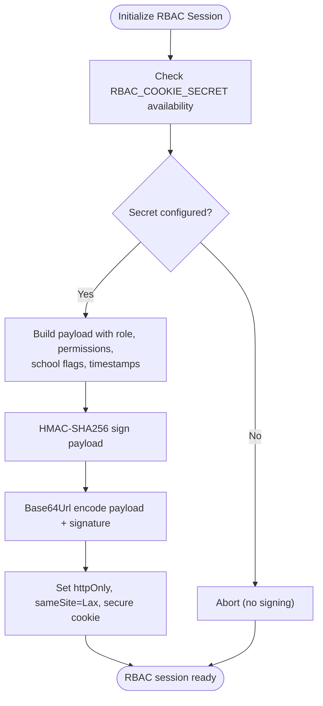
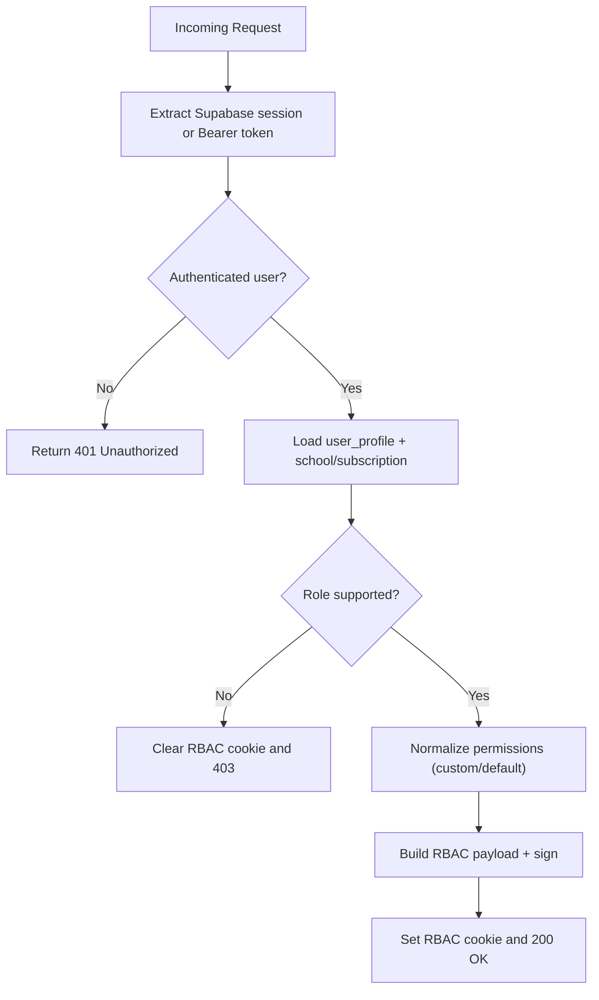
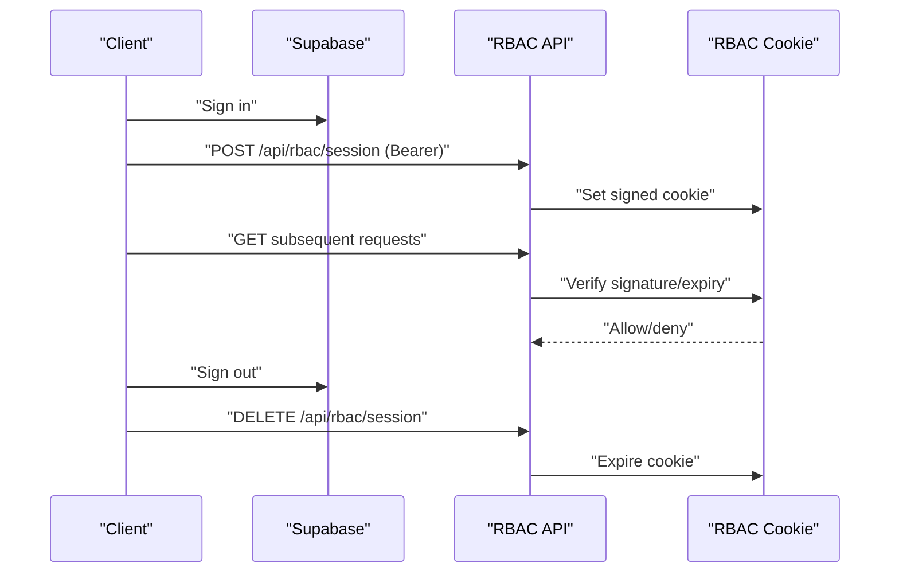
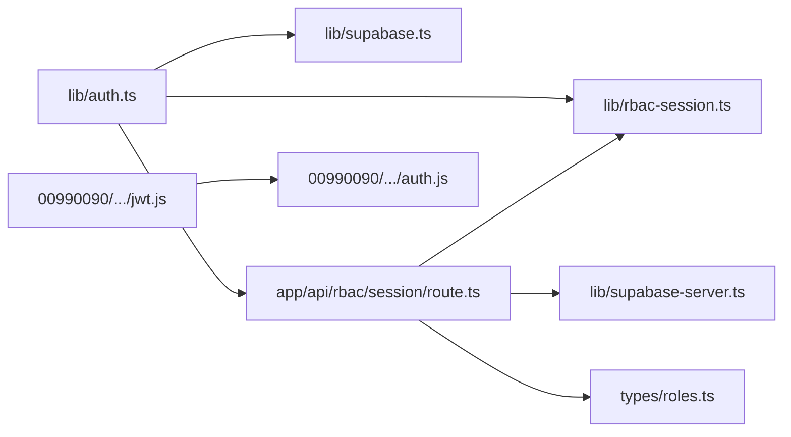

# Authentication Security

<cite>
**Referenced Files in This Document**
- [lib/auth.ts](file://lib/auth.ts)
- [lib/rbac-session.ts](file://lib/rbac-session.ts)
- [app/api/rbac/session/route.ts](file://app/api/rbac/session/route.ts)
- [lib/supabase.ts](file://lib/supabase.ts)
- [lib/supabase-server.ts](file://lib/supabase-server.ts)
- [types/roles.ts](file://types/roles.ts)
- [00990090/school-accounting-system/backend/src/utils/jwt.js](file://00990090/school-accounting-system/backend/src/utils/jwt.js)
- [00990090/school-accounting-system/backend/src/middleware/auth.js](file://00990090/school-accounting-system/backend/src/middleware/auth.js)
</cite>

## Table of Contents
1. [Introduction](#introduction)
2. [Project Structure](#project-structure)
3. [Core Components](#core-components)
4. [Architecture Overview](#architecture-overview)
5. [Detailed Component Analysis](#detailed-component-analysis)
6. [Dependency Analysis](#dependency-analysis)
7. [Performance Considerations](#performance-considerations)
8. [Troubleshooting Guide](#troubleshooting-guide)
9. [Conclusion](#conclusion)

## Introduction
This document explains the authentication and authorization security implementation across the project. It covers:
- Supabase-based authentication integration
- JWT usage in the legacy accounting system
- RBAC enforcement via a signed session cookie
- Session lifecycle: initialization, validation, refresh, and termination
- Real-time session synchronization and security mitigations against hijacking and theft
- Secure patterns, token validation, and session termination processes
- Common vulnerability mitigations

## Project Structure
The authentication stack spans client-side utilities, serverless API endpoints, and shared RBAC definitions:
- Client-side Supabase SDK usage and user profile retrieval
- RBAC session cookie signing and validation
- Supabase server client creation and bearer token extraction
- Role and permission definitions
- Legacy JWT utilities and middleware for the accounting system

**Diagram sources**
- [lib/auth.ts:239-267](file://lib/auth.ts#L239-L267)
- [lib/supabase.ts:1-22](file://lib/supabase.ts#L1-L22)
- [app/api/rbac/session/route.ts:14-133](file://app/api/rbac/session/route.ts#L14-L133)
- [lib/supabase-server.ts:52-74](file://lib/supabase-server.ts#L52-L74)
- [lib/rbac-session.ts:112-142](file://lib/rbac-session.ts#L112-L142)
- [types/roles.ts:47-72](file://types/roles.ts#L47-L72)
- [00990090/school-accounting-system/backend/src/utils/jwt.js:12-36](file://00990090/school-accounting-system/backend/src/utils/jwt.js#L12-L36)
- [00990090/school-accounting-system/backend/src/middleware/auth.js:10-40](file://00990090/school-accounting-system/backend/src/middleware/auth.js#L10-L40)

**Section sources**
- [lib/auth.ts:239-267](file://lib/auth.ts#L239-L267)
- [lib/supabase.ts:1-22](file://lib/supabase.ts#L1-L22)
- [app/api/rbac/session/route.ts:14-133](file://app/api/rbac/session/route.ts#L14-L133)
- [lib/supabase-server.ts:52-74](file://lib/supabase-server.ts#L52-L74)
- [lib/rbac-session.ts:112-142](file://lib/rbac-session.ts#L112-L142)
- [types/roles.ts:47-72](file://types/roles.ts#L47-L72)
- [00990090/school-accounting-system/backend/src/utils/jwt.js:12-36](file://00990090/school-accounting-system/backend/src/utils/jwt.js#L12-L36)
- [00990090/school-accounting-system/backend/src/middleware/auth.js:10-40](file://00990090/school-accounting-system/backend/src/middleware/auth.js#L10-L40)

## Core Components
- Supabase client and server utilities:
  - Browser client creation and environment validation
  - Server client with cookie persistence and bearer token extraction
- RBAC session cookie:
  - Payload composition with role, permissions, and context flags
  - HMAC signing with a dedicated secret and base64url encoding
  - Cookie options enforcing httpOnly, sameSite, and secure flags
- Role and permission model:
  - Known roles and normalized permissions
  - Route access and permission rules
- Client-side RBAC session helpers:
  - Initialize and clear RBAC session cookie
  - Sign-out clears both Supabase session and RBAC cookie
- Legacy JWT utilities and middleware:
  - Token generation and verification
  - Request authentication and role-based authorization

**Section sources**
- [lib/supabase.ts:1-22](file://lib/supabase.ts#L1-L22)
- [lib/supabase-server.ts:52-74](file://lib/supabase-server.ts#L52-L74)
- [lib/rbac-session.ts:56-152](file://lib/rbac-session.ts#L56-L152)
- [types/roles.ts:47-72](file://types/roles.ts#L47-L72)
- [lib/auth.ts:273-340](file://lib/auth.ts#L273-L340)
- [00990090/school-accounting-system/backend/src/utils/jwt.js:12-36](file://00990090/school-accounting-system/backend/src/utils/jwt.js#L12-L36)
- [00990090/school-accounting-system/backend/src/middleware/auth.js:10-40](file://00990090/school-accounting-system/backend/src/middleware/auth.js#L10-L40)

## Architecture Overview
The authentication flow integrates Supabase for identity with a signed RBAC session cookie for local authorization decisions.

**Diagram sources**
- [lib/auth.ts:273-340](file://lib/auth.ts#L273-L340)
- [app/api/rbac/session/route.ts:14-133](file://app/api/rbac/session/route.ts#L14-L133)
- [lib/supabase-server.ts:52-74](file://lib/supabase-server.ts#L52-L74)
- [lib/rbac-session.ts:112-142](file://lib/rbac-session.ts#L112-L142)

## Detailed Component Analysis

### Supabase Authentication Integration
- Client-side:
  - Creates a browser client with validated environment variables
  - Retrieves current user and merges Supabase metadata into the profile
- Server-side:
  - Builds a server client with cookie handling
  - Extracts Bearer token from Authorization header if present, otherwise uses session
  - Validates the token and returns the authenticated user

Security highlights:
- Environment checks prevent misconfiguration
- Bearer token fallback ensures robust session validation
- Server client respects cookie store for SSR and middleware scenarios

**Section sources**
- [lib/supabase.ts:1-22](file://lib/supabase.ts#L1-L22)
- [lib/supabase-server.ts:52-74](file://lib/supabase-server.ts#L52-L74)
- [lib/auth.ts:239-267](file://lib/auth.ts#L239-L267)

### RBAC Session Cookie Implementation
- Payload composition includes role, permissions, school flags, and timestamps
- Signing uses HMAC-SHA256 with a dedicated secret; base64url encoding for compactness
- Cookie options enforce httpOnly, sameSite=Lax, secure in production, and a fixed maxAge
- Verification validates signature, version, and expiry before decoding

**Diagram sources**
- [lib/rbac-session.ts:19-50](file://lib/rbac-session.ts#L19-L50)
- [lib/rbac-session.ts:56-119](file://lib/rbac-session.ts#L56-L119)
- [lib/rbac-session.ts:144-152](file://lib/rbac-session.ts#L144-L152)

**Section sources**
- [lib/rbac-session.ts:56-152](file://lib/rbac-session.ts#L56-L152)

### Role-Based Access Control (RBAC) Enforcement
- Role and permission definitions:
  - Known roles and normalized permissions
  - Route access rules and permission rules per path
- Client-side access decision:
  - Determines allowed paths, read-only modes, and reasons for denial
  - Checks school and subscription status for access validity
- Server-side RBAC session endpoint:
  - Validates user, loads profile and related context
  - Normalizes permissions (custom or default)
  - Builds and signs RBAC payload, sets cookie

**Diagram sources**
- [app/api/rbac/session/route.ts:14-133](file://app/api/rbac/session/route.ts#L14-L133)
- [types/roles.ts:47-72](file://types/roles.ts#L47-L72)
- [lib/rbac-session.ts:112-142](file://lib/rbac-session.ts#L112-L142)

**Section sources**
- [types/roles.ts:47-72](file://types/roles.ts#L47-L72)
- [app/api/rbac/session/route.ts:14-133](file://app/api/rbac/session/route.ts#L14-L133)

### Session Lifecycle: Initialization, Validation, Refresh, Termination
- Initialization:
  - Client calls RBAC session API with Authorization header
  - Server validates token, loads profile, normalizes permissions, and sets signed cookie
- Validation:
  - Subsequent requests rely on verified RBAC cookie for local decisions
  - Server can re-validate session if needed
- Refresh:
  - Client can reinitialize RBAC session after successful Supabase sign-in
  - Optional strict mode throws on failure for robust UX
- Termination:
  - Sign-out clears Supabase session and deletes RBAC cookie
  - API DELETE endpoint clears the cookie on demand

**Diagram sources**
- [lib/auth.ts:323-340](file://lib/auth.ts#L323-L340)
- [app/api/rbac/session/route.ts:135-154](file://app/api/rbac/session/route.ts#L135-L154)
- [lib/rbac-session.ts:144-152](file://lib/rbac-session.ts#L144-L152)

**Section sources**
- [lib/auth.ts:323-340](file://lib/auth.ts#L323-L340)
- [app/api/rbac/session/route.ts:135-154](file://app/api/rbac/session/route.ts#L135-L154)

### Legacy JWT-Based Authentication (Accounting System)
- Utilities:
  - Generates tokens with id, email, name, role and expiration
  - Verifies tokens using the configured secret
- Middleware:
  - Extracts Bearer token from Authorization header
  - Verifies token and attaches user to request
  - Role-based authorization checks

Security notes:
- Token expiration enforced during verification
- Clear error responses for invalid/expired tokens
- Role gating prevents unauthorized actions

**Section sources**
- [00990090/school-accounting-system/backend/src/utils/jwt.js:12-36](file://00990090/school-accounting-system/backend/src/utils/jwt.js#L12-L36)
- [00990090/school-accounting-system/backend/src/middleware/auth.js:10-40](file://00990090/school-accounting-system/backend/src/middleware/auth.js#L10-L40)

### Real-Time Session Synchronization
- Client initializes RBAC session upon successful Supabase sign-in
- On sign-out, both Supabase session and RBAC cookie are cleared
- Rate limiting protects RBAC session endpoints from abuse

Operational guidance:
- Call RBAC session initialization after Supabase sign-in
- Use strict mode to surface errors during initialization
- Clear RBAC session on sign-out to prevent stale authorizations

**Section sources**
- [lib/auth.ts:273-340](file://lib/auth.ts#L273-L340)
- [app/api/rbac/session/route.ts:14-133](file://app/api/rbac/session/route.ts#L14-L133)

## Dependency Analysis
- Client depends on Supabase for identity and on RBAC cookie for authorization
- Serverless API depends on Supabase server client and RBAC signing utilities
- RBAC signing relies on a dedicated secret separate from JWT secrets
- Role and permission logic is centralized in shared types

**Diagram sources**
- [lib/auth.ts:239-267](file://lib/auth.ts#L239-L267)
- [lib/supabase.ts:1-22](file://lib/supabase.ts#L1-L22)
- [lib/rbac-session.ts:112-142](file://lib/rbac-session.ts#L112-L142)
- [app/api/rbac/session/route.ts:14-133](file://app/api/rbac/session/route.ts#L14-L133)
- [lib/supabase-server.ts:52-74](file://lib/supabase-server.ts#L52-L74)
- [types/roles.ts:47-72](file://types/roles.ts#L47-L72)
- [00990090/school-accounting-system/backend/src/utils/jwt.js:12-36](file://00990090/school-accounting-system/backend/src/utils/jwt.js#L12-L36)
- [00990090/school-accounting-system/backend/src/middleware/auth.js:10-40](file://00990090/school-accounting-system/backend/src/middleware/auth.js#L10-L40)

**Section sources**
- [lib/auth.ts:239-267](file://lib/auth.ts#L239-L267)
- [lib/supabase.ts:1-22](file://lib/supabase.ts#L1-L22)
- [lib/rbac-session.ts:112-142](file://lib/rbac-session.ts#L112-L142)
- [app/api/rbac/session/route.ts:14-133](file://app/api/rbac/session/route.ts#L14-L133)
- [lib/supabase-server.ts:52-74](file://lib/supabase-server.ts#L52-L74)
- [types/roles.ts:47-72](file://types/roles.ts#L47-L72)
- [00990090/school-accounting-system/backend/src/utils/jwt.js:12-36](file://00990090/school-accounting-system/backend/src/utils/jwt.js#L12-L36)
- [00990090/school-accounting-system/backend/src/middleware/auth.js:10-40](file://00990090/school-accounting-system/backend/src/middleware/auth.js#L10-L40)

## Performance Considerations
- RBAC cookie signing is lightweight and performed server-side on session init
- Client-side access decisions rely on cookie verification, reducing server round-trips
- Rate limits protect RBAC session endpoints from abuse
- Using httpOnly and secure flags minimizes exposure risks

## Troubleshooting Guide
Common issues and resolutions:
- Missing RBAC secret in production:
  - Configure a dedicated RBAC_COOKIE_SECRET; fallbacks are not recommended for production
- RBAC session not initializing:
  - Ensure Authorization header contains a valid Bearer token or that Supabase session exists
  - Use strict mode to surface initialization errors
- Session denied unexpectedly:
  - Verify role and permissions normalization
  - Check school and subscription status flags embedded in the RBAC payload
- Legacy JWT errors:
  - Confirm JWT_SECRET and expiration configuration
  - Validate token presence and format in Authorization header

**Section sources**
- [lib/rbac-session.ts:19-50](file://lib/rbac-session.ts#L19-L50)
- [lib/auth.ts:273-340](file://lib/auth.ts#L273-L340)
- [app/api/rbac/session/route.ts:14-133](file://app/api/rbac/session/route.ts#L14-L133)
- [00990090/school-accounting-system/backend/src/utils/jwt.js:12-36](file://00990090/school-accounting-system/backend/src/utils/jwt.js#L12-L36)
- [00990090/school-accounting-system/backend/src/middleware/auth.js:10-40](file://00990090/school-accounting-system/backend/src/middleware/auth.js#L10-L40)

## Conclusion
The system combines Supabase authentication with a signed RBAC session cookie to deliver secure, scalable authorization. Client-side helpers streamline session initialization and termination, while serverless endpoints centralize validation and cookie management. Dedicated secrets, httpOnly cookies, and strict error handling mitigate common threats. The legacy JWT utilities remain compatible for the accounting subsystem, ensuring a cohesive security posture across the platform.