# Security Implementation

<cite>
**Referenced Files in This Document**
- [SECURITY.md](file://SECURITY.md)
- [proxy.ts](file://proxy.ts)
- [next.config.ts](file://next.config.ts)
- [lib/auth.ts](file://lib/auth.ts)
- [lib/rate-limit.ts](file://lib/rate-limit.ts)
- [lib/audit.ts](file://lib/audit.ts)
- [lib/supabase.ts](file://lib/supabase.ts)
- [lib/supabase-server.ts](file://lib/supabase-server.ts)
- [lib/rbac-session.ts](file://lib/rbac-session.ts)
- [app/api/rbac/session/route.ts](file://app/api/rbac/session/route.ts)
- [lib/authorized-api.ts](file://lib/authorized-api.ts)
- [lib/api-schemas.ts](file://lib/api-schemas.ts)
- [app/api/health/route.ts](file://app/api/health/route.ts)
- [lib/route-utils.ts](file://lib/route-utils.ts)
- [migrations/20260322_managed_mobile_rls.sql](file://migrations/20260322_managed_mobile_rls.sql)
- [migrations/20260322_mobile_attachments_storage.sql](file://migrations/20260322_mobile_attachments_storage.sql)
- [lib/admin-infrastructure.ts](file://lib/admin-infrastructure.ts)
- [types/roles.ts](file://types/roles.ts)
- [lib/supabase-query-helpers.ts](file://lib/supabase-query-helpers.ts)
</cite>

## Update Summary
**Changes Made**
- Enhanced API security with comprehensive Zod schema validation for all incoming requests
- Added health monitoring endpoint with comprehensive dependency checks and status reporting
- Strengthened authentication security with per-endpoint rate limiting and enhanced session management
- Implemented strict input sanitization and type checking across all API endpoints
- Added standardized error handling and validation utilities for consistent security posture

## Table of Contents
1. [Introduction](#introduction)
2. [Project Structure](#project-structure)
3. [Core Components](#core-components)
4. [Architecture Overview](#architecture-overview)
5. [Detailed Component Analysis](#detailed-component-analysis)
6. [Dependency Analysis](#dependency-analysis)
7. [Performance Considerations](#performance-considerations)
8. [Troubleshooting Guide](#troubleshooting-guide)
9. [Conclusion](#conclusion)
10. [Appendices](#appendices)

## Introduction
This document explains the multi-layered security implementation for the school management platform. It covers authentication and session management, authorization enforcement, data protection via Supabase Row-Level Security (RLS), audit logging, rate limiting, input validation, and protections against common vulnerabilities. The platform now features comprehensive security hardening including a nonce-based Content Security Policy, enhanced RBAC cookie security, dynamic security headers implemented through Next.js proxy middleware, robust query safety mechanisms, and comprehensive API schema validation using Zod for strict input sanitization and type checking.

## Project Structure
Security-related capabilities are distributed across:
- Authentication and RBAC session management in the frontend and API
- Next.js proxy middleware for dynamic security headers and CSP
- Supabase client configuration and server-side clients
- Database-level RLS policies and storage security
- Audit logging utilities
- Rate limiting middleware
- API schema validation using Zod for strict input validation
- Health monitoring endpoint for system status verification
- Admin infrastructure probing and compatibility
- Query safety helpers for preventing injection attacks

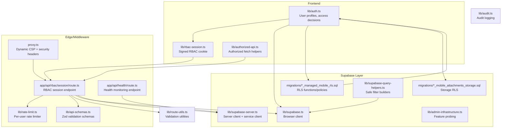

**Diagram sources**
- [lib/auth.ts:1-341](file://lib/auth.ts#L1-L341)
- [lib/rbac-session.ts:1-153](file://lib/rbac-session.ts#L1-L153)
- [lib/authorized-api.ts:1-49](file://lib/authorized-api.ts#L1-L49)
- [proxy.ts:1-139](file://proxy.ts#L1-L139)
- [app/api/rbac/session/route.ts:1-155](file://app/api/rbac/session/route.ts#L1-L155)
- [lib/rate-limit.ts:1-106](file://lib/rate-limit.ts#L1-L106)
- [lib/supabase.ts:1-22](file://lib/supabase.ts#L1-L22)
- [lib/supabase-server.ts:1-75](file://lib/supabase-server.ts#L1-L75)
- [migrations/20260322_managed_mobile_rls.sql:1-580](file://migrations/20260322_managed_mobile_rls.sql#L1-L580)
- [migrations/20260322_mobile_attachments_storage.sql:1-221](file://migrations/20260322_mobile_attachments_storage.sql#L1-L221)
- [lib/admin-infrastructure.ts:1-209](file://lib/admin-infrastructure.ts#L1-L209)
- [lib/audit.ts:1-63](file://lib/audit.ts#L1-L63)
- [lib/supabase-query-helpers.ts:1-34](file://lib/supabase-query-helpers.ts#L1-L34)
- [lib/api-schemas.ts:1-197](file://lib/api-schemas.ts#L1-L197)
- [app/api/health/route.ts:1-73](file://app/api/health/route.ts#L1-L73)
- [lib/route-utils.ts:1-48](file://lib/route-utils.ts#L1-L48)

**Section sources**
- [SECURITY.md:1-36](file://SECURITY.md#L1-L36)
- [lib/auth.ts:1-341](file://lib/auth.ts#L1-L341)
- [lib/rbac-session.ts:1-153](file://lib/rbac-session.ts#L1-L153)
- [proxy.ts:1-139](file://proxy.ts#L1-L139)
- [app/api/rbac/session/route.ts:1-155](file://app/api/rbac/session/route.ts#L1-L155)
- [lib/rate-limit.ts:1-106](file://lib/rate-limit.ts#L1-L106)
- [lib/supabase.ts:1-22](file://lib/supabase.ts#L1-L22)
- [lib/supabase-server.ts:1-75](file://lib/supabase-server.ts#L1-L75)
- [migrations/20260322_managed_mobile_rls.sql:1-580](file://migrations/20260322_managed_mobile_rls.sql#L1-L580)
- [migrations/20260322_mobile_attachments_storage.sql:1-221](file://migrations/20260322_mobile_attachments_storage.sql#L1-L221)
- [lib/admin-infrastructure.ts:1-209](file://lib/admin-infrastructure.ts#L1-L209)
- [lib/audit.ts:1-63](file://lib/audit.ts#L1-L63)
- [lib/supabase-query-helpers.ts:1-34](file://lib/supabase-query-helpers.ts#L1-L34)
- [lib/api-schemas.ts:1-197](file://lib/api-schemas.ts#L1-L197)
- [app/api/health/route.ts:1-73](file://app/api/health/route.ts#L1-L73)
- [lib/route-utils.ts:1-48](file://lib/route-utils.ts#L1-L48)

## Core Components
- RBAC session cookie: Signed, short-lived cookie containing role, permissions, and school/subscription context. Enforced by dedicated API endpoint and validated on subsequent requests.
- Robust CSP with per-request nonce: Next.js proxy middleware generates cryptographically random nonces per request for Content Security Policy, eliminating reliance on unsafe-inline scripts.
- Enhanced RBAC cookie secret requirements: Dedicated cookie secret is now mandatory in production; fallback to Supabase JWT secret is explicitly prohibited in production for security reasons.
- Comprehensive security headers: Proxy middleware sets dynamic security headers (Referrer-Policy, X-Content-Type-Options, X-Frame-Options, Permissions-Policy, HSTS) per request.
- Supabase Auth integration: Frontend and server clients integrate with Supabase Auth for identity and session retrieval.
- Database RLS: Fine-grained row-level policies scoped by role, school, and subscription state; storage policies restrict media access.
- Audit logging: Structured audit logs capture actions with actor metadata and optional metadata.
- Rate limiting: Per-window counters per identifier with cleanup and standardized headers.
- API schema validation: Comprehensive Zod-based validation for all incoming requests with strict input sanitization and type checking.
- Health monitoring: Dedicated endpoint for system status verification with dependency checks and comprehensive reporting.
- Admin infrastructure probing: Detects presence of advanced admin features and warns if tables/columns are missing.
- Safe query builders: Helper functions provide secure filter construction for Supabase queries, preventing injection attacks in .or() operations.

**Updated** Added comprehensive API schema validation and health monitoring capabilities

**Section sources**
- [lib/rbac-session.ts:1-153](file://lib/rbac-session.ts#L1-L153)
- [proxy.ts:1-139](file://proxy.ts#L1-L139)
- [app/api/rbac/session/route.ts:1-155](file://app/api/rbac/session/route.ts#L1-L155)
- [lib/supabase.ts:1-22](file://lib/supabase.ts#L1-L22)
- [lib/supabase-server.ts:1-75](file://lib/supabase-server.ts#L1-L75)
- [migrations/20260322_managed_mobile_rls.sql:1-580](file://migrations/20260322_managed_mobile_rls.sql#L1-L580)
- [migrations/20260322_mobile_attachments_storage.sql:1-221](file://migrations/20260322_mobile_attachments_storage.sql#L1-L221)
- [lib/audit.ts:1-63](file://lib/audit.ts#L1-L63)
- [lib/rate-limit.ts:1-106](file://lib/rate-limit.ts#L1-L106)
- [lib/api-schemas.ts:1-197](file://lib/api-schemas.ts#L1-L197)
- [app/api/health/route.ts:1-73](file://app/api/health/route.ts#L1-L73)
- [lib/admin-infrastructure.ts:1-209](file://lib/admin-infrastructure.ts#L1-L209)
- [lib/supabase-query-helpers.ts:1-34](file://lib/supabase-query-helpers.ts#L1-L34)

## Architecture Overview
The security architecture combines client-side RBAC session signing, server-side session initialization, robust CSP with nonce generation, and comprehensive security headers. All API requests are validated using Zod schemas before processing, with enhanced rate limiting and comprehensive error handling. Requests flow through rate-limited endpoints, validated against Supabase Auth and RBAC session state, enforced by database policies. The new query safety layer provides additional protection against injection attacks in database operations, while the health monitoring endpoint provides comprehensive system status verification.

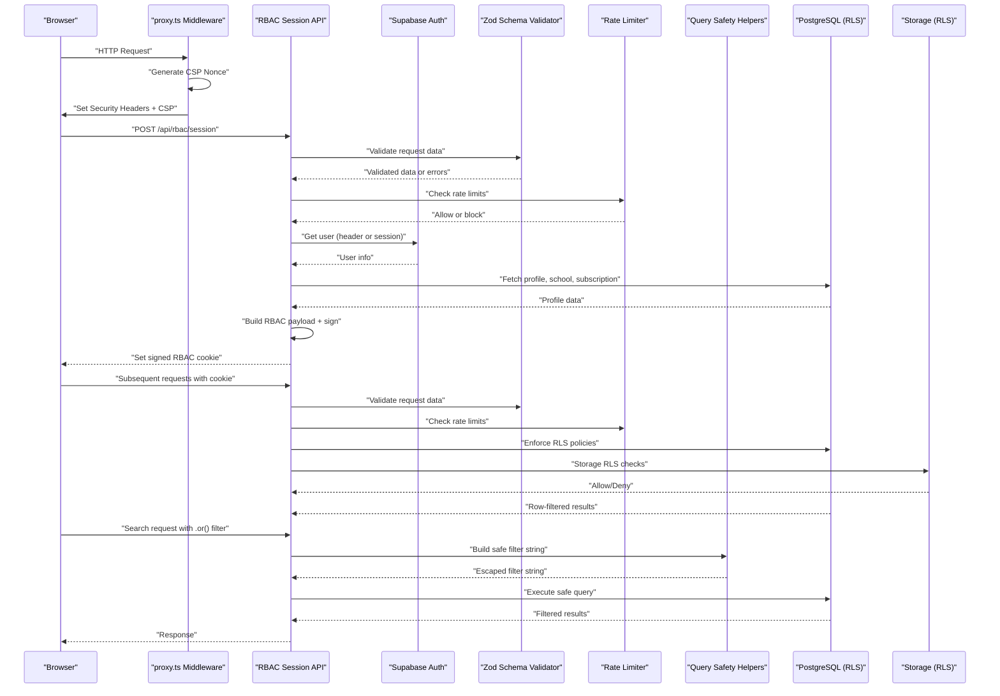

**Diagram sources**
- [proxy.ts:91-123](file://proxy.ts#L91-L123)
- [app/api/rbac/session/route.ts:14-133](file://app/api/rbac/session/route.ts#L14-L133)
- [lib/supabase-server.ts:60-74](file://lib/supabase-server.ts#L60-L74)
- [lib/supabase-query-helpers.ts:10-33](file://lib/supabase-query-helpers.ts#L10-L33)
- [migrations/20260322_managed_mobile_rls.sql:315-577](file://migrations/20260322_managed_mobile_rls.sql#L315-L577)
- [migrations/20260322_mobile_attachments_storage.sql:176-218](file://migrations/20260322_mobile_attachments_storage.sql#L176-L218)

## Detailed Component Analysis

### Proxy Middleware and Dynamic Security Headers
- Purpose: Next.js 16 proxy function (formerly middleware) that generates cryptographically random nonces and sets comprehensive security headers on every request.
- CSP Implementation: Generates 16-byte random nonces using Web Crypto API, builds CSP with `'nonce-${nonce}'` for script-src, and includes strict-dynamic for modern browser support.
- Security Headers: Sets Referrer-Policy, X-Content-Type-Options, X-Frame-Options, Permissions-Policy, and HSTS (only in production).
- Supabase Integration: Dynamically resolves Supabase origins and adds them to connect-src and img-src for WebSocket connections.
- Matching Strategy: Excludes static files, API routes, Next.js internals, and public files from CSP enforcement.

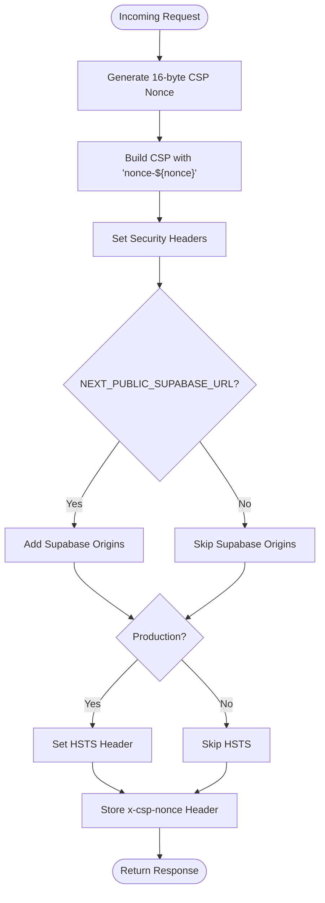

**Diagram sources**
- [proxy.ts:7-17](file://proxy.ts#L7-L17)
- [proxy.ts:44-85](file://proxy.ts#L44-L85)
- [proxy.ts:91-123](file://proxy.ts#L91-L123)
- [proxy.ts:125-138](file://proxy.ts#L125-L138)

**Section sources**
- [proxy.ts:1-139](file://proxy.ts#L1-L139)
- [next.config.ts:1-50](file://next.config.ts#L1-L50)

### RBAC Session Management
- Purpose: Maintain a signed, server-signed cookie containing role, permissions, and school/subscription context to enforce authorization without relying solely on client-side state.
- Enhanced Secret Handling: Dedicated cookie secret is now mandatory in production; explicit error thrown if not configured. Development mode allows fallback to SUPABASE_JWT_SECRET with warnings.
- Payload Building: Includes issuance/expiry timestamps and versioning.
- Cookie Options: HttpOnly, SameSite lax, secure in production, path "/", max age 8 hours.
- Endpoint Behavior:
  - POST initializes session by fetching profile, normalizing permissions, computing school/subscription state, building payload, signing, and setting cookie.
  - DELETE clears the cookie with immediate expiry.
  - Rate limits are enforced per endpoint.

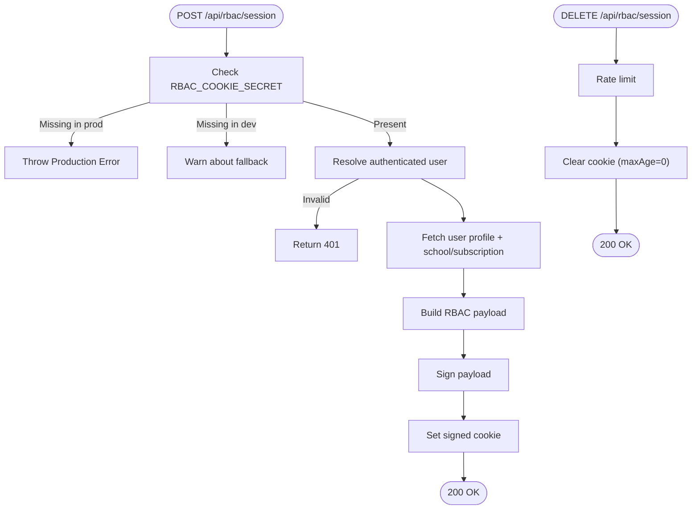

**Diagram sources**
- [lib/rbac-session.ts:19-50](file://lib/rbac-session.ts#L19-L50)
- [lib/rbac-session.ts:112-142](file://lib/rbac-session.ts#L112-L142)
- [app/api/rbac/session/route.ts:14-133](file://app/api/rbac/session/route.ts#L14-L133)

**Section sources**
- [lib/rbac-session.ts:1-153](file://lib/rbac-session.ts#L1-L153)
- [app/api/rbac/session/route.ts:1-155](file://app/api/rbac/session/route.ts#L1-L155)

### Authentication and Authorization Controls
- Supabase Auth integration:
  - Browser client creation validates environment variables and throws if missing.
  - Server client supports cookie-based session persistence and service role client for privileged operations.
  - Route-level user extraction supports Bearer token fallback.
- User profile retrieval:
  - Fetches user profile, resolves role, normalizes permissions (supports custom permissions), and enriches with school/subscription context.
  - Computes access decisions based on role, path rules, and permission requirements.
  - Determines if school access is blocked based on subscription status and expiration.
- Authorized API helpers:
  - Builds headers with Bearer token from current session and exposes fetch wrappers.

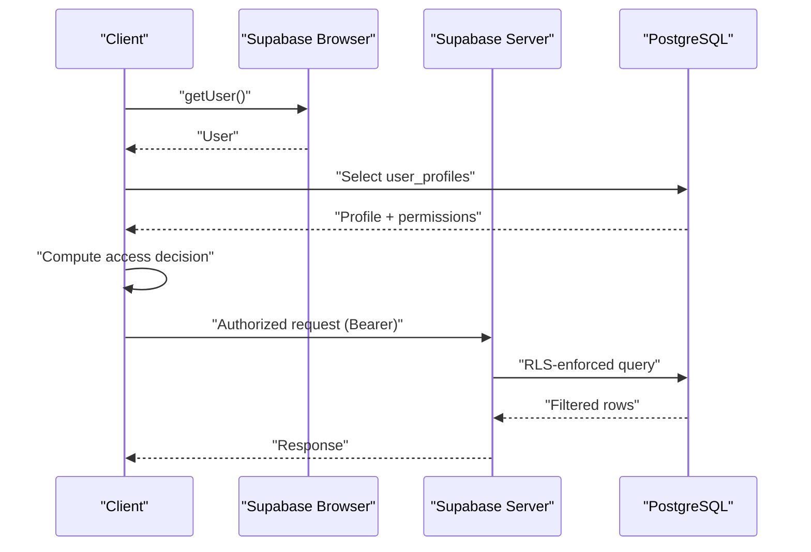

**Diagram sources**
- [lib/supabase.ts:1-22](file://lib/supabase.ts#L1-L22)
- [lib/supabase-server.ts:39-74](file://lib/supabase-server.ts#L39-L74)
- [lib/auth.ts:188-267](file://lib/auth.ts#L188-L267)
- [lib/authorized-api.ts:14-25](file://lib/authorized-api.ts#L14-L25)

**Section sources**
- [lib/supabase.ts:1-22](file://lib/supabase.ts#L1-L22)
- [lib/supabase-server.ts:1-75](file://lib/supabase-server.ts#L1-L75)
- [lib/auth.ts:1-341](file://lib/auth.ts#L1-L341)
- [lib/authorized-api.ts:1-49](file://lib/authorized-api.ts#L1-L49)

### Database RLS Policies and Tenant Scoping
- Managed user functions:
  - Provide current role, school ID, student/teacher IDs, and activity status for policy evaluation.
  - Teacher/student access checks for assignments, grades, attendance, and notifications.
- RLS policies:
  - Enable RLS on relevant tables and define select/update/insert policies scoped by role and managed identifiers.
  - Student/teacher can only access their own data or data within their managed scope (class/section/school).
- Conditional policy application:
  - Policies are created only if target tables exist.
- Storage security:
  - Storage bucket "school-media" is configured private with file size limits.
  - Functions and policies restrict read/write/delete based on managed roles and object ownership.

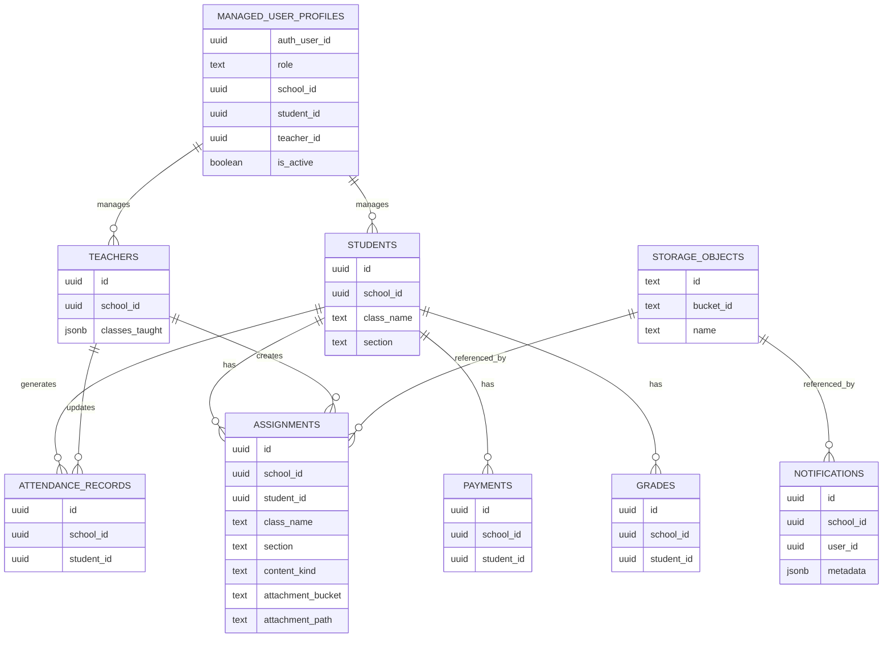

**Diagram sources**
- [migrations/20260322_managed_mobile_rls.sql:7-577](file://migrations/20260322_managed_mobile_rls.sql#L7-L577)
- [migrations/20260322_mobile_attachments_storage.sql:62-218](file://migrations/20260322_mobile_attachments_storage.sql#L62-L218)

**Section sources**
- [migrations/20260322_managed_mobile_rls.sql:1-580](file://migrations/20260322_managed_mobile_rls.sql#L1-L580)
- [migrations/20260322_mobile_attachments_storage.sql:1-221](file://migrations/20260322_mobile_attachments_storage.sql#L1-L221)

### Audit Logging System
- Purpose: Track user actions, system events, and security-relevant activities for compliance and monitoring.
- Schema: Supports action type, entity type, entity ID, summary, and metadata.
- Behavior: Attempts to insert audit log using current user context; errors are logged and ignored if the audit table is missing (compatibility mode).

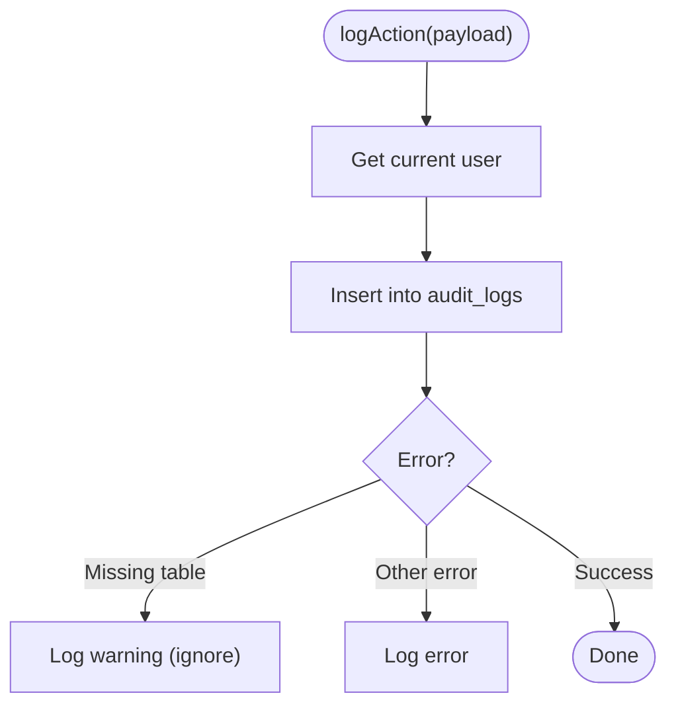

**Diagram sources**
- [lib/audit.ts:40-62](file://lib/audit.ts#L40-L62)
- [lib/admin-infrastructure.ts:43-64](file://lib/admin-infrastructure.ts#L43-L64)

**Section sources**
- [lib/audit.ts:1-63](file://lib/audit.ts#L1-L63)
- [lib/admin-infrastructure.ts:1-209](file://lib/admin-infrastructure.ts#L1-L209)

### Rate Limiting
- Mechanism: In-memory Map keyed by namespace and identifier with per-window counters and reset times; periodic cleanup removes expired entries.
- Headers: Standardized X-RateLimit-* and Retry-After for client guidance.
- Usage: Applied at the RBAC session endpoints to prevent abuse.

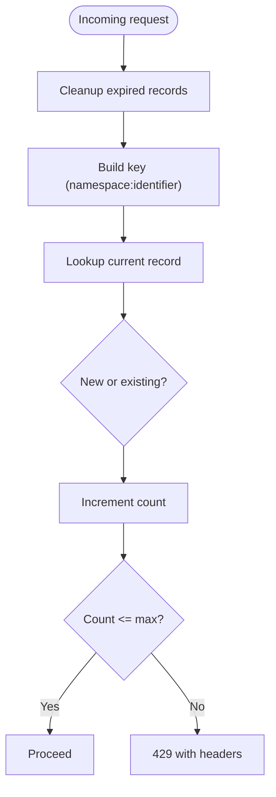

**Diagram sources**
- [lib/rate-limit.ts:34-105](file://lib/rate-limit.ts#L34-L105)
- [app/api/rbac/session/route.ts:32-40](file://app/api/rbac/session/route.ts#L32-L40)
- [app/api/rbac/session/route.ts:136-143](file://app/api/rbac/session/route.ts#L136-L143)

**Section sources**
- [lib/rate-limit.ts:1-106](file://lib/rate-limit.ts#L1-L106)
- [app/api/rbac/session/route.ts:1-155](file://app/api/rbac/session/route.ts#L1-L155)

### API Schema Validation with Zod
- Purpose: Provide comprehensive input validation and sanitization using Zod schemas for all API endpoints.
- Schema Design: Defines strict validation rules for all request parameters, body data, and query strings.
- Input Sanitization: Automatically trims whitespace, normalizes case, and validates data types.
- Error Handling: Provides detailed validation errors with field-specific messages and standardized error responses.
- Schema Categories:
  - Authentication schemas (login, password reset)
  - Payment processing schemas (create, delete, salary payments)
  - Expense management schemas (list, create, update)
  - Dashboard query schemas (overview, lists with pagination)
  - Generic utility schemas (UUID validation, money validation, date validation)

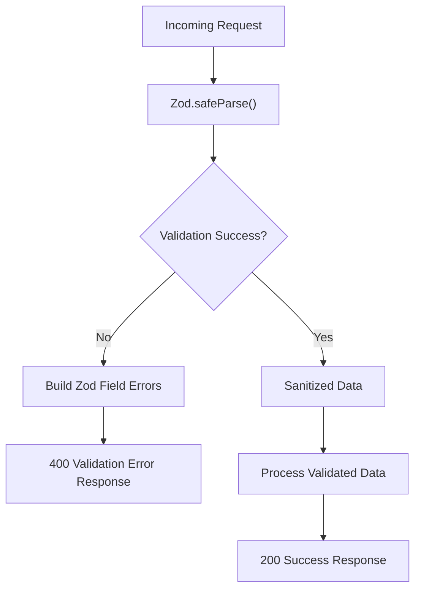

**Diagram sources**
- [lib/api-schemas.ts:97-105](file://lib/api-schemas.ts#L97-L105)
- [lib/route-utils.ts:21-33](file://lib/route-utils.ts#L21-L33)

**Section sources**
- [lib/api-schemas.ts:1-197](file://lib/api-schemas.ts#L1-L197)
- [lib/route-utils.ts:1-48](file://lib/route-utils.ts#L1-L48)

### Health Monitoring Endpoint
- Purpose: Provide comprehensive system status verification with dependency checks and detailed reporting.
- Status Checks: Validates environment configuration, database connectivity, and service role key availability.
- Response Format: Returns structured JSON with status indicators, timing information, and dependency health metrics.
- Monitoring Integration: Designed for use with health checks, load balancers, and monitoring systems.
- Error Reporting: Captures and reports specific error conditions with actionable messages.

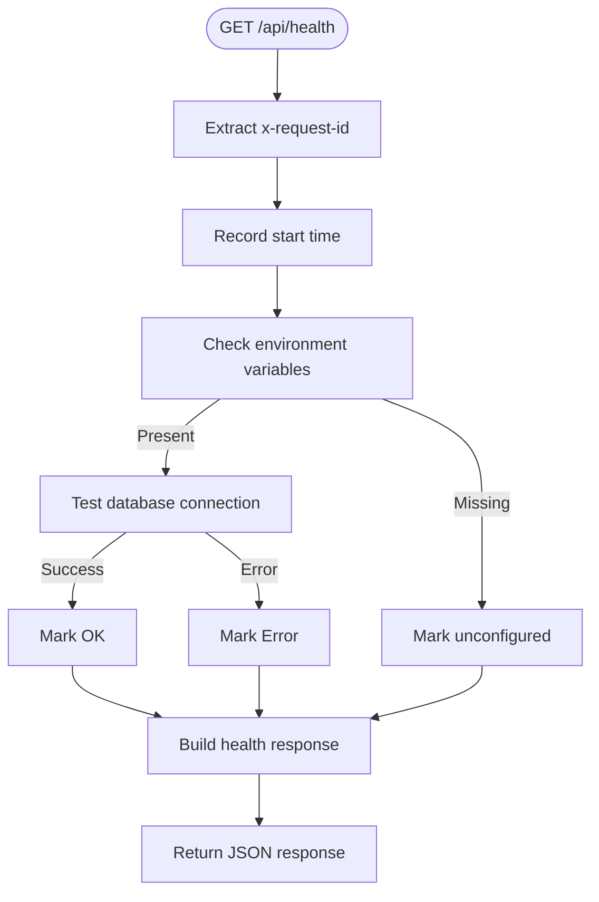

**Diagram sources**
- [app/api/health/route.ts:7-72](file://app/api/health/route.ts#L7-L72)

**Section sources**
- [app/api/health/route.ts:1-73](file://app/api/health/route.ts#L1-L73)

### Safe Query Builders and Filter Injection Prevention
- Purpose: Provide secure methods for constructing Supabase PostgREST queries to prevent injection attacks, particularly in .or() operations.
- Filter Value Escaping: The escapeFilterValue() function escapes special characters including backslashes, percent signs, underscores, commas, parentheses, and periods to prevent filter manipulation.
- Safe OR Filters: The buildSafeOrFilter() function creates properly escaped .or() filter strings for multiple columns, ensuring user input is safely incorporated into ilike queries.
- PostgREST Security: Protects against filter injection where malicious input could manipulate query logic by exploiting delimiter characters (commas, parentheses) and wildcard characters (%, _).
- Usage Pattern: Encourages developers to use these helper functions instead of raw string concatenation when building dynamic search queries.

**Updated** Added comprehensive safe query builder components for preventing filter injection attacks

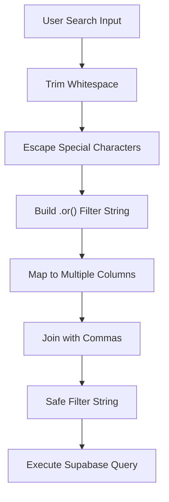

**Diagram sources**
- [lib/supabase-query-helpers.ts:10-33](file://lib/supabase-query-helpers.ts#L10-L33)

**Section sources**
- [lib/supabase-query-helpers.ts:1-34](file://lib/supabase-query-helpers.ts#L1-L34)

### Input Validation and Protection Against Common Vulnerabilities
- Input validation: Use comprehensive Zod schema validation for all user-provided inputs. Validate types, lengths, and formats before processing.
- XSS protection: Escape HTML and sanitize user-generated content rendered in templates. Use framework-safe rendering and avoid innerHTML. CSP with nonce eliminates most script injection vectors.
- CSRF protection: Enforce SameSite cookies and consider CSRF tokens for state-changing forms. Ensure all state-changing requests originate from trusted origins.
- Injection prevention: Use parameterized queries and avoid dynamic SQL construction. Validate and whitelist inputs for database operations. Implement the new safe query builders for dynamic filter construction.
- Secure headers: Dynamic security headers at the edge layer mitigate common web vulnerabilities.
- Rate limiting: Implement per-endpoint rate limiting with IP and user-based tracking to prevent abuse.

**Updated** Enhanced injection prevention with comprehensive Zod validation and new safe query builder functions

### Practical Secure Coding Practices
- Secrets management: Store secrets in environment variables; never commit secrets to source control. Rotate keys regularly and revoke compromised ones immediately. RBAC_COOKIE_SECRET is now mandatory in production.
- Least privilege: Use service role keys only where necessary and disable persistent sessions for service clients.
- Error handling: Log errors securely without exposing sensitive data. Use generic messages to clients while preserving details in logs. Implement standardized validation error handling.
- Feature detection: Use admin infrastructure probing to gracefully handle missing features and warn administrators.
- CSP compliance: Use nonce-based CSP instead of unsafe-inline scripts. Store CSP nonce in x-csp-nonce header for server components.
- Query safety: Always use the buildSafeOrFilter() helper function for dynamic search queries involving .or() operations. Never concatenate user input directly into filter strings.
- Schema validation: Implement comprehensive Zod validation for all API endpoints with strict input sanitization and type checking.

**Updated** Added comprehensive schema validation and enhanced query safety practices

**Section sources**
- [SECURITY.md:30-36](file://SECURITY.md#L30-L36)
- [lib/supabase-server.ts:39-50](file://lib/supabase-server.ts#L39-L50)
- [lib/admin-infrastructure.ts:112-209](file://lib/admin-infrastructure.ts#L112-L209)
- [lib/rbac-session.ts:23-30](file://lib/rbac-session.ts#L23-L30)
- [lib/supabase-query-helpers.ts:10-33](file://lib/supabase-query-helpers.ts#L10-L33)
- [lib/api-schemas.ts:1-197](file://lib/api-schemas.ts#L1-L197)

### Vulnerability Assessment and Incident Response
- Assessment: Conduct regular dependency audits, static analysis, and dynamic scanning. Review Supabase configuration and RLS policies periodically. Test CSP nonce generation, RBAC secret requirements, query safety mechanisms, and Zod validation comprehensively.
- Reporting: Follow private reporting guidelines for security issues. Treat credential exposure, privilege escalation, and isolation failures as critical.
- Response: Rotate affected secrets, apply patches, and communicate remediation steps. Monitor audit logs and alerts for suspicious activity.

**Updated** Enhanced assessment to include comprehensive schema validation and health monitoring

**Section sources**
- [SECURITY.md:17-36](file://SECURITY.md#L17-L36)

### Security Monitoring, Threat Detection, and Compliance
- Monitoring: Integrate audit logs with SIEM or analytics platforms. Alert on unusual spikes in 429 responses, repeated failures, or unauthorized access attempts. Monitor for potential filter injection attempts in search functionality and validate Zod schema compliance.
- Compliance: Maintain audit trails, enforce retention policies, and ensure data minimization. Regularly review RLS coverage, storage access controls, query safety implementations, and comprehensive input validation.
- CSP monitoring: Verify nonce generation and header injection in production. Monitor for CSP violations in browser developer tools.
- Health monitoring: Use the health endpoint for automated system status verification and dependency checks.

### Common Security Scenarios, Penetration Testing, and Maintenance
- Scenarios: Test cross-role access, tenant isolation, storage access bypass attempts, CSP nonce bypass attempts, RBAC secret validation, filter injection attack vectors, and Zod validation bypass attempts.
- Pen testing: Perform authorized penetration tests focusing on RBAC session integrity, RLS bypass vectors, storage exposure, CSP nonce effectiveness, query safety mechanisms, and comprehensive API validation.
- Maintenance: Apply database migrations before deploying dependent features. Re-run linters, type checks, builds, and load tests before production releases. Regularly review and update query safety practices and schema validation implementations.

**Updated** Enhanced pen testing to include comprehensive schema validation and health monitoring scenarios

## Dependency Analysis
- RBAC session signing depends on a dedicated secret; absence triggers warnings or errors depending on environment.
- Proxy middleware generates cryptographically secure nonces and sets comprehensive security headers.
- RBAC session endpoint depends on Supabase Auth for user resolution, Supabase server client for profile/school/subscription queries, rate limiting, and Zod schema validation.
- API endpoints depend on Zod schemas for input validation, rate limiting for abuse prevention, and comprehensive error handling utilities.
- Database RLS depends on managed user functions and policies; storage RLS depends on bucket configuration and policy functions.
- Audit logging depends on Supabase client and admin infrastructure probing to handle missing tables gracefully.
- Safe query builders depend on the new supabase-query-helpers module for filter escaping and construction.
- Health monitoring endpoint depends on environment configuration and database connectivity checks.

**Updated** Added dependencies on comprehensive schema validation and health monitoring

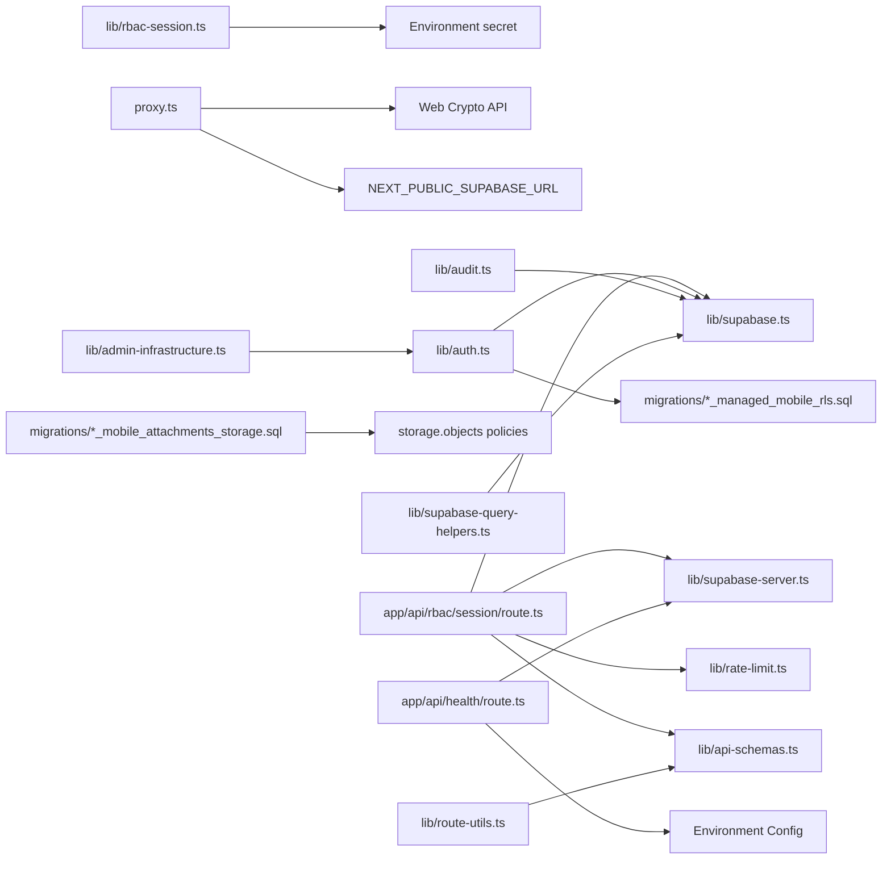

**Diagram sources**
- [lib/rbac-session.ts:19-50](file://lib/rbac-session.ts#L19-L50)
- [proxy.ts:7-16](file://proxy.ts#L7-L16)
- [proxy.ts:32-33](file://proxy.ts#L32-L33)
- [app/api/rbac/session/route.ts:22-133](file://app/api/rbac/session/route.ts#L22-L133)
- [lib/supabase-server.ts:1-75](file://lib/supabase-server.ts#L1-L75)
- [lib/supabase.ts:1-22](file://lib/supabase.ts#L1-L22)
- [lib/rate-limit.ts:65-105](file://lib/rate-limit.ts#L65-L105)
- [lib/auth.ts:188-267](file://lib/auth.ts#L188-L267)
- [migrations/20260322_managed_mobile_rls.sql:315-577](file://migrations/20260322_managed_mobile_rls.sql#L315-L577)
- [migrations/20260322_mobile_attachments_storage.sql:176-218](file://migrations/20260322_mobile_attachments_storage.sql#L176-L218)
- [lib/audit.ts:40-62](file://lib/audit.ts#L40-L62)
- [lib/admin-infrastructure.ts:131-209](file://lib/admin-infrastructure.ts#L131-L209)
- [lib/supabase-query-helpers.ts:1-34](file://lib/supabase-query-helpers.ts#L1-L34)
- [lib/api-schemas.ts:1-197](file://lib/api-schemas.ts#L1-L197)
- [app/api/health/route.ts:1-73](file://app/api/health/route.ts#L1-L73)
- [lib/route-utils.ts:1-48](file://lib/route-utils.ts#L1-L48)

**Section sources**
- [lib/rbac-session.ts:1-153](file://lib/rbac-session.ts#L1-L153)
- [proxy.ts:1-139](file://proxy.ts#L1-L139)
- [app/api/rbac/session/route.ts:1-155](file://app/api/rbac/session/route.ts#L1-L155)
- [lib/supabase-server.ts:1-75](file://lib/supabase-server.ts#L1-L75)
- [lib/supabase.ts:1-22](file://lib/supabase.ts#L1-L22)
- [lib/rate-limit.ts:1-106](file://lib/rate-limit.ts#L1-L106)
- [lib/auth.ts:1-341](file://lib/auth.ts#L1-L341)
- [migrations/20260322_managed_mobile_rls.sql:1-580](file://migrations/20260322_managed_mobile_rls.sql#L1-L580)
- [migrations/20260322_mobile_attachments_storage.sql:1-221](file://migrations/20260322_mobile_attachments_storage.sql#L1-L221)
- [lib/audit.ts:1-63](file://lib/audit.ts#L1-L63)
- [lib/admin-infrastructure.ts:1-209](file://lib/admin-infrastructure.ts#L1-L209)
- [lib/supabase-query-helpers.ts:1-34](file://lib/supabase-query-helpers.ts#L1-L34)
- [lib/api-schemas.ts:1-197](file://lib/api-schemas.ts#L1-L197)
- [app/api/health/route.ts:1-73](file://app/api/health/route.ts#L1-L73)
- [lib/route-utils.ts:1-48](file://lib/route-utils.ts#L1-L48)

## Performance Considerations
- RBAC session signing uses HMAC-SHA256; keep payloads minimal to reduce overhead.
- CSP nonce generation uses Web Crypto API; minimal performance impact but ensures cryptographic security.
- Rate limiter uses in-memory Map with periodic cleanup; monitor memory growth under high concurrency.
- RLS evaluation occurs server-side; ensure appropriate indexes on filtered columns (e.g., student_id, school_id).
- Storage RLS checks traverse related tables; maintain indexes on lookup columns.
- Safe query builders add minimal overhead through string escaping operations; benefits far outweigh performance costs.
- Zod validation adds CPU overhead for input parsing but provides comprehensive type safety and reduces downstream processing errors.
- Health monitoring endpoint performs lightweight database probes; optimize frequency for production deployments.

**Updated** Added performance considerations for new schema validation and health monitoring components

## Troubleshooting Guide
- Missing Supabase environment variables: Browser client creation throws if URL or keys are missing.
- RBAC secret not configured: Production requires a dedicated secret; explicit error thrown. Development falls back with warnings.
- CSP nonce generation failing: Check Web Crypto API availability in Next.js runtime.
- Proxy middleware not applying headers: Verify matcher configuration excludes static files and API routes correctly.
- Profile not found: RBAC session endpoint returns 404 when user profile cannot be retrieved.
- Unauthorized access: RBAC session endpoint returns 401 if user is not authenticated.
- Audit table missing: Audit logging ignores missing table errors and logs a warning.
- Rate limit exceeded: RBAC endpoints return 429 with standardized headers; adjust window/max hits as needed.
- Query safety failures: If .or() filters are not working correctly, ensure buildSafeOrFilter() is being used instead of manual string concatenation.
- Schema validation failures: Check Zod error messages for specific field validation issues; ensure request data matches expected types and formats.
- Health endpoint failures: Verify environment variables, database connectivity, and service role key configuration.
- Validation utility errors: Use buildZodFieldErrors() to extract detailed validation error information.

**Updated** Added troubleshooting guidance for new schema validation and health monitoring components

**Section sources**
- [lib/supabase.ts:8-19](file://lib/supabase.ts#L8-L19)
- [lib/rbac-session.ts:26-49](file://lib/rbac-session.ts#L26-L49)
- [proxy.ts:125-138](file://proxy.ts#L125-L138)
- [app/api/rbac/session/route.ts:49-56](file://app/api/rbac/session/route.ts#L49-L56)
- [app/api/rbac/session/route.ts:28-30](file://app/api/rbac/session/route.ts#L28-L30)
- [lib/audit.ts:56-62](file://lib/audit.ts#L56-L62)
- [lib/rate-limit.ts:86-105](file://lib/rate-limit.ts#L86-L105)
- [lib/supabase-query-helpers.ts:10-33](file://lib/supabase-query-helpers.ts#L10-L33)
- [lib/api-schemas.ts:1-197](file://lib/api-schemas.ts#L1-L197)
- [app/api/health/route.ts:1-73](file://app/api/health/route.ts#L1-L73)
- [lib/route-utils.ts:21-33](file://lib/route-utils.ts#L21-L33)

## Conclusion
The platform implements a robust, layered security model combining Supabase Auth, signed RBAC session cookies, dynamic CSP with nonce-based approach, comprehensive security headers, database RLS, storage policies, audit logging, and rate limiting. The recent security hardening includes mandatory dedicated RBAC cookie secrets in production, comprehensive CSP implementation with per-request nonces, dynamic security headers through proxy middleware, comprehensive API schema validation using Zod for strict input sanitization and type checking, health monitoring endpoint for system status verification, and most importantly, the new buildSafeOrFilter() helper function that prevents filter injection attacks in Supabase .or() queries. The enhanced query safety layer provides additional protection against injection vulnerabilities in dynamic search functionality. Administrators should ensure proper secret management, apply migrations before feature deployment, continuously monitor and test for vulnerabilities, verify CSP nonce generation and header injection in production environments, adopt the new safe query builder patterns throughout the application, implement comprehensive Zod validation across all API endpoints, and utilize the health monitoring endpoint for automated system status verification.

**Updated** Enhanced conclusion to highlight new schema validation, health monitoring, and query safety capabilities

## Appendices
- Security policy scope and operational expectations are documented centrally.
- Admin infrastructure probing helps identify missing features and compatibility warnings.
- RBAC_COOKIE_SECRET is now mandatory in production for enhanced security posture.
- Safe query builder functions provide standardized protection against filter injection attacks.
- The buildSafeOrFilter() helper should be used universally for dynamic search queries involving .or() operations.
- Zod schema validation provides comprehensive input sanitization and type checking for all API endpoints.
- Health monitoring endpoint enables automated system status verification and dependency checks.
- Standardized error handling utilities provide consistent validation error reporting across the application.

**Updated** Added information about new schema validation, health monitoring, and comprehensive error handling components

**Section sources**
- [SECURITY.md:1-36](file://SECURITY.md#L1-L36)
- [lib/admin-infrastructure.ts:112-209](file://lib/admin-infrastructure.ts#L112-L209)
- [lib/rbac-session.ts:23-30](file://lib/rbac-session.ts#L23-L30)
- [proxy.ts:38-43](file://proxy.ts#L38-L43)
- [lib/supabase-query-helpers.ts:1-34](file://lib/supabase-query-helpers.ts#L1-L34)
- [lib/api-schemas.ts:1-197](file://lib/api-schemas.ts#L1-L197)
- [app/api/health/route.ts:1-73](file://app/api/health/route.ts#L1-L73)
- [lib/route-utils.ts:1-48](file://lib/route-utils.ts#L1-L48)