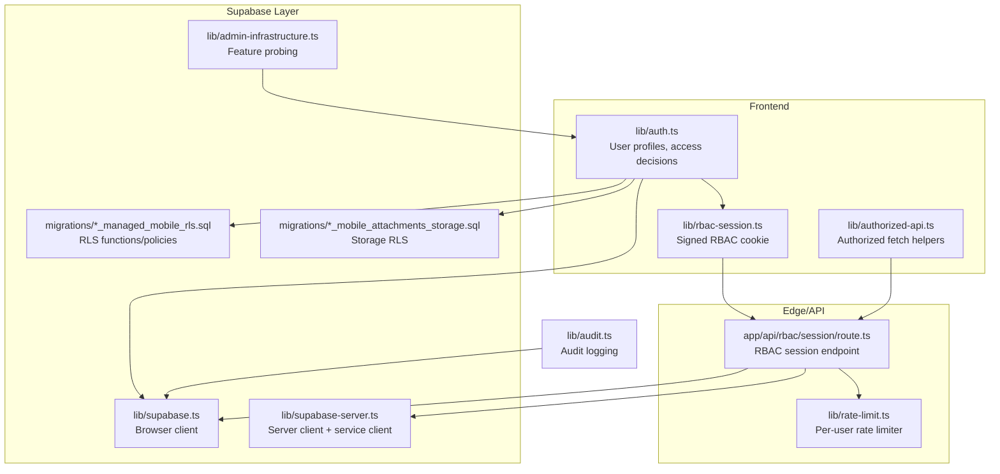
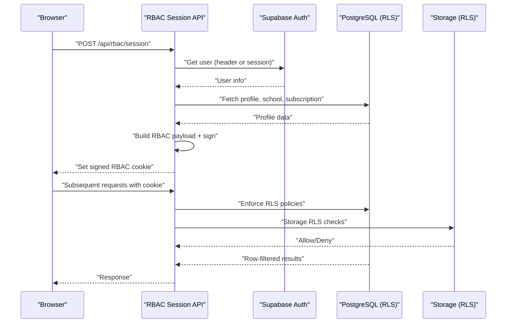
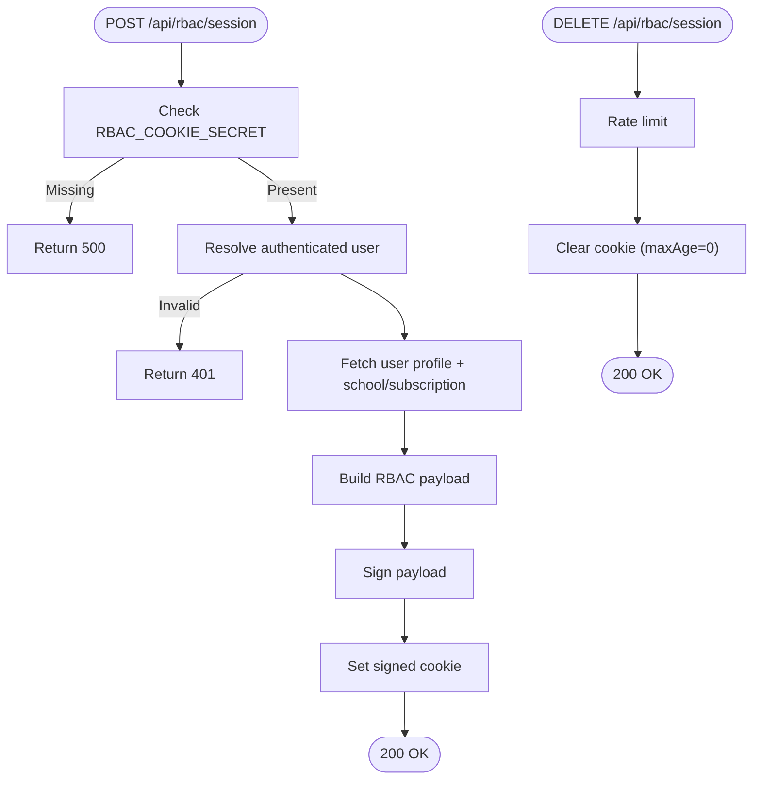
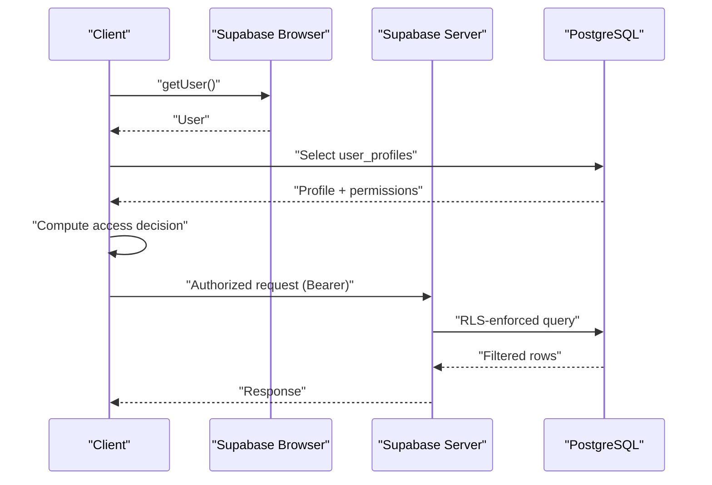
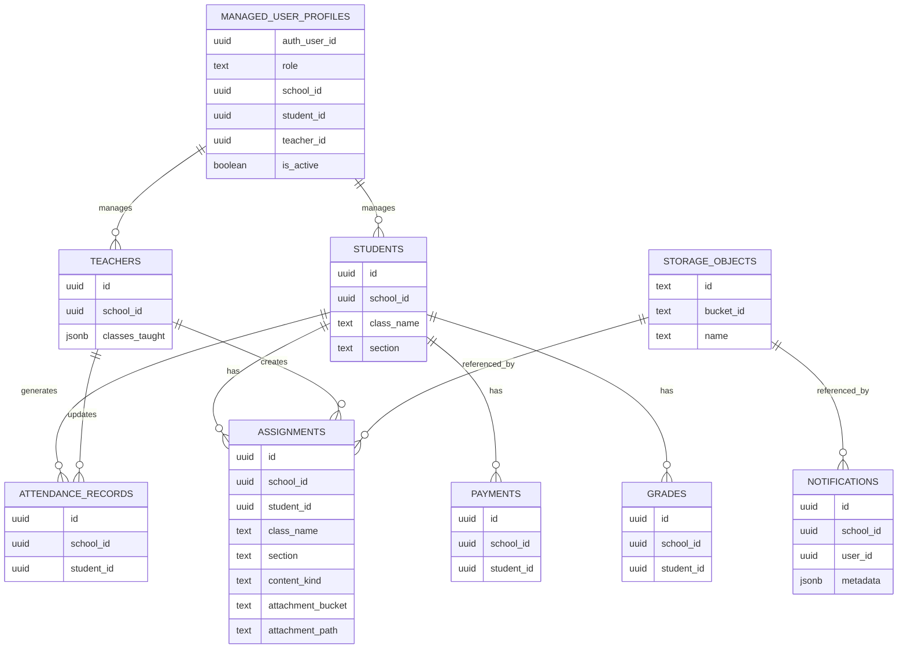
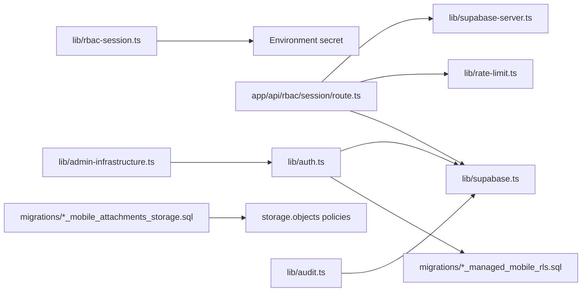

# Security Implementation

<cite>
**Referenced Files in This Document**
- [SECURITY.md](file://SECURITY.md)
- [lib/auth.ts](file://lib/auth.ts)
- [lib/rate-limit.ts](file://lib/rate-limit.ts)
- [lib/audit.ts](file://lib/audit.ts)
- [lib/supabase.ts](file://lib/supabase.ts)
- [lib/supabase-server.ts](file://lib/supabase-server.ts)
- [lib/rbac-session.ts](file://lib/rbac-session.ts)
- [app/api/rbac/session/route.ts](file://app/api/rbac/session/route.ts)
- [lib/authorized-api.ts](file://lib/authorized-api.ts)
- [migrations/20260322_managed_mobile_rls.sql](file://migrations/20260322_managed_mobile_rls.sql)
- [migrations/20260322_mobile_attachments_storage.sql](file://migrations/20260322_mobile_attachments_storage.sql)
- [lib/admin-infrastructure.ts](file://lib/admin-infrastructure.ts)
</cite>

## Table of Contents
1. [Introduction](#introduction)
2. [Project Structure](#project-structure)
3. [Core Components](#core-components)
4. [Architecture Overview](#architecture-overview)
5. [Detailed Component Analysis](#detailed-component-analysis)
6. [Dependency Analysis](#dependency-analysis)
7. [Performance Considerations](#performance-considerations)
8. [Troubleshooting Guide](#troubleshooting-guide)
9. [Conclusion](#conclusion)
10. [Appendices](#appendices)

## Introduction
This document explains the multi-layered security implementation for the school management platform. It covers authentication and session management, authorization enforcement, data protection via Supabase Row-Level Security (RLS), audit logging, rate limiting, input validation, and protections against common vulnerabilities. It also documents Supabase configuration including RLS policies, storage security, and database access controls, along with practical secure coding practices, vulnerability assessment, incident response, monitoring, and compliance considerations.

## Project Structure
Security-related capabilities are distributed across:
- Authentication and RBAC session management in the frontend and API
- Supabase client configuration and server-side clients
- Database-level RLS policies and storage security
- Audit logging utilities
- Rate limiting middleware
- Admin infrastructure probing and compatibility

**Diagram sources**
- [lib/auth.ts:1-341](file://lib/auth.ts#L1-L341)
- [lib/rbac-session.ts:1-153](file://lib/rbac-session.ts#L1-L153)
- [lib/authorized-api.ts:1-49](file://lib/authorized-api.ts#L1-L49)
- [app/api/rbac/session/route.ts:1-155](file://app/api/rbac/session/route.ts#L1-L155)
- [lib/rate-limit.ts:1-102](file://lib/rate-limit.ts#L1-L102)
- [lib/supabase.ts:1-22](file://lib/supabase.ts#L1-L22)
- [lib/supabase-server.ts:1-75](file://lib/supabase-server.ts#L1-L75)
- [migrations/20260322_managed_mobile_rls.sql:1-580](file://migrations/20260322_managed_mobile_rls.sql#L1-L580)
- [migrations/20260322_mobile_attachments_storage.sql:1-221](file://migrations/20260322_mobile_attachments_storage.sql#L1-L221)
- [lib/admin-infrastructure.ts:1-209](file://lib/admin-infrastructure.ts#L1-L209)
- [lib/audit.ts:1-63](file://lib/audit.ts#L1-L63)

**Section sources**
- [SECURITY.md:1-36](file://SECURITY.md#L1-L36)
- [lib/auth.ts:1-341](file://lib/auth.ts#L1-L341)
- [lib/rbac-session.ts:1-153](file://lib/rbac-session.ts#L1-L153)
- [app/api/rbac/session/route.ts:1-155](file://app/api/rbac/session/route.ts#L1-L155)
- [lib/rate-limit.ts:1-102](file://lib/rate-limit.ts#L1-L102)
- [lib/supabase.ts:1-22](file://lib/supabase.ts#L1-L22)
- [lib/supabase-server.ts:1-75](file://lib/supabase-server.ts#L1-L75)
- [migrations/20260322_managed_mobile_rls.sql:1-580](file://migrations/20260322_managed_mobile_rls.sql#L1-L580)
- [migrations/20260322_mobile_attachments_storage.sql:1-221](file://migrations/20260322_mobile_attachments_storage.sql#L1-L221)
- [lib/admin-infrastructure.ts:1-209](file://lib/admin-infrastructure.ts#L1-L209)
- [lib/audit.ts:1-63](file://lib/audit.ts#L1-L63)

## Core Components
- RBAC session cookie: Signed, short-lived cookie containing role, permissions, and school/subscription context. Enforced by dedicated API endpoint and validated on subsequent requests.
- Supabase Auth integration: Frontend and server clients integrate with Supabase Auth for identity and session retrieval.
- Database RLS: Fine-grained row-level policies scoped by role, school, and subscription state; storage policies restrict media access.
- Audit logging: Structured audit logs capture actions with actor metadata and optional metadata.
- Rate limiting: Per-window counters per identifier with cleanup and standardized headers.
- Admin infrastructure probing: Detects presence of advanced admin features and warns if tables/columns are missing.

**Section sources**
- [lib/rbac-session.ts:1-153](file://lib/rbac-session.ts#L1-L153)
- [app/api/rbac/session/route.ts:1-155](file://app/api/rbac/session/route.ts#L1-L155)
- [lib/supabase.ts:1-22](file://lib/supabase.ts#L1-L22)
- [lib/supabase-server.ts:1-75](file://lib/supabase-server.ts#L1-L75)
- [migrations/20260322_managed_mobile_rls.sql:1-580](file://migrations/20260322_managed_mobile_rls.sql#L1-L580)
- [migrations/20260322_mobile_attachments_storage.sql:1-221](file://migrations/20260322_mobile_attachments_storage.sql#L1-L221)
- [lib/audit.ts:1-63](file://lib/audit.ts#L1-L63)
- [lib/rate-limit.ts:1-102](file://lib/rate-limit.ts#L1-L102)
- [lib/admin-infrastructure.ts:1-209](file://lib/admin-infrastructure.ts#L1-L209)

## Architecture Overview
The security architecture combines client-side RBAC session signing, server-side session initialization, database RLS, and storage policies. Requests flow through rate-limited endpoints, validated against Supabase Auth and RBAC session state, enforced by database policies.

**Diagram sources**
- [app/api/rbac/session/route.ts:14-133](file://app/api/rbac/session/route.ts#L14-L133)
- [lib/supabase-server.ts:60-74](file://lib/supabase-server.ts#L60-L74)
- [migrations/20260322_managed_mobile_rls.sql:315-577](file://migrations/20260322_managed_mobile_rls.sql#L315-L577)
- [migrations/20260322_mobile_attachments_storage.sql:176-218](file://migrations/20260322_mobile_attachments_storage.sql#L176-L218)

## Detailed Component Analysis

### RBAC Session Management
- Purpose: Maintain a signed, server-signed cookie containing role, permissions, and school/subscription context to enforce authorization without relying solely on client-side state.
- Secret handling: Dedicated cookie secret is required in production; fallback to Supabase JWT secret is warned in development.
- Payload building: Includes issuance/expiry timestamps and versioning.
- Cookie options: HttpOnly, SameSite lax, secure in production, path “/”, max age 8 hours.
- Endpoint behavior:
  - POST initializes session by fetching profile, normalizing permissions, computing school/subscription state, building payload, signing, and setting cookie.
  - DELETE clears the cookie with immediate expiry.
  - Rate limits are enforced per endpoint.

**Diagram sources**
- [lib/rbac-session.ts:19-50](file://lib/rbac-session.ts#L19-L50)
- [lib/rbac-session.ts:112-142](file://lib/rbac-session.ts#L112-L142)
- [app/api/rbac/session/route.ts:14-133](file://app/api/rbac/session/route.ts#L14-L133)

**Section sources**
- [lib/rbac-session.ts:1-153](file://lib/rbac-session.ts#L1-L153)
- [app/api/rbac/session/route.ts:1-155](file://app/api/rbac/session/route.ts#L1-L155)

### Authentication and Authorization Controls
- Supabase Auth integration:
  - Browser client creation validates environment variables and throws if missing.
  - Server client supports cookie-based session persistence and service role client for privileged operations.
  - Route-level user extraction supports Bearer token fallback.
- User profile retrieval:
  - Fetches user profile, resolves role, normalizes permissions (supports custom permissions), and enriches with school/subscription context.
  - Computes access decisions based on role, path rules, and permission requirements.
  - Determines if school access is blocked based on subscription status and expiration.
- Authorized API helpers:
  - Builds headers with Bearer token from current session and exposes fetch wrappers.

**Diagram sources**
- [lib/supabase.ts:1-22](file://lib/supabase.ts#L1-L22)
- [lib/supabase-server.ts:39-74](file://lib/supabase-server.ts#L39-L74)
- [lib/auth.ts:188-267](file://lib/auth.ts#L188-L267)
- [lib/authorized-api.ts:14-25](file://lib/authorized-api.ts#L14-L25)

**Section sources**
- [lib/supabase.ts:1-22](file://lib/supabase.ts#L1-L22)
- [lib/supabase-server.ts:1-75](file://lib/supabase-server.ts#L1-L75)
- [lib/auth.ts:1-341](file://lib/auth.ts#L1-L341)
- [lib/authorized-api.ts:1-49](file://lib/authorized-api.ts#L1-L49)

### Database RLS Policies and Tenant Scoping
- Managed user functions:
  - Provide current role, school ID, student/teacher IDs, and activity status for policy evaluation.
  - Teacher/student access checks for assignments, grades, attendance, and notifications.
- RLS policies:
  - Enable RLS on relevant tables and define select/update/insert policies scoped by role and managed identifiers.
  - Student/teacher can only access their own data or data within their managed scope (class/section/school).
- Conditional policy application:
  - Policies are created only if target tables exist.
- Storage security:
  - Storage bucket “school-media” is configured private with file size limits.
  - Functions and policies restrict read/write/delete based on managed roles and object ownership.

**Diagram sources**
- [migrations/20260322_managed_mobile_rls.sql:7-577](file://migrations/20260322_managed_mobile_rls.sql#L7-L577)
- [migrations/20260322_mobile_attachments_storage.sql:62-218](file://migrations/20260322_mobile_attachments_storage.sql#L62-L218)

**Section sources**
- [migrations/20260322_managed_mobile_rls.sql:1-580](file://migrations/20260322_managed_mobile_rls.sql#L1-L580)
- [migrations/20260322_mobile_attachments_storage.sql:1-221](file://migrations/20260322_mobile_attachments_storage.sql#L1-L221)

### Audit Logging System
- Purpose: Track user actions, system events, and security-relevant activities for compliance and monitoring.
- Schema: Supports action type, entity type, entity ID, summary, and metadata.
- Behavior: Attempts to insert audit log using current user context; errors are logged and ignored if the audit table is missing (compatibility mode).

**Diagram sources**
- [lib/audit.ts:40-62](file://lib/audit.ts#L40-L62)
- [lib/admin-infrastructure.ts:43-64](file://lib/admin-infrastructure.ts#L43-L64)

**Section sources**
- [lib/audit.ts:1-63](file://lib/audit.ts#L1-L63)
- [lib/admin-infrastructure.ts:1-209](file://lib/admin-infrastructure.ts#L1-L209)

### Rate Limiting
- Mechanism: In-memory Map keyed by namespace and identifier with per-window counters and reset times; periodic cleanup removes expired entries.
- Headers: Standardized X-RateLimit-* and Retry-After for client guidance.
- Usage: Applied at the RBAC session endpoints to prevent abuse.

**Diagram sources**
- [lib/rate-limit.ts:34-101](file://lib/rate-limit.ts#L34-L101)
- [app/api/rbac/session/route.ts:32-40](file://app/api/rbac/session/route.ts#L32-L40)
- [app/api/rbac/session/route.ts:136-143](file://app/api/rbac/session/route.ts#L136-L143)

**Section sources**
- [lib/rate-limit.ts:1-102](file://lib/rate-limit.ts#L1-L102)
- [app/api/rbac/session/route.ts:1-155](file://app/api/rbac/session/route.ts#L1-L155)

### Input Validation and Protection Against Common Vulnerabilities
- Input validation: Use server-side validation and sanitization for all user-provided inputs. Validate types, lengths, and formats before processing.
- XSS protection: Escape HTML and sanitize user-generated content rendered in templates. Use framework-safe rendering and avoid innerHTML.
- CSRF protection: Enforce SameSite cookies and consider CSRF tokens for state-changing forms. Ensure all state-changing requests originate from trusted origins.
- Injection prevention: Use parameterized queries and avoid dynamic SQL construction. Validate and whitelist inputs for database operations.
- Secure headers: Apply security headers at the edge layer to mitigate common web vulnerabilities.

[No sources needed since this section provides general guidance]

### Practical Secure Coding Practices
- Secrets management: Store secrets in environment variables; never commit secrets to source control. Rotate keys regularly and revoke compromised ones immediately.
- Least privilege: Use service role keys only where necessary and disable persistent sessions for service clients.
- Error handling: Log errors securely without exposing sensitive data. Use generic messages to clients while preserving details in logs.
- Feature detection: Use admin infrastructure probing to gracefully handle missing features and warn administrators.

**Section sources**
- [SECURITY.md:30-36](file://SECURITY.md#L30-L36)
- [lib/supabase-server.ts:39-50](file://lib/supabase-server.ts#L39-L50)
- [lib/admin-infrastructure.ts:112-209](file://lib/admin-infrastructure.ts#L112-L209)

### Vulnerability Assessment and Incident Response
- Assessment: Conduct regular dependency audits, static analysis, and dynamic scanning. Review Supabase configuration and RLS policies periodically.
- Reporting: Follow private reporting guidelines for security issues. Treat credential exposure, privilege escalation, and isolation failures as critical.
- Response: Rotate affected secrets, apply patches, and communicate remediation steps. Monitor audit logs and alerts for suspicious activity.

**Section sources**
- [SECURITY.md:17-36](file://SECURITY.md#L17-L36)

### Security Monitoring, Threat Detection, and Compliance
- Monitoring: Integrate audit logs with SIEM or analytics platforms. Alert on unusual spikes in 429 responses, repeated failures, or unauthorized access attempts.
- Compliance: Maintain audit trails, enforce retention policies, and ensure data minimization. Regularly review RLS coverage and storage access controls.

[No sources needed since this section provides general guidance]

### Common Security Scenarios, Penetration Testing, and Maintenance
- Scenarios: Test cross-role access, tenant isolation, and storage access bypass attempts. Validate rate limiting effectiveness and session invalidation.
- Pen testing: Perform authorized penetration tests focusing on RBAC session integrity, RLS bypass vectors, and storage exposure.
- Maintenance: Apply database migrations before deploying dependent features. Re-run linters, type checks, builds, and load tests before production releases.

[No sources needed since this section provides general guidance]

## Dependency Analysis
- RBAC session signing depends on a dedicated secret; absence triggers warnings or errors depending on environment.
- RBAC session endpoint depends on Supabase Auth for user resolution, Supabase server client for profile/school/subscription queries, and rate limiting.
- Database RLS depends on managed user functions and policies; storage RLS depends on bucket configuration and policy functions.
- Audit logging depends on Supabase client and admin infrastructure probing to handle missing tables gracefully.

**Diagram sources**
- [lib/rbac-session.ts:19-50](file://lib/rbac-session.ts#L19-L50)
- [app/api/rbac/session/route.ts:22-133](file://app/api/rbac/session/route.ts#L22-L133)
- [lib/supabase-server.ts:1-75](file://lib/supabase-server.ts#L1-L75)
- [lib/supabase.ts:1-22](file://lib/supabase.ts#L1-L22)
- [lib/rate-limit.ts:65-101](file://lib/rate-limit.ts#L65-L101)
- [lib/auth.ts:188-267](file://lib/auth.ts#L188-L267)
- [migrations/20260322_managed_mobile_rls.sql:315-577](file://migrations/20260322_managed_mobile_rls.sql#L315-L577)
- [migrations/20260322_mobile_attachments_storage.sql:176-218](file://migrations/20260322_mobile_attachments_storage.sql#L176-L218)
- [lib/audit.ts:40-62](file://lib/audit.ts#L40-L62)
- [lib/admin-infrastructure.ts:131-209](file://lib/admin-infrastructure.ts#L131-L209)

**Section sources**
- [lib/rbac-session.ts:1-153](file://lib/rbac-session.ts#L1-L153)
- [app/api/rbac/session/route.ts:1-155](file://app/api/rbac/session/route.ts#L1-L155)
- [lib/supabase-server.ts:1-75](file://lib/supabase-server.ts#L1-L75)
- [lib/supabase.ts:1-22](file://lib/supabase.ts#L1-L22)
- [lib/rate-limit.ts:1-102](file://lib/rate-limit.ts#L1-L102)
- [lib/auth.ts:1-341](file://lib/auth.ts#L1-L341)
- [migrations/20260322_managed_mobile_rls.sql:1-580](file://migrations/20260322_managed_mobile_rls.sql#L1-L580)
- [migrations/20260322_mobile_attachments_storage.sql:1-221](file://migrations/20260322_mobile_attachments_storage.sql#L1-L221)
- [lib/audit.ts:1-63](file://lib/audit.ts#L1-L63)
- [lib/admin-infrastructure.ts:1-209](file://lib/admin-infrastructure.ts#L1-L209)

## Performance Considerations
- RBAC session signing uses HMAC-SHA256; keep payloads minimal to reduce overhead.
- Rate limiter uses in-memory Map with periodic cleanup; monitor memory growth under high concurrency.
- RLS evaluation occurs server-side; ensure appropriate indexes on filtered columns (e.g., student_id, school_id).
- Storage RLS checks traverse related tables; maintain indexes on lookup columns.

[No sources needed since this section provides general guidance]

## Troubleshooting Guide
- Missing Supabase environment variables: Browser client creation throws if URL or keys are missing.
- RBAC secret not configured: Production requires a dedicated secret; development falls back with warnings.
- Profile not found: RBAC session endpoint returns 404 when user profile cannot be retrieved.
- Unauthorized access: RBAC session endpoint returns 401 if user is not authenticated.
- Audit table missing: Audit logging ignores missing table errors and logs a warning.
- Rate limit exceeded: RBAC endpoints return 429 with standardized headers; adjust window/max hits as needed.

**Section sources**
- [lib/supabase.ts:8-19](file://lib/supabase.ts#L8-L19)
- [lib/rbac-session.ts:26-49](file://lib/rbac-session.ts#L26-L49)
- [app/api/rbac/session/route.ts:49-56](file://app/api/rbac/session/route.ts#L49-L56)
- [app/api/rbac/session/route.ts:28-30](file://app/api/rbac/session/route.ts#L28-L30)
- [lib/audit.ts:56-62](file://lib/audit.ts#L56-L62)
- [lib/rate-limit.ts:86-101](file://lib/rate-limit.ts#L86-L101)

## Conclusion
The platform implements a robust, layered security model combining Supabase Auth, signed RBAC session cookies, database RLS, storage policies, audit logging, and rate limiting. Administrators should ensure proper secret management, apply migrations before feature deployment, and continuously monitor and test for vulnerabilities. Compliance and operational expectations are documented to guide responsible disclosure and maintenance.

[No sources needed since this section summarizes without analyzing specific files]

## Appendices
- Security policy scope and operational expectations are documented centrally.
- Admin infrastructure probing helps identify missing features and compatibility warnings.

**Section sources**
- [SECURITY.md:1-36](file://SECURITY.md#L1-L36)
- [lib/admin-infrastructure.ts:112-209](file://lib/admin-infrastructure.ts#L112-L209)