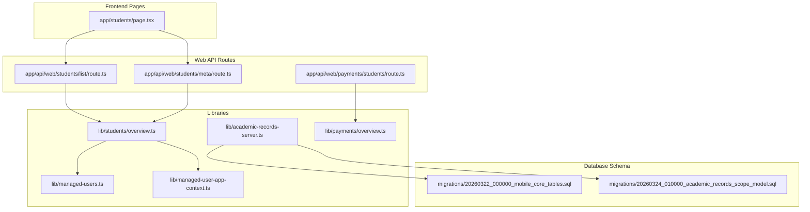
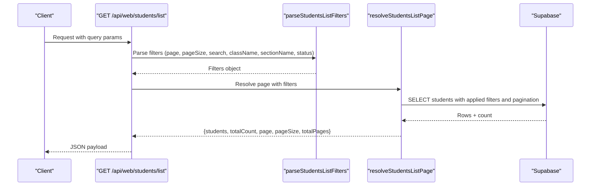
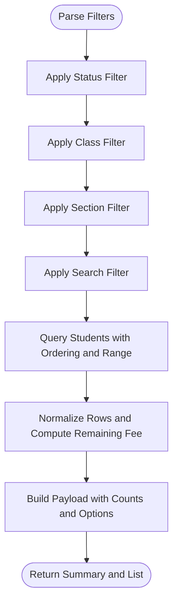
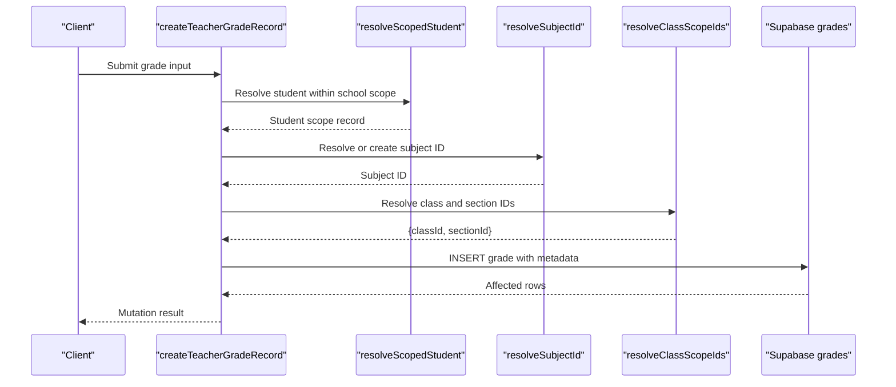
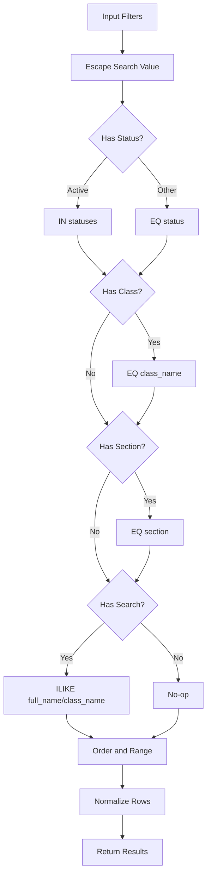
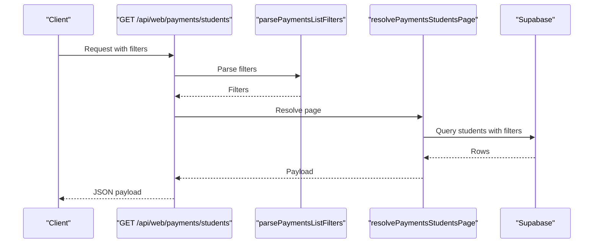
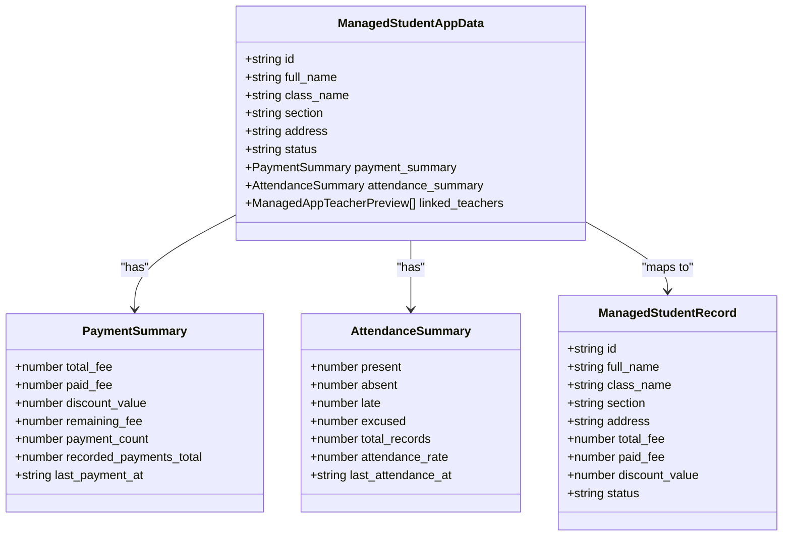
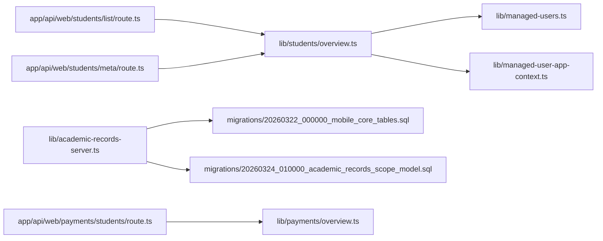

# Student Management System

<cite>
**Referenced Files in This Document**
- [app/students/page.tsx](file://app/students/page.tsx)
- [lib/students/overview.ts](file://lib/students/overview.ts)
- [app/api/web/students/list/route.ts](file://app/api/web/students/list/route.ts)
- [app/api/web/students/meta/route.ts](file://app/api/web/students/meta/route.ts)
- [lib/academic-records-server.ts](file://lib/academic-records-server.ts)
- [migrations/20260322_000000_mobile_core_tables.sql](file://migrations/20260322_000000_mobile_core_tables.sql)
- [migrations/20260324_010000_academic_records_scope_model.sql](file://migrations/20260324_010000_academic_records_scope_model.sql)
- [lib/managed-users.ts](file://lib/managed-users.ts)
- [lib/managed-user-app-context.ts](file://lib/managed-user-app-context.ts)
- [app/api/web/payments/students/route.ts](file://app/api/web/payments/students/route.ts)
- [lib/payments/overview.ts](file://lib/payments/overview.ts)
</cite>

## Table of Contents
1. [Introduction](#introduction)
2. [Project Structure](#project-structure)
3. [Core Components](#core-components)
4. [Architecture Overview](#architecture-overview)
5. [Detailed Component Analysis](#detailed-component-analysis)
6. [Dependency Analysis](#dependency-analysis)
7. [Performance Considerations](#performance-considerations)
8. [Troubleshooting Guide](#troubleshooting-guide)
9. [Conclusion](#conclusion)
10. [Appendices](#appendices)

## Introduction
This document describes the student management system with a focus on academic record management and student lifecycle operations. It explains how student records are maintained, how academic records (assignments and grades) are tracked, and how centralized student overview is provided. It also documents search and filtering, bulk operations, and data import/export capabilities. Practical workflows for enrollment tracking, academic record updates, and profile management are included, along with integrations to class management, attendance tracking, and payment systems. Reporting and validation rules are addressed to support common student management scenarios.

## Project Structure
The system is organized around:
- API routes under app/api/web that expose REST endpoints for students, payments, and reports.
- Business logic in lib modules for student overview, academic records, payments, and managed user contexts.
- Migrations that define the academic records schema (assignments and grades) and indexes.
- Frontend pages that redirect to localized paths and integrate with the backend APIs.

**Diagram sources**
- [app/students/page.tsx:1-6](file://app/students/page.tsx#L1-L6)
- [app/api/web/students/list/route.ts:1-55](file://app/api/web/students/list/route.ts#L1-L55)
- [app/api/web/students/meta/route.ts:1-55](file://app/api/web/students/meta/route.ts#L1-L55)
- [app/api/web/payments/students/route.ts:1-55](file://app/api/web/payments/students/route.ts#L1-L55)
- [lib/students/overview.ts:1-283](file://lib/students/overview.ts#L1-L283)
- [lib/academic-records-server.ts:1-800](file://lib/academic-records-server.ts#L1-L800)
- [lib/payments/overview.ts:746-777](file://lib/payments/overview.ts#L746-L777)
- [lib/managed-users.ts:1-105](file://lib/managed-users.ts#L1-L105)
- [lib/managed-user-app-context.ts:50-85](file://lib/managed-user-app-context.ts#L50-L85)
- [migrations/20260322_000000_mobile_core_tables.sql:140-181](file://migrations/20260322_000000_mobile_core_tables.sql#L140-L181)
- [migrations/20260324_010000_academic_records_scope_model.sql:1-314](file://migrations/20260324_010000_academic_records_scope_model.sql#L1-L314)

**Section sources**
- [app/students/page.tsx:1-6](file://app/students/page.tsx#L1-L6)
- [lib/students/overview.ts:1-283](file://lib/students/overview.ts#L1-L283)
- [app/api/web/students/list/route.ts:1-55](file://app/api/web/students/list/route.ts#L1-L55)
- [app/api/web/students/meta/route.ts:1-55](file://app/api/web/students/meta/route.ts#L1-L55)
- [lib/academic-records-server.ts:1-800](file://lib/academic-records-server.ts#L1-L800)
- [migrations/20260322_000000_mobile_core_tables.sql:140-181](file://migrations/20260322_000000_mobile_core_tables.sql#L140-L181)
- [migrations/20260324_010000_academic_records_scope_model.sql:1-314](file://migrations/20260324_010000_academic_records_scope_model.sql#L1-L314)
- [lib/managed-users.ts:1-105](file://lib/managed-users.ts#L1-L105)
- [lib/managed-user-app-context.ts:50-85](file://lib/managed-user-app-context.ts#L50-L85)
- [app/api/web/payments/students/route.ts:1-55](file://app/api/web/payments/students/route.ts#L1-L55)
- [lib/payments/overview.ts:746-777](file://lib/payments/overview.ts#L746-L777)

## Core Components
- Student overview and listing: Provides paginated lists, summary statistics, and filter options for students, including status tabs, class, section, and search.
- Academic records: Manages assignments and grades with teacher scoping, subject resolution, and class/section scope resolution.
- Payments integration: Exposes endpoints to list students in the context of payments and supports exportable filtered sets.
- Managed user model: Defines student and teacher records, roles, and app account summaries used across the system.
- App context: Supplies student preview data including payment and attendance summaries for dashboards.

**Section sources**
- [lib/students/overview.ts:1-283](file://lib/students/overview.ts#L1-L283)
- [lib/academic-records-server.ts:1-800](file://lib/academic-records-server.ts#L1-L800)
- [lib/managed-users.ts:1-105](file://lib/managed-users.ts#L1-L105)
- [lib/managed-user-app-context.ts:50-85](file://lib/managed-user-app-context.ts#L50-L85)
- [app/api/web/payments/students/route.ts:1-55](file://app/api/web/payments/students/route.ts#L1-L55)
- [lib/payments/overview.ts:746-777](file://lib/payments/overview.ts#L746-L777)

## Architecture Overview
The system follows a layered architecture:
- Presentation layer: Next.js pages and API routes.
- Application layer: Route handlers parse filters, enforce rate limits, and delegate to library functions.
- Domain layer: Libraries encapsulate business logic for student overview, academic records, and payments.
- Persistence layer: Supabase-backed tables for students, assignments, grades, and supporting entities.

**Diagram sources**
- [app/api/web/students/list/route.ts:1-55](file://app/api/web/students/list/route.ts#L1-L55)
- [lib/students/overview.ts:212-260](file://lib/students/overview.ts#L212-L260)

## Detailed Component Analysis

### Student Overview and Lifecycle
The student overview module provides:
- Filtering by status (active, transferred, suspended, deleted), class, section, and free-text search.
- Pagination with configurable page size and computed total pages.
- Summary statistics and tab counts for quick insights.
- Normalization of numeric and textual fields to ensure consistent rendering.

**Diagram sources**
- [lib/students/overview.ts:87-113](file://lib/students/overview.ts#L87-L113)
- [lib/students/overview.ts:229-260](file://lib/students/overview.ts#L229-L260)
- [lib/students/overview.ts:160-190](file://lib/students/overview.ts#L160-L190)
- [lib/students/overview.ts:192-210](file://lib/students/overview.ts#L192-L210)

Practical example: Listing students in a class with pagination and status filtering is handled by the list route, which parses filters, enforces rate limits, and resolves the page via the overview resolver.

**Section sources**
- [app/api/web/students/list/route.ts:1-55](file://app/api/web/students/list/route.ts#L1-L55)
- [lib/students/overview.ts:212-260](file://lib/students/overview.ts#L212-L260)
- [lib/students/overview.ts:160-190](file://lib/students/overview.ts#L160-L190)
- [lib/students/overview.ts:192-210](file://lib/students/overview.ts#L192-L210)

### Academic Records: Assignments and Grades
The academic records server manages:
- Teacher-scoped operations ensuring assignments and grades are within the teacher’s assigned subjects and scopes.
- Subject resolution and class/section scope resolution with dynamic column support detection.
- Validation of inputs (e.g., scores, max scores, timestamps) and robust error handling with feature gates.
- Insertion of assignments and grades with optional metadata and attachments.

**Diagram sources**
- [lib/academic-records-server.ts:686-824](file://lib/academic-records-server.ts#L686-L824)
- [lib/academic-records-server.ts:239-270](file://lib/academic-records-server.ts#L239-L270)
- [lib/academic-records-server.ts:272-348](file://lib/academic-records-server.ts#L272-L348)
- [lib/academic-records-server.ts:350-443](file://lib/academic-records-server.ts#L350-L443)

Practical example: A teacher creates a grade for a student by providing student_id, subject, score, and optional metadata. The system validates inputs, resolves subject and class/section IDs, and inserts the grade.

**Section sources**
- [lib/academic-records-server.ts:686-824](file://lib/academic-records-server.ts#L686-L824)
- [migrations/20260322_000000_mobile_core_tables.sql:149-178](file://migrations/20260322_000000_mobile_core_tables.sql#L149-L178)
- [migrations/20260324_010000_academic_records_scope_model.sql:24-314](file://migrations/20260324_010000_academic_records_scope_model.sql#L24-L314)

### Student Search and Filtering
Search and filtering are implemented consistently across modules:
- Escaping and normalization of search terms to prevent SQL injection and improve matching.
- Applying filters for status, class, section, and search text.
- Building tab counts per status and section options for UI controls.

**Diagram sources**
- [lib/students/overview.ts:73-75](file://lib/students/overview.ts#L73-L75)
- [lib/students/overview.ts:87-113](file://lib/students/overview.ts#L87-L113)
- [lib/students/overview.ts:229-260](file://lib/students/overview.ts#L229-L260)

**Section sources**
- [lib/students/overview.ts:73-113](file://lib/students/overview.ts#L73-L113)
- [lib/students/overview.ts:229-260](file://lib/students/overview.ts#L229-L260)

### Bulk Operations and Data Import/Export
- Exportable student lists: The payments module exposes an endpoint to export filtered student sets, including special quick filters (e.g., students without invoices).
- Bulk filtering: Consistent filter parsing and normalization enable efficient bulk operations across modules.

**Diagram sources**
- [app/api/web/payments/students/route.ts:1-55](file://app/api/web/payments/students/route.ts#L1-L55)
- [lib/payments/overview.ts:746-777](file://lib/payments/overview.ts#L746-L777)

**Section sources**
- [app/api/web/payments/students/route.ts:1-55](file://app/api/web/payments/students/route.ts#L1-L55)
- [lib/payments/overview.ts:746-777](file://lib/payments/overview.ts#L746-L777)

### Integration with Class Management, Attendance Tracking, and Payment Systems
- Class and section scope resolution: Academic records rely on resolving class and section identifiers from school-scoped tables, ensuring teacher actions remain within assigned scopes.
- Attendance and payment summaries: The managed user app context includes attendance and payment summaries for each student, enabling centralized dashboards and overview pages.

**Diagram sources**
- [lib/managed-user-app-context.ts:50-85](file://lib/managed-user-app-context.ts#L50-L85)
- [lib/managed-users.ts:15-25](file://lib/managed-users.ts#L15-L25)

**Section sources**
- [lib/managed-user-app-context.ts:50-85](file://lib/managed-user-app-context.ts#L50-L85)
- [lib/managed-users.ts:15-25](file://lib/managed-users.ts#L15-L25)

## Dependency Analysis
- API routes depend on library modules for parsing filters and resolving data.
- Academic records server depends on migrations for table schemas and indexes.
- Student overview depends on managed user models for consistent typing and app context for dashboard summaries.

**Diagram sources**
- [app/api/web/students/list/route.ts:1-55](file://app/api/web/students/list/route.ts#L1-L55)
- [app/api/web/students/meta/route.ts:1-55](file://app/api/web/students/meta/route.ts#L1-L55)
- [lib/students/overview.ts:1-283](file://lib/students/overview.ts#L1-L283)
- [lib/academic-records-server.ts:1-800](file://lib/academic-records-server.ts#L1-L800)
- [migrations/20260322_000000_mobile_core_tables.sql:140-181](file://migrations/20260322_000000_mobile_core_tables.sql#L140-L181)
- [migrations/20260324_010000_academic_records_scope_model.sql:1-314](file://migrations/20260324_010000_academic_records_scope_model.sql#L1-L314)
- [lib/managed-users.ts:1-105](file://lib/managed-users.ts#L1-L105)
- [lib/managed-user-app-context.ts:50-85](file://lib/managed-user-app-context.ts#L50-L85)
- [app/api/web/payments/students/route.ts:1-55](file://app/api/web/payments/students/route.ts#L1-L55)
- [lib/payments/overview.ts:746-777](file://lib/payments/overview.ts#L746-L777)

**Section sources**
- [lib/students/overview.ts:1-283](file://lib/students/overview.ts#L1-L283)
- [lib/academic-records-server.ts:1-800](file://lib/academic-records-server.ts#L1-L800)
- [lib/managed-users.ts:1-105](file://lib/managed-users.ts#L1-L105)
- [lib/managed-user-app-context.ts:50-85](file://lib/managed-user-app-context.ts#L50-L85)
- [app/api/web/payments/students/route.ts:1-55](file://app/api/web/payments/students/route.ts#L1-L55)
- [lib/payments/overview.ts:746-777](file://lib/payments/overview.ts#L746-L777)

## Performance Considerations
- Indexes on frequently queried columns (e.g., student_id, teacher_id, school_id, due_at) improve query performance for assignments and grades.
- Pagination with range queries prevents large result sets and reduces memory usage.
- Rate limiting on API routes protects backend resources during bulk operations.
- Column support detection avoids unnecessary writes and improves resilience when schema evolves.

[No sources needed since this section provides general guidance]

## Troubleshooting Guide
Common issues and resolutions:
- Feature gate errors: When required tables (assignments, grades) are missing or inaccessible, feature gates return structured messages indicating missing tables or permission issues.
- Input validation failures: Invalid scores, missing student IDs, or unauthorized scope triggers explicit error messages.
- Search anomalies: Escaped search values ensure predictable matching; verify that special characters are normalized.

**Section sources**
- [lib/academic-records-server.ts:84-108](file://lib/academic-records-server.ts#L84-L108)
- [lib/academic-records-server.ts:719-735](file://lib/academic-records-server.ts#L719-L735)
- [lib/students/overview.ts:73-75](file://lib/students/overview.ts#L73-L75)

## Conclusion
The student management system integrates student lifecycle operations with academic record management and payments. It provides robust filtering, pagination, and export capabilities while enforcing teacher scoping and input validation. Centralized summaries and consistent data models enable efficient dashboards and reporting. The modular design and migration-driven schema evolution support maintainability and scalability.

[No sources needed since this section summarizes without analyzing specific files]

## Appendices

### Practical Workflows

- Student enrollment workflow
  - Use the student list route to verify class and section assignments and status.
  - Ensure class/section scope resolution succeeds before enrolling students.
  - Validate payment and attendance summaries for newly enrolled students.

- Academic record update workflow
  - Teachers create assignments with subject, class, and section scope resolution.
  - Grade creation validates scores and ensures teacher scope alignment.
  - Use feature gates to handle missing tables or permission errors.

- Student profile management
  - Update student records via managed user models and ensure normalization of fields.
  - Use student overview filters to locate profiles and verify status.

**Section sources**
- [app/api/web/students/list/route.ts:1-55](file://app/api/web/students/list/route.ts#L1-L55)
- [lib/academic-records-server.ts:509-684](file://lib/academic-records-server.ts#L509-L684)
- [lib/academic-records-server.ts:686-824](file://lib/academic-records-server.ts#L686-L824)
- [lib/managed-users.ts:15-77](file://lib/managed-users.ts#L15-L77)