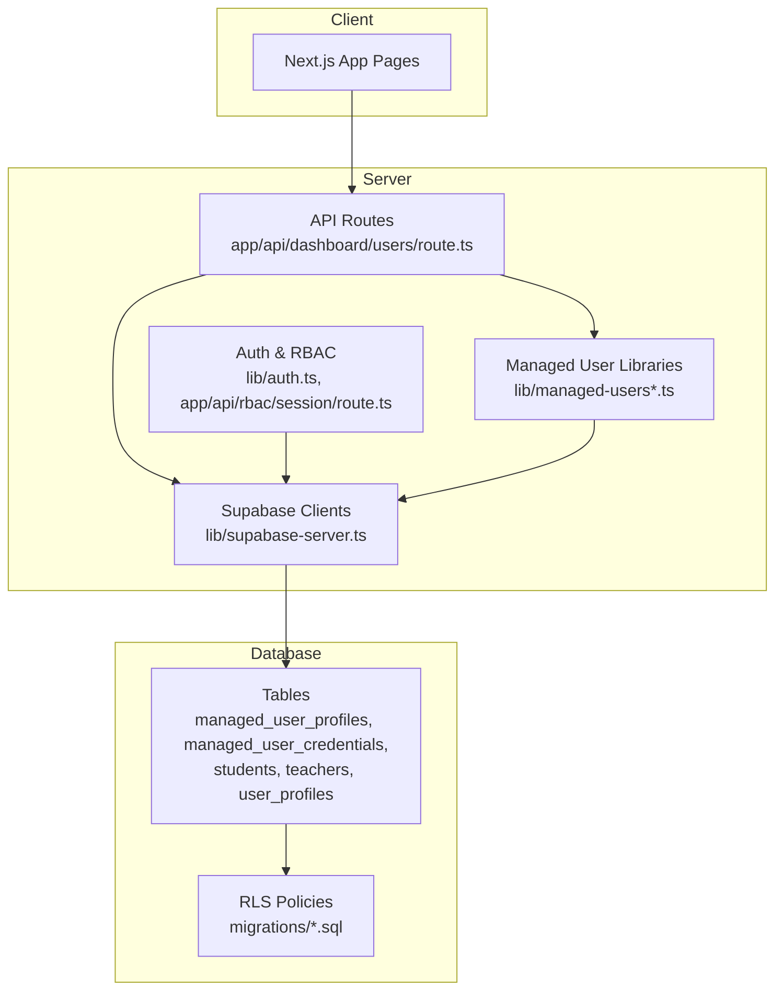
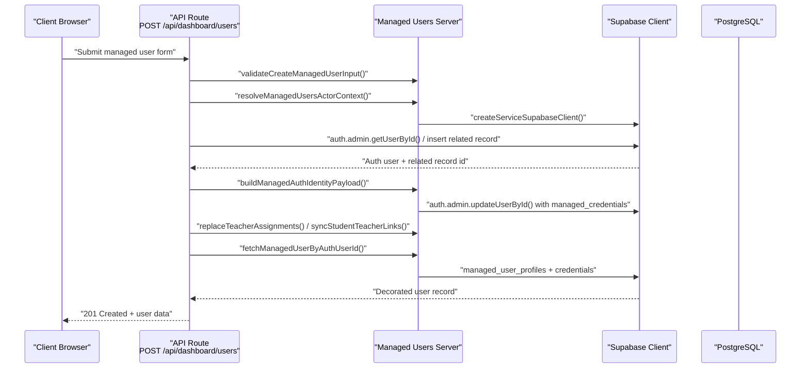
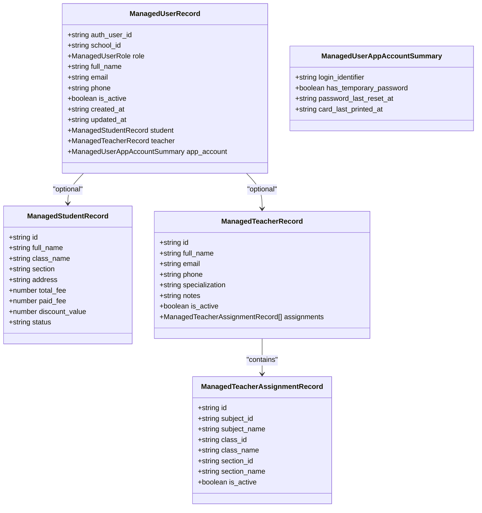
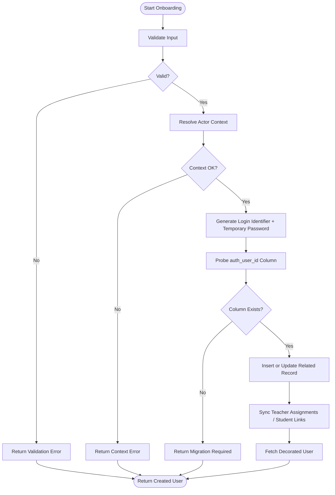
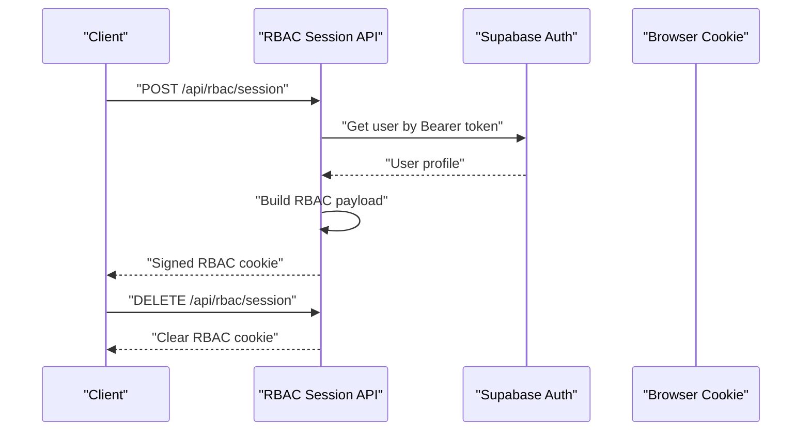
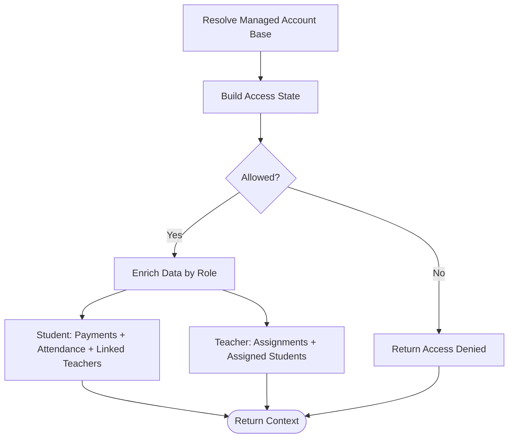
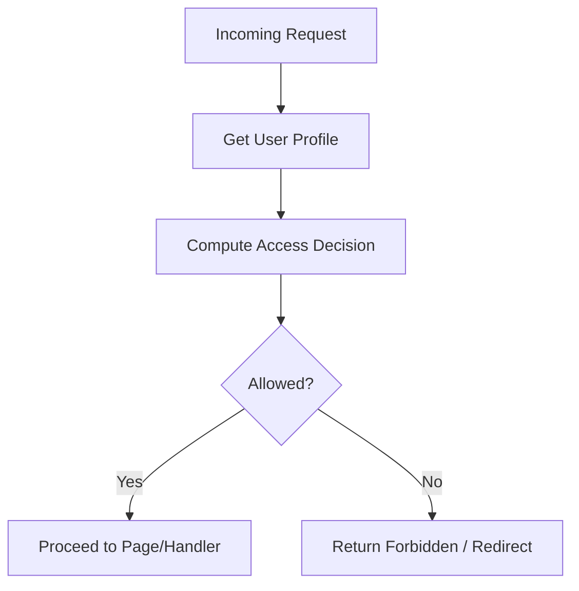
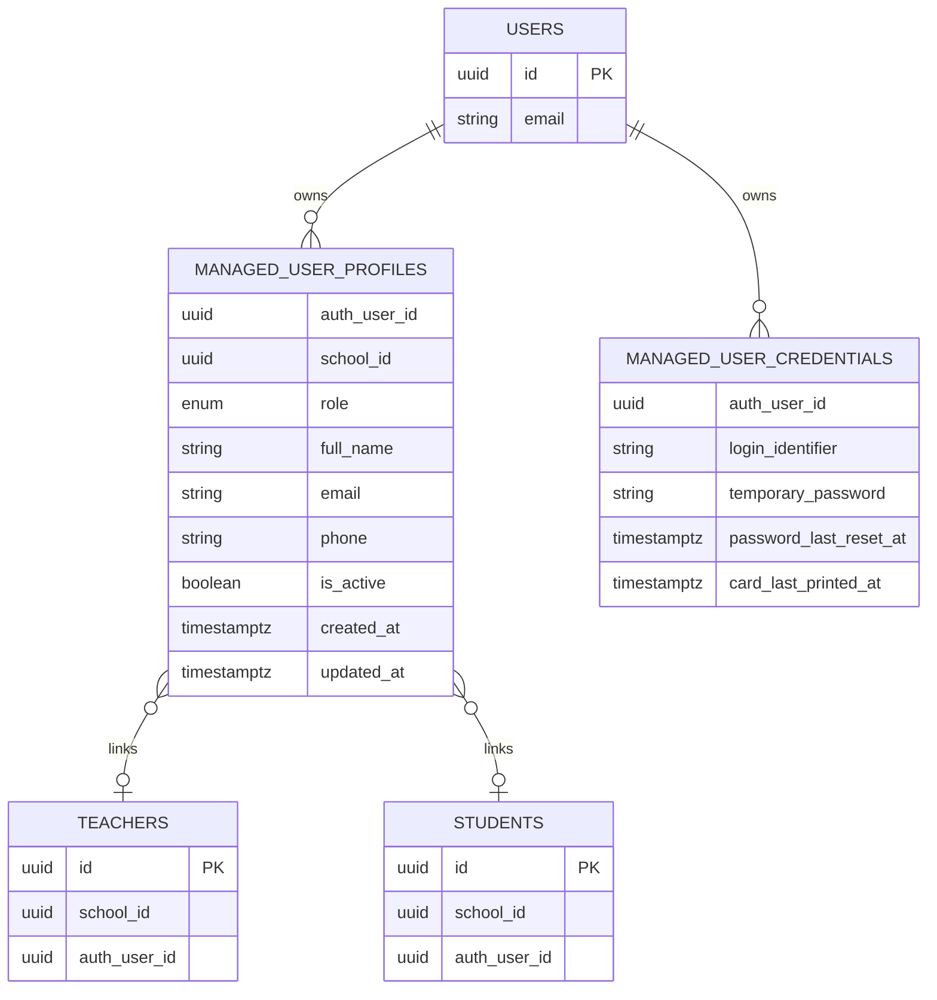
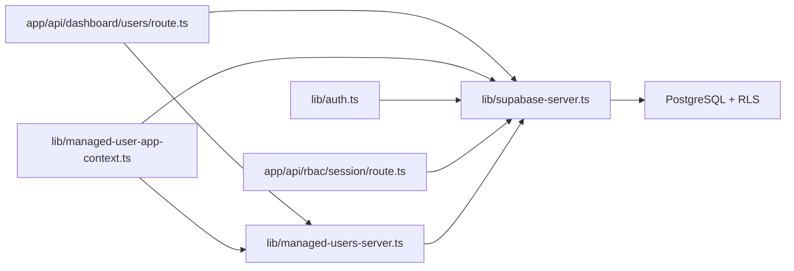

# Managed Users

<cite>
**Referenced Files in This Document**
- [lib/managed-users.ts](file://lib/managed-users.ts)
- [lib/managed-users-server.ts](file://lib/managed-users-server.ts)
- [lib/managed-user-app-context.ts](file://lib/managed-user-app-context.ts)
- [lib/auth.ts](file://lib/auth.ts)
- [types/roles.ts](file://types/roles.ts)
- [lib/supabase-server.ts](file://lib/supabase-server.ts)
- [app/api/dashboard/users/route.ts](file://app/api/dashboard/users/route.ts)
- [app/api/rbac/session/route.ts](file://app/api/rbac/session/route.ts)
- [migrations/20260322_managed_mobile_rls.sql](file://migrations/20260322_managed_mobile_rls.sql)
- [migrations/20260323_010000_managed_account_schema_backfill.sql](file://migrations/20260323_010000_managed_account_schema_backfill.sql)
</cite>

## Table of Contents
1. [Introduction](#introduction)
2. [Project Structure](#project-structure)
3. [Core Components](#core-components)
4. [Architecture Overview](#architecture-overview)
5. [Detailed Component Analysis](#detailed-component-analysis)
6. [Dependency Analysis](#dependency-analysis)
7. [Performance Considerations](#performance-considerations)
8. [Troubleshooting Guide](#troubleshooting-guide)
9. [Conclusion](#conclusion)

## Introduction
This document explains the managed user system for teachers and students, focusing on profile management, credential handling, and access permissions. It covers the teacher onboarding workflow (registration, profile setup, role assignment), credential management and authentication integration, and the managed user context supporting multi-school access, branch-level permissions, and hierarchical role management. Practical scenarios and workflows are included, along with troubleshooting guidance for common issues such as credential conflicts, permission inheritance, and user provisioning.

## Project Structure
The managed user system spans TypeScript libraries, Next.js API routes, Supabase integration, and PostgreSQL Row Level Security (RLS) policies. Key areas:
- Data models and validation for managed users
- Server-side orchestration for onboarding, linking, and credential updates
- Application context builder for student and teacher dashboards
- Authentication and RBAC session management
- Role-based access control (RBAC) and route protection
- Database RLS policies for multi-school and admin scoping

**Diagram sources**
- [app/api/dashboard/users/route.ts](file://app/api/dashboard/users/route.ts)
- [lib/managed-users-server.ts](file://lib/managed-users-server.ts)
- [lib/managed-users.ts](file://lib/managed-users.ts)
- [lib/managed-user-app-context.ts](file://lib/managed-user-app-context.ts)
- [lib/auth.ts](file://lib/auth.ts)
- [app/api/rbac/session/route.ts](file://app/api/rbac/session/route.ts)
- [lib/supabase-server.ts](file://lib/supabase-server.ts)
- [migrations/20260322_managed_mobile_rls.sql](file://migrations/20260322_managed_mobile_rls.sql)
- [migrations/20260323_010000_managed_account_schema_backfill.sql](file://migrations/20260323_010000_managed_account_schema_backfill.sql)

**Section sources**
- [lib/managed-users.ts](file://lib/managed-users.ts)
- [lib/managed-users-server.ts](file://lib/managed-users-server.ts)
- [lib/managed-user-app-context.ts](file://lib/managed-user-app-context.ts)
- [lib/auth.ts](file://lib/auth.ts)
- [types/roles.ts](file://types/roles.ts)
- [lib/supabase-server.ts](file://lib/supabase-server.ts)
- [app/api/dashboard/users/route.ts](file://app/api/dashboard/users/route.ts)
- [app/api/rbac/session/route.ts](file://app/api/rbac/session/route.ts)
- [migrations/20260322_managed_mobile_rls.sql](file://migrations/20260322_managed_mobile_rls.sql)
- [migrations/20260323_010000_managed_account_schema_backfill.sql](file://migrations/20260323_010000_managed_account_schema_backfill.sql)

## Core Components
- Managed user data model and validation:
  - Defines roles, fields, and normalization/validation for student and teacher records, including teacher assignments and credential summaries.
- Managed user server utilities:
  - Actor context resolution, schema capability probing, credential metadata patching, and managed account decoration.
- Application context builder:
  - Builds the managed user app context including access state, linkage, profile, and role-specific data for students and teachers.
- Authentication and RBAC:
  - Session initialization via API, cookie signing/verification, and client helpers for RBAC session lifecycle.
- Role-based access control:
  - Role definitions, permission groups, route access rules, and sidebar navigation mapping.
- Supabase integration:
  - Route and service clients, bearer token extraction, and authenticated user retrieval.
- Database RLS:
  - Policies enabling multi-school scoping and admin-level checks for managed user profiles and credentials.

**Section sources**
- [lib/managed-users.ts](file://lib/managed-users.ts)
- [lib/managed-users-server.ts](file://lib/managed-users-server.ts)
- [lib/managed-user-app-context.ts](file://lib/managed-user-app-context.ts)
- [lib/auth.ts](file://lib/auth.ts)
- [types/roles.ts](file://types/roles.ts)
- [lib/supabase-server.ts](file://lib/supabase-server.ts)
- [migrations/20260322_managed_mobile_rls.sql](file://migrations/20260322_managed_mobile_rls.sql)
- [migrations/20260323_010000_managed_account_schema_backfill.sql](file://migrations/20260323_010000_managed_account_schema_backfill.sql)

## Architecture Overview
The managed user system integrates client-side pages, server-side API routes, and Supabase for authentication and data persistence. RLS policies ensure that administrative actions are scoped to the current school and role. The server orchestrates onboarding, credential metadata updates, and cross-record linking.

**Diagram sources**
- [app/api/dashboard/users/route.ts](file://app/api/dashboard/users/route.ts)
- [lib/managed-users-server.ts](file://lib/managed-users-server.ts)
- [lib/supabase-server.ts](file://lib/supabase-server.ts)

**Section sources**
- [app/api/dashboard/users/route.ts](file://app/api/dashboard/users/route.ts)
- [lib/managed-users-server.ts](file://lib/managed-users-server.ts)
- [lib/supabase-server.ts](file://lib/supabase-server.ts)

## Detailed Component Analysis

### Managed User Data Model and Validation
- Roles and fields:
  - Supports "student" and "teacher" roles with distinct payloads for profile, student, and teacher records.
  - Includes teacher assignments with deduplication and normalization.
- Validation:
  - Validates required fields, email format, money values, and teacher assignments.
  - Provides separate validators for create vs update operations.

**Diagram sources**
- [lib/managed-users.ts](file://lib/managed-users.ts)

**Section sources**
- [lib/managed-users.ts](file://lib/managed-users.ts)

### Managed User Onboarding Workflow
- Input validation and normalization:
  - Uses validator functions to normalize and validate incoming payloads.
- Actor context resolution:
  - Ensures the acting user has sufficient role and school scope.
- Credential generation:
  - Generates login identifiers and temporary passwords when needed.
- Related record creation/linking:
  - Creates or reuses student/teacher records and links them to the auth user.
- Assignment and linkage synchronization:
  - Updates teacher assignments and student-teacher links.
- Decorated user retrieval:
  - Returns a decorated user record enriched with credentials and assignments.

**Diagram sources**
- [app/api/dashboard/users/route.ts](file://app/api/dashboard/users/route.ts)
- [lib/managed-users-server.ts](file://lib/managed-users-server.ts)

**Section sources**
- [app/api/dashboard/users/route.ts](file://app/api/dashboard/users/route.ts)
- [lib/managed-users-server.ts](file://lib/managed-users-server.ts)

### Credential Management and Authentication Integration
- Credential metadata:
  - Stores login identifier, temporary password, and timestamps in auth user metadata under managed_credentials.
- Metadata patching:
  - Updates app_metadata and user_metadata atomically via Supabase admin APIs.
- Session-based RBAC:
  - Initializes and refreshes a signed RBAC session cookie after successful authentication.
- Client helpers:
  - Provides functions to refresh or clear RBAC session cookies and sign out.

**Diagram sources**
- [app/api/rbac/session/route.ts](file://app/api/rbac/session/route.ts)
- [lib/auth.ts](file://lib/auth.ts)
- [lib/rbac-session.ts](file://lib/rbac-session.ts)

**Section sources**
- [lib/managed-users-server.ts](file://lib/managed-users-server.ts)
- [app/api/rbac/session/route.ts](file://app/api/rbac/session/route.ts)
- [lib/auth.ts](file://lib/auth.ts)

### Managed User Context and Multi-School Access
- Identity and linkage:
  - Resolves managed account identity, linkage status, and role.
- Access state:
  - Determines whether the account can access the app based on role, school scope, and linked record status.
- Data enrichment:
  - For students: payment summary, attendance summary, and linked teachers.
  - For teachers: assignments and assigned students.
- Branch-level permissions:
  - Admins may be scoped to specific branches via admin_branch_scopes.

**Diagram sources**
- [lib/managed-user-app-context.ts](file://lib/managed-user-app-context.ts)
- [lib/managed-users-server.ts](file://lib/managed-users-server.ts)

**Section sources**
- [lib/managed-user-app-context.ts](file://lib/managed-user-app-context.ts)
- [lib/managed-users-server.ts](file://lib/managed-users-server.ts)

### Role-Based Access Control and Route Protection
- Roles and permissions:
  - Defines roles (super_admin, admin, employee) and permission groups.
- Route access rules:
  - Maps path prefixes to allowed roles and optional read-only roles.
- Permission rules:
  - Some routes require specific permissions (e.g., view/edit students/payments).
- Access decision:
  - Computes allow/deny decisions based on role, permissions, and school/subscription status.

**Diagram sources**
- [lib/auth.ts](file://lib/auth.ts)
- [types/roles.ts](file://types/roles.ts)

**Section sources**
- [lib/auth.ts](file://lib/auth.ts)
- [types/roles.ts](file://types/roles.ts)

### Database RLS and Policy Scoping
- Managed user profiles and credentials:
  - Enable RLS and define policies allowing super_admin or admin scoped to current school.
- Self-select policy:
  - Authenticated users can select their own managed profile.
- Function grants:
  - Functions for current managed role, school ID, and access checks are granted to authenticated users.

**Diagram sources**
- [migrations/20260322_managed_mobile_rls.sql](file://migrations/20260322_managed_mobile_rls.sql)
- [migrations/20260323_010000_managed_account_schema_backfill.sql](file://migrations/20260323_010000_managed_account_schema_backfill.sql)

**Section sources**
- [migrations/20260322_managed_mobile_rls.sql](file://migrations/20260322_managed_mobile_rls.sql)
- [migrations/20260323_010000_managed_account_schema_backfill.sql](file://migrations/20260323_010000_managed_account_schema_backfill.sql)

## Dependency Analysis
- Component coupling:
  - API routes depend on managed user server utilities and Supabase clients.
  - Application context depends on managed user server utilities and service Supabase client.
  - Authentication and RBAC depend on Supabase auth admin APIs and cookie signing.
- External dependencies:
  - Supabase for authentication, admin operations, and database queries.
  - PostgreSQL RLS for enforcing multi-school and role-based access.
- Potential circular dependencies:
  - None observed among the focused modules.

**Diagram sources**
- [app/api/dashboard/users/route.ts](file://app/api/dashboard/users/route.ts)
- [lib/managed-users-server.ts](file://lib/managed-users-server.ts)
- [lib/managed-user-app-context.ts](file://lib/managed-user-app-context.ts)
- [lib/auth.ts](file://lib/auth.ts)
- [app/api/rbac/session/route.ts](file://app/api/rbac/session/route.ts)
- [lib/supabase-server.ts](file://lib/supabase-server.ts)

**Section sources**
- [app/api/dashboard/users/route.ts](file://app/api/dashboard/users/route.ts)
- [lib/managed-users-server.ts](file://lib/managed-users-server.ts)
- [lib/managed-user-app-context.ts](file://lib/managed-user-app-context.ts)
- [lib/auth.ts](file://lib/auth.ts)
- [app/api/rbac/session/route.ts](file://app/api/rbac/session/route.ts)
- [lib/supabase-server.ts](file://lib/supabase-server.ts)

## Performance Considerations
- Caching:
  - Schema capability probing and credential metadata lookups use in-memory caches with TTL to reduce repeated database calls.
- Batch operations:
  - Decorated user retrieval and credential fetching use Promise.all to parallelize queries.
- Pagination and filtering:
  - API routes support pagination and teacher-scoped filtering to limit result sets.
- Recommendations:
  - Monitor cache hit rates for credential metadata and schema capabilities.
  - Consider indexing frequently filtered columns (e.g., school_id, role, is_active) in managed_user_profiles.

[No sources needed since this section provides general guidance]

## Troubleshooting Guide
- Credential conflicts:
  - Symptom: Duplicate managed login identifier or conflicting auth metadata.
  - Resolution: Ensure unique login identifiers and verify managed_credentials updates via patchManagedCredentialMetadata.
- Permission inheritance:
  - Symptom: Unexpected access denied errors.
  - Resolution: Verify role-to-permission mapping and route permission rules; confirm school subscription status and expiry.
- User provisioning:
  - Symptom: Onboarding fails due to missing auth_user_id column.
  - Resolution: Run migrations to add auth_user_id to students/teachers tables; retry onboarding.
- Access state issues:
  - Symptom: Managed account marked inactive or missing linked record.
  - Resolution: Check managed profile and linked record statuses; ensure teacher is_active and student status allows app access.

**Section sources**
- [lib/managed-users-server.ts](file://lib/managed-users-server.ts)
- [lib/managed-user-app-context.ts](file://lib/managed-user-app-context.ts)
- [lib/auth.ts](file://lib/auth.ts)
- [types/roles.ts](file://types/roles.ts)
- [app/api/dashboard/users/route.ts](file://app/api/dashboard/users/route.ts)

## Conclusion
The managed user system provides a robust foundation for teacher and student onboarding, credential management, and role-based access control. It leverages Supabase authentication, service roles, and PostgreSQL RLS to enforce multi-school scoping and admin privileges. The APIs and libraries are structured to support scalable provisioning, permission enforcement, and contextual data enrichment for both students and teachers.