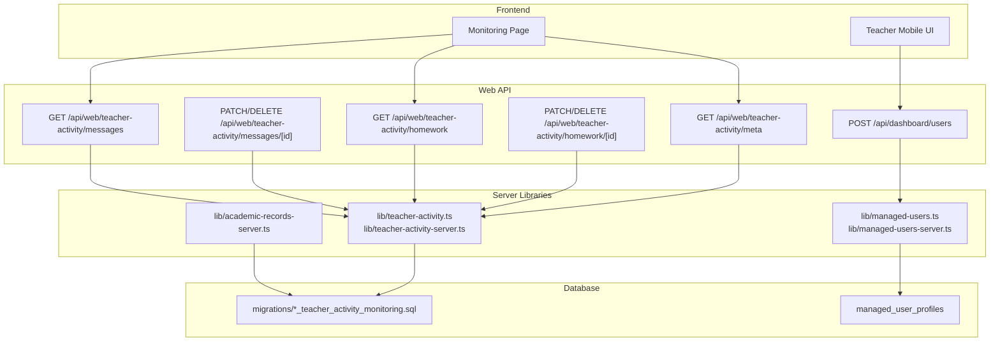
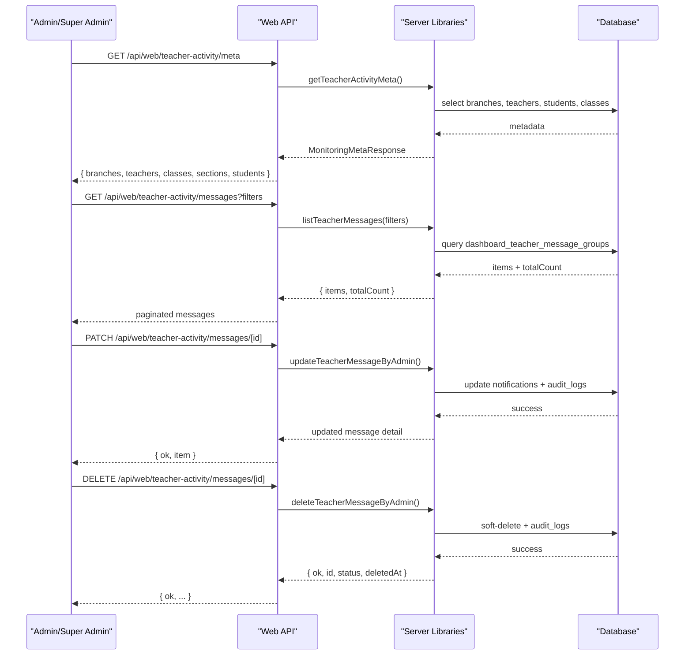
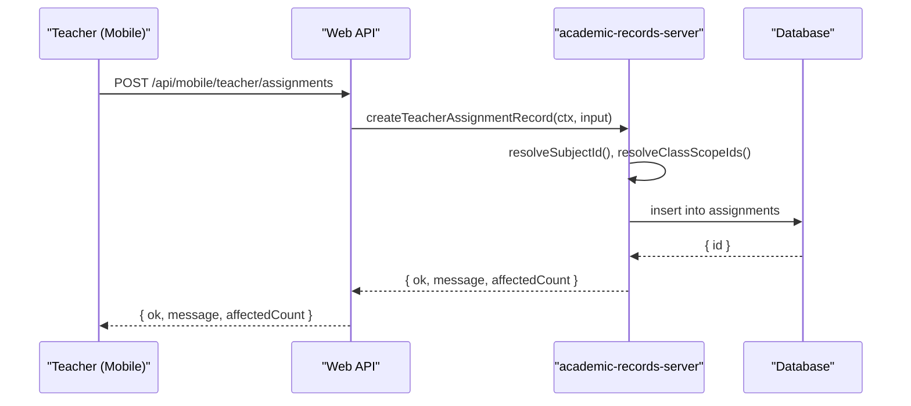
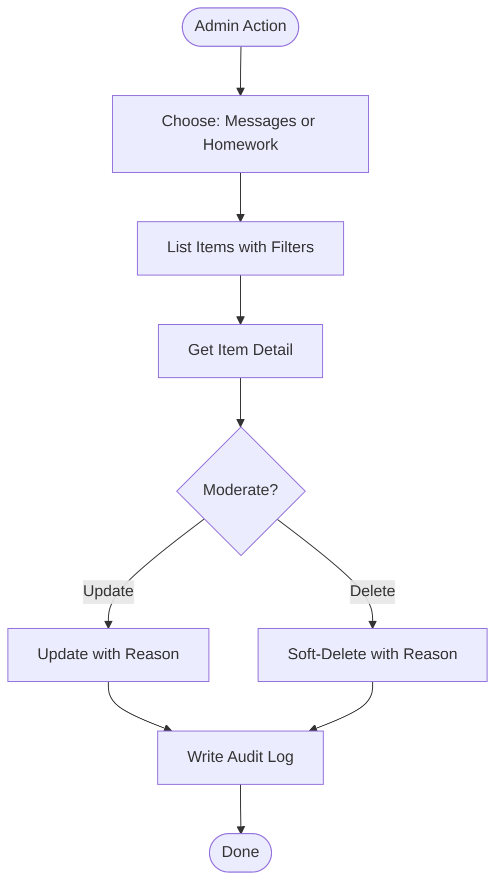
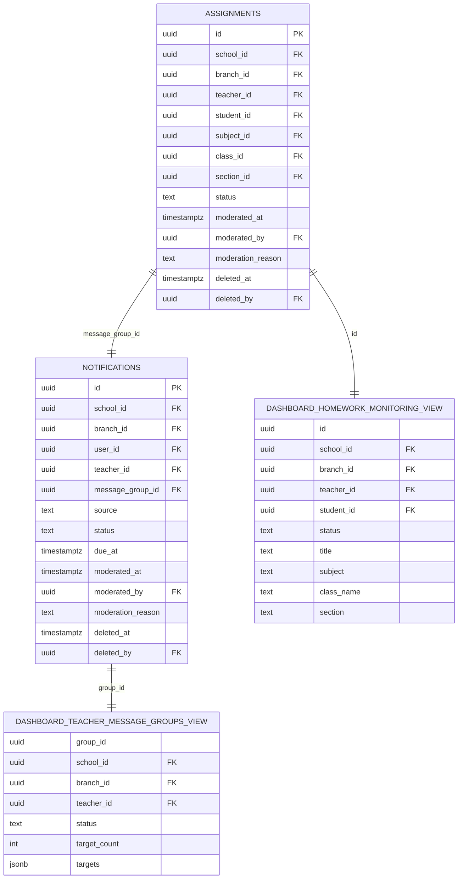
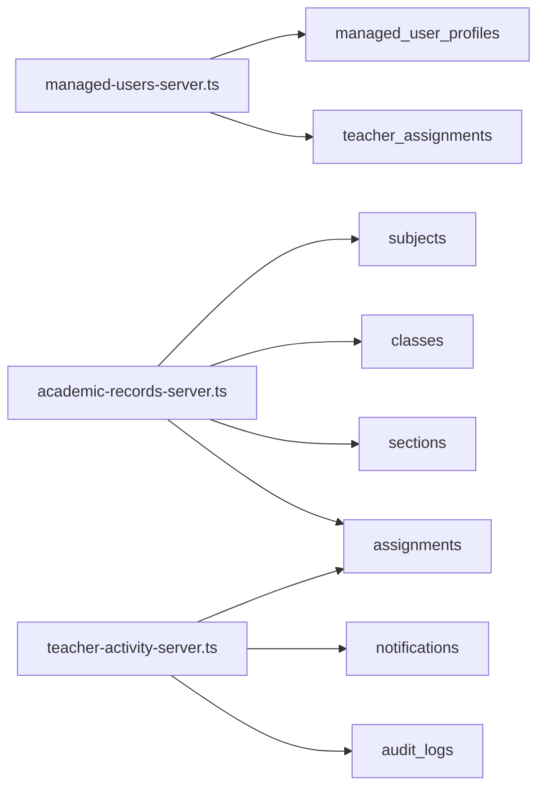

# Teacher Management

<cite>
**Referenced Files in This Document**
- [lib/managed-users.ts](file://lib/managed-users.ts)
- [lib/managed-users-server.ts](file://lib/managed-users-server.ts)
- [app/api/dashboard/users/route.ts](file://app/api/dashboard/users/route.ts)
- [migrations/20260323_010000_managed_account_schema_backfill.sql](file://migrations/20260323_010000_managed_account_schema_backfill.sql)
- [lib/academic-records-server.ts](file://lib/academic-records-server.ts)
- [app/api/mobile/teacher/assignments/route.ts](file://app/api/mobile/teacher/assignments/route.ts)
- [migrations/20260329_000000_teacher_activity_monitoring.sql](file://migrations/20260329_000000_teacher_activity_monitoring.sql)
- [lib/teacher-activity.ts](file://lib/teacher-activity.ts)
- [lib/teacher-activity-server.ts](file://lib/teacher-activity-server.ts)
- [app/api/web/teacher-activity/meta/route.ts](file://app/api/web/teacher-activity/meta/route.ts)
- [app/api/web/teacher-activity/messages/route.ts](file://app/api/web/teacher-activity/messages/route.ts)
- [app/api/web/teacher-activity/messages/[id]/route.ts](file://app/api/web/teacher-activity/messages/[id]/route.ts)
- [app/api/web/teacher-activity/homework/route.ts](file://app/api/web/teacher-activity/homework/route.ts)
- [app/api/web/teacher-activity/homework/[id]/route.ts](file://app/api/web/teacher-activity/homework/[id]/route.ts)
- [app/[locale]/monitoring/page.tsx](file://app/[locale]/monitoring/page.tsx)
</cite>

## Table of Contents
1. [Introduction](#introduction)
2. [Project Structure](#project-structure)
3. [Core Components](#core-components)
4. [Architecture Overview](#architecture-overview)
5. [Detailed Component Analysis](#detailed-component-analysis)
6. [Dependency Analysis](#dependency-analysis)
7. [Performance Considerations](#performance-considerations)
8. [Troubleshooting Guide](#troubleshooting-guide)
9. [Conclusion](#conclusion)
10. [Appendices](#appendices)

## Introduction
This document describes the teacher management system with a focus on teacher assignment management and activity monitoring. It explains how teachers are assigned to classes and subjects, how workload is distributed, and how teacher activities (messages and homework) are monitored, moderated, and audited. It also documents the managed user system that supports teacher profiles, credentials, and access permissions, and outlines onboarding workflows, scheduling, and performance analytics capabilities.

## Project Structure
The teacher management system spans several layers:
- Managed user profiles and credentials for teachers and students
- Assignment creation and scoping for teachers
- Activity monitoring for teacher messages and homework
- Audit logging for moderation actions
- Web and mobile API endpoints for CRUD operations and filtering

**Diagram sources**
- [app/api/web/teacher-activity/meta/route.ts:1-23](file://app/api/web/teacher-activity/meta/route.ts#L1-L23)
- [app/api/web/teacher-activity/messages/route.ts:1-20](file://app/api/web/teacher-activity/messages/route.ts#L1-L20)
- [app/api/web/teacher-activity/messages/[id]/route.ts](file://app/api/web/teacher-activity/messages/[id]/route.ts#L1-L83)
- [app/api/web/teacher-activity/homework/route.ts:1-20](file://app/api/web/teacher-activity/homework/route.ts#L1-L20)
- [app/api/web/teacher-activity/homework/[id]/route.ts](file://app/api/web/teacher-activity/homework/[id]/route.ts#L1-L83)
- [app/api/dashboard/users/route.ts:1046-1096](file://app/api/dashboard/users/route.ts#L1046-L1096)
- [lib/managed-users.ts:1-375](file://lib/managed-users.ts#L1-L375)
- [lib/managed-users-server.ts:1061-1114](file://lib/managed-users-server.ts#L1061-L1114)
- [lib/academic-records-server.ts:509-684](file://lib/academic-records-server.ts#L509-L684)
- [lib/teacher-activity.ts:1-404](file://lib/teacher-activity.ts#L1-L404)
- [lib/teacher-activity-server.ts:361-743](file://lib/teacher-activity-server.ts#L361-L743)
- [migrations/20260329_000000_teacher_activity_monitoring.sql:1-501](file://migrations/20260329_000000_teacher_activity_monitoring.sql#L1-L501)
- [migrations/20260323_010000_managed_account_schema_backfill.sql:39-71](file://migrations/20260323_010000_managed_account_schema_backfill.sql#L39-L71)

**Section sources**
- [app/[locale]/monitoring/page.tsx](file://app/[locale]/monitoring/page.tsx#L541-L567)
- [migrations/20260329_000000_teacher_activity_monitoring.sql:1-501](file://migrations/20260329_000000_teacher_activity_monitoring.sql#L1-L501)

## Core Components
- Managed user profiles and credentials:
  - Defines teacher and student records, validation, and normalized inputs.
  - Supports creating and updating managed accounts with assignments and credentials.
- Teacher assignment management:
  - Resolves subjects, classes, and sections to assignment records.
  - Supports replacing teacher assignments and building legacy “classes taught” summaries.
- Activity monitoring:
  - Lists and details teacher messages and homework with moderation controls.
  - Provides metadata and audit trails for administrative actions.
- Database schema:
  - Adds status, moderation, and branch scoping to assignments and notifications.
  - Creates views for monitoring dashboards and admin scopes.

**Section sources**
- [lib/managed-users.ts:1-375](file://lib/managed-users.ts#L1-L375)
- [lib/managed-users-server.ts:1061-1114](file://lib/managed-users-server.ts#L1061-L1114)
- [lib/academic-records-server.ts:509-684](file://lib/academic-records-server.ts#L509-L684)
- [lib/teacher-activity.ts:1-404](file://lib/teacher-activity.ts#L1-L404)
- [lib/teacher-activity-server.ts:361-743](file://lib/teacher-activity-server.ts#L361-L743)
- [migrations/20260329_000000_teacher_activity_monitoring.sql:1-501](file://migrations/20260329_000000_teacher_activity_monitoring.sql#L1-L501)

## Architecture Overview
The system integrates teacher onboarding, assignment scheduling, and activity monitoring with robust moderation and audit capabilities.

**Diagram sources**
- [app/api/web/teacher-activity/meta/route.ts:1-23](file://app/api/web/teacher-activity/meta/route.ts#L1-L23)
- [app/api/web/teacher-activity/messages/route.ts:1-20](file://app/api/web/teacher-activity/messages/route.ts#L1-L20)
- [app/api/web/teacher-activity/messages/[id]/route.ts](file://app/api/web/teacher-activity/messages/[id]/route.ts#L1-L83)
- [lib/teacher-activity-server.ts:361-743](file://lib/teacher-activity-server.ts#L361-L743)
- [migrations/20260329_000000_teacher_activity_monitoring.sql:413-458](file://migrations/20260329_000000_teacher_activity_monitoring.sql#L413-L458)

## Detailed Component Analysis

### Managed User System (Teacher Profiles, Credentials, Permissions)
- Data model:
  - Managed user record includes role, profile, and optional teacher/student details.
  - Teacher assignment records define subject/class/section scope and activation status.
- Validation and normalization:
  - Validates required fields, emails, passwords, and money values.
  - Normalizes teacher assignments and de-duplicates entries.
- Onboarding and updates:
  - On successful managed user creation, replaces teacher assignments atomically.
  - Syncs student-teacher links when applicable.

```mermaid
classDiagram
class ManagedUserRecord {
+string auth_user_id
+string school_id
+string role
+string full_name
+string email
+string? phone
+boolean is_active
+string? created_at
+string? updated_at
+ManagedStudentRecord? student
+ManagedTeacherRecord? teacher
+ManagedUserAppAccountSummary? app_account
}
class ManagedTeacherRecord {
+string id
+string? full_name
+string? email
+string? phone
+string? specialization
+string? notes
+boolean? is_active
+ManagedTeacherAssignmentRecord[] assignments
}
class ManagedTeacherAssignmentRecord {
+string id
+string? subject_id
+string subject_name
+string? class_id
+string class_name
+string? section_id
+string? section_name
+boolean is_active
}
class ManagedUserInput {
+string? school_id
+string role
+string full_name
+string email
+string? phone
+boolean is_active
+ManagedStudentInput? student
+ManagedTeacherInput? teacher
}
class ManagedTeacherInput {
+string? specialization
+string? notes
+ManagedTeacherAssignmentInput[] assignments
}
ManagedUserRecord --> ManagedTeacherRecord : "optional"
ManagedTeacherRecord --> ManagedTeacherAssignmentRecord : "has many"
```

**Diagram sources**
- [lib/managed-users.ts:1-375](file://lib/managed-users.ts#L1-L375)

**Section sources**
- [lib/managed-users.ts:1-375](file://lib/managed-users.ts#L1-L375)
- [app/api/dashboard/users/route.ts:1046-1096](file://app/api/dashboard/users/route.ts#L1046-L1096)
- [migrations/20260323_010000_managed_account_schema_backfill.sql:39-71](file://migrations/20260323_010000_managed_account_schema_backfill.sql#L39-L71)

### Teacher Assignment Management (Class Assignments, Subject Teaching, Workload Distribution)
- Assignment creation:
  - Teachers can create assignments with title, description, subject, class/section, due date, and attachments.
  - Scope resolution ensures subject/class/section exist and match teacher’s assignments.
- Assignment replacement:
  - Replaces all existing teacher assignments for a school with new ones.
  - Supports legacy “classes taught” migration path.
- Class/section resolution:
  - Resolves class and section IDs with fallbacks and validation.

**Diagram sources**
- [app/api/mobile/teacher/assignments/route.ts:1-42](file://app/api/mobile/teacher/assignments/route.ts#L1-L42)
- [lib/academic-records-server.ts:509-684](file://lib/academic-records-server.ts#L509-L684)
- [migrations/20260329_000000_teacher_activity_monitoring.sql:460-498](file://migrations/20260329_000000_teacher_activity_monitoring.sql#L460-L498)

**Section sources**
- [lib/academic-records-server.ts:509-684](file://lib/academic-records-server.ts#L509-L684)
- [lib/managed-users-server.ts:1715-1774](file://lib/managed-users-server.ts#L1715-L1774)
- [lib/managed-users-server.ts:2015-2061](file://lib/managed-users-server.ts#L2015-L2061)
- [app/api/mobile/teacher/assignments/route.ts:1-42](file://app/api/mobile/teacher/assignments/route.ts#L1-L42)

### Teacher Activity Monitoring (Content Moderation, Performance Tracking, Activity Logging)
- Message monitoring:
  - Lists teacher broadcast messages with filters and pagination.
  - Updates/deletes messages with moderation reasons and audit trail.
- Homework monitoring:
  - Lists teacher-created assignments with filters and pagination.
  - Updates/deletes assignments with moderation reasons and audit trail.
- Metadata and scope:
  - Provides branches, teachers, classes, sections, and students for filtering.
  - Applies branch-level scoping for admins and super admins.

**Diagram sources**
- [lib/teacher-activity-server.ts:451-743](file://lib/teacher-activity-server.ts#L451-L743)
- [lib/teacher-activity.ts:248-282](file://lib/teacher-activity.ts#L248-L282)
- [app/api/web/teacher-activity/messages/[id]/route.ts](file://app/api/web/teacher-activity/messages/[id]/route.ts#L1-L83)
- [app/api/web/teacher-activity/homework/[id]/route.ts](file://app/api/web/teacher-activity/homework/[id]/route.ts#L1-L83)

**Section sources**
- [lib/teacher-activity.ts:1-404](file://lib/teacher-activity.ts#L1-L404)
- [lib/teacher-activity-server.ts:361-743](file://lib/teacher-activity-server.ts#L361-L743)
- [app/api/web/teacher-activity/meta/route.ts:1-23](file://app/api/web/teacher-activity/meta/route.ts#L1-L23)
- [app/api/web/teacher-activity/messages/route.ts:1-20](file://app/api/web/teacher-activity/messages/route.ts#L1-L20)
- [app/api/web/teacher-activity/homework/route.ts:1-20](file://app/api/web/teacher-activity/homework/route.ts#L1-L20)

### Database Schema and Views for Monitoring
- Status and moderation columns:
  - Adds status, moderation timestamps, and soft-deletion to assignments and notifications.
- Triggers and defaults:
  - Sets branch scope defaults and generates message group IDs.
- Views:
  - dashboard_teacher_message_groups aggregates teacher broadcasts.
  - dashboard_homework_monitoring exposes assignment details for monitoring.

**Diagram sources**
- [migrations/20260329_000000_teacher_activity_monitoring.sql:1-501](file://migrations/20260329_000000_teacher_activity_monitoring.sql#L1-L501)

**Section sources**
- [migrations/20260329_000000_teacher_activity_monitoring.sql:1-501](file://migrations/20260329_000000_teacher_activity_monitoring.sql#L1-L501)

## Dependency Analysis
- Managed users depend on managed user profiles and teacher assignment tables.
- Academic records depend on subjects, classes, sections, and assignments.
- Activity monitoring depends on notifications and assignments with status and moderation columns.
- Audit logs capture moderation actions for both messages and homework.

**Diagram sources**
- [lib/managed-users-server.ts:1061-1114](file://lib/managed-users-server.ts#L1061-L1114)
- [lib/academic-records-server.ts:272-443](file://lib/academic-records-server.ts#L272-L443)
- [lib/teacher-activity-server.ts:223-298](file://lib/teacher-activity-server.ts#L223-L298)
- [migrations/20260329_000000_teacher_activity_monitoring.sql:1-501](file://migrations/20260329_000000_teacher_activity_monitoring.sql#L1-L501)

**Section sources**
- [lib/managed-users-server.ts:1061-1114](file://lib/managed-users-server.ts#L1061-L1114)
- [lib/academic-records-server.ts:272-443](file://lib/academic-records-server.ts#L272-L443)
- [lib/teacher-activity-server.ts:223-298](file://lib/teacher-activity-server.ts#L223-L298)

## Performance Considerations
- Indexes on assignments and notifications support efficient filtering and sorting by status, branch, and timestamps.
- Pagination is enforced in monitoring APIs to limit payload sizes.
- Batch operations (e.g., replacing teacher assignments) minimize redundant writes.
- Audit logging is asynchronous via inserts and does not block primary operations.

[No sources needed since this section provides general guidance]

## Troubleshooting Guide
- Assignment creation fails:
  - Ensure subject/class/section exist and match teacher’s scope.
  - Verify assignments table columns and schema readiness.
- Message/homework moderation errors:
  - Check status constraints and moderation reasons.
  - Confirm branch scoping and admin permissions.
- Audit trail missing:
  - Verify audit_logs table exists and inserts succeed.

**Section sources**
- [lib/academic-records-server.ts:509-684](file://lib/academic-records-server.ts#L509-L684)
- [lib/teacher-activity-server.ts:548-685](file://lib/teacher-activity-server.ts#L548-L685)
- [migrations/20260329_000000_teacher_activity_monitoring.sql:1-501](file://migrations/20260329_000000_teacher_activity_monitoring.sql#L1-L501)

## Conclusion
The teacher management system provides a cohesive solution for onboarding teachers, assigning classes and subjects, distributing workload, and monitoring teacher activities with moderation and audit capabilities. The modular design separates concerns across managed users, academic records, and activity monitoring, while the database schema supports scalable filtering and reporting.

[No sources needed since this section summarizes without analyzing specific files]

## Appendices

### Practical Examples

- Teacher assignment management
  - Create an assignment for a specific class and section with a due date and optional attachment.
  - Replace a teacher’s assignments for a school to reflect schedule changes.
  - Example paths:
    - [app/api/mobile/teacher/assignments/route.ts:1-42](file://app/api/mobile/teacher/assignments/route.ts#L1-L42)
    - [lib/academic-records-server.ts:509-684](file://lib/academic-records-server.ts#L509-L684)
    - [lib/managed-users-server.ts:2015-2061](file://lib/managed-users-server.ts#L2015-L2061)

- Activity monitoring workflows
  - List teacher messages with filters (branch, teacher, status, date range).
  - Update or delete a message with a moderation reason; audit trail recorded.
  - Example paths:
    - [app/api/web/teacher-activity/messages/route.ts:1-20](file://app/api/web/teacher-activity/messages/route.ts#L1-L20)
    - [app/api/web/teacher-activity/messages/[id]/route.ts](file://app/api/web/teacher-activity/messages/[id]/route.ts#L1-L83)
    - [lib/teacher-activity-server.ts:548-685](file://lib/teacher-activity-server.ts#L548-L685)

- Performance evaluation processes
  - Use monitoring dashboards to review message and homework statuses.
  - Track moderation actions via audit logs.
  - Example paths:
    - [app/[locale]/monitoring/page.tsx](file://app/[locale]/monitoring/page.tsx#L541-L567)
    - [lib/teacher-activity-server.ts:223-298](file://lib/teacher-activity-server.ts#L223-L298)

### Integration Notes
- Class management integration:
  - Class and section resolution ensures assignments target valid scopes.
- Content moderation:
  - Status values and moderation fields enforce governance.
- Reporting systems:
  - Views aggregate messages and homework for reporting.

**Section sources**
- [lib/academic-records-server.ts:350-443](file://lib/academic-records-server.ts#L350-L443)
- [migrations/20260329_000000_teacher_activity_monitoring.sql:413-498](file://migrations/20260329_000000_teacher_activity_monitoring.sql#L413-L498)

### Common Scenarios and Strategies
- Assignment conflicts:
  - Resolve class/section mismatches and ensure subject/class/section exist.
- Performance improvement:
  - Monitor moderation trends and adjust teacher training or policies accordingly.
- Onboarding:
  - Validate teacher assignments during managed user creation and replace as needed.

**Section sources**
- [lib/managed-users-server.ts:1715-1774](file://lib/managed-users-server.ts#L1715-L1774)
- [app/api/dashboard/users/route.ts:1046-1096](file://app/api/dashboard/users/route.ts#L1046-L1096)