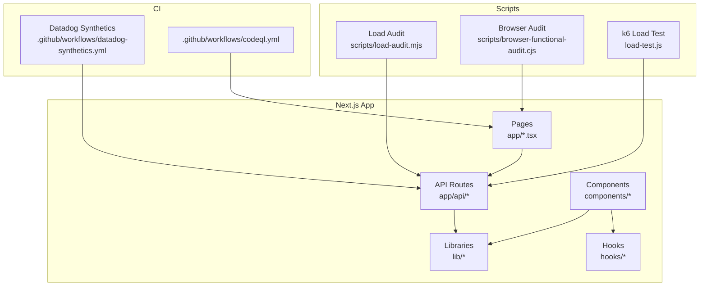
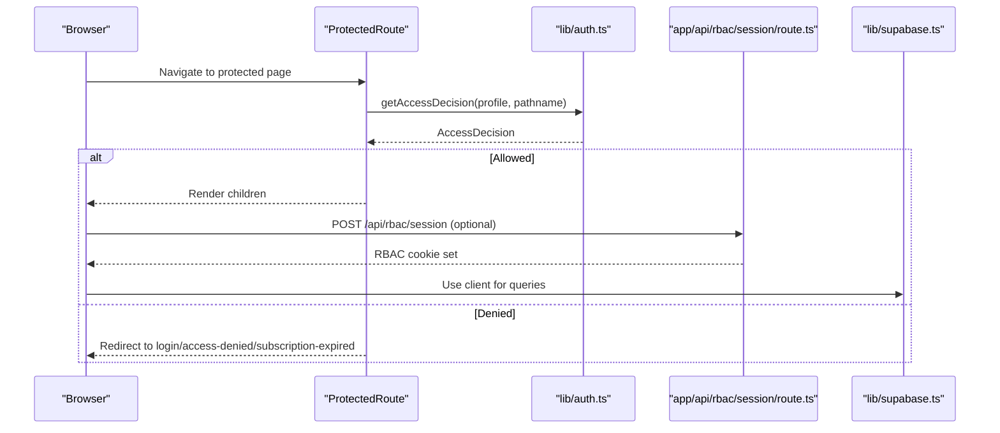
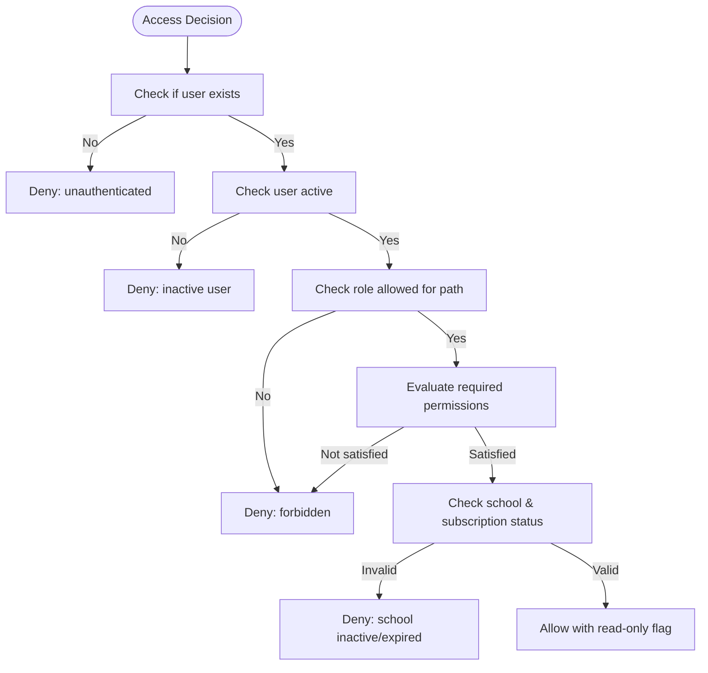
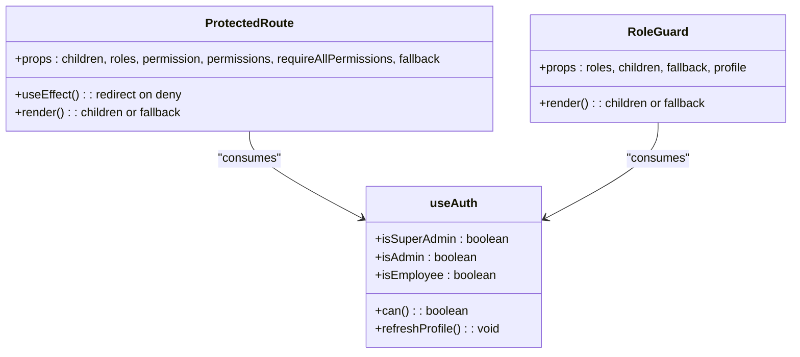
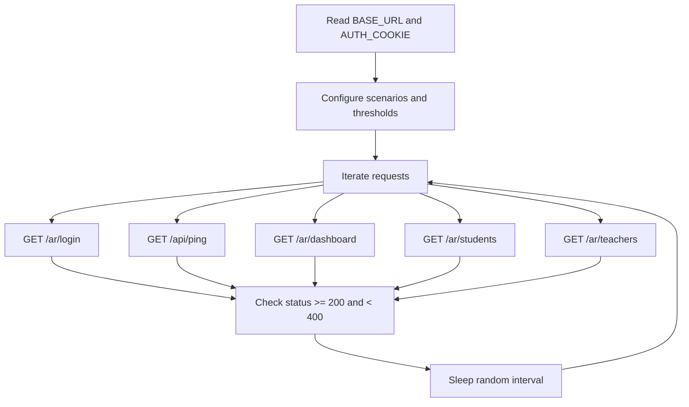
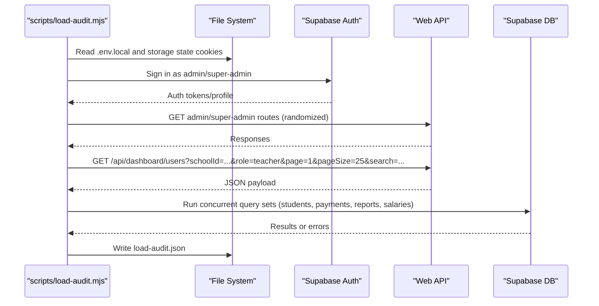
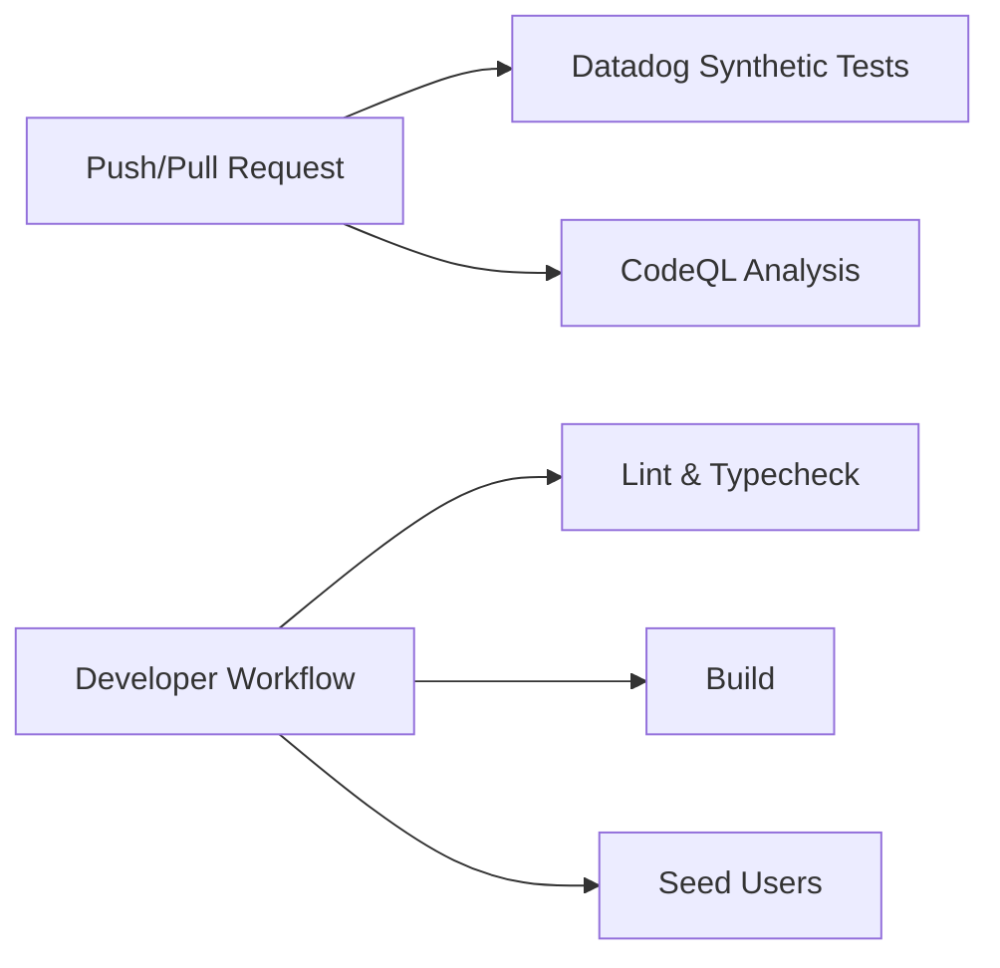
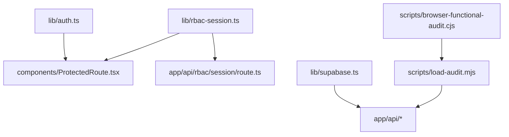

# Testing Strategy

<cite>
**Referenced Files in This Document**
- [load-test.js](file://load-test.js)
- [scripts/load-audit.mjs](file://scripts/load-audit.mjs)
- [scripts/browser-functional-audit.cjs](file://scripts/browser-functional-audit.cjs)
- [.github/workflows/datadog-synthetics.yml](file://.github/workflows/datadog-synthetics.yml)
- [.github/workflows/codeql.yml](file://.github/workflows/codeql.yml)
- [package.json](file://package.json)
- [lib/auth.ts](file://lib/auth.ts)
- [lib/rbac-session.ts](file://lib/rbac-session.ts)
- [hooks/useAuth.ts](file://hooks/useAuth.ts)
- [components/ProtectedRoute.tsx](file://components/ProtectedRoute.tsx)
- [components/RoleGuard.tsx](file://components/RoleGuard.tsx)
- [lib/supabase.ts](file://lib/supabase.ts)
- [app/api/rbac/session/route.ts](file://app/api/rbac/session/route.ts)
- [app/api/ping/route.ts](file://app/api/ping/route.ts)
- [app/login/page.tsx](file://app/login/page.tsx)
- [app/dashboard/page.tsx](file://app/dashboard/page.tsx)
- [app/students/page.tsx](file://app/students/page.tsx)
- [app/teachers/page.tsx](file://app/teachers/page.tsx)
- [app/api/web/students/list/route.ts](file://app/api/web/students/list/route.ts)
- [app/api/web/payments/overview/route.ts](file://app/api/web/payments/overview/route.ts)
- [app/api/web/reports/overview/route.ts](file://app/api/web/reports/overview/route.ts)
- [app/api/web/salaries/teachers/[teacherId]/route.ts](file://app/api/web/salaries/teachers/[teacherId]/route.ts)
- [app/api/web/super-admin/schools/[schoolId]/route.ts](file://app/api/web/super-admin/schools/[schoolId]/route.ts)
- [app/api/web/monitoring/branding/route.ts](file://app/api/web/monitoring/branding/route.ts)
- [app/api/web/schema-compat/route.ts](file://app/api/web/schema-compat/route.ts)
- [app/api/mobile/student/attendance/route.ts](file://app/api/mobile/student/attendance/route.ts)
- [app/api/mobile/teacher/grades/route.ts](file://app/api/mobile/teacher/grades/route.ts)
- [app/api/mobile/notifications/route.ts](file://app/api/mobile/notifications/route.ts)
- [app/api/mobile/session/route.ts](file://app/api/mobile/session/route.ts)
- [app/api/mobile/dashboard/route.ts](file://app/api/mobile/dashboard/route.ts)
- [app/api/web/dashboard/overview/route.ts](file://app/api/web/dashboard/overview/route.ts)
- [app/api/web/dashboard/branding/route.ts](file://app/api/web/dashboard/branding/route.ts)
- [app/api/web/payments/export/route.ts](file://app/api/web/payments/export/route.ts)
- [app/api/web/payments/archive/route.ts](file://app/api/web/payments/archive/route.ts)
- [app/api/web/payments/meta/route.ts](file://app/api/web/payments/meta/route.ts)
- [app/api/web/payments/records/[paymentId]/route.ts](file://app/api/web/payments/records/[paymentId]/route.ts)
- [app/api/web/payments/student-search/route.ts](file://app/api/web/payments/student-search/route.ts)
- [app/api/web/payments/students/[studentId]/route.ts](file://app/api/web/payments/students/[studentId]/route.ts)
- [app/api/web/reports/dataset/route.ts](file://app/api/web/reports/dataset/route.ts)
- [app/api/web/salaries/bootstrap/route.ts](file://app/api/web/salaries/bootstrap/route.ts)
- [app/api/web/salaries/deductions/route.ts](file://app/api/web/salaries/deductions/route.ts)
- [app/api/web/salaries/lectures/route.ts](file://app/api/web/salaries/lectures/route.ts)
- [app/api/web/salaries/pay/route.ts](file://app/api/web/salaries/pay/route.ts)
- [app/api/web/salaries/report/route.ts](file://app/api/web/salaries/report/route.ts)
- [app/api/web/salaries/teachers/route.ts](file://app/api/web/salaries/teachers/route.ts)
- [app/api/web/salaries/archive/route.ts](file://app/api/web/salaries/archive/route.ts)
- [app/api/web/fee-notifications/[id]/route.ts](file://app/api/web/fee-notifications/[id]/route.ts)
- [app/api/web/fee-notifications/route.ts](file://app/api/web/fee-notifications/route.ts)
- [app/api/web/teacher-activity/homework/route.ts](file://app/api/web/teacher-activity/homework/route.ts)
- [app/api/web/teacher-activity/messages/route.ts](file://app/api/web/teacher-activity/messages/route.ts)
- [app/api/web/teacher-activity/meta/route.ts](file://app/api/web/teacher-activity/meta/route.ts)
- [app/api/web/students/credential-cards/route.ts](file://app/api/web/students/credential-cards/route.ts)
- [app/api/web/students/demo-seed/route.ts](file://app/api/web/students/demo-seed/route.ts)
- [app/api/web/students/meta/route.ts](file://app/api/web/students/meta/route.ts)
- [app/api/web/super-admin/overview/route.ts](file://app/api/web/super-admin/overview/route.ts)
- [app/api/web/super-admin/subscriptions/[schoolId]/route.ts](file://app/api/web/super-admin/subscriptions/[schoolId]/route.ts)
- [app/api/web/super-admin/users/[userId]/route.ts](file://app/api/web/super-admin/users/[userId]/route.ts)
- [app/api/web/monitoring/overview/route.ts](file://app/api/web/monitoring/overview/route.ts)
- [app/api/web/monitoring/branding/route.ts](file://app/api/web/monitoring/branding/route.ts)
- [app/api/web/monitoring/schools/route.ts](file://app/api/web/monitoring/schools/route.ts)
- [app/api/web/monitoring/users/route.ts](file://app/api/web/monitoring/users/route.ts)
- [app/api/web/monitoring/teachers/route.ts](file://app/api/web/monitoring/teachers/route.ts)
- [app/api/web/monitoring/payments/route.ts](file://app/api/web/monitoring/overview/route.ts)
- [app/api/web/monitoring/payments/route.ts](file://app/api/web/monitoring/payments/route.ts)
- [app/api/web/monitoring/payments/route.ts](file://app/api/web/monitoring/payments/route.ts)
- [app/api/web/monitoring/payments/route.ts](file://app/api/web/monitoring/payments/route.ts)
- [app/api/web/monitoring/payments/route.ts](file://app/api/web/monitoring/payments/route.ts)
- [app/api/web/monitoring/payments/route.ts](file://app/api/web/monitoring/payments/route.ts)
- [app/api/web/monitoring/payments/route.ts](file://app/api/web/monitoring/payments/route.ts)
- [app/api/web/monitoring/payments/route.ts](file://app/api/web/monitoring/payments/route.ts)
- [app/api/web/monitoring/payments/route.ts](file://app/api/web/monitoring/payments/route.ts)
- [app/api/web/monitoring/payments/route.ts](file://app/api/web/monitoring/payments/route.ts)
- [app/api/web/monitoring/payments/route.ts](file://app/api/web/monitoring/payments/route.ts)
- [app/api/web/monitoring/payments/route.ts](file://app/api/web/monitoring/payments/route.ts)
- [app/api/web/monitoring/payments/route.ts](file://app/api/web/monitoring/payments/route.ts)
- [app/api/web/monitoring/payments/route.ts](file://app/api/web/monitoring/payments/route.ts)
- [app/api/web/monitoring/payments/route.ts](file://app/api/web/monitoring/payments/route.ts)
- [app/api/web/monitoring/payments/route.ts](file://app/api/web/monitoring/payments/route.ts)
- [app/api/web/monitoring/payments/route.ts](file://app/api/web/monitoring/payments/route.ts)
- [app/api/web/monitoring/payments/route.ts](file://app/api/web/monitoring/payments/route.ts)
- [app/api/web/monitoring/payments/route.ts](file://app/api/web/monitoring/payments/route.ts)
- [app/api......](file://app/api/web/monitoring/payments/route.ts)
</cite>

## Table of Contents
1. [Introduction](#introduction)
2. [Project Structure](#project-structure)
3. [Core Components](#core-components)
4. [Architecture Overview](#architecture-overview)
5. [Detailed Component Analysis](#detailed-component-analysis)
6. [Dependency Analysis](#dependency-analysis)
7. [Performance Considerations](#performance-considerations)
8. [Troubleshooting Guide](#troubleshooting-guide)
9. [Conclusion](#conclusion)
10. [Appendices](#appendices)

## Introduction
This document defines a comprehensive testing strategy for the Next.js application, covering unit testing, integration testing, and end-to-end testing. It explains the testing framework setup, test organization, automated testing procedures, and performance testing using k6 and Node.js scripts. It also documents authentication flows, API endpoint coverage, database operations via Supabase, and UI component protections. Multi-tenant scenarios, role-based access control (RBAC), and data isolation are addressed alongside internationalization and cross-browser compatibility considerations. Practical examples are provided through file paths to relevant source locations.

## Project Structure
The repository includes:
- Frontend Next.js application under the root app directory with API routes, pages, and shared components.
- Backend-like API routes organized under app/api for both web and mobile contexts.
- Authentication and RBAC utilities under lib and components for UI protection.
- Load testing and functional auditing scripts under scripts.
- GitHub Actions workflows for Datadog synthetic tests and CodeQL analysis.

**Diagram sources**
- [app/login/page.tsx](file://app/login/page.tsx)
- [app/api/rbac/session/route.ts](file://app/api/rbac/session/route.ts)
- [lib/auth.ts](file://lib/auth.ts)
- [lib/rbac-session.ts](file://lib/rbac-session.ts)
- [components/ProtectedRoute.tsx](file://components/ProtectedRoute.tsx)
- [scripts/load-audit.mjs](file://scripts/load-audit.mjs)
- [scripts/browser-functional-audit.cjs](file://scripts/browser-functional-audit.cjs)
- [load-test.js](file://load-test.js)
- [.github/workflows/datadog-synthetics.yml](file://.github/workflows/datadog-synthetics.yml)
- [.github/workflows/codeql.yml](file://.github/workflows/codeql.yml)

**Section sources**
- [package.json](file://package.json)
- [lib/supabase.ts](file://lib/supabase.ts)

## Core Components
- Authentication and RBAC:
  - User profile resolution, permission evaluation, and access decisions are implemented in [lib/auth.ts](file://lib/auth.ts).
  - RBAC session cookie signing and verification are handled in [lib/rbac-session.ts](file://lib/rbac-session.ts).
  - UI guards and route protection are provided by [components/ProtectedRoute.tsx](file://components/ProtectedRoute.tsx) and [components/RoleGuard.tsx](file://components/RoleGuard.tsx).
  - Client-side RBAC session initialization is performed by [lib/auth.ts](file://lib/auth.ts) via the RBAC API route [app/api/rbac/session/route.ts](file://app/api/rbac/session/route.ts).
- Supabase integration:
  - Browser client creation and validation are in [lib/supabase.ts](file://lib/supabase.ts).
- API coverage:
  - Web APIs include dashboard, payments, reports, salaries, students, super-admin, monitoring, and more under [app/api/web/*](file://app/api/web/).
  - Mobile APIs include session, student, teacher, and notifications under [app/api/mobile/*](file://app/api/mobile/).
- Load and functional audits:
  - Functional audit saves authenticated sessions for later use in load audits [scripts/browser-functional-audit.cjs](file://scripts/browser-functional-audit.cjs).
  - Load audit performs concurrent requests and database query sets [scripts/load-audit.mjs](file://scripts/load-audit.mjs).
  - k6 load test targets public pages and API endpoints [load-test.js](file://load-test.js).
- CI:
  - Datadog synthetic tests run via GitHub Actions [datadog-synthetics.yml](file://.github/workflows/datadog-synthetics.yml).
  - CodeQL advanced scanning [codeql.yml](file://.github/workflows/codeql.yml).

**Section sources**
- [lib/auth.ts](file://lib/auth.ts)
- [lib/rbac-session.ts](file://lib/rbac-session.ts)
- [components/ProtectedRoute.tsx](file://components/ProtectedRoute.tsx)
- [components/RoleGuard.tsx](file://components/RoleGuard.tsx)
- [lib/supabase.ts](file://lib/supabase.ts)
- [app/api/rbac/session/route.ts](file://app/api/rbac/session/route.ts)
- [scripts/browser-functional-audit.cjs](file://scripts/browser-functional-audit.cjs)
- [scripts/load-audit.mjs](file://scripts/load-audit.mjs)
- [load-test.js](file://load-test.js)
- [.github/workflows/datadog-synthetics.yml](file://.github/workflows/datadog-synthetics.yml)
- [.github/workflows/codeql.yml](file://.github/workflows/codeql.yml)

## Architecture Overview
The testing architecture integrates:
- UI-level protection via ProtectedRoute and RoleGuard.
- RBAC session lifecycle managed by the RBAC API route and client utilities.
- API coverage across web and mobile domains.
- Automated audits and load tests using Playwright and k6.
- CI pipelines for synthetic and security scanning.

**Diagram sources**
- [components/ProtectedRoute.tsx](file://components/ProtectedRoute.tsx)
- [lib/auth.ts](file://lib/auth.ts)
- [app/api/rbac/session/route.ts](file://app/api/rbac/session/route.ts)
- [lib/supabase.ts](file://lib/supabase.ts)

## Detailed Component Analysis

### Authentication and RBAC Session Management
- Access decision logic evaluates unauthenticated, inactive user, forbidden, school inactive, and subscription expired states [lib/auth.ts](file://lib/auth.ts).
- RBAC cookie signing and verification are implemented with HMAC-SHA256 and base64url encoding [lib/rbac-session.ts](file://lib/rbac-session.ts).
- Client-side RBAC session initialization and cleanup are handled in [lib/auth.ts](file://lib/auth.ts) by calling the RBAC API route [app/api/rbac/session/route.ts](file://app/api/rbac/session/route.ts).

**Diagram sources**
- [lib/auth.ts](file://lib/auth.ts)

**Section sources**
- [lib/auth.ts](file://lib/auth.ts)
- [lib/rbac-session.ts](file://lib/rbac-session.ts)
- [app/api/rbac/session/route.ts](file://app/api/rbac/session/route.ts)

### UI Protection Components
- ProtectedRoute enforces access control and redirects based on reasons derived from access decisions [components/ProtectedRoute.tsx](file://components/ProtectedRoute.tsx).
- RoleGuard provides role-based rendering [components/RoleGuard.tsx](file://components/RoleGuard.tsx).
- useAuth aggregates role checks for convenient consumption in components [hooks/useAuth.ts](file://hooks/useAuth.ts).

**Diagram sources**
- [components/ProtectedRoute.tsx](file://components/ProtectedRoute.tsx)
- [components/RoleGuard.tsx](file://components/RoleGuard.tsx)
- [hooks/useAuth.ts](file://hooks/useAuth.ts)

**Section sources**
- [components/ProtectedRoute.tsx](file://components/ProtectedRoute.tsx)
- [components/RoleGuard.tsx](file://components/RoleGuard.tsx)
- [hooks/useAuth.ts](file://hooks/useAuth.ts)

### API Endpoint Coverage
- Web API routes include:
  - Dashboard: [app/api/web/dashboard/overview/route.ts](file://app/api/web/dashboard/overview/route.ts), [app/api/web/dashboard/branding/route.ts](file://app/api/web/dashboard/branding/route.ts)
  - Payments: [app/api/web/payments/overview/route.ts](file://app/api/web/payments/overview/route.ts), [app/api/web/payments/export/route.ts](file://app/api/web/payments/export/route.ts), [app/api/web/payments/archive/route.ts](file://app/api/web/payments/archive/route.ts), [app/api/web/payments/meta/route.ts](file://app/api/web/payments/meta/route.ts), [app/api/web/payments/records/[paymentId]/route.ts](file://app/api/web/payments/records/[paymentId]/route.ts), [app/api/web/payments/student-search/route.ts](file://app/api/web/payments/student-search/route.ts), [app/api/web/payments/students/[studentId]/route.ts](file://app/api/web/payments/students/[studentId]/route.ts)
  - Reports: [app/api/web/reports/overview/route.ts](file://app/api/web/reports/overview/route.ts), [app/api/web/reports/dataset/route.ts](file://app/api/web/reports/dataset/route.ts)
  - Salaries: [app/api/web/salaries/teachers/[teacherId]/route.ts](file://app/api/web/salaries/teachers/[teacherId]/route.ts), [app/api/web/salaries/bootstrap/route.ts](file://app/api/web/salaries/bootstrap/route.ts), [app/api/web/salaries/deductions/route.ts](file://app/api/web/salaries/deductions/route.ts), [app/api/web/salaries/lectures/route.ts](file://app/api/web/salaries/lectures/route.ts), [app/api/web/salaries/pay/route.ts](file://app/api/web/salaries/pay/route.ts), [app/api/web/salaries/report/route.ts](file://app/api/web/salaries/report/route.ts), [app/api/web/salaries/teachers/route.ts](file://app/api/web/salaries/teachers/route.ts), [app/api/web/salaries/archive/route.ts](file://app/api/web/salaries/archive/route.ts)
  - Students: [app/api/web/students/list/route.ts](file://app/api/web/students/list/route.ts), [app/api/web/students/credential-cards/route.ts](file://app/api/web/students/credential-cards/route.ts), [app/api/web/students/demo-seed/route.ts](file://app/api/web/students/demo-seed/route.ts), [app/api/web/students/meta/route.ts](file://app/api/web/students/meta/route.ts)
  - Super Admin: [app/api/web/super-admin/overview/route.ts](file://app/api/web/super-admin/overview/route.ts), [app/api/web/super-admin/schools/[schoolId]/route.ts](file://app/api/web/super-admin/schools/[schoolId]/route.ts), [app/api/web/super-admin/subscriptions/[schoolId]/route.ts](file://app/api/web/super-admin/subscriptions/[schoolId]/route.ts), [app/api/web/super-admin/users/[userId]/route.ts](file://app/api/web/super-admin/users/[userId]/route.ts)
  - Monitoring: [app/api/web/monitoring/overview/route.ts](file://app/api/web/monitoring/overview/route.ts), [app/api/web/monitoring/branding/route.ts](file://app/api/web/monitoring/branding/route.ts), [app/api/web/monitoring/schools/route.ts](file://app/api/web/monitoring/schools/route.ts), [app/api/web/monitoring/users/route.ts](file://app/api/web/monitoring/users/route.ts), [app/api/web/monitoring/teachers/route.ts](file://app/api/web/monitoring/teachers/route.ts), [app/api/web/monitoring/payments/route.ts](file://app/api/web/monitoring/payments/route.ts)
  - Schema compatibility: [app/api/web/schema-compat/route.ts](file://app/api/web/schema-compat/route.ts)
  - Fee notifications: [app/api/web/fee-notifications/[id]/route.ts](file://app/api/web/fee-notifications/[id]/route.ts), [app/api/web/fee-notifications/route.ts](file://app/api/web/fee-notifications/route.ts)
  - Teacher activity: [app/api/web/teacher-activity/homework/route.ts](file://app/api/web/teacher-activity/homework/route.ts), [app/api/web/teacher-activity/messages/route.ts](file://app/api/web/teacher-activity/messages/route.ts), [app/api/web/teacher-activity/meta/route.ts](file://app/api/web/teacher-activity/meta/route.ts)
- Mobile API routes include:
  - Session: [app/api/mobile/session/route.ts](file://app/api/mobile/session/route.ts)
  - Student: [app/api/mobile/student/attendance/route.ts](file://app/api/mobile/student/attendance/route.ts), [app/api/mobile/student/assignments/route.ts](file://app/api/mobile/student/assignments/route.ts), [app/api/mobile/student/dashboard/route.ts](file://app/api/mobile/student/dashboard/route.ts), [app/api/mobile/student/grades/route.ts](file://app/api/mobile/student/grades/route.ts), [app/api/mobile/student/notifications/route.ts](file://app/api/mobile/student/notifications/route.ts), [app/api/mobile/student/payments/route.ts](file://app/api/mobile/student/payments/route.ts)
  - Teacher: [app/api/mobile/teacher/assignments/route.ts](file://app/api/mobile/teacher/assignments/route.ts), [app/api/mobile/teacher/classes/route.ts](file://app/api/mobile/teacher/classes/route.ts), [app/api/mobile/teacher/dashboard/route.ts](file://app/api/mobile/teacher/dashboard/route.ts), [app/api/mobile/teacher/grades/route.ts](file://app/api/mobile/teacher/grades/route.ts), [app/api/mobile/teacher/notifications/route.ts](file://app/api/mobile/teacher/notifications/route.ts), [app/api/mobile/teacher/students/route.ts](file://app/api/mobile/teacher/students/route.ts)
  - Notifications: [app/api/mobile/notifications/route.ts](file://app/api/mobile/notifications/route.ts)

**Section sources**
- [app/api/web/dashboard/overview/route.ts](file://app/api/web/dashboard/overview/route.ts)
- [app/api/web/dashboard/branding/route.ts](file://app/api/web/dashboard/branding/route.ts)
- [app/api/web/payments/overview/route.ts](file://app/api/web/payments/overview/route.ts)
- [app/api/web/payments/export/route.ts](file://app/api/web/payments/export/route.ts)
- [app/api/web/payments/archive/route.ts](file://app/api/web/payments/archive/route.ts)
- [app/api/web/payments/meta/route.ts](file://app/api/web/payments/meta/route.ts)
- [app/api/web/payments/records/[paymentId]/route.ts](file://app/api/web/payments/records/[paymentId]/route.ts)
- [app/api/web/payments/student-search/route.ts](file://app/api/web/payments/student-search/route.ts)
- [app/api/web/payments/students/[studentId]/route.ts](file://app/api/web/payments/students/[studentId]/route.ts)
- [app/api/web/reports/overview/route.ts](file://app/api/web/reports/overview/route.ts)
- [app/api/web/reports/dataset/route.ts](file://app/api/web/reports/dataset/route.ts)
- [app/api/web/salaries/teachers/[teacherId]/route.ts](file://app/api/web/salaries/teachers/[teacherId]/route.ts)
- [app/api/web/salaries/bootstrap/route.ts](file://app/api/web/salaries/bootstrap/route.ts)
- [app/api/web/salaries/deductions/route.ts](file://app/api/web/salaries/deductions/route.ts)
- [app/api/web/salaries/lectures/route.ts](file://app/api/web/salaries/lectures/route.ts)
- [app/api/web/salaries/pay/route.ts](file://app/api/web/salaries/pay/route.ts)
- [app/api/web/salaries/report/route.ts](file://app/api/web/salaries/report/route.ts)
- [app/api/web/salaries/teachers/route.ts](file://app/api/web/salaries/teachers/route.ts)
- [app/api/web/salaries/archive/route.ts](file://app/api/web/salaries/archive/route.ts)
- [app/api/web/students/list/route.ts](file://app/api/web/students/list/route.ts)
- [app/api/web/students/credential-cards/route.ts](file://app/api/web/students/credential-cards/route.ts)
- [app/api/web/students/demo-seed/route.ts](file://app/api/web/students/demo-seed/route.ts)
- [app/api/web/students/meta/route.ts](file://app/api/web/students/meta/route.ts)
- [app/api/web/super-admin/overview/route.ts](file://app/api/web/super-admin/overview/route.ts)
- [app/api/web/super-admin/schools/[schoolId]/route.ts](file://app/api/web/super-admin/schools/[schoolId]/route.ts)
- [app/api/web/super-admin/subscriptions/[schoolId]/route.ts](file://app/api/web/super-admin/subscriptions/[schoolId]/route.ts)
- [app/api/web/super-admin/users/[userId]/route.ts](file://app/api/web/super-admin/users/[userId]/route.ts)
- [app/api/web/monitoring/overview/route.ts](file://app/api/web/monitoring/overview/route.ts)
- [app/api/web/monitoring/branding/route.ts](file://app/api/web/monitoring/branding/route.ts)
- [app/api/web/monitoring/schools/route.ts](file://app/api/web/monitoring/schools/route.ts)
- [app/api/web/monitoring/users/route.ts](file://app/api/web/monitoring/users/route.ts)
- [app/api/web/monitoring/teachers/route.ts](file://app/api/web/monitoring/teachers/route.ts)
- [app/api/web/monitoring/payments/route.ts](file://app/api/web/monitoring/payments/route.ts)
- [app/api/web/schema-compat/route.ts](file://app/api/web/schema-compat/route.ts)
- [app/api/web/fee-notifications/[id]/route.ts](file://app/api/web/fee-notifications/[id]/route.ts)
- [app/api/web/fee-notifications/route.ts](file://app/api/web/fee-notifications/route.ts)
- [app/api/web/teacher-activity/homework/route.ts](file://app/api/web/teacher-activity/homework/route.ts)
- [app/api/web/teacher-activity/messages/route.ts](file://app/api/web/teacher-activity/messages/route.ts)
- [app/api/web/teacher-activity/meta/route.ts](file://app/api/web/teacher-activity/meta/route.ts)
- [app/api/mobile/session/route.ts](file://app/api/mobile/session/route.ts)
- [app/api/mobile/student/attendance/route.ts](file://app/api/mobile/student/attendance/route.ts)
- [app/api/mobile/student/assignments/route.ts](file://app/api/mobile/student/assignments/route.ts)
- [app/api/mobile/student/dashboard/route.ts](file://app/api/mobile/student/dashboard/route.ts)
- [app/api/mobile/student/grades/route.ts](file://app/api/mobile/student/grades/route.ts)
- [app/api/mobile/student/notifications/route.ts](file://app/api/mobile/student/notifications/route.ts)
- [app/api/mobile/student/payments/route.ts](file://app/api/mobile/student/payments/route.ts)
- [app/api/mobile/teacher/assignments/route.ts](file://app/api/mobile/teacher/assignments/route.ts)
- [app/api/mobile/teacher/classes/route.ts](file://app/api/mobile/teacher/classes/route.ts)
- [app/api/mobile/teacher/dashboard/route.ts](file://app/api/mobile/teacher/dashboard/route.ts)
- [app/api/mobile/teacher/grades/route.ts](file://app/api/mobile/teacher/grades/route.ts)
- [app/api/mobile/teacher/notifications/route.ts](file://app/api/mobile/teacher/notifications/route.ts)
- [app/api/mobile/teacher/students/route.ts](file://app/api/mobile/teacher/students/route.ts)
- [app/api/mobile/notifications/route.ts](file://app/api/mobile/notifications/route.ts)

### Load Testing with k6
- The k6 script defines ramping VU scenarios, thresholds, and requests to login, API ping, dashboard, students, and teachers pages [load-test.js](file://load-test.js).
- Environment variables:
  - BASE_URL: Target host for load tests.
  - AUTH_COOKIE: Optional pre-authenticated cookie to simulate logged-in users.

**Diagram sources**
- [load-test.js](file://load-test.js)

**Section sources**
- [load-test.js](file://load-test.js)

### Functional and Reliability Audits
- Browser functional audit:
  - Uses Playwright Chromium to log in as admin and super-admin, save storage state for subsequent audits [scripts/browser-functional-audit.cjs](file://scripts/browser-functional-audit.cjs).
- Load audit:
  - Reads saved storage state cookies, creates authenticated Supabase clients, and executes:
    - Randomized route requests for admin and super-admin [scripts/load-audit.mjs](file://scripts/load-audit.mjs).
    - Teachers API request with pagination and filters [scripts/load-audit.mjs](file://scripts/load-audit.mjs).
    - Concurrent dashboard query set including students, payments, and class fees [scripts/load-audit.mjs](file://scripts/load-audit.mjs).
    - Students query set with counts and range [scripts/load-audit.mjs](file://scripts/load-audit.mjs).
    - Reports query set across students, payments, expenses, and salaries [scripts/load-audit.mjs](file://scripts/load-audit.mjs).
    - Salaries query set across multiple related tables [scripts/load-audit.mjs](file://scripts/load-audit.mjs).
    - Login cycle using Supabase auth [scripts/load-audit.mjs](file://scripts/load-audit.mjs).
  - Aggregates latency percentiles and failure statistics, writes results to artifacts [scripts/load-audit.mjs](file://scripts/load-audit.mjs).

**Diagram sources**
- [scripts/load-audit.mjs](file://scripts/load-audit.mjs)

**Section sources**
- [scripts/browser-functional-audit.cjs](file://scripts/browser-functional-audit.cjs)
- [scripts/load-audit.mjs](file://scripts/load-audit.mjs)

### CI and Automated Testing
- Datadog Synthetic tests:
  - Triggered on push and pull_request to main, using GitHub secrets for Datadog keys [datadog-synthetics.yml](file://.github/workflows/datadog-synthetics.yml).
- CodeQL Advanced:
  - Scans JavaScript/TypeScript and other languages on a schedule [codeql.yml](file://.github/workflows/codeql.yml).
- Local scripts:
  - Package scripts include dev, build, lint, typecheck, and seed users [package.json](file://package.json).

**Diagram sources**
- [.github/workflows/datadog-synthetics.yml](file://.github/workflows/datadog-synthetics.yml)
- [.github/workflows/codeql.yml](file://.github/workflows/codeql.yml)
- [package.json](file://package.json)

**Section sources**
- [.github/workflows/datadog-synthetics.yml](file://.github/workflows/datadog-synthetics.yml)
- [.github/workflows/codeql.yml](file://.github/workflows/codeql.yml)
- [package.json](file://package.json)

## Dependency Analysis
- UI protection depends on:
  - Access decision utilities in [lib/auth.ts](file://lib/auth.ts).
  - RBAC session management in [lib/rbac-session.ts](file://lib/rbac-session.ts).
  - ProtectedRoute and RoleGuard components [components/ProtectedRoute.tsx](file://components/ProtectedRoute.tsx), [components/RoleGuard.tsx](file://components/RoleGuard.tsx).
- API routes depend on:
  - Supabase client initialization [lib/supabase.ts](file://lib/supabase.ts).
  - RBAC session cookie handling [lib/rbac-session.ts](file://lib/rbac-session.ts).
- Load and functional audits depend on:
  - Saved storage state cookies from [scripts/browser-functional-audit.cjs](file://scripts/browser-functional-audit.cjs).
  - Supabase client for authenticated queries [scripts/load-audit.mjs](file://scripts/load-audit.mjs).

**Diagram sources**
- [lib/auth.ts](file://lib/auth.ts)
- [lib/rbac-session.ts](file://lib/rbac-session.ts)
- [components/ProtectedRoute.tsx](file://components/ProtectedRoute.tsx)
- [app/api/rbac/session/route.ts](file://app/api/rbac/session/route.ts)
- [lib/supabase.ts](file://lib/supabase.ts)
- [scripts/browser-functional-audit.cjs](file://scripts/browser-functional-audit.cjs)
- [scripts/load-audit.mjs](file://scripts/load-audit.mjs)

**Section sources**
- [lib/auth.ts](file://lib/auth.ts)
- [lib/rbac-session.ts](file://lib/rbac-session.ts)
- [components/ProtectedRoute.tsx](file://components/ProtectedRoute.tsx)
- [app/api/rbac/session/route.ts](file://app/api/rbac/session/route.ts)
- [lib/supabase.ts](file://lib/supabase.ts)
- [scripts/browser-functional-audit.cjs](file://scripts/browser-functional-audit.cjs)
- [scripts/load-audit.mjs](file://scripts/load-audit.mjs)

## Performance Considerations
- k6 load testing:
  - Ramping VUs simulate realistic traffic growth and decay [load-test.js](file://load-test.js).
  - Thresholds enforce acceptable failure rates and latency targets (p95/p99) [load-test.js](file://load-test.js).
- Node.js load audit:
  - Parallel workers execute staged tasks with concurrency and iterations [scripts/load-audit.mjs](file://scripts/load-audit.mjs).
  - Latency summarization computes min/avg/p95/p99/max [scripts/load-audit.mjs](file://scripts/load-audit.mjs).
- Database query sets:
  - Concurrent queries exercise Supabase performance under load [scripts/load-audit.mjs](file://scripts/load-audit.mjs).
- Recommendations:
  - Add database indexes for frequently filtered/sorted columns observed during audits.
  - Monitor Supabase rate limits and adjust k6 concurrency accordingly.
  - Cache static assets and leverage CDN for public pages.

[No sources needed since this section provides general guidance]

## Troubleshooting Guide
- RBAC cookie secret:
  - Production requires RBAC_COOKIE_SECRET; fallbacks are warned but not recommended [lib/rbac-session.ts](file://lib/rbac-session.ts).
- Supabase environment variables:
  - Missing NEXT_PUBLIC_SUPABASE_URL or NEXT_PUBLIC_SUPABASE_ANON_KEY triggers an error during client creation [lib/supabase.ts](file://lib/supabase.ts).
- Access denied redirects:
  - ProtectedRoute resolves redirects based on access decision reasons (unauthenticated, school inactive, subscription expired, forbidden) [components/ProtectedRoute.tsx](file://components/ProtectedRoute.tsx).
- Functional audit prerequisites:
  - Browser audit must be run first to produce storage state files consumed by load audit [scripts/browser-functional-audit.cjs](file://scripts/browser-functional-audit.cjs), [scripts/load-audit.mjs](file://scripts/load-audit.mjs).
- Datadog synthetic tests:
  - Ensure DD_API_KEY and DD_APP_KEY secrets are configured in repository settings [datadog-synthetics.yml](file://.github/workflows/datadog-synthetics.yml).

**Section sources**
- [lib/rbac-session.ts](file://lib/rbac-session.ts)
- [lib/supabase.ts](file://lib/supabase.ts)
- [components/ProtectedRoute.tsx](file://components/ProtectedRoute.tsx)
- [scripts/browser-functional-audit.cjs](file://scripts/browser-functional-audit.cjs)
- [scripts/load-audit.mjs](file://scripts/load-audit.mjs)
- [.github/workflows/datadog-synthetics.yml](file://.github/workflows/datadog-synthetics.yml)

## Conclusion
This testing strategy combines UI protection, RBAC enforcement, comprehensive API coverage, and robust load/performance auditing. The k6 and Node.js scripts enable scalable load testing and reliability audits, while CI pipelines integrate Datadog synthetics and CodeQL for continuous assurance. Multi-tenant and role-based access control are validated through functional and load audits, ensuring data isolation and access correctness across admin and super-admin contexts.

[No sources needed since this section summarizes without analyzing specific files]

## Appendices

### Practical Examples Index
- Authentication flows:
  - RBAC session initialization and clearing [lib/auth.ts](file://lib/auth.ts), [app/api/rbac/session/route.ts](file://app/api/rbac/session/route.ts).
  - Supabase sign-in and profile retrieval [scripts/load-audit.mjs](file://scripts/load-audit.mjs).
- API endpoints:
  - Payments overview [app/api/web/payments/overview/route.ts](file://app/api/web/payments/overview/route.ts).
  - Students list [app/api/web/students/list/route.ts](file://app/api/web/students/list/route.ts).
  - Reports overview [app/api/web/reports/overview/route.ts](file://app/api/web/reports/overview/route.ts).
  - Salaries report [app/api/web/salaries/report/route.ts](file://app/api/web/salaries/report/route.ts).
  - Super Admin schools [app/api/web/super-admin/schools/[schoolId]/route.ts](file://app/api/web/super-admin/schools/[schoolId]/route.ts).
  - Monitoring branding [app/api/web/monitoring/branding/route.ts](file://app/api/web/monitoring/branding/route.ts).
- Database operations:
  - Concurrent dashboard query set [scripts/load-audit.mjs](file://scripts/load-audit.mjs).
  - Students query set [scripts/load-audit.mjs](file://scripts/load-audit.mjs).
  - Reports query set [scripts/load-audit.mjs](file://scripts/load-audit.mjs).
  - Salaries query set [scripts/load-audit.mjs](file://scripts/load-audit.mjs).
- UI components:
  - ProtectedRoute usage [components/ProtectedRoute.tsx](file://components/ProtectedRoute.tsx).
  - RoleGuard usage [components/RoleGuard.tsx](file://components/RoleGuard.tsx).
  - useAuth hook [hooks/useAuth.ts](file://hooks/useAuth.ts).
- Load testing:
  - k6 script [load-test.js](file://load-test.js).
  - Functional audit [scripts/browser-functional-audit.cjs](file://scripts/browser-functional-audit.cjs).
  - Load audit [scripts/load-audit.mjs](file://scripts/load-audit.mjs).
- CI:
  - Datadog synthetic tests [datadog-synthetics.yml](file://.github/workflows/datadog-synthetics.yml).
  - CodeQL [codeql.yml](file://.github/workflows/codeql.yml).

[No sources needed since this section indexes examples without analyzing specific files]