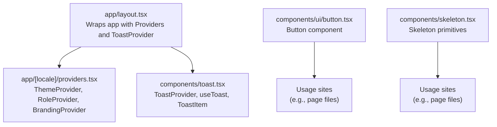
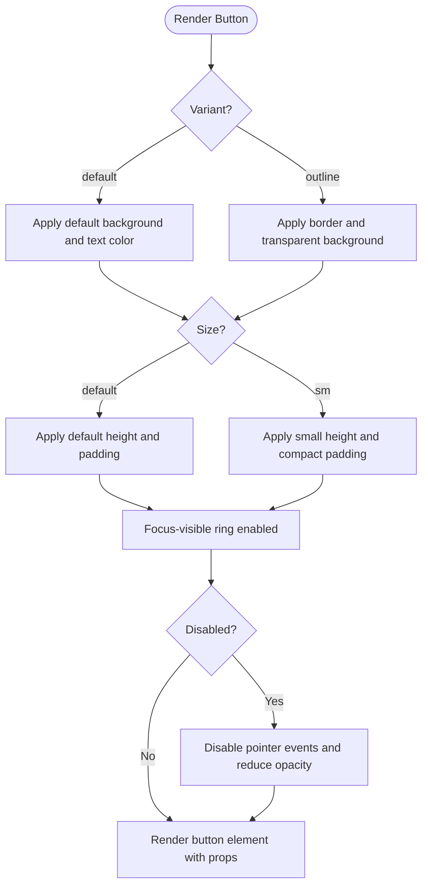
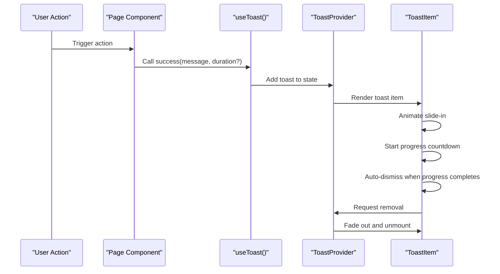
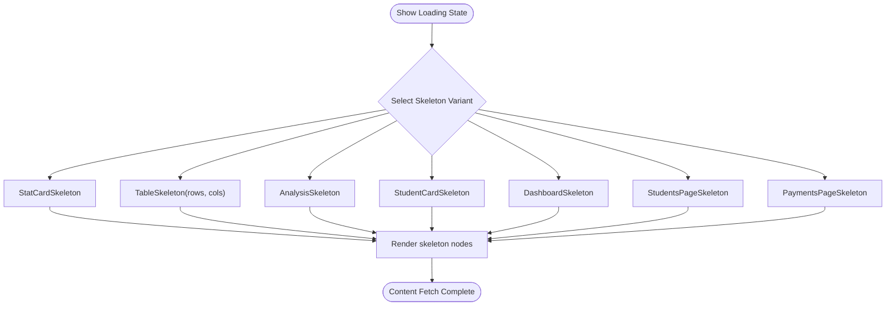
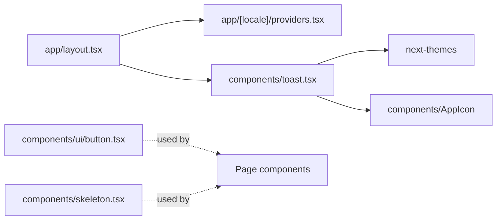

# Core UI Components

<cite>
**Referenced Files in This Document**
- [button.tsx](file://components/ui/button.tsx)
- [toast.tsx](file://components/toast.tsx)
- [skeleton.tsx](file://components/skeleton.tsx)
- [layout.tsx](file://app/layout.tsx)
- [providers.tsx](file://app/[locale]/providers.tsx)
- [fee-notifications/page.tsx](file://app/[locale]/fee-notifications/page.tsx)
- [monitoring/page.tsx](file://app/[locale]/monitoring/page.tsx)
- [super-admin/page.tsx](file://app/[locale]/super-admin/page.tsx)
</cite>

## Table of Contents
1. [Introduction](#introduction)
2. [Project Structure](#project-structure)
3. [Core Components](#core-components)
4. [Architecture Overview](#architecture-overview)
5. [Detailed Component Analysis](#detailed-component-analysis)
6. [Dependency Analysis](#dependency-analysis)
7. [Performance Considerations](#performance-considerations)
8. [Troubleshooting Guide](#troubleshooting-guide)
9. [Conclusion](#conclusion)
10. [Appendices](#appendices)

## Introduction
This document describes the core UI primitive components used throughout the application: Button, Toast, and Skeleton. It explains variants, sizes, states, styling options, accessibility, responsive behavior, animations, and composition patterns. It also provides usage examples with code snippet paths and guidance for integrating and extending these components.

## Project Structure
The core UI primitives live under the components directory and are wired into the Next.js app shell via providers and layout.



**Diagram sources**
- [layout.tsx:14-31](file://app/layout.tsx#L14-L31)
- [providers.tsx:7-22](file://app/[locale]/providers.tsx#L7-L22)
- [toast.tsx:214-276](file://components/toast.tsx#L214-L276)
- [button.tsx:15-35](file://components/ui/button.tsx#L15-L35)
- [skeleton.tsx:29-221](file://components/skeleton.tsx#L29-L221)

**Section sources**
- [layout.tsx:14-31](file://app/layout.tsx#L14-L31)
- [providers.tsx:7-22](file://app/[locale]/providers.tsx#L7-L22)

## Core Components
This section documents the three core UI primitives and how to use them effectively.

- Button
  - Variants: default, outline
  - Sizes: default, sm
  - States: focus-visible ring, disabled pointer-events and opacity
  - Styling: Tailwind-style classes composed via a helper; supports className override
  - Accessibility: Inherits native button semantics; focus-visible ring included
  - Composition: Accepts all native button props; integrates with form controls and links

- Toast
  - Types: success, error, warning, info
  - Positioning: Fixed top-start (RTL-aware)
  - Timing: Defaults to ~3.5 seconds; configurable per toast
  - Interaction: Click to dismiss; animated slide-in and fade-out; progress bar
  - Theming: Light/dark variants with theme-aware colors and backdrop blur
  - Composition: Provider exposes useToast hook; limited to 4 concurrent toasts

- Skeleton
  - Purpose: Loading states and progressive enhancement
  - Variants: StatCard, Table, Analysis, StudentCard, Dashboard, StudentsPage, PaymentsPage
  - Styling: Uses CSS variables for theme adaptation; RTL-friendly
  - Composition: Compose skeletons to match page layouts; wrap real content

**Section sources**
- [button.tsx:3-9](file://components/ui/button.tsx#L3-L9)
- [button.tsx:15-35](file://components/ui/button.tsx#L15-L35)
- [toast.tsx:7-21](file://components/toast.tsx#L7-L21)
- [toast.tsx:214-276](file://components/toast.tsx#L214-L276)
- [skeleton.tsx:29-221](file://components/skeleton.tsx#L29-L221)

## Architecture Overview
The Button component is a presentational component with minimal logic. The Toast system is a provider pattern exposing a context hook for imperative notifications. Skeleton components are pure presentational utilities.

```mermaid
classDiagram
class Button {
+variant : "default" | "outline"
+size : "default" | "sm"
+className : string
+rest props
}
class ToastProvider {
+children : ReactNode
+contextValue : { success, error, warning, info }
}
class ToastItem {
+toast : Toast
+onRemove(id) : void
}
class Skeleton {
+StatCardSkeleton()
+TableSkeleton(rows, cols)
+AnalysisSkeleton()
+StudentCardSkeleton()
+DashboardSkeleton()
+StudentsPageSkeleton()
+PaymentsPageSkeleton()
}
ToastProvider --> ToastItem : "renders"
```

**Diagram sources**
- [button.tsx:6-9](file://components/ui/button.tsx#L6-L9)
- [button.tsx:15-35](file://components/ui/button.tsx#L15-L35)
- [toast.tsx:16-21](file://components/toast.tsx#L16-L21)
- [toast.tsx:214-276](file://components/toast.tsx#L214-L276)
- [toast.tsx:99-211](file://components/toast.tsx#L99-L211)
- [skeleton.tsx:29-221](file://components/skeleton.tsx#L29-L221)

## Detailed Component Analysis

### Button Component
- Props and behavior
  - Variant and size control base styles and spacing
  - Focus-visible ring ensures keyboard accessibility
  - Disabled state prevents interaction and dims opacity
  - className composes additional styles safely
- Styling and customization
  - Uses a helper to filter falsy classes and join strings
  - Supports overriding base styles via className
- Accessibility
  - Inherits native button semantics; ensure labels for icons
  - Focus ring is visible for keyboard users
- Responsive behavior
  - Size classes adjust height and padding; suitable for small screens
- Usage examples
  - Integration: Import Button and render with props
  - Styling variations: Pass className to augment base styles
  - Composition: Combine with icons and form controls



**Diagram sources**
- [button.tsx:15-35](file://components/ui/button.tsx#L15-L35)

**Section sources**
- [button.tsx:3-9](file://components/ui/button.tsx#L3-L9)
- [button.tsx:15-35](file://components/ui/button.tsx#L15-L35)

### Toast Component
- API surface
  - useToast returns imperative methods: success, error, warning, info
  - Each method accepts a message and optional duration
- Rendering and behavior
  - ToastProvider renders a fixed-position container
  - ToastItem animates in, shows progress, and fades out on close
  - Automatic dismissal via requestAnimationFrame loop
  - Duplicate suppression within a short interval
- Theming and appearance
  - Light/dark configs define colors, backgrounds, borders, and progress colors
  - Direction is RTL-aware
- Accessibility and UX
  - Click to dismiss; no auto-close on hover by default
  - Progress bar indicates remaining time
- Usage examples
  - Integration: Wrap app with ToastProvider in the app shell
  - Invocation: Call useToast().success(...) in response to actions
  - Duration: Pass a custom duration for persistent notifications



**Diagram sources**
- [toast.tsx:27-31](file://components/toast.tsx#L27-L31)
- [toast.tsx:214-276](file://components/toast.tsx#L214-L276)
- [toast.tsx:99-211](file://components/toast.tsx#L99-L211)

**Section sources**
- [toast.tsx:7-21](file://components/toast.tsx#L7-L21)
- [toast.tsx:27-31](file://components/toast.tsx#L27-L31)
- [toast.tsx:214-276](file://components/toast.tsx#L214-L276)
- [toast.tsx:99-211](file://components/toast.tsx#L99-L211)

### Skeleton Component
- Purpose
  - Provide lightweight loading placeholders while content loads
- Variants
  - StatCardSkeleton, TableSkeleton(rows, cols), AnalysisSkeleton, StudentCardSkeleton
  - DashboardSkeleton, StudentsPageSkeleton, PaymentsPageSkeleton
- Styling and responsiveness
  - Uses CSS variables for theme-aware surfaces and borders
  - Adapts to RTL layouts
- Composition
  - Build complex skeletons by composing smaller pieces
  - Replace actual content with skeletons during fetch lifecycle



**Diagram sources**
- [skeleton.tsx:29-221](file://components/skeleton.tsx#L29-L221)

**Section sources**
- [skeleton.tsx:29-221](file://components/skeleton.tsx#L29-L221)

## Dependency Analysis
- Button depends on React and receives native button attributes; no external runtime dependencies
- Toast depends on React context, next-themes for theme detection, and an icon component
- Skeleton is a pure presentational module with no external runtime dependencies
- Layout and providers integrate ToastProvider into the app shell



**Diagram sources**
- [layout.tsx:14-31](file://app/layout.tsx#L14-L31)
- [providers.tsx:7-22](file://app/[locale]/providers.tsx#L7-L22)
- [toast.tsx:214-276](file://components/toast.tsx#L214-L276)
- [button.tsx:15-35](file://components/ui/button.tsx#L15-L35)
- [skeleton.tsx:29-221](file://components/skeleton.tsx#L29-L221)

**Section sources**
- [layout.tsx:14-31](file://app/layout.tsx#L14-L31)
- [providers.tsx:7-22](file://app/[locale]/providers.tsx#L7-L22)
- [toast.tsx:214-276](file://components/toast.tsx#L214-L276)

## Performance Considerations
- Button
  - Stateless functional component; minimal re-render cost
  - Prefer className overrides for style changes to avoid prop churn
- Toast
  - requestAnimationFrame used for smooth progress animation
  - Limited to a small number of toasts to keep DOM light
  - Avoid frequent rapid toasts to prevent stacking
- Skeleton
  - Stateless placeholders; very low overhead
  - Use appropriate variants to minimize DOM nesting

[No sources needed since this section provides general guidance]

## Troubleshooting Guide
- Toast not appearing
  - Ensure ToastProvider wraps the app shell
  - Verify useToast is called within the provider context
- Toast duplicates
  - The system suppresses identical toasts within a short interval
  - Adjust message or type, or increase the interval between invocations
- Button focus ring missing
  - Ensure focus-visible styles are not overridden by global CSS
  - Confirm variant and size classes are applied
- Skeleton not adapting to theme
  - Ensure CSS variables for theme surfaces are defined
  - Verify RTL direction is set appropriately

**Section sources**
- [layout.tsx:20-28](file://app/layout.tsx#L20-L28)
- [toast.tsx:27-31](file://components/toast.tsx#L27-L31)
- [toast.tsx:227-237](file://components/toast.tsx#L227-L237)
- [button.tsx:22-24](file://components/ui/button.tsx#L22-L24)
- [skeleton.tsx:3-5](file://components/skeleton.tsx#L3-L5)

## Conclusion
The Button, Toast, and Skeleton components form the foundation of the UI toolkit. They emphasize simplicity, accessibility, and theme-awareness. Integrate them via the app shell, compose them thoughtfully for loading states, and extend them through className overrides and custom variants as needed.

[No sources needed since this section summarizes without analyzing specific files]

## Appendices

### Usage Examples (by snippet path)
- Button
  - Basic usage and variants/sizes: [button.tsx:15-35](file://components/ui/button.tsx#L15-L35)
  - Styling augmentation: [button.tsx:21-30](file://components/ui/button.tsx#L21-L30)
- Toast
  - Provider integration: [layout.tsx:20-28](file://app/layout.tsx#L20-L28)
  - Hook usage and invocation: [fee-notifications/page.tsx:176-180](file://app/[locale]/fee-notifications/page.tsx#L176-L180), [monitoring/page.tsx:302-306](file://app/[locale]/monitoring/page.tsx#L302-L306), [super-admin/page.tsx:494-498](file://app/[locale]/super-admin/page.tsx#L494-L498)
  - Custom duration: [toast.tsx:227-237](file://components/toast.tsx#L227-L237)
- Skeleton
  - Page-level skeletons: [skeleton.tsx:133-165](file://components/skeleton.tsx#L133-L165), [skeleton.tsx:168-197](file://components/skeleton.tsx#L168-L197), [skeleton.tsx:200-221](file://components/skeleton.tsx#L200-L221)

**Section sources**
- [button.tsx:15-35](file://components/ui/button.tsx#L15-L35)
- [layout.tsx:20-28](file://app/layout.tsx#L20-L28)
- [fee-notifications/page.tsx:176-180](file://app/[locale]/fee-notifications/page.tsx#L176-L180)
- [monitoring/page.tsx:302-306](file://app/[locale]/monitoring/page.tsx#L302-L306)
- [super-admin/page.tsx:494-498](file://app/[locale]/super-admin/page.tsx#L494-L498)
- [toast.tsx:227-237](file://components/toast.tsx#L227-L237)
- [skeleton.tsx:133-165](file://components/skeleton.tsx#L133-L165)
- [skeleton.tsx:168-197](file://components/skeleton.tsx#L168-L197)
- [skeleton.tsx:200-221](file://components/skeleton.tsx#L200-L221)