# UI Components

<cite>
**Referenced Files in This Document**
- [button.tsx](file://components/ui/button.tsx)
- [AppShellTopbar.tsx](file://components/AppShellTopbar.tsx)
- [AppSidebar.tsx](file://components/AppSidebar.tsx)
- [ConfirmDialog.tsx](file://components/ConfirmDialog.tsx)
- [Breadcrumb.tsx](file://components/school/Breadcrumb.tsx)
- [DataTableShell.tsx](file://components/school/DataTableShell.tsx)
- [SchoolModuleLayout.tsx](file://components/school/SchoolModuleLayout.tsx)
- [schoolModuleStyles.ts](file://components/school/schoolModuleStyles.ts)
- [BrandLockup.tsx](file://components/brand/BrandLockup.tsx)
- [SchoolLogo.tsx](file://components/brand/SchoolLogo.tsx)
- [design-system.md](file://docs/web-admin-handoff/design-system.md)
- [figma-design-tokens.json](file://docs/web-admin-handoff/tokens/figma-design-tokens.json)
- [themes.ts](file://lib/brand/themes.ts)
- [palette.ts](file://lib/brand/palette.ts)
</cite>

## Table of Contents
1. [Introduction](#introduction)
2. [Project Structure](#project-structure)
3. [Core Components](#core-components)
4. [Architecture Overview](#architecture-overview)
5. [Detailed Component Analysis](#detailed-component-analysis)
6. [Dependency Analysis](#dependency-analysis)
7. [Performance Considerations](#performance-considerations)
8. [Troubleshooting Guide](#troubleshooting-guide)
9. [Conclusion](#conclusion)
10. [Appendices](#appendices)

## Introduction
This document describes the UI component library and design system for the application. It covers shared components, UI primitives, brand components, and school-specific modules. For each major component category, we document props, events, styling options, and customization capabilities. We also provide usage guidance for responsive design, accessibility, internationalization, composition patterns, state management, cross-browser compatibility, performance optimization, and testing strategies. Finally, we outline the design system tokens, color schemes, typography scales, and spacing guidelines used across the application.

## Project Structure
The UI component library is organized by domain and responsibility:
- Shared shell and navigation: AppShellTopbar, AppSidebar
- Dialogs and overlays: ConfirmDialog
- School module scaffolding: SchoolModuleLayout, Breadcrumb, DataTableShell
- Branding primitives: BrandLockup, SchoolLogo
- UI primitives: Button
- Design system and theming: design-system.md, figma-design-tokens.json, themes.ts, palette.ts

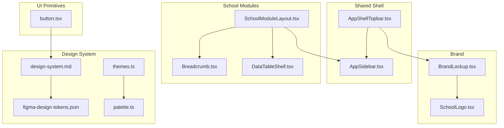

**Diagram sources**
- [AppShellTopbar.tsx:1-134](file://components/AppShellTopbar.tsx#L1-L134)
- [AppSidebar.tsx:1-180](file://components/AppSidebar.tsx#L1-L180)
- [SchoolModuleLayout.tsx:1-44](file://components/school/SchoolModuleLayout.tsx#L1-L44)
- [Breadcrumb.tsx:1-22](file://components/school/Breadcrumb.tsx#L1-L22)
- [DataTableShell.tsx:1-98](file://components/school/DataTableShell.tsx#L1-L98)
- [BrandLockup.tsx:1-73](file://components/brand/BrandLockup.tsx#L1-L73)
- [SchoolLogo.tsx:1-63](file://components/brand/SchoolLogo.tsx#L1-L63)
- [button.tsx:1-38](file://components/ui/button.tsx#L1-L38)
- [design-system.md:1-267](file://docs/web-admin-handoff/design-system.md#L1-L267)
- [figma-design-tokens.json:1-210](file://docs/web-admin-handoff/tokens/figma-design-tokens.json#L1-L210)
- [themes.ts:1-365](file://lib/brand/themes.ts#L1-L365)
- [palette.ts:1-313](file://lib/brand/palette.ts#L1-L313)

**Section sources**
- [AppShellTopbar.tsx:1-134](file://components/AppShellTopbar.tsx#L1-L134)
- [AppSidebar.tsx:1-180](file://components/AppSidebar.tsx#L1-L180)
- [SchoolModuleLayout.tsx:1-44](file://components/school/SchoolModuleLayout.tsx#L1-L44)
- [Breadcrumb.tsx:1-22](file://components/school/Breadcrumb.tsx#L1-L22)
- [DataTableShell.tsx:1-98](file://components/school/DataTableShell.tsx#L1-L98)
- [BrandLockup.tsx:1-73](file://components/brand/BrandLockup.tsx#L1-L73)
- [SchoolLogo.tsx:1-63](file://components/brand/SchoolLogo.tsx#L1-L63)
- [button.tsx:1-38](file://components/ui/button.tsx#L1-L38)
- [design-system.md:1-267](file://docs/web-admin-handoff/design-system.md#L1-L267)
- [figma-design-tokens.json:1-210](file://docs/web-admin-handoff/tokens/figma-design-tokens.json#L1-L210)
- [themes.ts:1-365](file://lib/brand/themes.ts#L1-L365)
- [palette.ts:1-313](file://lib/brand/palette.ts#L1-L313)

## Core Components
This section documents the most frequently used components and their capabilities.

- Button (UI primitive)
  - Purpose: Base button with variants and sizes.
  - Props:
    - variant: "default" | "outline"
    - size: "default" | "sm"
    - Inherits standard button attributes (e.g., type, disabled).
  - Styling options: Tailwind-style class composition via a helper; variant and size map to color and sizing classes.
  - Accessibility: Inherits native button semantics; ensure labels are meaningful.
  - Usage example path: [button.tsx:15-35](file://components/ui/button.tsx#L15-L35)

- AppShellTopbar (Shared shell)
  - Purpose: Topbar with branding, school context, academic year pill, actions, ping indicator, and profile menu.
  - Props:
    - title: string
    - subtitle?: string
    - scope?: SchoolScopeState
    - className?: string
    - fixed?: boolean
    - showAcademicYear?: boolean
    - actions?: React.ReactNode
  - Events: Dispatches "app-sidebar-toggle" via DOM event to open/close sidebar.
  - Internationalization: Renders locale-aware labels and academic year.
  - Accessibility: Uses aria-labels for buttons; renders sr-only text when needed.
  - Usage example path: [AppShellTopbar.tsx:19-133](file://components/AppShellTopbar.tsx#L19-L133)

- AppSidebar (Shared shell)
  - Purpose: Navigation sidebar with role-aware items, localization, and school scoping.
  - Props:
    - currentPath: string
    - containerClassName?: string
    - navClassName?: string
    - separatorClassName?: string
    - showFloatingToggle?: boolean
  - Events: Listens to "app-sidebar-toggle" and "app-sidebar-close"; syncs with window state for school scope.
  - Internationalization: Localizes labels per locale.
  - Accessibility: Uses aria-labels for toggle/close; keyboard navigable links.
  - Usage example path: [AppSidebar.tsx:27-179](file://components/AppSidebar.tsx#L27-L179)

- ConfirmDialog (Overlay dialog)
  - Purpose: Modal confirmation with danger vs primary tones, busy state, and action buttons.
  - Props:
    - open: boolean
    - title: string
    - description?: string
    - confirmLabel?: string
    - cancelLabel?: string
    - tone?: "danger" | "primary"
    - busy?: boolean
    - onConfirm: () => void | Promise<void>
    - onClose: () => void
  - Accessibility: role="dialog", aria-modal, backdrop click-to-close, disabled states during busy.
  - Usage example path: [ConfirmDialog.tsx:17-170](file://components/ConfirmDialog.tsx#L17-L170)

- Breadcrumb (School module)
  - Purpose: Navigation breadcrumb with separators and current page emphasis.
  - Props:
    - items: BreadcrumbItem[] with label and optional href.
  - Accessibility: Uses aria-label and aria-current for current page.
  - Usage example path: [Breadcrumb.tsx:5-21](file://components/school/Breadcrumb.tsx#L5-L21)

- DataTableShell (School module)
  - Purpose: Unified data table shell with loading, error, empty states, retry, and pagination.
  - Props:
    - loading: boolean
    - error: string | null
    - empty: boolean
    - emptyMessage?: string
    - emptyDetail?: string
    - emptyIcon?: string
    - emptyAction?: React.ReactNode
    - onRetry?: () => void
    - children: React.ReactNode
    - page: number
    - pageSize: number
    - totalCount: number
    - onPageChange: (p: number) => void
  - Usage example path: [DataTableShell.tsx:6-97](file://components/school/DataTableShell.tsx#L6-L97)

- SchoolModuleLayout (School module)
  - Purpose: Page scaffold for school modules with sidebar, breadcrumbs, title/subtitle, and content area.
  - Props:
    - currentPath: string
    - title: string
    - subtitle?: string
    - breadcrumbs?: BreadcrumbItem[]
    - children: React.ReactNode
    - topbarExtra?: React.ReactNode
  - Usage example path: [SchoolModuleLayout.tsx:7-43](file://components/school/SchoolModuleLayout.tsx#L7-L43)

- BrandLockup (Brand)
  - Purpose: Combined logo badge and text lockup with runtime branding overrides.
  - Props:
    - size?: number
    - showText?: boolean
    - titleClassName?: string
    - subtitleClassName?: string
    - title?: string
    - subtitle?: string
    - className?: string
    - logoSrc?: string | null
  - Usage example path: [BrandLockup.tsx:22-72](file://components/brand/BrandLockup.tsx#L22-L72)

- SchoolLogo (Brand)
  - Purpose: Resilient logo component with fallback initials and sanitization.
  - Props:
    - src?: string | null
    - alt: string
    - label?: string | null
    - size?: number
    - className?: string
    - imageClassName?: string
    - fallbackClassName?: string
  - Usage example path: [SchoolLogo.tsx:17-62](file://components/brand/SchoolLogo.tsx#L17-L62)

**Section sources**
- [button.tsx:1-38](file://components/ui/button.tsx#L1-L38)
- [AppShellTopbar.tsx:1-134](file://components/AppShellTopbar.tsx#L1-L134)
- [AppSidebar.tsx:1-180](file://components/AppSidebar.tsx#L1-L180)
- [ConfirmDialog.tsx:1-171](file://components/ConfirmDialog.tsx#L1-L171)
- [Breadcrumb.tsx:1-22](file://components/school/Breadcrumb.tsx#L1-L22)
- [DataTableShell.tsx:1-98](file://components/school/DataTableShell.tsx#L1-L98)
- [SchoolModuleLayout.tsx:1-44](file://components/school/SchoolModuleLayout.tsx#L1-L44)
- [BrandLockup.tsx:1-73](file://components/brand/BrandLockup.tsx#L1-L73)
- [SchoolLogo.tsx:1-63](file://components/brand/SchoolLogo.tsx#L1-L63)

## Architecture Overview
The component architecture follows a layered design:
- Shared shell components (AppShellTopbar, AppSidebar) provide global navigation and branding.
- School module components (SchoolModuleLayout, Breadcrumb, DataTableShell) encapsulate page scaffolding and data presentation.
- Brand components (BrandLockup, SchoolLogo) centralize branding and theming.
- UI primitives (Button) provide low-level, reusable building blocks.
- Design system and theming (design-system.md, figma-design-tokens.json, themes.ts, palette.ts) define tokens, palettes, and families.

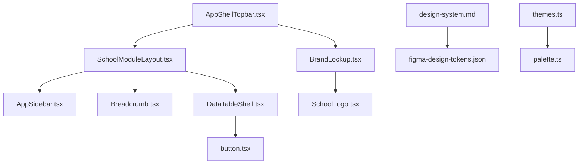

**Diagram sources**
- [AppShellTopbar.tsx:1-134](file://components/AppShellTopbar.tsx#L1-L134)
- [BrandLockup.tsx:1-73](file://components/brand/BrandLockup.tsx#L1-L73)
- [SchoolModuleLayout.tsx:1-44](file://components/school/SchoolModuleLayout.tsx#L1-L44)
- [AppSidebar.tsx:1-180](file://components/AppSidebar.tsx#L1-L180)
- [Breadcrumb.tsx:1-22](file://components/school/Breadcrumb.tsx#L1-L22)
- [DataTableShell.tsx:1-98](file://components/school/DataTableShell.tsx#L1-L98)
- [SchoolLogo.tsx:1-63](file://components/brand/SchoolLogo.tsx#L1-L63)
- [button.tsx:1-38](file://components/ui/button.tsx#L1-L38)
- [design-system.md:1-267](file://docs/web-admin-handoff/design-system.md#L1-L267)
- [figma-design-tokens.json:1-210](file://docs/web-admin-handoff/tokens/figma-design-tokens.json#L1-L210)
- [themes.ts:1-365](file://lib/brand/themes.ts#L1-L365)
- [palette.ts:1-313](file://lib/brand/palette.ts#L1-L313)

## Detailed Component Analysis

### Button
- Implementation pattern: ForwardRef component with Tailwind-style class composition helper; variant and size map to color and dimension classes.
- Props: variant, size, plus inherited button HTML attributes.
- Styling: Uses a helper to filter falsy classes and join strings; supports focus-visible ring and disabled states.
- Accessibility: Inherits native button semantics; ensure accessible labels.
- Customization: Extend className to override base styles; variant and size control semantic appearance.

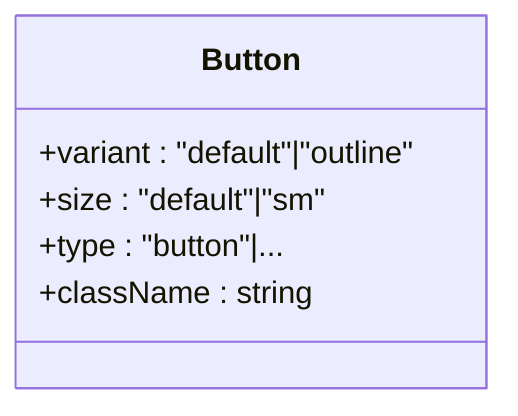

**Diagram sources**
- [button.tsx:6-35](file://components/ui/button.tsx#L6-L35)

**Section sources**
- [button.tsx:1-38](file://components/ui/button.tsx#L1-L38)

### AppShellTopbar
- Responsibilities: Render topbar with school branding, academic year pill, optional school selector (super admin), ping indicator, profile menu, and actions.
- Props: title, subtitle, scope, className, fixed, showAcademicYear, actions.
- Events: Dispatches "app-sidebar-toggle" to control sidebar visibility.
- Internationalization: Locale-aware labels and academic year rendering.
- Accessibility: aria-labels for interactive elements; screen-reader-friendly labels.

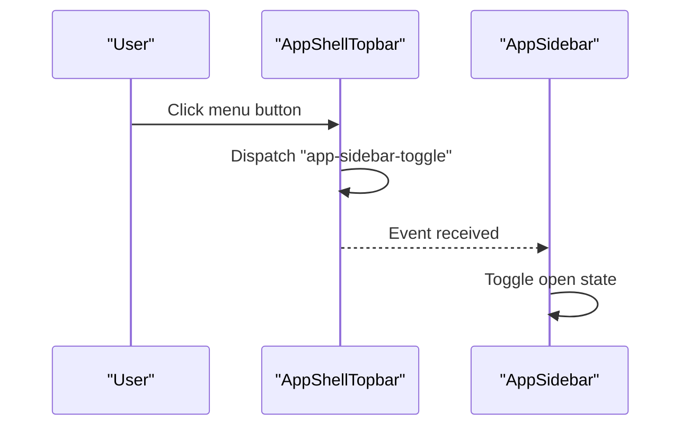

**Diagram sources**
- [AppShellTopbar.tsx:72-78](file://components/AppShellTopbar.tsx#L72-L78)
- [AppSidebar.tsx:76-82](file://components/AppSidebar.tsx#L76-L82)

**Section sources**
- [AppShellTopbar.tsx:1-134](file://components/AppShellTopbar.tsx#L1-L134)

### AppSidebar
- Responsibilities: Role-aware navigation, localization, school scoping, and mobile/floating toggles.
- Props: currentPath, containerClassName, navClassName, separatorClassName, showFloatingToggle.
- Events: Listens to "app-sidebar-toggle" and "app-sidebar-close"; syncs with window state for school scope.
- Internationalization: Localizes labels per locale; builds scoped paths for super admin.
- Accessibility: aria-labels for toggle/close; keyboard navigable links.

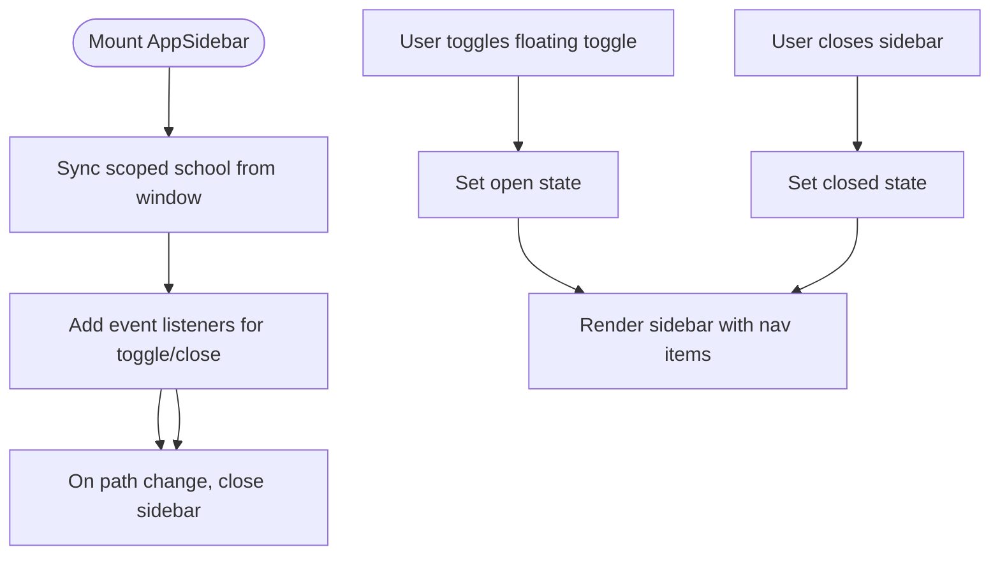

**Diagram sources**
- [AppSidebar.tsx:37-95](file://components/AppSidebar.tsx#L37-L95)

**Section sources**
- [AppSidebar.tsx:1-180](file://components/AppSidebar.tsx#L1-L180)

### ConfirmDialog
- Responsibilities: Confirmation dialog with tone-based styling, busy state, and action buttons.
- Props: open, title, description, confirmLabel, cancelLabel, tone, busy, onConfirm, onClose.
- Accessibility: role="dialog", aria-modal, backdrop click-to-close, disabled states during busy.
- Styling: Uses inline styles with CSS variables for theme tokens.

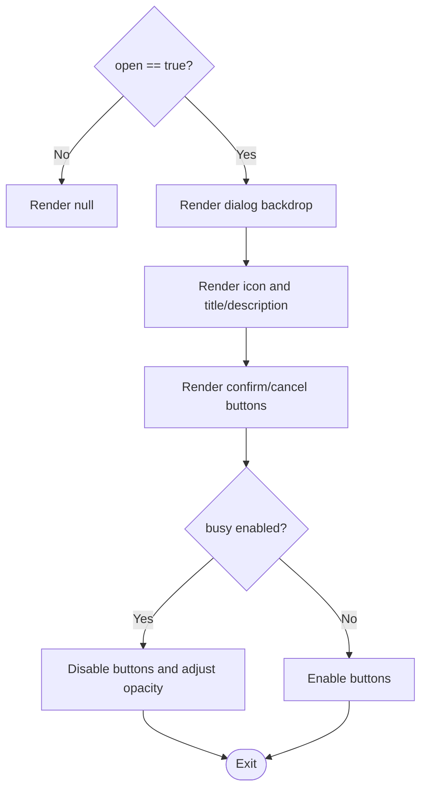

**Diagram sources**
- [ConfirmDialog.tsx:27-170](file://components/ConfirmDialog.tsx#L27-L170)

**Section sources**
- [ConfirmDialog.tsx:1-171](file://components/ConfirmDialog.tsx#L1-L171)

### Breadcrumb
- Responsibilities: Render breadcrumb navigation with separators and current page emphasis.
- Props: items with label and optional href.
- Accessibility: Uses aria-label and aria-current for current page.

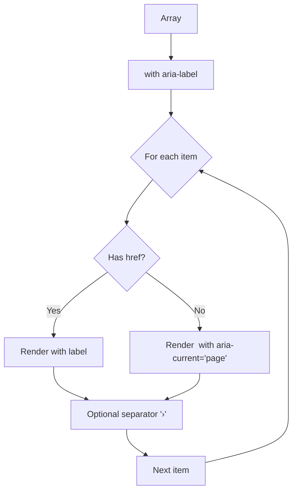

**Diagram sources**
- [Breadcrumb.tsx:5-21](file://components/school/Breadcrumb.tsx#L5-L21)

**Section sources**
- [Breadcrumb.tsx:1-22](file://components/school/Breadcrumb.tsx#L1-L22)

### DataTableShell
- Responsibilities: Unified data table shell with loading, error, empty states, retry, and pagination.
- Props: loading, error, empty, emptyMessage, emptyDetail, emptyIcon, emptyAction, onRetry, children, page, pageSize, totalCount, onPageChange.
- Composition: Delegates to ListPagination for pagination controls.

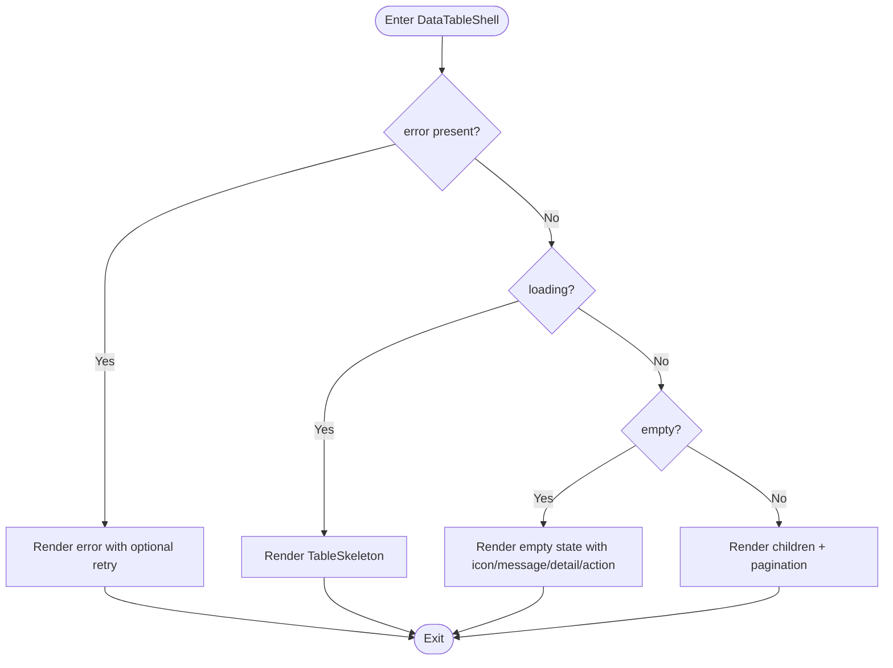

**Diagram sources**
- [DataTableShell.tsx:6-97](file://components/school/DataTableShell.tsx#L6-L97)

**Section sources**
- [DataTableShell.tsx:1-98](file://components/school/DataTableShell.tsx#L1-L98)

### SchoolModuleLayout
- Responsibilities: Page scaffold for school modules with sidebar, breadcrumbs, title/subtitle, and content area.
- Props: currentPath, title, subtitle, breadcrumbs, children, topbarExtra.
- Composition: Includes scoped school module CSS for RTL and dark mode overrides.

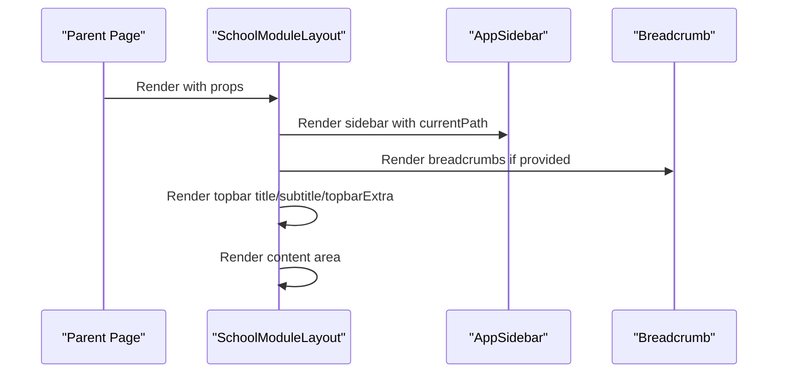

**Diagram sources**
- [SchoolModuleLayout.tsx:7-43](file://components/school/SchoolModuleLayout.tsx#L7-L43)

**Section sources**
- [SchoolModuleLayout.tsx:1-44](file://components/school/SchoolModuleLayout.tsx#L1-L44)

### BrandLockup and SchoolLogo
- BrandLockup: Combines a circular logo badge with optional text; resolves runtime branding and defaults.
- SchoolLogo: Resilient logo with fallback initials and sanitized URLs; handles broken images gracefully.
- Theming: Integrates with brand palette and theme presets.

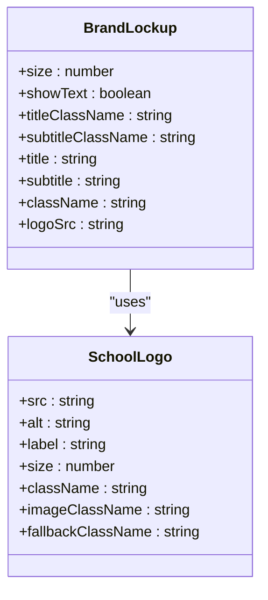

**Diagram sources**
- [BrandLockup.tsx:11-72](file://components/brand/BrandLockup.tsx#L11-L72)
- [SchoolLogo.tsx:17-62](file://components/brand/SchoolLogo.tsx#L17-L62)

**Section sources**
- [BrandLockup.tsx:1-73](file://components/brand/BrandLockup.tsx#L1-L73)
- [SchoolLogo.tsx:1-63](file://components/brand/SchoolLogo.tsx#L1-L63)

## Dependency Analysis
- Component coupling:
  - AppShellTopbar depends on BrandLockup and ProfileMenu; it also dispatches events consumed by AppSidebar.
  - SchoolModuleLayout composes AppSidebar, Breadcrumb, and DataTableShell.
  - BrandLockup composes SchoolLogo.
  - DataTableShell composes ListPagination and TableSkeleton.
- Cohesion:
  - Each component encapsulates a single responsibility (shell, layout, branding, data).
- External dependencies:
  - Icons via a token system (e.g., AppIcon).
  - Theming via CSS variables and design tokens.
  - Hooks for role, branding, and school scope.

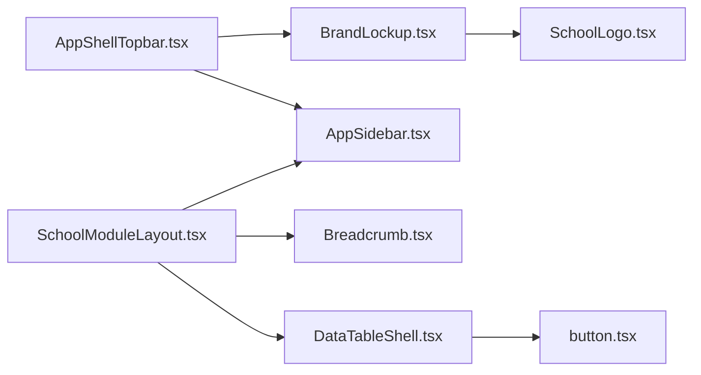

**Diagram sources**
- [AppShellTopbar.tsx:1-134](file://components/AppShellTopbar.tsx#L1-L134)
- [BrandLockup.tsx:1-73](file://components/brand/BrandLockup.tsx#L1-L73)
- [SchoolModuleLayout.tsx:1-44](file://components/school/SchoolModuleLayout.tsx#L1-L44)
- [AppSidebar.tsx:1-180](file://components/AppSidebar.tsx#L1-L180)
- [Breadcrumb.tsx:1-22](file://components/school/Breadcrumb.tsx#L1-L22)
- [DataTableShell.tsx:1-98](file://components/school/DataTableShell.tsx#L1-L98)
- [SchoolLogo.tsx:1-63](file://components/brand/SchoolLogo.tsx#L1-L63)
- [button.tsx:1-38](file://components/ui/button.tsx#L1-L38)

**Section sources**
- [AppShellTopbar.tsx:1-134](file://components/AppShellTopbar.tsx#L1-L134)
- [AppSidebar.tsx:1-180](file://components/AppSidebar.tsx#L1-L180)
- [SchoolModuleLayout.tsx:1-44](file://components/school/SchoolModuleLayout.tsx#L1-L44)
- [Breadcrumb.tsx:1-22](file://components/school/Breadcrumb.tsx#L1-L22)
- [DataTableShell.tsx:1-98](file://components/school/DataTableShell.tsx#L1-L98)
- [BrandLockup.tsx:1-73](file://components/brand/BrandLockup.tsx#L1-L73)
- [SchoolLogo.tsx:1-63](file://components/brand/SchoolLogo.tsx#L1-L63)
- [button.tsx:1-38](file://components/ui/button.tsx#L1-L38)

## Performance Considerations
- Prefer memoization for derived values (e.g., useMemo for nav items).
- Lazy-load heavy assets (e.g., logos) and avoid unnecessary re-renders by passing stable callbacks.
- Use CSS variables for theming to minimize reflows and leverage GPU acceleration.
- Keep dialogs mounted conditionally to reduce DOM overhead.
- Optimize images and sanitize URLs to prevent render errors and cascading effects.

## Troubleshooting Guide
- ConfirmDialog does not render when open is false; ensure state updates propagate to onConfirm/onClose.
- AppSidebar toggle events rely on DOM events; verify event listeners are attached after mount.
- BrandLockup and SchoolLogo require sanitized URLs; invalid URLs fall back to initials.
- DataTableShell requires totalCount and onPageChange to function correctly; ensure pagination state is controlled.

**Section sources**
- [ConfirmDialog.tsx:27-170](file://components/ConfirmDialog.tsx#L27-L170)
- [AppSidebar.tsx:60-91](file://components/AppSidebar.tsx#L60-L91)
- [BrandLockup.tsx:32-34](file://components/brand/BrandLockup.tsx#L32-L34)
- [SchoolLogo.tsx:34-40](file://components/brand/SchoolLogo.tsx#L34-L40)
- [DataTableShell.tsx:6-34](file://components/school/DataTableShell.tsx#L6-L34)

## Conclusion
The UI component library emphasizes composability, accessibility, and theming consistency. Shared shell components provide a cohesive navigation experience, while school module components standardize data presentation. Brand components centralize branding logic, and the design system ensures consistent tokens and styles across locales and modes.

## Appendices

### Design System Tokens and Theming
- Color primitives and semantic tokens are defined in the design system and exported as JSON tokens.
- Theme families and presets enable brand customization with consistent palettes.
- Palette utilities derive colors from seeds or logos and support manual overrides.

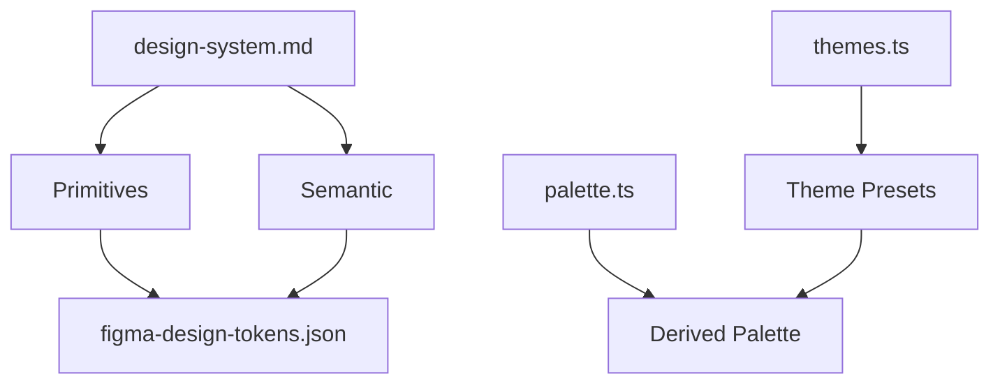

**Diagram sources**
- [design-system.md:1-267](file://docs/web-admin-handoff/design-system.md#L1-L267)
- [figma-design-tokens.json:1-210](file://docs/web-admin-handoff/tokens/figma-design-tokens.json#L1-L210)
- [themes.ts:52-75](file://lib/brand/themes.ts#L52-L75)
- [palette.ts:268-310](file://lib/brand/palette.ts#L268-L310)

**Section sources**
- [design-system.md:1-267](file://docs/web-admin-handoff/design-system.md#L1-L267)
- [figma-design-tokens.json:1-210](file://docs/web-admin-handoff/tokens/figma-design-tokens.json#L1-L210)
- [themes.ts:1-365](file://lib/brand/themes.ts#L1-L365)
- [palette.ts:1-313](file://lib/brand/palette.ts#L1-L313)

### Responsive Design Guidelines
- Use CSS variables for layout and typography scaling.
- Apply RTL-first styles for Arabic contexts; ensure directionality is handled consistently.
- Maintain minimum touch targets and spacing for mobile usability.

### Accessibility Compliance
- Ensure all interactive elements have accessible names (aria-labels).
- Use ARIA roles where appropriate (e.g., dialog).
- Preserve focus order and provide visible focus indicators.

### Internationalization Support
- Components render locale-aware labels and academic year information.
- Paths are localized per locale; maintain consistent routing keys.

### Cross-Browser Compatibility
- Prefer CSS variables and widely supported features.
- Test RTL layouts and dynamic theming across browsers.

### Component Testing Strategies
- Unit test component props and rendering conditions (e.g., loading/error/empty states).
- Mock hooks (role, branding, school scope) for isolated tests.
- Verify event dispatch and listener behavior for shell components.